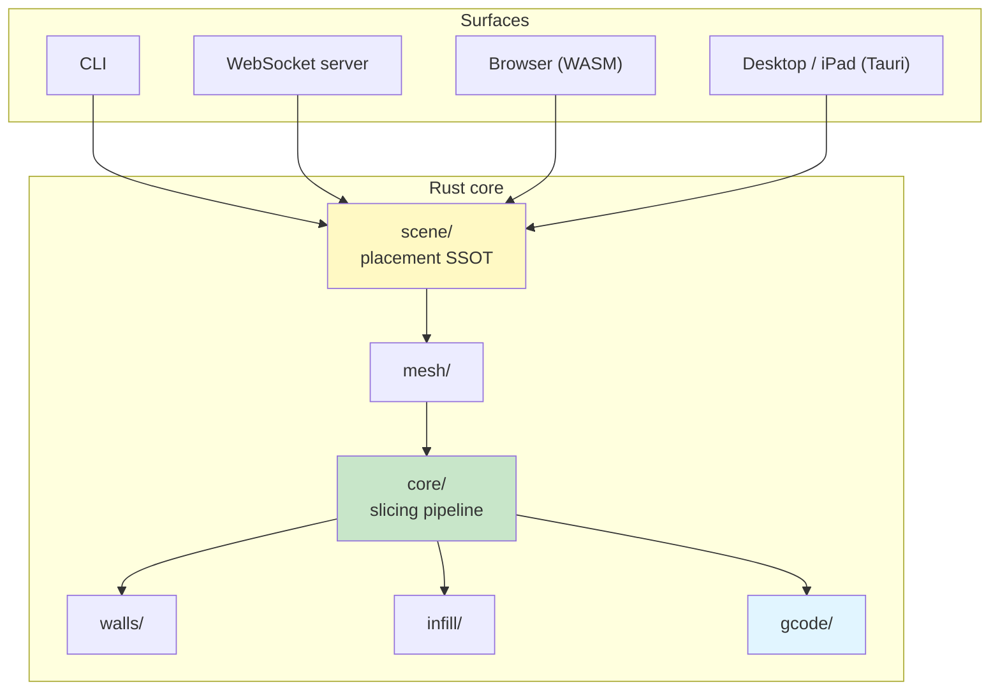

# Architecture

A map of the codebase, not a manual. Each module carries its own long-form
README with the reasoning behind it — this page tells you which one to open.

> Using the app instead of working on it? Start at
> [Getting started](https://slicer.maxscopp.de/docs/use/).

## The shape of it

One Rust core, four things that drive it.



The same engine compiles to a native binary, to WebAssembly, and into a Tauri
shell. That's the whole point: previews and final output can't disagree, because
there is no second implementation to disagree with.

The UI picks its **runtime mode** at startup:

| Mode | Slicing happens | When |
| --- | --- | --- |
| `cloud` | On your server | Default web build |
| `web` | In your browser | `web-slicer` build |
| `native` | In-process | Desktop and iPad |

## Modules

Every one of these has a README. They are the real documentation.

### Pipeline

| Module | Owns | Read |
| --- | --- | --- |
| [`mesh/`](src/mesh/README.md) | Loading STL, OBJ, 3MF; mesh types and analysis | Loading and repair |
| [`core/`](src/core/README.md) | The slicing pipeline — `process_mesh`, surfaces, infill boundaries, object identity | **Start here** |
| [`walls/`](src/walls/README.md) | Perimeters: the Arachne variable-width generator and the classic fixed-offset one | Bead placement |
| [`infill/`](src/infill/README.md) | Sparse fill patterns | Pattern generation |
| [`adhesion/`](src/adhesion/README.md) | Skirt, brim, raft | Why it runs last |
| [`gcode/`](src/gcode/README.md) | Emission, firmware dialects, lifecycle markers, the parseable footer | Output |

The pipeline's execution order is load-bearing and documented in
[`core/README.md`](src/core/README.md). Surfaces are computed after walls;
infill after surfaces; adhesion dead last. Reordering breaks things in ways that
are hard to see.

### Scene and configuration

| Module | Owns |
| --- | --- |
| [`scene/`](src/scene/README.md) | **Single source of truth for object placement.** Every CLI flag and every UI gesture becomes a `SceneOp` |
| [`orient/`](src/orient/README.md) | Auto-orientation and face-to-floor |
| [`settings/`](src/settings/README.md) | Slicing parameters, validation, the JSON schema the UI generates its form from |
| [`config/`](src/config/README.md) | `slicer.toml`: discovery, merge order, persistence |
| [`profiles/`](src/profiles/) | The user's printer / filament / process library, and its export |

### Interfaces

| Module | Owns |
| --- | --- |
| [`cli/`](src/cli/README.md) | `slice`, `settings`, `config`, `info`, `changelog` |
| [`server/`](src/server/README.md) | HTTP for bytes, WebSocket for control flow |
| [`printer/`](src/printer/) | Native outbound transport to printers (Moonraker today) |
| [`db/`](src/db/README.md) | SQLite slice history and the G-code cache |
| [`gcode_viewer/`](src/gcode_viewer/) | Parsing G-code back for the preview |

The front-end lives in [`ui/`](ui/README.md) (Angular) and
[`ui-desktop/`](ui-desktop/README.md) (Tauri shell for desktop and iPadOS).

## The pipeline in one pass

```
slice_mesh                    mesh → contours per layer
generate walls                contours → bead paths (Arachne or classic)
apply_single_wall_restrictions strip inner walls where configured
generate_top_bottom_surfaces  solid surfaces within the interior
add_infill_to_layers          sparse fill, minus solid regions
path ordering + flow          greedy TSP per role, then wall-overlap scaling
apply_adhesion                skirt / brim / raft
```

`slice_plate` in [`core/objects.rs`](src/core/objects.rs) is the single entry
point. It merges the plate and runs the pipeline once when object identity isn't
needed, and runs it per object when it is — the merged path is byte-identical to
a plain `process_mesh`, which is pinned by a test.

## Key types

```rust
pub struct SliceLayer {
    pub z: f64,
    pub paths: Paths,                             // closed contours (Clipper2)
    pub path_roles: Vec<ExtrusionRole>,           // parallel array
    pub path_widths: Vec<Option<f64>>,            // per-path bead width
    pub path_vertex_widths: Vec<Option<Vec<f64>>>,// per-vertex, for tapering beads
    pub solid_regions: Paths,
    // … plus overhang and object-tag parallel arrays
}
```

**The parallel arrays are the thing to be careful with.** Anything that rebuilds
a layer's paths must carry every parallel array along, or roles, widths and
object tags silently shift onto the wrong paths.

`ExtrusionRole` distinguishes `OuterWall`, `InnerWall`, `OverhangPerimeter`,
`Infill`, `Bridge`, `TopSurface`, `BottomSurface`, `GapFill`, `Support` and
`Skirt`. Note that a **hole boundary also carries `OuterWall`** — it's the
outermost bead of that contour. Tell solid islands from holes by signed area,
never by role.

## Conventions worth knowing before you edit

**Clipper2 fill rules are not interchangeable.** Surface detection uses
`EvenOdd` (winding-independent); infill subtraction uses `Positive`; anything
subtracting the wall-bead footprint uses `NonZero`, because that footprint is a
frame with CW holes. Picking the wrong one produces plausible-looking, wrong
geometry. The table in [`core/README.md`](src/core/README.md) is authoritative.

**Don't add a second placement path.** `scene/` owns transforms. Baking happens
once, at the slicer boundary.

**Don't add a parallel version constant.** [`src/version.rs`](src/version.rs) is
the only place version and changelog are read from, and the version is derived
from the git tag at build time.

**Validate geometry changes, don't reason about them.**
[`tools/gcode-analysis/`](tools/gcode-analysis/README.md) measures sliced output
directly — wall overlap, unfilled gaps, bead-width distribution, capsule
renders. Compare against the `classic` generator before claiming a fix.

## Further reading

- [Slicing algorithm](src/SLICING.md) — the geometry, in depth
- [AGENTS.md](AGENTS.md) — the full contract set, including hard-won pitfalls
- [CONTRIBUTING.md](CONTRIBUTING.md) — workflow
- [DEVELOPMENT.md](DEVELOPMENT.md) — day-to-day commands

External: [Clipper2](https://www.angusj.com/clipper2/Docs/Overview.htm) ·
[Arachne](https://github.com/Ultimaker/CuraEngine/blob/main/docs/arachne.md) ·
[RepRap G-code](https://reprap.org/wiki/G-code) ·
[Marlin](https://marlinfw.org/meta/gcode/) ·
[Klipper](https://www.klipper3d.org/G-Codes.html)
