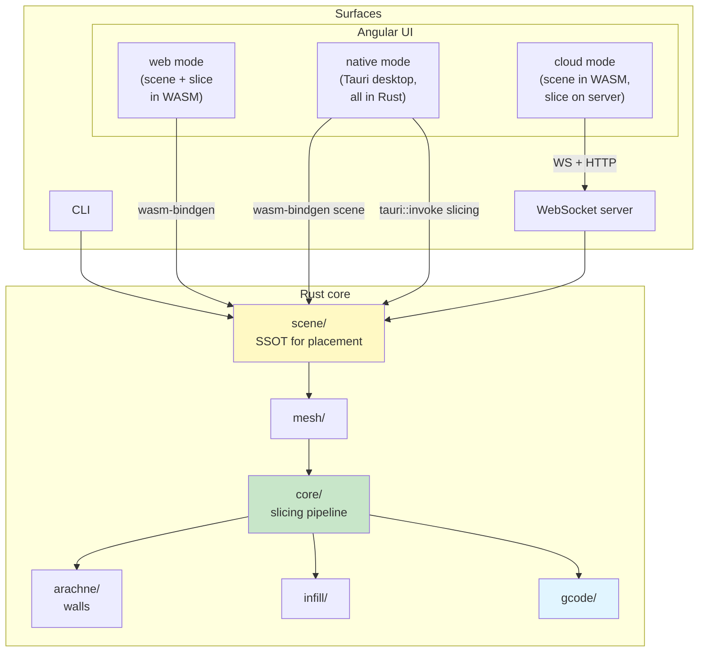

# Development

> New here? Start with [SETUP.md](SETUP.md) to get it running, then read [CONTRIBUTING.md](CONTRIBUTING.md) for the workflow.

```bash
cargo build                                                 # fast iteration (debug)
cargo test
cargo fmt && cargo clippy --all-targets --all-features -- -D warnings
pnpm --filter slicer-engine-docs docs:dev                   # live docs site
sea-orm-cli migrate generate "my_migration" -d src/db       # scaffold DB migration
```

**Git hooks (autoformat on commit):** `pnpm install` sets up [Lefthook](https://lefthook.dev)
via the `prepare` script. On every commit it formats just the **staged** files so they already
match CI — [Prettier](https://prettier.io/) for `ui/**/*.{ts,html,scss,css}` and `rustfmt` for
`*.rs`. Skip once with `git commit --no-verify`, or disable with `LEFTHOOK=0 git commit`.

See [CONTRIBUTING.md](CONTRIBUTING.md) for workflow, [AGENTS.md](AGENTS.md) for AI-agent guidance, and [ARCHITECTURE.md](ARCHITECTURE.md) for the long-form architecture overview (also rendered on the [docs site](https://slicer.maxscopp.de/docs/guide/architecture)).

**G-code diagnostics:** [tools/gcode-analysis/](tools/gcode-analysis/README.md) has Python scripts to measure and visualise sliced output — wall overlap, unfilled gaps, bead-width distribution, and layer/zoom renders.

**Not sure what to check after a change?** Ask the agent "what should I test?" — the [`test-changes` skill](.github/skills/test-changes/SKILL.md) replies with a short checklist for the platform you name (remote + web by default).

---

## Architecture at a glance



The same engine runs in three different environments — on a server, compiled into the browser, and bundled into the desktop app — so the G-code is always identical no matter where you slice.

The UI selects its **runtime mode** at startup:

| Mode     | Where slicing happens | When               |
| -------- | --------------------- | ------------------ |
| `cloud`  | On your server        | Default web build  |
| `web`    | In your browser       | `web-slicer` build |
| `native` | On your desktop       | Desktop app        |

See [Scene Engine](src/scene/README.md) and [Slicing Pipeline](src/core/README.md) for the contract.

---

## References

[RepRap G-code Wiki](https://reprap.org/wiki/G-code) · [Arachne Paper](https://github.com/Ultimaker/CuraEngine/blob/main/docs/arachne.md) · [Clipper2](https://www.angusj.com/clipper2/Docs/Overview.htm) · [Marlin G-code](https://marlinfw.org/meta/gcode/) · [Klipper G-code](https://www.klipper3d.org/G-Codes.html) · [Tauri](https://v2.tauri.app/)
