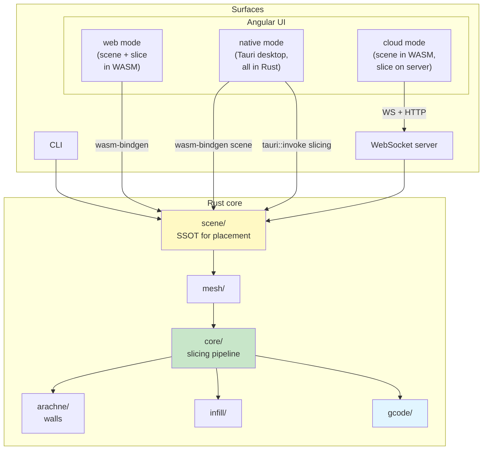

# Slicer Engine

🌐 **[Try the online slicer](https://slicer.maxscopp.de/)** → no install, no account, works right now.

**Slice your 3D models instantly — in your browser, on your desktop, or on your own server. Your workflow, your choice.**

Drop in an STL, OBJ, or 3MF and get print-ready G-code in seconds. One engine, three ways to run it:

|                    | Where it runs                             | Setup                                                    |
| ------------------ | ----------------------------------------- | -------------------------------------------------------- |
| 🌐 **Web**         | Fully in your browser — nothing installed | None — [just open the link](https://slicer.maxscopp.de/) |
| 🖥️ **Desktop**     | Native app, runs entirely on your machine | Download & run                                           |
| ☁️ **Self-hosted** | Host it yourself, share with your team    | `cargo run -- serve`                                     |

Every mode uses the same slicing engine, so results are identical regardless of how you run it. In the browser, your files never leave your machine.

📖 **Full documentation: [https://slicer.maxscopp.de/docs/](https://slicer.maxscopp.de/docs/)** — architecture, module guides, and contributor docs.

---

## Prerequisites

Before building or running, ensure you have:

### Required

- **Rust 1.70+ via [rustup](https://rustup.rs/)** — the Homebrew `rust` package is **not supported**; it ships without the `wasm32-unknown-unknown` standard library and can't add targets. If you have it installed, run `brew uninstall rust` first, then install rustup.
- **Node.js 20+** and **pnpm 9+** — [Node](https://nodejs.org/), then `npm install -g pnpm`

### For WASM builds (self-hosted UI, browser slicer, desktop)

All three modes need the WASM scene bindings. Add the target and install a matching `wasm-bindgen-cli`:

```bash
rustup target add wasm32-unknown-unknown

# Match the wasm-bindgen version pinned in Cargo.lock — mismatched CLI
# versions silently produce broken bindings.
cargo install wasm-bindgen-cli --version "$(grep -A1 '^name = "wasm-bindgen"$' Cargo.lock | tail -1 | cut -d'"' -f2)" --locked
```

> Only needed if you build the standalone in-browser bundle yourself: `cargo install wasm-pack`. The `pnpm hydrate` scripts do not use it.

### For desktop app builds

Install Tauri CLI (choose one):

```bash
cargo install tauri-cli --version "^2"
# OR: pnpm add -g @tauri-apps/cli
```

### Optional

- **C++ toolchain** (clang++ or MSVC) — needed only for full WASM builds with polygon clipping support
  - Linux: `sudo apt install build-essential clang`
  - macOS: `xcode-select --install` (Xcode Command Line Tools)
  - Windows: Visual Studio or Build Tools

---

## Quick Start

```bash
# Slice an STL to G-code
cargo run -- slice --input model.stl --output output.gcode

# Inspect or edit persisted settings
cargo run -- settings show
cargo run -- settings set layer_height 0.15
```

To run the WebSocket + UI server (`cargo run -- serve`), see **[First-time setup](#first-time-setup-self-hosted-ui)** below — the UI must be built before the server can serve it.

---

## First-time setup (self-hosted UI)

After cloning, run these once in order. Skipping any step means the next one fails with confusing errors.

```bash
# 1. Install deps (Rust + Node prerequisites above must already be in place)
pnpm install

# 2. Build WASM scene bindings + generate JSON schemas + TS types
#    Populates ui/src/generated/ — without this, `pnpm ui:build` fails with
#    "Cannot find module '../../generated/scene-wasm/scene_engine'".
pnpm run hydrate

# 3. Build the Angular UI
#    Produces ui/dist/slicer-ui/browser — without this, `cargo run -- serve`
#    fails with "UI directory not found: ./ui/dist/slicer-ui/browser".
pnpm run ui:build

# 4. Start the server (serves the UI at http://localhost:5201/)
cargo run -- serve
```

For iterative UI work, use the dev-server flow in [Self-hosted web UI](#self-hosted-web-ui) below (skips step 3, hot-reloads Angular).

---

## Architecture at a glance



The same engine runs in three different environments — on a server, compiled into the browser, and bundled into the desktop app — so slicing results are always identical regardless of where you run it.

The UI selects its **runtime mode** at startup:

| Mode     | Where slicing happens | When               |
| -------- | --------------------- | ------------------ |
| `cloud`  | On your server        | Default web build  |
| `web`    | In your browser       | `web-slicer` build |
| `native` | On your desktop       | Desktop app        |

See [Scene Engine](src/scene/README.md) and [Slicing Pipeline](src/core/README.md) for the contract.

---

## Configuration

Slicer Engine is configured via [`slicer.toml`](src/config/README.md). Resolution order:

1. CLI flags (per invocation, never persisted)
2. Project config — `./slicer.toml` in the working directory
3. User config — platform path (e.g. `~/.config/slicer-engine/slicer.toml`)
4. Built-in defaults

```toml
[machine]
nozzle_diameter = 0.4
build_volume_x = 220.0

[slicing]
layer_height = 0.2
wall_count = 3
infill_density = 0.20

[server]
port = 5201
```

Manage it from the CLI:

```bash
slicer-engine config show
slicer-engine config set slicing.layer_height 0.15
slicer-engine slice --input model.stl --config ./slicer.toml
```

Full reference → [Settings](src/settings/README.md) · [Config (TOML)](src/config/README.md) · [CLI](src/cli/README.md).

---

## Self-hosted web UI

Production flow (server serves the built UI on a single port):

```bash
pnpm run hydrate             # once (or when Rust bindings/schemas change)
pnpm run ui:build            # once (or after UI changes)
cargo run --release -- serve # http://localhost:5201/
```

Dev flow (Angular hot-reload, backend runs separately — both must be running):

```bash
pnpm run hydrate             # once (or when Rust bindings/schemas change)
pnpm run ui:dev              # Angular dev server → http://localhost:4200
cargo run -- serve           # WebSocket/HTTP server  → http://localhost:5201
```

The UI sends slicing jobs to the local server. Scene management runs in the browser for instant feedback.

---

## Browser slicer (no server needed)

> **Live demo:** [https://slicer.maxscopp.de/](https://slicer.maxscopp.de/) — slice in your browser, no backend required.

The full slicing pipeline runs in-browser. Building this locally requires a wasm-capable C++ toolchain (`clang++`) for the polygon clipping library.

```bash
# Build the full WASM bundle (scene + slicer)
pnpm run hydrate:web-slicer

# Dev server — no backend required
pnpm run ui:dev:web-slicer   # http://localhost:4200

# Production build
pnpm run ui:build:web-slicer
```

---

## Desktop app

Bundles the UI and the full slicing engine into a native desktop application. No server required.

```bash
# Prerequisites: install Tauri CLI
cargo install tauri-cli --version "^2"
# or: pnpm add -g @tauri-apps/cli

# Dev mode (hot-reloads Angular, rebuilds Rust on change)
pnpm run desktop:dev

# Production build (outputs a platform installer)
pnpm run desktop:build
```

The desktop app automatically uses the bundled native engine for slicing, giving you full offline capability and the best performance. Scene management is shared with the browser UI, so the experience is identical.

---

## Building

### Native (your host platform)

```bash
cargo build --release                   # Single command — that's it
```

### Cross-platform

```bash
cargo build --release --target x86_64-pc-windows-msvc       # Windows
cargo build --release --target x86_64-apple-darwin          # macOS Intel
cargo build --release --target aarch64-apple-darwin         # macOS ARM
```

### WebAssembly (browser slicer)

Requires: `rustup target add wasm32-unknown-unknown` and `cargo install wasm-pack`

```bash
wasm-pack build --target web --release
```

Or use the pnpm script (which handles schema generation too):

```bash
pnpm run hydrate               # Scene + type bindings
pnpm run hydrate:web-slicer    # Full WASM slicer (includes polygon clipping)
```

### Using Makefile (Linux/macOS)

```bash
make build-release  build-windows  build-macos  build-wasm
```

---

## Troubleshooting Setup

**`cargo run -- serve` fails with `UI directory not found: ./ui/dist/slicer-ui/browser`?**
Build the UI first: `pnpm run hydrate && pnpm run ui:build`. See [First-time setup](#first-time-setup-self-hosted-ui).

**`pnpm ui:build` fails with `Cannot find module '../../generated/scene-wasm/scene_engine'` (or `.../slicer-engine-ws-*-message-v1`)?**
You skipped `pnpm run hydrate`. Run it, then retry the build.

**`wasm32-unknown-unknown` target not found / `error[E0463]: can't find crate for 'core'`?**
Either the target isn't installed (`rustup target add wasm32-unknown-unknown`) **or** you're on Homebrew Rust, which can't add targets. Run `brew uninstall rust` and install [rustup](https://rustup.rs/).

**`wasm-bindgen` command not found?**
Install the CLI at the exact version pinned in `Cargo.lock` (mismatched versions produce silently broken bindings):

```bash
cargo install wasm-bindgen-cli --version "$(grep -A1 '^name = "wasm-bindgen"$' Cargo.lock | tail -1 | cut -d'"' -f2)" --locked
```

**`wasm-pack` command not found?**
Only needed for the standalone `wasm-pack build` invocation — the `pnpm hydrate` scripts don't use it. If you actually need it: `cargo install wasm-pack`.

**pnpm hydrate fails with C++ compilation errors?**
Install the C++ toolchain for your platform (see Prerequisites above), then retry.

---

## Development

```bash
cargo build                                                 # fast iteration (debug)
cargo test
cargo fmt && cargo clippy --all-targets --all-features -- -D warnings
pnpm --filter slicer-engine-docs docs:dev                   # live docs site
sea-orm-cli migrate generate "my_migration" -d src/db       # scaffold DB migration
```

**Git hooks (autoformat on commit):** `pnpm install` sets up [Lefthook](https://lefthook.dev)
via the `prepare` script. On every commit it formats just the **staged** files so they already
match CI — [Prettier](https://prettier.io/) for `ui/**/*.{ts,html,scss,css}` and `rustfmt` for
`*.rs`. Skip once with `git commit --no-verify`, or disable with `LEFTHOOK=0 git commit`.

See [CONTRIBUTING.md](CONTRIBUTING.md) for workflow, [AGENTS.md](AGENTS.md) for AI-agent guidance, and [ARCHITECTURE.md](ARCHITECTURE.md) for the long-form architecture overview (also rendered on the [docs site](https://slicer.maxscopp.de/docs/guide/architecture)).

**G-code diagnostics:** [tools/gcode-analysis/](tools/gcode-analysis/README.md) has Python scripts to measure and visualise sliced output — wall overlap, unfilled gaps, bead-width distribution, and layer/zoom renders.

---

## References

[RepRap G-code Wiki](https://reprap.org/wiki/G-code) · [Arachne Paper](https://github.com/Ultimaker/CuraEngine/blob/main/docs/arachne.md) · [Clipper2](https://www.angusj.com/clipper2/Docs/Overview.htm) · [Marlin G-code](https://marlinfw.org/meta/gcode/) · [Klipper G-code](https://www.klipper3d.org/G-Codes.html) · [Tauri](https://v2.tauri.app/)

---

## Implementation notes

This is primarily an AI-driven project. I don't have the deep, intricate domain knowledge that slicer internals demand, so most of the code is written by AI tools working from proven approaches in established slicers, rebuilt from scratch in Rust.

It also doubles as a playground for probing the limits of AI: how it copes with a large, complex codebase over the long term, and how far genuinely hard problems can be guided toward the expected result without the person steering it holding that deep understanding themselves.

---

## License

All rights reserved until an official license is decided. No use, reproduction, modification, or distribution permitted without written authorization. TBD.

---

## Support

[Issues](https://github.com/max-scopp/slicer-engine/issues) · [Discussions](https://github.com/max-scopp/slicer-engine/discussions) · [Contributing](CONTRIBUTING.md) · [Documentation site](https://slicer.maxscopp.de/docs/)
