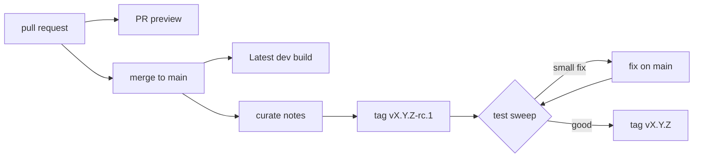

# Releasing

This project has **one source of truth for releases: a git tag**. Everything
else — the version baked into every binary, the "What's New" dialog in the UI,
the published GitHub Release, and the attached artifacts — is derived from that
tag and from [CHANGELOG.md](CHANGELOG.md). There is no second place to bump a
version by hand.

## Four kinds of build

| Build | Made by | Who it is for | Where |
| --- | --- | --- | --- |
| **PR preview** | every push to a pull request | reviewers, before it merges | its own address on Cloudflare Pages |
| **Latest dev build** | every merge to `main` | anyone who wants the newest work today | the Releases page (desktop), [slicer.maxscopp.de](https://slicer.maxscopp.de/) on GitHub Pages (web) |
| **Release candidate** | a `vX.Y.Z-rc.N` tag | the final test sweep before a release | a GitHub pre-release |
| **Release** | a `vX.Y.Z` tag | everyone | a GitHub Release |

Previews and dev builds happen on their own and report their version as
`development`. A release goes through a candidate first: the notes are
finished, the candidate is built exactly as the release will be, someone tests
it, and only then is the real tag cut.



## How versioning works

The running version is computed at **build time** by [`build.rs`](build.rs),
which probes git:

| Build situation                                    | Reported version |
| -------------------------------------------------- | ---------------- |
| Clean checkout sitting exactly on a `vX.Y.Z` tag   | `X.Y.Z`          |
| Clean checkout on a `vX.Y.Z-rc.N` tag              | `X.Y.Z-rc.N`     |
| Any commit ahead of a tag, or a dirty working tree | `development`    |
| No tags at all (fresh clone)                       | `development`    |

That value is exposed to every target through
[`src/version.rs`](src/version.rs) (`crate::version::VERSION`) and surfaced by:

- the CLI — `slicer-engine --version` and `slicer-engine info`,
- the WebSocket server — the `Connected { version }` handshake,
- the WASM bundle — `appVersion()` / `appInfo()`, read by the Angular UI,
- the Tauri desktop app — via the same WASM bundle.

Because the version is honest by construction, local development builds always
read `development` instead of a stale, misleading number. Only a tagged, clean
build ever reports a real semver.

> The `version` field in `Cargo.toml` is the *next* target version the
> maintainers are working towards. It is **not** what users see — that always
> comes from the git tag.

## The changelog

[CHANGELOG.md](CHANGELOG.md) follows [Keep a Changelog](https://keepachangelog.com/)
and is embedded into every build via `include_str!`. The UI reads it back out in
**Settings → What's New**, and shows the same list in a one-time dialog — scrolled
to the newly installed version — the first time a user runs an upgraded release
(development builds are never nagged). On iPadOS, where dialogs are drawn by the
OS and cannot hold that much content, the prompt links to the settings section
instead.

It is written **for the person using the app**: what they can do now that they
could not before, in a few short lines each. It is not a record of every commit.

- **`## [Unreleased]` fills up as work lands**, one entry per user-visible
  change. It is shown on the Latest dev build as "Coming in the next release".
- **Before every release it is freshened up** — merged, trimmed and rewritten
  into something enjoyable to read, biggest change first. The
  [`release` skill](.claude/skills/release/SKILL.md) holds the voice.
- **A release candidate uses its release's section.** `0.6.0-rc.1` has no
  heading of its own; it shows the `## [0.6.0]` notes, in the app and on GitHub.
- **The full commit list is for the nerds**, and lives only on the GitHub
  Release, folded away under the curated notes —
  [`scripts/release-commits.sh`](scripts/release-commits.sh) writes it from the
  commits since the previous stable release. It never goes into `CHANGELOG.md`,
  which ships inside the app.

## Cutting a release — the easy way

Run the **`release` skill** (say "prepare a release" to the agent). It works in
two passes, and stops for your go-ahead before every tag:

1. **Prepare** — gathers the commits and contributors since the last release,
   freshens up the notes, and cuts the release candidate.
2. **Ship** — after your test sweep (and any tiny fix), dates the notes and
   cuts the release itself.

The manual steps below are what that skill performs.

## Cutting a release — step by step

### 1. Prepare the notes

```bash
scripts/gen-changelog-draft.sh          # commits since the last v* tag, by category
scripts/release-contributors.sh         # contributors + first-timers
scripts/release-commits.sh              # the full list, as it will appear on GitHub
```

None of these write anything. Rewrite `## [Unreleased]` into the release's
notes, rename it to the version with today's date, and open a fresh
`Unreleased` above it:

```markdown
## [Unreleased]

## [0.6.0] - 2026-10-01

One or two sentences on the biggest change.
...
```

### 2. Cut the release candidate

```bash
git add CHANGELOG.md
git commit -m "docs: changelog for 0.6.0"
git tag v0.6.0-rc.1
git push origin main v0.6.0-rc.1
```

The candidate is published as a GitHub **pre-release** with every platform's
build and the `0.6.0` notes under a "release candidate" banner.

### 3. Test sweep

Install the candidate and try what the notes promise, on the platforms that
matter — the [`test-changes` skill](.claude/skills/test-changes/SKILL.md)
writes the checklist. Anything found is fixed on `main` like any other change;
if the fix is user-visible, add a line to the `## [0.6.0]` section, not to
`Unreleased`.

A fix that needs its own round of testing gets another candidate
(`v0.6.0-rc.2`). A tiny, obviously safe one can go straight to the release.

### 4. Ship

Set the section's date to today if it has moved, commit, and tag **the commit
you tested** (plus any tiny fix):

```bash
git tag v0.6.0
git push origin main v0.6.0
```

If unrelated work has merged to `main` since the candidate, do not tag the tip
of `main` — it would ship untested changes. Branch `release/0.6` from the
candidate's tag, put the fix and the date there, and tag that branch.

Pushing either kind of tag triggers
[`.github/workflows/release.yml`](.github/workflows/release.yml), which:

1. Extracts the version's section from `CHANGELOG.md`
   (via [`scripts/extract-changelog.sh`](scripts/extract-changelog.sh)), adds
   the folded commit list, and **creates the GitHub Release** — a pre-release
   for a candidate.
2. Builds the **CLI/server binary** for Linux, macOS (x86-64 + arm64), and
   Windows, and attaches each as a `.tar.gz` / `.zip`.
3. Builds the **Tauri desktop app** for each platform and attaches the
   installers/bundles.

Every build in that workflow has `SLICER_VERSION` pinned to the tag, so the
artifacts report the correct version even on a shallow checkout.

## Verifying a release locally

```bash
# What version will this checkout report?
cargo run -- info

# What are the embedded notes?
cargo run -- changelog                 # full changelog
cargo run -- changelog --version 0.6.0 # one section (an -rc.N resolves to it too)
cargo run -- changelog --json          # machine-readable

# Exactly what the GitHub Release body will start with
scripts/extract-changelog.sh 0.6.0-rc.1
```

On a clean checkout of the tag, `cargo run -- info` should print `0.6.0` with
channel `release`; anywhere else it prints `development`.

## The Latest dev build

[`.github/workflows/dev-build.yml`](.github/workflows/dev-build.yml) runs after
every merge to `main` and replaces a single pre-release titled **Latest dev
build** (tag `dev-build`) with fresh Windows and macOS desktop bundles.

- **Honest about what it is.** It reports `development`, so the app never shows
  a What's New prompt for it, and its notes open by saying it is untested.
- **Useful notes anyway.** The `Unreleased` changelog, as "Coming in the next
  release", then the full commit list since the last release.
- **Replaced in one step.** All platforms build first; only when every one
  succeeded is the previous dev build swapped out — tag, notes and downloads
  together. A failed build leaves the last good one in place.
- **Always on top, always the same links.** The release is recreated each time,
  so it heads the Releases page, and the downloads keep version-less names, e.g.
  `…/releases/download/dev-build/Slicer-Engine-Desktop-macOS.dmg`.
- **Never cancelled mid-build.** Merges that arrive during a build queue up and
  collapse into one follow-up build of the newest commit.

### On the web

The web slicer and the docs at [slicer.maxscopp.de](https://slicer.maxscopp.de/)
are the Latest dev build too:
[`.github/workflows/deploy-docs.yml`](.github/workflows/deploy-docs.yml)
publishes them to GitHub Pages after every merge to `main` that touches them.
The custom domain comes from [`ui/public/CNAME`](ui/public/CNAME), which the
UI build copies into the site — delete it and the domain goes with it.

This is the only build that asks to be found. The workflow sets
`SLICER_SITE_URL`, and [`scripts/seo/`](scripts/seo/) adds what search engines
and link previews read: a descriptive title, canonical URLs, social cards,
schema.org data, `robots.txt`, one `sitemap.xml` for the app and the docs,
`llms.txt`, and readable HTML on the home page for crawlers that don't run the
app. Every other build — a preview, a fork, a self-hosted server — leaves the
variable unset and ships the neutral app shell, so none of them claims to be
this site.

## PR previews

[`.github/workflows/pr-preview.yml`](.github/workflows/pr-preview.yml) gives
every pull request its own copy of the static site — the web slicer at the
root, the docs under `/docs/` — so a change can be tried in a browser before it
merges.

- **The same build as GitHub Pages.** Both call
  [`scripts/build-site.sh`](scripts/build-site.sh); only the host differs, and
  the search-engine layer above, which a preview never gets. The web slicer
  runs entirely in the browser, so a static host is all it needs.
- **One address per pull request**, `https://pr-<n>.<project>.pages.dev`,
  updated in place on every push. It is posted as a single comment on the pull
  request (edited, never repeated) and shown as its deployment.
- **Gone when the pull request closes** — merged or not, its deployments are
  deleted.
- **Not for forks.** A fork's workflow never sees the repository's secrets, and
  giving them to its code would be unsafe. A maintainer can deploy a fork's pull
  request by hand once they have read it: *Actions → PR preview → Run workflow*
  with its number.
- **Not indexed.** Cloudflare marks preview deployments `noindex`.

### Setting it up

Previews skip quietly until these exist in the repository settings:

| Name | Kind | What it is |
| --- | --- | --- |
| `CLOUDFLARE_API_TOKEN` | secret | an API token with **Account → Cloudflare Pages → Edit** |
| `CLOUDFLARE_ACCOUNT_ID` | secret | the account id from the Cloudflare dashboard |
| `CLOUDFLARE_PAGES_PROJECT` | variable, optional | the Pages project name (default `coldcrabby-slicer`) |

The workflow creates the Pages project on first use. The free plan is enough;
its limit that matters here is 25 MiB per file, which the WASM bundle must stay
under.

## macOS bundles & code signing

Both desktop workflows build a **universal** macOS binary
(`universal-apple-darwin`), so a single `.dmg` runs on Intel *and* Apple Silicon.

By default the app is only **ad-hoc signed** (`APPLE_SIGNING_IDENTITY=-`). That
is enough to launch it, but because it is not notarized, macOS attaches a
quarantine flag to the downloaded bundle and Gatekeeper reports the app as
**"damaged and can't be opened"**. Clearing the flag once fixes it:

```bash
xattr -cr "/Applications/Cold Crabby Desktop.app"
```

The dev build and release notes already spell this out for users.

### Shipping notarized builds

To give users a clean double-click experience (no `xattr` dance), add these repo
**secrets** — both workflows detect them automatically and switch from ad-hoc
signing to real Developer ID signing + notarization:

| Secret                       | What it is                                          |
| ---------------------------- | --------------------------------------------------- |
| `APPLE_SIGNING_IDENTITY`     | e.g. `Developer ID Application: Your Name (TEAMID)` |
| `APPLE_CERTIFICATE`          | base64 of the exported `.p12`                       |
| `APPLE_CERTIFICATE_PASSWORD` | password for that `.p12`                            |
| `APPLE_ID`                   | your Apple ID email                                 |
| `APPLE_PASSWORD`             | an app-specific password for notarization           |
| `APPLE_TEAM_ID`              | your 10-character Apple Team ID                      |

This requires a paid Apple Developer account. Until those are set, the ad-hoc +
`xattr` path above is the supported way to run the desktop app.

## See also

- [`release` skill](.claude/skills/release/SKILL.md) — automates this process locally.
- [CHANGELOG.md](CHANGELOG.md) — the notes themselves.
- [`build.rs`](build.rs) — version derivation from git.
- [`src/version.rs`](src/version.rs) — the version/changelog API.
- [`.github/workflows/release.yml`](.github/workflows/release.yml) — candidates and releases.
- [`.github/workflows/dev-build.yml`](.github/workflows/dev-build.yml) — the Latest dev build.
- [`scripts/release-commits.sh`](scripts/release-commits.sh) — the commit list for the nerds.
- [`.github/workflows/pr-preview.yml`](.github/workflows/pr-preview.yml) and [`scripts/build-site.sh`](scripts/build-site.sh) — PR previews.
- [`.github/workflows/deploy-docs.yml`](.github/workflows/deploy-docs.yml) — the web slicer and docs on GitHub Pages.
