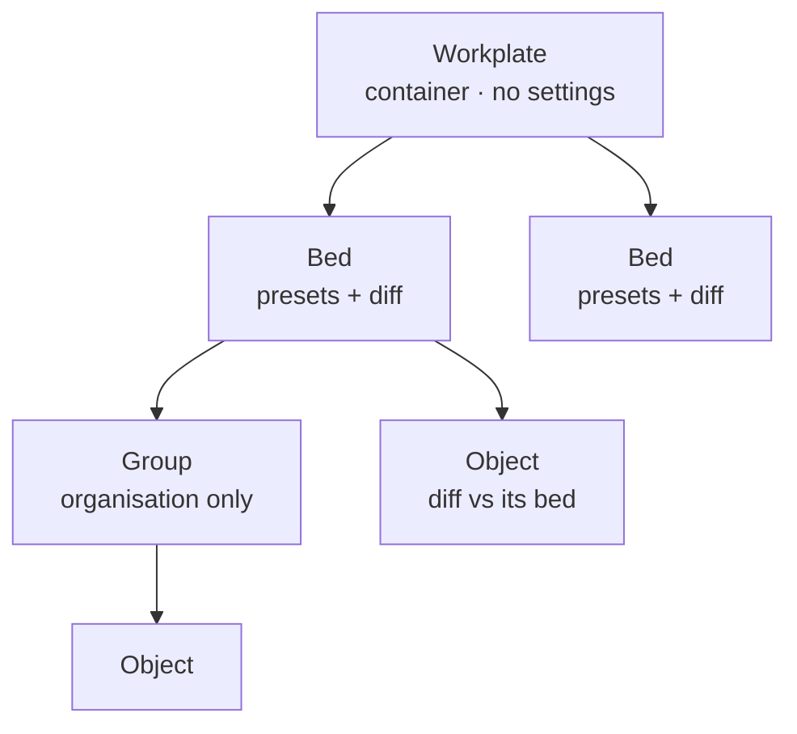

# Project Tree and Object Scope

A build plan, not a specification. It records the shape agreed in design review
and what each landing needs, so the hard parts can be argued about in their own
pull requests rather than in this one.

## The problem, in three parts

- **The objects list does not scale.** A 232 px card floating over the plate it
  describes, capped at 320 px tall, with no hierarchy, no rename, no range
  select, and duplicates that all read `Benchy.stl`. It is right for three
  objects and unusable for twelve.
- **Nothing on a plate can carry its own settings.** `slice_plate` takes one
  `SlicingParams` for everything on it; `ObjectInput` carries a mesh and paint.
- **A workplate is a bed.** `SceneState` holds one `bed: BedConfig` and
  `WorkplateSetup` is flat — one preset trio, one override map, one object
  list. Several beds, on different printers, in one workplate has nowhere to go.

These are one missing tree.

## The shape

**Three levels in the tree; two places settings are stored.** A level that
organises is not a level that overrides. The chain stays
`defaults → printer → filament → process → bed → object`, and a group edit
writes ordinary object overrides onto each member rather than becoming a layer
of its own.

Three surfaces, three questions:

| Surface | Answers | Follows |
| --- | --- | --- |
| Left sidebar | With what settings? | the selected **scope** — bed settings, object sheet over them |
| Right sidebar | What is here? | the **view mode** — project tree in model, G-code inspector in preview |
| Floating card | Go | nothing; it is the estimate and Slice for the current bed |

A fixed right-sidebar footer carries the project totals and **Slice all**, so it
survives the body's mode swap. **Slice this bed** stays on the plate. Two Slice
buttons, two scopes, each beside what it acts on.

## Landings

### 1 — A right sidebar, and the tree in it

No engine work.

- Teach `nexus-sidebar` a `side` input. It is left-handed in about eight places:
  the hide transform, the pin anchored at `left: var(--sidebar-w)`, the reveal
  tab tucked against the nav rail, the drag handle at `right: 0`, the safe-area
  padding — and the two pointer comparisons behind the hover-peek, which read
  *distance from the left edge* and must become *distance from the panel's near
  edge*. That logic is what stopped the peek oscillating; generalise it once,
  do not fork it.
- Mount a second sidebar after `<main>` in `slicing-shell`. The shell is already
  a flex row, so the scene shrinks by itself.
- Move the object list into it; retire `objects-panel`'s floating dock and the
  `.objects-dock` grid slot.
- Tree: root row, automatic groups by source file and by instance, collapsed by
  default. Inline rename (it also names the object in the exclude markers).
  Range select, select-all-in-group, a filter that appears once the count earns
  it.
- Settle the two-column room test before any width is hardcoded. The left
  sidebar docks unless `isHandheld()`; nav rail plus two columns is a different
  sum.

### 2 — Stable instance ids

Invisible, and blocking for everything after it.

`ObjectId` is monotonic within one `SceneState` and gone on reconnect;
`source_id` is shared by every duplicate. There is nothing to hang per-object
data on across a session. Stamp an instance uuid at `Add` and `Duplicate`, carry
it into the saved object entries, and pin it with a test that reopens a
workplate full of duplicates.

### 3 — Beds

- `SceneState.beds: Vec<BedConfig>`, each object tagged with its bed, and a
  `MoveToBed` op — which bed an object stands on is a placement fact and goes
  through the scene engine like every other one. Out-of-bounds and collision are
  then measured against each object's own printer.
- One bed renders at a time. The camera, gizmos, the paint brush and arrange all
  assume a single plate under the cursor.
- `WorkplateSetup.beds: Vec<BedSetup>`, where a `BedSetup` is today's flat
  fields plus a stable id. A legacy document loads as a one-bed workplate; every
  field stays defaulted.
- One bed, one slice, one G-code, one history row. Per bed the request is
  exactly today's request, so `slice_plate` stays the single entry point.
  "Slice all" is N of them with per-bed progress, not a new protocol.
  **History and the result cache need a bed id in their key** — settle it before
  the first bed is written.
- Naming pass while it is cheap: **workplate** is the document you open, **bed**
  is one printer's plate inside it. The engine barely moves — `slice_plate` and
  `PlateSlice` already describe exactly one bed's work — but the UI copy and
  `src/workplate/README.md` need it.
- Adding a bed **copies** the current bed's presets and overrides and says so. A
  live link would be a project-default layer through the back door.

### 4 — Object scope

- `x-scope: "object"` beside `x-group` in `src/settings/params.rs`, defaulting to
  bed, evaluated in one place next to `relevance.ts`, with a spec that fails on
  an unclassified field the way `setting-contract.spec.ts` fails on an unclaimed
  group. Object-scopeable: Walls, Infill, Surfaces, Support, Quality, Speed,
  Extrusion, Mesh. Bed-only: Layer (one z stack per bed), Adhesion, Temperature,
  Cooling, Hardware, Retraction, Output, Objects, Thumbnail, Time estimate.
- `overrides` on `SceneObjectSliceDto` — a sparse map, defaulted empty, in the
  same slot `support_paint` already occupies. Old clients and old documents keep
  working.
- Resolution is `bed params → object diff`, applied engine-side after the
  existing stack. Keys that are not object-scoped are refused into
  `unsupported_feature_warnings`, never silently honoured.
- A non-empty diff on any object sets `object_aware`. **The merged fast path must
  stay byte-identical** when nothing asks for object awareness.
- The sheet lists **only what is overridden**, each beside the bed value it
  beats, with an add-setting search and an empty state. Inherited fields render
  only behind "Show all object settings".
- Provenance marks, used in both columns: unmarked = inherited from the preset
  stack, hollow ring = set on this bed, filled accent = set on this object.

### 5 — Named groups and the reverse view

Drag-to-group, group selection as batch edit, and a "N objects differ"
affordance on a bed setting that some object overrides — driven from the same
computed as the marks, so the two cannot drift.

## Decisions still open

- **Does the G-code inspector move into the right sidebar too?** It is what keeps
  the scene one width across the view toggle, but its expand motion and its
  "give up room before Slice does" rule were tuned inside the floating card.
- **Which column yields first** on a laptop-width window — the project dock or
  the settings dock.
- **One bed on screen, or all of them.** An all-beds overview changes the camera
  and gizmo model and deserves its own design.
- **Row visibility.** Useful at twelve parts, and hidden is not excluded —
  someone will assume it is. Ships view-only with copy that says so, or waits.
- **Group settings.** Batch-edit only above. Making a group a real inheritance
  layer is a deliberate third scope and needs a third mark.

## Non-goals

- No settings at the workplate level. With different printers per bed there is
  nothing coherent to put there, and it would cost the one question that has to
  stay answerable: where did this value come from?
- No blur behind the object sheet. The single sanctioned backdrop blur is for
  translucent surfaces over the 3D scene; the settings column is opaque chrome.
  Elevation, a tone scrim and an accent edge do the same job within the rules.
- No groups in the scene engine. It owns placement; a folder is not a placement,
  though which bed an object is on is.
