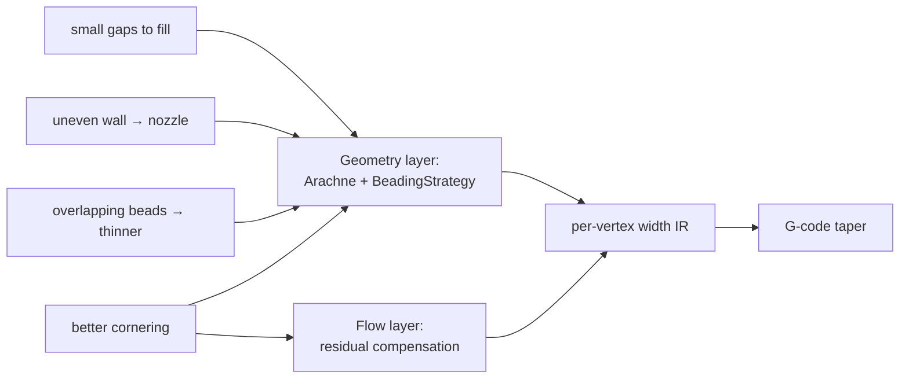
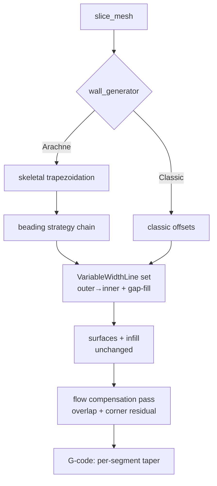
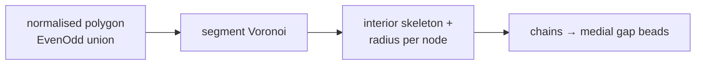
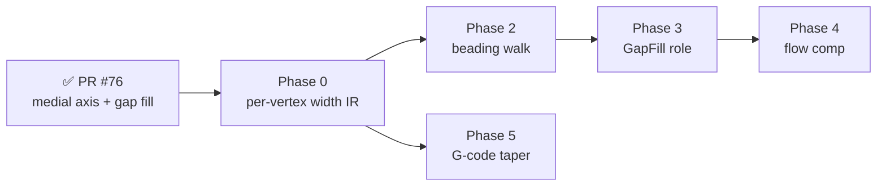

# Architecture — Variable-Width Walls, Gap Fill & Flow Compensation (Arachne, continuation)

**Status:** in progress · **Scope:** `src/walls/`, `src/core/`, `src/gcode/`, `src/settings/`
· **Merged:** PR #75 (`feat/walls-module-restructure` — module split) and **PR #76
(`feat/arachne-generator`)** — a working medial-axis Arachne generator + a slicer
robustness fix (phantom contour at grazing horizontal faces).

PR #76 delivered the **geometry foundation** (segment Voronoi, medial-axis
skeleton, and medial-axis gap fill of the residual). This plan now covers the
**remaining** work to reach full variable-width extrusion: a per-vertex width
representation, wiring the beading strategy into a skeleton walk so _every_ bead
(not just the residual) is correctly sized, gap-fill role plumbing, and a thin
residual flow pass — the way CuraEngine / PrusaSlicer / OrcaSlicer finish it.

---

## 0. Read this first — reframing the request

The request lists four wants: _small gaps to fill_, _thicker lines when wall
thickness isn't a clean multiple of the nozzle_, _better cornering_, and _make
overlapping Arachne beads thinner so they don't collide_.

**Three of the four are not flow adjustments — they are bead-placement
decisions.** Overlap avoidance, uneven-wall widening, and gap fill are decided
_when the beads are generated_, from the local thickness of the cross-section.
This is precisely why Ultimaker built Arachne: constant-width concentric offsets
_cannot_ fill a region whose thickness isn't an integer multiple of the line
width without either overlapping (over-extrusion, corner blobs) or leaving voids
(gaps). No amount of post-hoc E-scaling fixes geometry that was placed wrong.

> **Anti-pattern to avoid:** a large "flow compensation" layer bolted on top of
> Classic constant-width offsets to hide overlaps. That is the exact approach
> the mature slicers abandoned. We solve overlap/uneven/gap **at the geometry
> layer** (Arachne + a beading strategy), and reserve a _small_ flow pass only
> for the genuinely-residual cases (material shared between _different_ path
> groups, and inner-corner pile-up).

So the deliverable is: a real Arachne generator (geometry) + a minimal flow pass
(the residual), on top of a per-vertex width representation that both require.



---

## 1. Current state (verified against PR #76)

**Delivered — the geometry foundation is real and working:**

| Piece                      | Where                 | Notes                                                                                                                                   |
| -------------------------- | --------------------- | --------------------------------------------------------------------------------------------------------------------------------------- |
| Segment Voronoi            | `arachne/voronoi.rs`  | `boostvoronoi` (BSL-1.0), µm-integer input, translated to a local origin, input-simplified; panic-contained by the caller               |
| Medial-axis skeleton       | `arachne/skeleton.rs` | interior primary edges only; every `SkeletonNode` carries `radius` = ½ local thickness; `chains()` splits at junctions                  |
| Local bead-count variation | `arachne/generate.rs` | concentric `d`-wide offset loops that vanish in thin regions "for free"                                                                 |
| Medial-axis gap fill       | `arachne/generate.rs` | residual = `normalised − union(loop bands)`, per island; thin runs get an **open** variable-width bead (mean thickness, `[min, 2.5 d]`) |
| Beading foundation         | `arachne/beading.rs`  | `BeadingConfig` / `Beading` / symmetric layout, unit-tested — but **`#![allow(dead_code)]`, not wired into `generate`**                 |

**Remaining — what this plan finishes:**

| Concern           | Today                                                                   | Gap                                                                                                                                     |
| ----------------- | ----------------------------------------------------------------------- | --------------------------------------------------------------------------------------------------------------------------------------- |
| Width model       | `SliceLayer.path_widths: Vec<Option<f64>>` — **one width per path**     | Cannot represent a bead that tapers along its length; the medial beads are piecewise-**constant** (mean per run) only because of this   |
| Outer/inner loops | constant width `d`                                                      | not yet varied to absorb uneven-wall thickness (the "uneven wall → nozzle" ask)                                                         |
| Overlap handling  | avoided **geometrically** (loops kept at `d`, only the leftover filled) | beads are never **thinned** to partition thickness → acute-corner self-overlap of the `d` loops persists (the "make beads thinner" ask) |
| G-code flow       | `width_mm` resolved **once per path**                                   | Cannot taper E per segment                                                                                                              |
| Gap-fill role     | medial beads tagged `InnerWall`                                         | no distinct `GapFill` role / speed / `;TYPE:Gap infill` marker                                                                          |
| Flow comp         | none                                                                    | cross-group overlap + inner-corner pile-up unaddressed                                                                                  |
| Curved edges      | parabolic Voronoi edges chord-approximated                              | Cura discretises; refinement deferred                                                                                                   |
| Perf              | per-layer Voronoi is unconditional `O(n log n)`                         | spatial-index / skip heuristic is the noted follow-up                                                                                   |

The Arachne params (`wall_line_width_min/max`, `wall_transition_threshold`,
`wall_transition_length`, `wall_distribution_count`) are consumed by
`beading.rs` but that module is **dead code** until the skeleton walk (§5) is
wired — so their effect is not yet visible in output.

---

## 2. Target architecture



Two clean seams:

1. **Generator boundary** — Classic and the merged Arachne both replace the
   layer's perimeter contours in place; the target is that both emit the same
   `VariableWidthLine` shape once §3 lands. Downstream stays generator-agnostic
   (the existing invariant from `walls/README.md` §"whichever generator runs…").
2. **Flow boundary** — a single `flow::compensate()` pass runs after all
   geometry, before G-code. It only _reads_ geometry and _writes_ per-vertex
   width multipliers. Deterministic, isolated, testable.

---

## 3. Phase 0 — Variable-width extrusion IR (the linchpin)

Nothing downstream can taper until width is per-vertex. This phase unblocks
every later phase and is worth doing carefully.

**Chosen representation** (mirrors CuraEngine `ExtrusionLine`/`ExtrusionJunction`
and Prusa `ExtrusionPath` width arrays):

```rust
/// One extrusion move-chain whose width may vary per vertex.
pub struct VariableWidthLine {
    pub junctions: Vec<Junction>, // point + width at that point
    pub role: ExtrusionRole,
    pub closed: bool,
}
pub struct Junction { pub x: f64, pub y: f64, pub w: f64 }
```

Width between two junctions is linearly interpolated by the G-code emitter.

**Migration strategy — staged, not big-bang.** Rewriting `SliceLayer` wholesale
touches infill, surfaces, debug, and G-code at once (high risk). Instead:

- **0a.** Add an _optional_ parallel array `path_vertex_widths: Vec<Option<Vec<f64>>>`
  to `SliceLayer` (one width per vertex when present; `None` ⇒ fall back to the
  existing scalar `path_widths[i]`, which falls back to the role default). Only
  the wall generators populate it. Zero change for infill/surfaces.
- **0b.** Teach the G-code emit loop to read per-vertex widths: replace the
  single `width_mm` with a per-segment width = mean of the two endpoint widths
  (or midpoint sample). Extend the existing `;WIDTH:` transition logic to fire
  on intra-path width change (it already fires on inter-path change).
- **0c.** _End-state (later consolidation, not required for Arachne to ship):_
  collapse `paths` + `path_roles` + `path_widths` + `path_vertex_widths` +
  `path_is_open` into one `Vec<VariableWidthLine>`. Track as a follow-up; the
  parallel-array bridge keeps blast radius small now.

> **Why not jump straight to the unified type?** It is the correct end-state, but
> doing it before Arachne exists means a large diff with no user-visible payoff
> and a big merge-conflict surface against in-flight infill/surface work. Stage
> it. This is a deliberate, documented debt with a payoff trigger (0c after
> Arachne lands).

**Definition of done:** a hand-built tapering bead (0.4→0.8 mm) round-trips
through `SliceLayer` → G-code and produces monotonic E with the correct
volumetric ratio at each segment; `;WIDTH:` comments track the taper.

---

## 4. Phase 1 — Skeletal trapezoidation (the medial axis) — ✅ DELIVERED (PR #76)

The heart of Arachne (Kuipers et al. 2020, _"A Framework for Adaptive Width
Control of Dense Contour-Parallel Toolpaths"_). **This phase is done** — the
notes below record the decisions that shipped and the one deferred refinement.

**Primitive: a segment Voronoi diagram.** Each polygon edge is a Voronoi site;
the diagram's interior edges approximate the medial axis, and every point on it
carries a distance-to-boundary = half the local thickness. Shipped in
`arachne/voronoi.rs` (build) + `arachne/skeleton.rs` (interior filter + per-node
`radius`).

**Dependency decision — `boostvoronoi`** (pure-Rust port of Boost.Polygon's
Voronoi, the _same_ construction Cura and Prusa rely on) — **adopted**:

| Option                      | Segment sites?         | Robustness                           | Wasm                     | Verdict                               |
| --------------------------- | ---------------------- | ------------------------------------ | ------------------------ | ------------------------------------- |
| `boostvoronoi`              | ✅                     | i64 exact predicates (Boost lineage) | pure Rust — should build | **adopt**                             |
| `spade`                     | ❌ point Delaunay only | good                                 | ✅                       | insufficient (no segment medial axis) |
| `geo` / `cavalier_contours` | ❌                     | offsetting, not medial axis          | ✅                       | wrong tool                            |
| hand-rolled segment Voronoi | —                      | very hard to get robust              | —                        | don't                                 |

As shipped, sites are fed at **µm integer** scale (`VORONOI_SCALE = 1000`),
translated to a local bounding-box origin first for numerical headroom, and the
contour is simplified at 5 µm before construction — `boost::polygon::voronoi`
needs integer input and is fragile on near-coincident sites. (This differs from
the Clipper2 `Centi` scale used elsewhere; it is local to the Voronoi build.)

**Pipeline** (as built):



The `union(…, EvenOdd)` normalisation from `classic.rs` (invariant #1) is reused
as the input stage. **Deferred:** parabolic (convex-vertex) Voronoi edges are
chord-approximated, not discretised into arcs — a geometric-accuracy refinement
Cura performs but we have not.

---

## 5. Phase 2 — Wire the beading strategy into a skeleton walk (the core remaining work)

**The fork.** PR #76 ships a _pragmatic_ scheme: keep every loop at width `d`
and fill only the leftover the loops don't cover. That already nails "small gaps
to fill", but it never **thins** a loop, so it cannot satisfy the other two
geometry asks:

- _uneven wall → nozzle_ needs the inner loops to **widen** to absorb the
  non-integer remainder (instead of dumping it into a central gap bead);
- _make colliding beads thinner_ needs all beads to **partition** the local
  thickness (instead of two `d` loops overlapping at an acute concave corner).

Both require replacing "offset loops + residual" with a **skeleton walk that
samples the beading strategy per node** — exactly what `arachne/beading.rs`
(`BeadingConfig`, currently dead code) was built for. Given local thickness
`t = 2·radius`, the strategy already decides bead count and per-bead width; the
walk reconstructs continuous loops by sampling it along each medial edge and
smoothing count changes over `wall_transition_length`.

| Strategy role                       | `beading.rs` today         | User ask                  | Param                       |
| ----------------------------------- | -------------------------- | ------------------------- | --------------------------- |
| distribute `t` across N beads       | ✅ `compute` (equal share) | colliding beads → thinner | `wall_line_width_max`       |
| pin outer at `d`, widen inner       | ⬜ (equal share only)      | uneven wall → nozzle      | `wall_distribution_count`   |
| widen a sub-`d` feature to one bead | ⬜ (returns 0 beads)       | keep small ribs           | `wall_line_width_min`       |
| cap count, leftover → infill        | ✅ `left_over`             | honour wall count         | `wall_count`                |
| count hysteresis                    | ✅ `transition_threshold`  | no flip-flop              | `wall_transition_threshold` |

**Hard prerequisite: Phase 0.** The walk produces a _continuously_ varying width
per node; the current per-path width model would immediately average that away
(as the medial beads already do). So Phase 0 (per-vertex width IR) must land
first, or the walk buys nothing over what shipped. Two params still need adding:
`wall_transition_angle` (≈10°) and `wall_transition_filter_distance` (de-noises
tiny count flips).

**Recommendation.** Evolve, don't rip out: keep the offset-loop path as the
count-limited common case, and route only the geometry-limited / uneven cases
through the beading walk — then converge on the walk generating _all_ beads once
it is proven on the fixture suite. Keep it behind `WallGenerator::Arachne`; the
coverage-difference residual is a fine fallback if the walk fails on a layer.

**Delivered so far.** `emit_medial_beads` now consumes
`BeadingConfig::optimal_bead_count` to split a wide residual into `n` parallel,
per-vertex-tapered beads (offset along the medial normal) instead of one
over-wide bead — so `beading.rs` is live and the residual is correctly
partitioned (no overlap, no over-extrusion). **Still remaining:** variable-width
**outer** loops for thin _uniform_ walls (e.g. a 0.6 mm wall that should be one
0.6 mm bead, not a 0.4 mm loop with a dropped 0.2 mm residual). That is the full
skeletal walk over the main loops — higher risk; the offset-loop path still
emits constant-`d` walls until it lands.

**Why not a per-island shortcut?** A single representative thickness per island
was tried and reverted: a rectangular wall is thin at the sides but thick at the
corners, so its inradius (the thick corner) over-widens the beads and the thin
side gaps fall below `min_bead_width` and vanish. Correct variable-width outer
walls need the **per-location** thickness from the skeletal walk, not a
per-island number.

---

## 6. Phase 3 — Gap fill (✅ delivered)

**Arachne (done):** `generate.rs` emits the medial-axis residual as **open**,
per-vertex-tapered beads (`path_is_open = true`), per island, with a
`gap_fill_min_length_mm` run filter (default `2·d`) to shed sliver noise. Beads
are tagged **`ExtrusionRole::GapFill`** → the G-code generator emits the
OrcaSlicer `;TYPE:Gap infill` label and resolves the `gap_fill_speed` param
(falling back to `perimeter_speed`, then `print_speed`). Per-vertex taper flows
through Phase 0.

**Remaining (optional):**

- A distinct gap-fill colour in the viewers (`;TYPE:Gap infill` currently maps
  to the infill colour via the `"infill"` substring match — acceptable).

**Classic (optional):** its single-residual-bead approximation stays as-is; a
true medial-axis gap fill would reuse the same skeleton. Defer — Arachne is the
gap-fill story.

---

## 7. Phase 4 — Flow / overlap compensation (the small residual)

With Arachne partitioning each cross-section, intra-wall overlap is already
gone. This pass handles only what the beading strategy can't see:

> **Assessment (this branch).** In our architecture the overlaps this pass would
> compensate are already avoided geometrically: Arachne beads are placed by
> coverage-difference (they don't overlap), gap fill lives in the _uncovered_
> region, and wall↔infill overlap is set by `infill_overlap_percent` /
> `infill_perimeter_gap_mm`. So Phase 4 is **low-priority** here — implement it
> only if a real over-extrusion artefact is observed, and keep it default-off.

1. **Cross-group overlap** — where a wall, a gap-fill line, and sparse/solid
   infill share the same mm² (e.g. the wall↔infill seam, or gap fill abutting a
   wall). Scale E down over the overlapping length so total deposited volume is
   right. Algorithm: for each extrusion segment, measure overlap length against
   already-committed geometry of _other_ groups (Clipper2 or a segment-distance
   test), multiply that sub-segment's width by a `[flow_min, 1.0]` factor.
   (CuraEngine `WallOverlapComputation`; Prusa handles this at gap-fill time.)
2. **Inner-corner pile-up (optional, advanced)** — at concave corners the head
   momentarily over-deposits; ramp flow down across the corner arc. Gated behind
   a default-off param until validated; easy to get wrong, modest payoff.
3. **Bridge / first-layer flow** — confirm the existing role-based handling
   already covers these; no new work expected.

Implementation: `src/flow/mod.rs`, a single deterministic
`compensate(&mut [SliceLayer], &SlicingParams)` pass after infill/surfaces and
before G-code. Writes into the Phase 0 per-vertex width array (never mutates
geometry). Skippable via a feature flag for A/B diffing.

> **Deliberately small.** If this phase grows large, it's a smell that geometry
> is being placed wrong upstream. Push fixes into the beading strategy first.

---

## 8. "Better cornering" — disambiguated

The phrase spans several established features; map each to its real home so we
don't build a vague catch-all:

| Symptom                                              | Real fix                                                    | Where                                                     |
| ---------------------------------------------------- | ----------------------------------------------------------- | --------------------------------------------------------- |
| Constant-width offsets self-overlap at acute corners | variable width                                              | Phase 2 (Arachne)                                         |
| Blob pile-up at concave corners                      | inner-corner flow ramp                                      | Phase 4 (opt.)                                            |
| Ugly seam sitting on a corner                        | `SeamPosition::SharpestCorner` (**exists**) + seam gap/wipe | `settings/params.rs`                                      |
| Dimensional bulge / rounded outer corners            | "precise wall": spacing = width, outer-first order          | Phase 2 ordering                                          |
| Faceted curves                                       | arc fitting (G2/G3)                                         | separate `feature/arc-fitting` branch — out of scope here |

---

## 9. Parameter mapping (Cura ⇄ ours)

| CuraEngine                        | Ours (existing unless noted)              | Default    |
| --------------------------------- | ----------------------------------------- | ---------- |
| `wall_line_count`                 | `wall_count`                              | 3          |
| `min_bead_width`                  | `wall_line_width_min × d`                 | 0.85 d     |
| (max variable width)              | `wall_line_width_max × d`                 | 1.5 d      |
| `wall_transition_threshold`       | `wall_transition_threshold`               | 0.6        |
| `wall_transition_length`          | `wall_transition_length`                  | 1.0 mm     |
| `wall_distribution_count`         | `wall_distribution_count`                 | 1          |
| `wall_transition_angle`           | **add** `wall_transition_angle`           | 10°        |
| `wall_transition_filter_distance` | **add** `wall_transition_filter_distance` | 0.1 mm     |
| `gap_fill_speed`                  | **add** `gap_fill_speed`                  | role speed |
| —                                 | **add** `gap_fill_min_length_mm`          | ≈0.4 d     |

Only four new params; the rest are already declared and merely need consuming.

---

## 10. Failure modes & numerical robustness

| Failure                                          | Guard                                                                                                      |
| ------------------------------------------------ | ---------------------------------------------------------------------------------------------------------- |
| Collinear / coincident / duplicate Voronoi sites | dedupe + snap at `Centi` integer scale before construction                                                 |
| Integer overflow at model scale                  | keep coords in Clipper2 `Centi`; validate bbox fits i64 predicate range                                    |
| Self-touching / non-manifold layer contour       | reuse `union(…, EvenOdd)` normalisation (invariant #1) as Voronoi input                                    |
| Degenerate / zero-area cells, sliver beads       | reuse `drop_degenerate_beads` (invariant #2) on the raw shrink result                                      |
| Bead width below extrudable minimum              | `Limited`+`Widening` floor at `wall_line_width_min`; below that → drop, don't extrude air                  |
| Hole winding flipped → infill in the void        | **do not** normalise wall paths to CCW (invariant #3); classify by signed area                             |
| Bead-count flip-flop on noisy edges              | `wall_transition_filter_distance` + hysteresis at `wall_transition_threshold`                              |
| Non-determinism                                  | no hashing/threads in geometric decisions; rayon only across independent layers/islands (existing pattern) |

The four wall invariants in `walls/README.md` and AGENTS.md continue to hold —
Arachne is added _beside_ Classic, not by weakening them.

---

## 11. Testing

- **Unit fixtures** (`tests/fixtures/`): thin wedge (0.3→1.2 mm taper), acute
  30° corner, letter-stem cross (variable thickness), annulus/donut (hole
  winding), 3-bead→2-bead transition ramp, sub-`d` rib (widening), tiny gap
  (< `min_w`).
- **Golden-geometry asserts:** bead count vs thickness, per-vertex width
  monotonicity across transitions, no overlap (pairwise bead centerline distance
  ≥ ½(w₁+w₂) − ε), no gap (union of beads covers interior minus tolerance).
- **Volumetric conservation:** ∫ width·dl over all beads + gap fill ≈ layer
  solid area (within tolerance) — catches both over- and under-extrusion.
- **Debug SVG stages:** add `WallMedialAxis`, `WallVariableBeads`,
  `WallGapFill`, `FlowOverlap` to `src/debug/` so each phase is inspectable
  (mirrors the existing `WallOffsetStep`/`WallBeads` stages).
- **Regression:** slice Benchy in both Classic and Arachne; diff G-code E-totals
  and wall counts; Arachne should show fewer dropped thin features and no
  corner over-extrusion spikes.
- **Wasm:** confirm `boostvoronoi` compiles under `wasm32-unknown-unknown`
  (`make build-wasm`); if not, gate Arachne `cfg(not(target_arch="wasm32"))` and
  keep Classic as the wasm generator (acceptable — matches existing native-only
  gating in AGENTS.md).

---

## 12. Dependency & licensing decision

- **`boostvoronoi`** (Boost Software License lineage — permissive): adopted for
  the medial axis in PR #76 (`arachne/voronoi.rs`). BSL-1.0 is compatible with
  both an AGPL public tier and a commercial licence.
- **No LICENSE file exists in this repo.** CuraEngine and PrusaSlicer are
  **AGPL-3.0**. Copying their Arachne/BeadingStrategy source would impose AGPL
  on this codebase. PR #76's generator is **clean-room** (paper + `boostvoronoi`
  primitive); keep it that way when wiring the beading walk (§5).
  Flag for the maintainer: decide the repo's own license.

---

## 13. Sequencing



Remaining merge order (each independently shippable behind
`WallGenerator::Arachne` / a feature flag):

1. **Phase 0** — per-vertex width IR + G-code taper. No behaviour change; the
   hard prerequisite for everything below. _Milestone: a tapering bead
   round-trips through `SliceLayer` → G-code with correct per-segment E._
2. **Phase 2** — wire `beading.rs` into the skeleton walk so inner loops widen
   and colliding beads thin. _Milestone: a non-integer-thickness wall shows a
   widened inner bead (not a central gap); an acute corner shows no `d`-loop
   overlap._
3. **Phase 3** — promote medial beads to `GapFill` role + speed; taper their
   width now that Phase 0 allows it.
4. **Phase 4** — flow compensation (small); "better cornering" residual.
5. Flip default to Arachne only after the fixture suite + Benchy regression pass.

---

## 14. Non-goals (this plan)

- Arc fitting / G2-G3 (separate `feature/arc-fitting` branch).
- Adaptive layer height, variable line width _per layer_ for surface quality.
- Rewriting infill/surfaces onto the unified IR (Phase 0c consolidation is a
  tracked follow-up, not a blocker).
- A large general-purpose flow-compensation engine — kept deliberately thin
  (§7).

---

## See also

- `src/walls/README.md` — generator switch, four invariants, output topology
- `src/walls/arachne/{voronoi,skeleton,beading,generate}.rs` — the shipped
  medial-axis generator (§1) and the dead-code beading foundation to wire (§5)
- `src/walls/classic.rs` / `src/walls/beads.rs` — offset generator, still the
  default
- `src/gcode/generator.rs` — `extrusion_for_move`, the per-path width resolution
  to make per-segment (Phase 0b / 5)
- `src/core/types.rs` — `SliceLayer`, `ExtrusionRole` (add `GapFill`)
- `src/settings/params.rs` — the pre-wired Arachne params to consume
- AGENTS.md §"Arachne Wall Paths", §"Clipper2 Fill Rules", §"Slicing Pipeline"
- Kuipers, Doubrovski, Verlinden (2020), _A Framework for Adaptive Width Control
  of Dense Contour-Parallel Toolpaths_ — the Arachne paper

```

```
