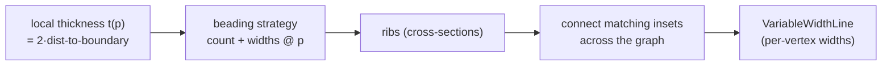
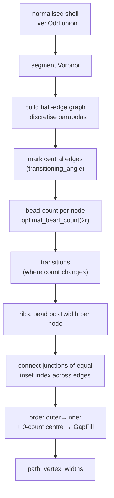
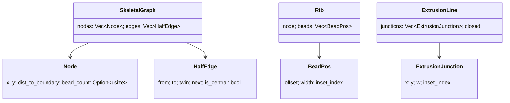

# Architecture — Skeletal Trapezoidation Walk (Arachne variable-width walls)

**Status:** proposal · **Scope:** `src/walls/arachne/` · **Prereqs merged/branched:**
per-vertex width IR (Phase 0), segment Voronoi + medial skeleton (Phase 1), the
`BeadingConfig` foundation, and the `GapFill` role — all on
`feat/arachne-variable-width`.

This plan builds the one piece the [flow plan](architecture-arachne-flow-1.md)
left open: **continuously variable-width _outer_ walls**. It is the real
CuraEngine/PrusaSlicer "Arachne" — a **skeletal trapezoidation** of each shell
(Kuipers et al. 2020) that assigns a bead count and per-point width from the
_local_ wall thickness and stitches those into variable-width toolpaths.

---

## 0. Why a walk, and not a shortcut

The flow-plan already delivered variable-width **gap fill** (the residual medial
beads). The remaining goal — vary the width of the **main perimeter loops** so a
0.6 mm wall is one 0.6 mm bead and a 1.7 mm wall is two 0.85 mm beads — has one
hard rule:

> **Width must be decided from the _local_ (per-point) wall thickness, never a
> per-island number.**

We proved why. A per-island representative thickness (the island inradius) was
tried and reverted: a rectangular wall is thin at the sides (e.g. 1.2 mm) but
thick at the corners (~1.7 mm); the inradius picks the corner, over-widens every
bead, and the thin side gaps fall below `min_bead_width` and vanish. Every real
wall varies in thickness (corners, fillets, tapers), so the only correct answer
is the **per-location** thickness the medial axis already carries. That is the
walk.

---

## 1. What we already have (the foundation)

| Piece | File | Reused as |
| --- | --- | --- |
| Segment Voronoi (`boostvoronoi`, µm-integer, panic-contained) | [voronoi.rs](../src/walls/arachne/voronoi.rs) | the graph's raw geometry |
| Interior medial skeleton, per-node `radius` (= ½ thickness), `chains()` | [skeleton.rs](../src/walls/arachne/skeleton.rs) | evolves into the half-edge graph |
| `BeadingConfig` — `optimal_bead_count(t)`, `compute(t) → widths/locations` | [beading.rs](../src/walls/arachne/beading.rs) | the base beading strategy |
| Per-vertex width IR (`SliceLayer.path_vertex_widths`) + G-code taper | [core/types.rs](../src/core/types.rs), [gcode/generator.rs](../src/gcode/generator.rs) | the toolpath **sink** — no downstream work |
| `ExtrusionRole::GapFill` + `;TYPE:Gap infill` | [core/types.rs](../src/core/types.rs) | 0-bead-count centre lines |

The IR is the important one: Phase 0 means the walk's output — polylines whose
width varies per vertex — already round-trips to correct per-segment G-code. The
walk only has to _produce_ `VariableWidthLine`s; everything after is done.

---

## 2. The algorithm (CuraEngine `SkeletalTrapezoidation`, Kuipers 2020)

Port the structure the mature engines use — do **not** invent a novel scheme.
The reference pipeline, mapped to our modules:

Stage names follow Cura so the source is a legible reference:

| Cura step | What it does | Our home |
| --- | --- | --- |
| `HalfEdgeGraph` construction | Voronoi → nodes/twin/next half-edges; `distance_to_boundary` per node | new `graph.rs` |
| edge discretisation | parabolic (point–segment) edges → line segments at `discretization_step_size` | `graph.rs` |
| `setMarking` / `filterMarking` | keep **central** edges (medial spine); drop shallow ones past `transitioning_angle`; collapse short central runs | `graph.rs` |
| `generateTransitionMids` | mark where `optimal_bead_count(t)` steps up/down along a central edge | `transition.rs` |
| `filterTransitionMids` | drop transitions closer than `wall_transition_filter_distance`; resolve conflicts | `transition.rs` |
| `generateTransitionEnds` | ramp each transition over `wall_transition_length` | `transition.rs` |
| `generateExtraRibs` | at each central node emit a **rib** — bead positions/widths from `beading.compute(t)` | `ribs.rs` |
| `generateSegments` / `connectJunctions` | join equal-inset-index junctions of adjacent ribs into `ExtrusionLine`s | `walk.rs` |
| `BeadingStrategyFactory` chain | Distributed → Redistribute → Widening → Limited → Order | `beading.rs` |

---

## 3. Data structures

- **`SkeletalGraph`** — a half-edge graph so the walk can traverse `twin`/`next`
  and know which boundary a bead offsets from. Evolves `skeleton.rs`'s
  `Skeleton {nodes, edges}` (currently undirected + chord-approx) into a
  directed half-edge structure with discretised parabolas.
- **`ExtrusionLine` / `ExtrusionJunction`** — Cura's toolpath type. On emit it
  lowers to `SliceLayer.paths[i]` + `path_vertex_widths[i]` (`w` per junction),
  `path_roles[i]` from `inset_index` (0 → OuterWall, ≥1 → InnerWall,
  0-bead-count centre run → GapFill), `path_is_open` for open ribs.

No new sink type is needed downstream — `ExtrusionLine` is a build-time scratch
type that flattens into the existing per-vertex IR.

---

## 4. Staged delivery

Each stage is independently reviewable and ships behind
`WallGenerator::Arachne`; the current offset-loops + coverage-difference residual
stays as the **fallback** until Stage E flips over. This mirrors the flow plan's
"evolve, don't rip out".

| Stage | Deliverable | Milestone / golden test |
| --- | --- | --- |
| **A** | half-edge `SkeletalGraph` + parabola discretisation | graph round-trips square / annulus / wedge; convex-corner edges are arcs not chords |
| **B** | central-edge marking + per-node bead-count field | wedge shows 1→2→3 bead-count bands as it widens; no count on boundary-hugging edges |
| **C** | transitions (mids / filter / ends) | linear wedge shows a smooth 1→2 ramp over `wall_transition_length`, no flip-flop near the boundary |
| **D** | ribs + junction connection → `path_vertex_widths` | **rectangular annulus**: two partitioned beads at the sides, widened at the corners, **no overlap and no dropped side gap** (the case that broke the heuristic) |
| **E** | beading chain (Redistribute/Widening/Limited/Order) + wire as the Arachne path; fixture suite; flip default | Benchy E-total & wall count within tolerance of the offset path; thin-wall box → one correctly-sized bead tagged OuterWall |

Recommended: land A–D on a dedicated branch off `feat/arachne-variable-width`;
keep the walk **opt-in** (a hidden `wall_generator` value or a debug flag) until
D passes the annulus test, then make it the `Arachne` implementation in E.

---

## 5. Parameters

| Param | Status | Role in the walk | Default |
| --- | --- | --- | --- |
| `wall_line_width_min` / `_max` | ✅ exists | bead width clamp (min/max bead) | 0.85 / 1.5 × d |
| `wall_transition_threshold` | ✅ exists | hysteresis before adding a bead | 0.6 |
| `wall_transition_length` | ✅ exists | ramp length of a count transition | 1.0 mm |
| `wall_distribution_count` | ✅ exists | how many inner beads absorb variation (Redistribute) | 1 |
| `wall_transition_angle` | **add** | min medial angle for a transition (avoids ribs on near-parallel edges) | 10° |
| `wall_transition_filter_distance` | **add** | drop transitions closer than this (de-noise) | 0.1 mm |
| `discretization_step_size` | **add (internal)** | parabola discretisation step | ~0.2 mm |

Two user-facing params to add; the rest are already declared and merely start
being consumed by the walk.

---

## 6. Beading strategy chain

`beading.rs` today is a single `DistributedBeadingStrategy` (`compute` = equal
share). The walk needs the full chain the mature engines compose — each a thin
decorator over the next:

| Link | Adds | Param |
| --- | --- | --- |
| `Distributed` (have) | split `t` into N equal beads | `wall_line_width_max` |
| `Redistribute` | pin the **outer** bead at nominal `d`, push variation inward | `wall_distribution_count` |
| `Widening` | a sub-`min` feature becomes **one** widened bead (don't drop thin ribs) | `wall_line_width_min` |
| `Limited` | cap bead count at `wall_count`; surplus thickness → infill | `wall_count` |
| `Order` | emit outer→inner by `inset_index` | — |

This is where "uneven wall → nozzle" (Redistribute) and "keep small ribs"
(Widening) — the two asks the flow plan left unmet — actually land.

---

## 7. Failure modes & numerical robustness

| Failure | Guard |
| --- | --- |
| Parabolic edge chord-approx warps thin curved walls | discretise point–segment edges (Stage A); this is the deferred item from `skeleton.rs` |
| Bead-count flip-flop along a noisy edge | `wall_transition_threshold` hysteresis + `wall_transition_filter_distance` |
| Ribs on near-parallel medial edges (spurious perpendiculars) | `wall_transition_angle` gate |
| Voronoi build error / numerical panic on a layer | reuse `build_voronoi_safe` (`catch_unwind`); **fall back to the offset-loop path for that layer** |
| Self-touching / non-manifold contour | reuse `union(…, EvenOdd)` normalisation (invariant #1) as input |
| Hole winding | classify by signed area; never normalise wall paths to CCW (invariant #3) |
| Sub-`min` feature | `Widening` up to a printable bead, else drop — never extrude below `min_bead_width` |
| Non-determinism | no hashing/threads in geometric decisions; rayon only across independent layers (existing pattern) |
| Junction-connection gaps at graph junctions (Y/T nodes) | connect within a node's rib set first, then across edges; leave a ≤ tol seam rather than a spurious bridge |

The four wall invariants ([walls/README.md](../src/walls/README.md), AGENTS.md)
continue to hold — the walk is added _beside_ the offset path, not by weakening
them.

---

## 8. Testing

- **Fixture suite** ([tests/fixtures/](../tests/fixtures/)): thin uniform wall
  (0.6 mm), **rectangular annulus** (thin sides + thick corners — the regression
  case), linear wedge (0.3→1.6 mm taper), letter-stem cross, circle/annulus,
  tapering rib, sub-`min` sliver.
- **Golden geometry:** bead count vs local thickness; per-vertex width
  monotonic across a transition ramp; **no overlap** (pairwise junction distance
  ≥ ½(w₁+w₂) − ε); **no gap** (union of bead bands covers the interior − tol).
- **Volume conservation:** ∫ width·dl over all beads ≈ layer solid area within
  tolerance — the single strongest correctness check (catches over/under-fill).
- **Debug SVG stages** ([debug/](../src/debug/)): `WalkGraph`, `WalkCentral`,
  `WalkBeadCount`, `WalkRibs`, `WalkExtrusionLines` — one per stage, so each is
  visually inspectable (mirrors the existing wall debug stages).
- **Regression:** slice Benchy in offset-Arachne vs walk-Arachne; diff E-total,
  wall counts, and per-role lengths; the walk should show fewer dropped thin
  features and no over-extrusion.
- **Wasm:** the walk is pure Rust (no new native deps) — confirm `make
  build-wasm` still links.

---

## 9. Performance

- Per layer the walk is `O(n log n)` in contour vertices (Voronoi-dominated),
  same order as today; the graph walk is linear in edges.
- Parallelise across layers with rayon (existing pattern); the graph build is
  per-island and independent.
- The parabola discretisation adds vertices — cap `discretization_step_size` so
  a curved wall doesn't explode the junction count; simplify emitted
  `ExtrusionLine`s with a width-aware tolerance before lowering to the IR.
- Budget check: Benchy currently slices in ~1.6 s (Arachne); target the walk
  within ~2× of the offset path before flipping the default.

---

## 10. Dependency & licensing

- **No new crate** — the walk reuses `boostvoronoi` (BSL-1.0) already vendored.
- **Clean-room only.** CuraEngine and PrusaSlicer are **AGPL-3.0**; this repo has
  no declared license. Implement from the **paper + algorithm description**,
  using Cura's _stage names_ as a map, **not** its source. Do not paste AGPL
  code. (Same standard the flow plan set for the medial axis.)

---

## 11. Non-goals

- Adaptive layer height / per-layer width for surface quality.
- Flow/overlap compensation (flow plan Phase 4 — assessed low-priority; the walk
  removes intra-wall overlap by construction, which is most of it).
- Arc fitting / G2-G3 (separate `feature/arc-fitting` branch).
- Replacing the **Classic** generator — it stays the default and the
  dependency-free option.
- A perfect junction-merge at every Y/T node — Cura itself leaves sub-tolerance
  seams there; match that, don't over-engineer.

---

## See also

- [architecture-arachne-flow-1.md](architecture-arachne-flow-1.md) — the parent
  plan; §5 (Phase 2) and its "why not a per-island shortcut" note motivate this
  doc
- [src/walls/arachne/voronoi.rs](../src/walls/arachne/voronoi.rs) /
  [skeleton.rs](../src/walls/arachne/skeleton.rs) /
  [beading.rs](../src/walls/arachne/beading.rs) — the foundation the walk builds on
- [src/walls/arachne/generate.rs](../src/walls/arachne/generate.rs) — the
  offset-loop + residual path that stays the fallback
- [src/core/types.rs](../src/core/types.rs) — `SliceLayer.path_vertex_widths`
  (the sink), `ExtrusionRole::GapFill`
- AGENTS.md §"Arachne Wall Paths", §"Clipper2 Fill Rules", §"Slicing Pipeline"
- Kuipers, Doubrovski, Verlinden (2020), _A Framework for Adaptive Width Control
  of Dense Contour-Parallel Toolpaths_ — the Arachne paper; and CuraEngine
  `SkeletalTrapezoidation` as the structural reference (read, don't copy)
