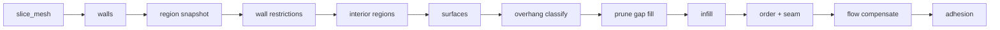
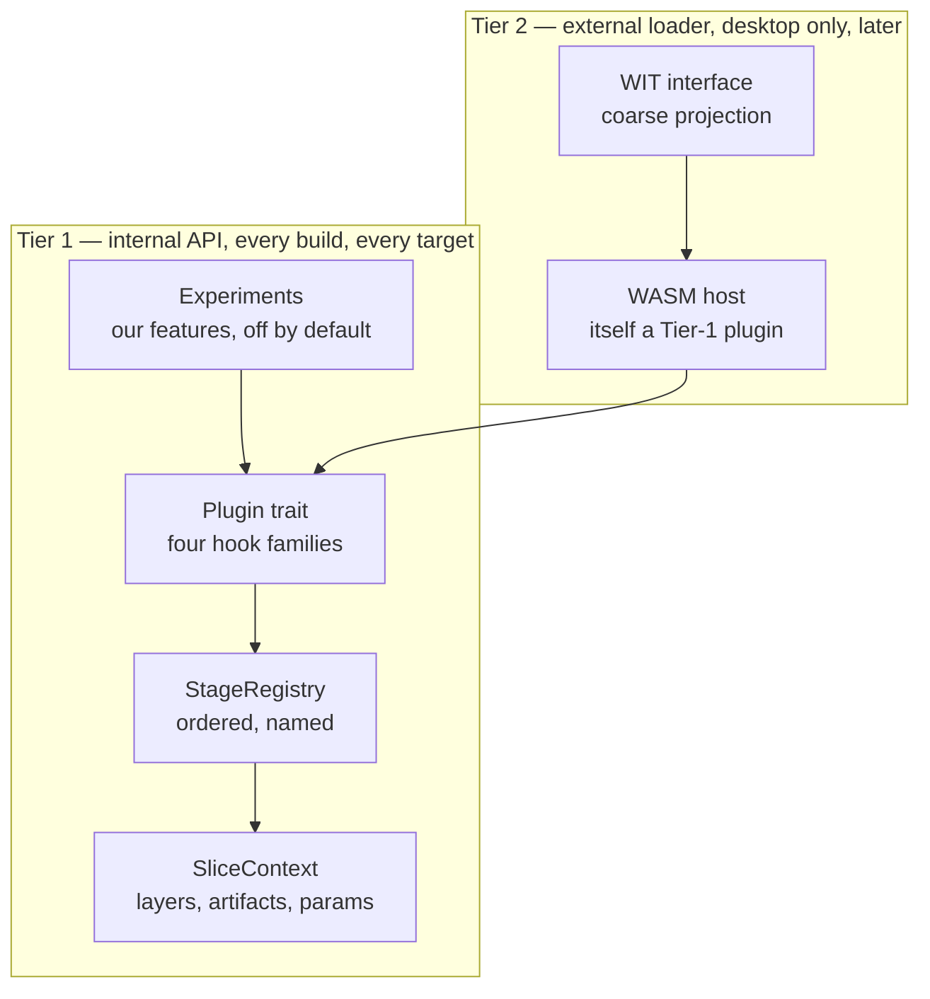

# Plugin support — design proposal

> **Status: M1–M3 have shipped; M4 is still a proposal.**
> The hook interface, the reified stage list, `SliceContext`, namespaced plugin
> settings, the non-planar layer model and the G-code move IR all exist — see
> [plugin/README.md](plugin/README.md) for the code and
> [Staging](#staging) for what each milestone covers. Everything below
> concerning the **external WASM tier** still describes what we intend to
> build, not how the engine behaves today.

The slicer should let people add behaviour — arc welding, wavy overhangs,
whatever someone needs — without forking the pipeline. This document argues for
**one hook API, designed once, with several delivery transports layered on
top**, and explains what has to change in the engine before that is possible.

The single rule the whole design defends:

> **A plugin extends the engine through the same interface we use ourselves.**
> Our own optional features are plugins. The external loader is a plugin. If a
> capability is only reachable by editing the pipeline, the API has failed.

---

## Why this shape

Three constraints drove the design, and together they eliminate most of the
obvious answers.

**Deep access matters more than convenience.** A plugin that only sees G-code
text can reorder moves but can never touch geometry. The interesting extensions
— non-planar overhangs, custom infill, support generation — need the real
`SliceLayer`, the real `clipper2::Paths`, the real `Mesh`. Any design that
marshals those across a boundary either loses fidelity or pays for it per layer,
per slice.

**The engine ships to five runtimes.** CLI, WebSocket server, browser WASM,
Tauri desktop, and iOS all drive the same core. Anything requiring `dlopen` or a
JIT is unavailable on the last two.

**We want the plugin system for ourselves first.** The immediate goal is a home
for optional, opinionated features that should not bloat the core — shipped in
every build as **experiments**, off by default. External third-party plugins are
a later, desktop-only concern.

That combination points at a **compile-time Rust trait** as the real API, with
sandboxed/loadable transports added later *as consumers of that same trait*.

---

## What the engine already gives us

More of the groundwork exists than expected.

| Asset | Where | Why it matters |
| --- | --- | --- |
| Two convergence points | `core::process_mesh`, `gcode::generate_gcode_from_params` | Every runtime funnels through exactly these two functions. Hook them once and all five benefit. |
| Half-reified stage list | [logging.rs](logging.rs) `phases::*` | The pipeline's stages are already *named* for timing — they are just not a list yet. |
| Trait-extension precedent | [gcode/dialect.rs](gcode/dialect.rs) | `GcodeDialect: Send + Sync` with defaulted methods is the established house pattern for `Box<dyn Trait>` extension. |
| Schema-driven settings UI | [settings/params.rs](settings/params.rs) → `schemars` → `ui/src/app/schema-form/` | **The biggest lever in the repo** — see below. |
| Conditional field visibility | [relevance.ts](../ui/src/app/schema-form/models/relevance.ts) | `x-relevant-when` already gates a field on a sibling's value. |
| QA baselines | [slicing_quality.rs](../tests/slicing_quality.rs) + 8 baselines | Makes a load-bearing refactor verifiable instead of hopeful. |

### The settings UI is already free

The settings form is generated entirely from JSON Schema. A Rust field
annotated with `#[schemars(description = "…", extend("x-group" = "Walls"))]`
becomes a labelled, grouped, validated form control with no Angular code at all.

This means **a plugin that emits a JSON Schema fragment gets its entire settings
UI for free.** And because `x-relevant-when` supports a scalar `equals` gate, a
plugin can hide its own settings behind its own `enabled` flag using machinery
that already exists — the experiments toggle needs no new UI concept whatsoever.

---

## What blocked it — and what M1 cleared

Four findings, in increasing order of how much work they imply. The first and
the fourth are done; the middle two are still open, and are what M2 and M3
exist for.

### The pipeline was a function, not a list — *fixed in M1*

`process_mesh` ran roughly 440 lines of straight-line code. It timed **11
phases** — but 4 of them (`"Overhang Perimeter Classification"`,
`"Path Ordering"`, `"Flow Compensation"`, `"Bed Adhesion"`) used ad-hoc string
literals rather than the `phases::` catalog, and one step
(`prune_redundant_gap_fill`) was not timed at all. The stages were real, they
were simply not data.

Worse, inter-stage results lived in **local variables** —
`pre_strip_infill_regions` and `interior_regions` were computed in one part of
the function and read in another. There was nowhere to insert a stage, and
nothing for an inserted stage to read.



The sequence now lives in [core/stages.rs](core/stages.rs) as a
`StageRegistry` of 17 named stages, every id a `phases::` constant; the locals
are fields on `SliceContext::artifacts`.

`process_mesh_debug` re-implemented this entire sequence a second time to
capture snapshots — a maintenance hazard the design predicted any naive hook
scheme would turn into a third copy. It had **already drifted**: the duplicate
silently skipped path ordering and bed adhesion, so `--debug-geometry` emitted
unordered G-code with no skirt. It is now the production pipeline plus one
plugin ([plugin/builtin/debug_capture.rs](plugin/builtin/debug_capture.rs)),
and a test pins the two to the same layers.

### `SliceLayer` could not express non-planar intent — *fixed in M2*

[core/types.rs](core/types.rs) gave every layer a single `z`. It carried
per-vertex *width* (`path_vertex_widths`) but no per-vertex *Z*.

So **wavy overhangs could not be expressed at any hook point** — not because
the hooks were in the wrong place, but because the type handed to them could
not represent the idea.

This is the central lesson of the research: *the data model, not the hook list,
is the real limit.* A hook that hands you a type that cannot describe your
feature is a dead end, however well-placed it is.

`SliceLayer::path_vertex_z` is the answer: one Z **offset** per vertex,
relative to the layer's own `z`. Offsets rather than absolute heights, because
`z` moves when a raft is prepended or a first layer is made thicker, and an
offset stays correct across both. The generator emits those segments with
`move_extrude_z` and charges them for the **3D** distance they travel, so a
climbing bead is not under-extruded; it also suppresses path simplification and
coasting for such a path, both of which would quietly flatten the shape that
made it non-planar.

`SliceLayer::path_data` lands with it: per-path scratch space keyed by plugin
id, so a plugin can carry a conclusion from one stage to a later one, and two
plugins annotating the same path cannot clobber each other.

Both use the established empty-vector sentinel, so a flat print allocates
neither and emits not one Z-bearing extrusion move.

**Adding parallel arrays is the risk here, and M2 paid it down rather than
adding to it.** Every per-path array used to be rebuilt by hand at each site
that reorders, filters or prepends paths — and the ordering pass was already
silently dropping `path_objects`, harmless only because nothing tags objects
before it runs. `SliceLayer::rebuild_paths` now replaces the paths and *every*
array together, re-walking per-vertex arrays with the same rotation or reversal
as the vertices they describe. Sites call that instead of enumerating arrays,
so forgetting one is no longer possible.

**Spiral (vase) mode was deliberately left alone.** It keeps its bespoke
Z-ramping in the emitter, which is coupled to its own flow fade-in and
fade-out. Rebuilding it on `path_vertex_z` would be a behaviour change to
working output for no user-visible gain, so it is a candidate for later rather
than part of this milestone.

### There was no G-code move IR — *fixed in M3*

`generate_with_stats` ([gcode/generator.rs](gcode/generator.rs)) appended
directly to a `String`, so the program never existed as *moves*. **Arc welding
had nothing to attach to**: a native welder needs to see a run of extrusions
and replace it, and post-processing finished text has been ruled out as a
plugin mechanism precisely because it sees no geometry, no roles and no
settings.

Emission is now split:

```text
plan  →  Vec<Move>  →  filters  →  render
```

[gcode/ir.rs](gcode/ir.rs) holds the `Move` enum and `MoveProgram`;
[`Plugin::move_filter`](plugin/mod.rs) is the hook family. A filter sees motion
with its **role, width, feedrate and extrusion intact**, and may merge, split,
replace or drop moves before a character is rendered.

**Only motion is modelled.** Fan, temperature, markers and comments are carried
as `Move::Raw` — already-rendered text emitted verbatim. That is a deliberate
boundary: modelling every command would mean re-deciding in typed form every
choice the emitter already makes correctly, for no gain, and rendering `Raw`
verbatim is what makes the split **provably** output-neutral — the bytes for
everything unmodelled cannot drift, because they are the same bytes.

The related cost is only partly paid. [gcode_viewer/parser.rs](gcode_viewer/parser.rs)
and the time estimator still parse our own emitted text back into moves. The IR
is now the representation they *could* share, and doing so is a follow-on this
milestone makes possible rather than something it does.

### `SlicingParams` was closed, and the cache would have lied — *fixed in M1*

[settings/params.rs](settings/params.rs) is ~105 flat fields with
`#[serde(default)]` and no `deny_unknown_fields` anywhere in the crate — so
unknown keys are **silently dropped**. A plugin's settings would have vanished
on round-trip with no error.

More urgently, `SlicingParams::cache_fingerprint` feeds the G-code result
cache. If plugin state were not in that fingerprint, **toggling a plugin would
hand back a stale G-code file.** That is a correctness bug, not an ergonomic
one.

Both are answered by the same decision: a namespaced
`plugins: BTreeMap<String, Value>` field. Being a declared field it survives
serde, and being part of the struct it reaches `cache_fingerprint` for free.
It is skipped when empty, so a build with no configured plugin fingerprints
exactly as it did before — no cache is invalidated by the mere existence of the
feature.

The settings form was also flat: the parser read a single level of `properties`,
so nested `plugins.<id>.<key>` settings would not have rendered. It now descends
into a namespace and keys those fields by dotted path
([schema-parser.ts](../ui/src/app/schema-form/models/schema-parser.ts),
[field-path.ts](../ui/src/app/schema-form/models/field-path.ts)), and
`x-relevant-when` resolves its gate by path too — which is what lets a plugin
hide its settings behind its own toggle with no new UI concept.

---

## The contract: two tiers, one interface



The load-bearing property: **the external loader is just another compile-time
plugin.** Adding it later changes no hook signatures, because it is written
*against* the same trait everything else uses. That is what lets the API be
designed once rather than renegotiated per transport.

### Four hook families — and only four

| Family | Shape | Serves | Status |
| --- | --- | --- | --- |
| **Stage** | `fn stages(&self) -> Vec<StageRegistration>` | fuzzy skin, ironing, wavy overhangs, supports | shipped |
| **Settings** | `fn settings_schema(&self) -> Option<Value>` | every plugin — yields its UI automatically | shipped |
| **Registry** | `fn register(&self, r: &mut Registry)` | new infill patterns, wall generators, G-code dialects | with its milestone |
| **Move filter** | `fn move_filter(&self) -> Option<Box<dyn MoveFilter>>` | arc welding, travel optimisation | shipped |

A stage registration says *where* it goes by naming an existing stage: insert
before it, insert after it, or wrap it.

The remaining family is deliberately *not* stubbed out. It needs something that
does not exist yet to attach to — a strategy registry — and a hook whose type
cannot describe its feature is the exact dead end this design was written to
avoid. It arrives as a **defaulted** trait method, so no plugin written against
today's trait has to change when it does. That property is what made deferring
the move filter free rather than a deferred cost, and it holds here too.

### Why this expands as the codebase expands

- Hooks are keyed by **stage id**, and stages are **data** — so adding an engine
  stage creates two new hook points for free, with no change to the plugin API.
- Plugins receive `&SlicingParams`, so every new core setting is visible
  immediately.
- Registries are open maps: new strategy categories are purely additive.
- New `ExtrusionRole` variants flow through the context untouched.

The honest limit, restated: this holds for **behaviour**, not **representation**.
When a feature needs something the data model cannot express, plugins still need
the model extended. That is why the `SliceLayer` and move-IR work below are
foundation, not polish.

---

## Anatomy

```rust
/// Identity and stability of a plugin. Experiments are just plugins that
/// declare themselves experimental.
pub struct PluginManifest {
    pub id: &'static str,          // "fuzzy-skin"
    pub name: &'static str,        // "Fuzzy skin"
    pub description: &'static str,
    pub stability: Stability,      // Experimental | Stable
    pub api_version: u32,
}
```

`SliceContext` replaces the local variables that used to trap inter-stage
state: it owns the layers, an `artifacts` side-channel (`interior_regions`,
`pre_strip_infill_regions`, `overhang_support`, `first_layer_height`), the
params, the logger, and a typed map for plugin-owned data.

Everything reachable from a stage must be `Send + Sync` — rayon parallelises
wall generation, interior regions, surfaces and infill.

### Experiments

An experiment is a plugin with `stability: Experimental`. Its settings live at
`params.plugins["<id>"]`, with a reserved `enabled` boolean in its own
namespace, and its other fields declare
`x-relevant-when: { field: "plugins.<id>.enabled", equals: true }`.

Both of those are **supplied by the engine, not written by the plugin**: a
fragment carries only the plugin's own knobs, and `inject_plugin_settings`
adds the toggle and gates every other field on it. So every experiment gets the
same shape, and a plugin cannot accidentally redefine the one field it does not
own.

The consequence is that the entire show/hide behaviour falls out of machinery
that already exists. Experiments are statically linked, so they work on WASM and
iOS too — a free consequence of the Tier-1 choice rather than a goal.

Settings are namespaced per plugin rather than flattened into one bag,
deliberately: no collisions with the 105 core keys, obvious ownership, and a
fingerprint that is trivial to compute.

---

## Security model: two trust tiers, and the seam between them

The tiers above are not just a delivery mechanism — they are a trust boundary,
and the design's safety claims hold only as long as that boundary is respected.

- **Tier 1 trust = engine trust.** A compile-time plugin is reviewed like core
  code (`cargo fmt`, `cargo clippy -- -D warnings`, human review, the QA
  baselines) *because* it ships with the same privileges as the engine itself,
  in every build we distribute — including WASM and iOS, where there is no
  loader boundary at all to fall back on. There is deliberately no isolation
  here; see Non-goals.
- **Tier 2 trust = contained by construction.** Whatever a Tier 2 module does,
  it can only do it through what the WIT interface exports to it — no ambient
  filesystem or network access, no reach outside its own linear memory. A bug
  or a malicious plugin is bounded by the host, not by the plugin author's
  intentions.

### Why the isolation is structural, not conventional

This is worth being explicit about, because a scripting VM looks like a
tempting shortcut for Tier 2 and it is not an equivalent one. A Lua embed
(PrusaSlicer's own extension mechanism, scoped there to macro/G-code-expression
text — not geometry) is sandboxed by *removing capability*: strip `os`, `io`,
`debug`, `loadstring`, `package.loadlib` from the global table and hope nothing
reaches them back through a metatable. The interpreter itself still runs in the
host's address space, so a VM bug is a host memory-corruption bug. WASM's
sandbox instead comes from the hardware/runtime enforcing a linear-memory
boundary regardless of what the guest code does or what bugs it has — the
capability grant (the WIT surface) and the isolation guarantee are two
independent layers, and losing one doesn't lose the other. That difference is
why Tier 2 is specified as WASM rather than an embedded scripting language: the
guarantee needs to hold even when the plugin is actively hostile, not just
when it is well-behaved.

### The promotion path is where the guarantee disappears

The scenario worth writing down now, before M4 exists: a Tier 2 plugin proves
useful, gets popular, and someone proposes baking it into the engine as a Tier
1 experiment — shipped by default, compiled in, no longer sandboxed. That
proposal is exactly the moment the code's trust level jumps from "contained
regardless of what it does" to "runs with full engine privileges on every
user's machine, including iOS, which Tier 2 never reached in the first place."

**A plugin having run safely inside the Tier 2 sandbox says nothing about
whether it is safe to run outside one.** The sandbox validates that *whatever
the plugin does, the blast radius is bounded* — it says nothing about the
quality, intent, or memory-safety of the code once that bound is removed.
Popularity and utility validate the feature; they do not substitute for the
review a Tier 1 PR would otherwise get.

Before M4 ships loadable Tier 2 plugins, promotion needs its own explicit gate
— not "it worked fine and people like it" — covering at least:

- **The same review bar as a first-party core PR**: full source read, `clippy
  -D warnings`, `fmt`, and particular scrutiny of any `unsafe` block, since
  Tier 1 has no memory-isolation backstop to catch a mistake there.
- **Supply-chain review of everything the plugin newly pulls in.** A promoted
  plugin's dependency tree becomes the engine's dependency tree — license,
  maintenance status, and build-script behavior all need the same vetting a
  new core dependency would get.
- **No silent capability expansion.** A promoted plugin should not gain
  filesystem/network/process reach it never exercised behind the WIT boundary
  without that specifically being called out and justified — "it was sandboxed
  before" is not a reason to wave through what it can touch now that it isn't.
- **Provenance.** Who is vouching for this code, and who maintains it once it
  is compiled into every release, on targets (iOS, WASM) the original sandboxed
  version never ran on at all.
- **Every existing Tier 1 gate applies unchanged**: the QA baselines, and the
  byte-identical-output-when-disabled requirement that already governs
  experiments.

This is called out here, ahead of M4, specifically so it doesn't get decided
implicitly under release pressure the first time a community plugin is good
enough that "just compile it in" feels like the obvious next step.

---

## Staging

Each milestone is independently shippable, and the risk climbs steeply at the
end.

| Milestone | Delivers | Unblocks | Status |
| --- | --- | --- | --- |
| **M1** Foundation | `SliceContext`, stage list, `Plugin` trait, namespaced settings, experiments UI | fuzzy skin, ironing | **shipped** |
| **M2** Layer model | per-vertex Z, per-path plugin data | wavy overhangs | **shipped** |
| **M3** Move IR | plan → `Vec<Move>` → filters → render | native arc welding | **shipped** |
| **M4** External | desktop-only WASM host, WIT interface | third-party plugins | proposed |

M1 also **deleted the duplicated debug pipeline** by turning snapshot capture
into an ordinary set of stages — see the first blocker above for what that copy
had already drifted into. M3 makes it *possible* for the time estimator and the
G-code viewer to share one representation instead of round-tripping through
text; both still parse, and moving them over is a follow-on.

The non-negotiable constraint across all of them: with no plugin active, output
must be **byte-identical**. The QA baselines are the gate, and refactors land
separately from the hooks they enable. M1 held it — the baselines did not move,
and [tests/plugin_hooks.rs](../tests/plugin_hooks.rs) additionally pins that
*occupying* a hook point changes nothing by itself, which is the property that
keeps the baselines meaningful once experiments start shipping.

---

## Non-goals

- **Post-processing scripts.** Spawning an executable over finished G-code is
  the traditional answer and is explicitly rejected: it sees text only, has no
  geometry, no settings integration, and no UI.
- **External plugins on iOS/iPadOS.** Out of scope. Experiments still run there
  because they are compiled in; third-party plugins will not.
- **Sandboxing in Tier 1.** A compile-time plugin has the same trust level as
  the engine. Isolation is what Tier 2 is for — see
  [Security model](#security-model-two-trust-tiers-and-the-seam-between-them)
  for what that isolation actually rests on, and where it stops applying.
- **A stable ABI for native dynamic libraries.** Rust has no stable ABI, and
  flattening `SliceLayer` and `Paths` through a C boundary would discard the
  deep access that motivates the whole design.
- **Replacing existing extension points.** `GcodeDialect` and the wall/infill
  strategies keep working; the registries wrap them rather than displace them.

---

## Open questions

- ~~**How far does the first push go** — M1 alone, or through M2/M3?~~
  Answered: M1 alone. M3 means splitting the emitter core, which is the single
  riskiest change proposed here, and M1 carried enough QA-baseline risk of its
  own to be worth landing by itself.
- **Which feature is the first experiment?** Still open, and now the thing
  gating the **Experiments** settings group from appearing at all —
  `builtin_plugins()` is empty, so a shipped build renders no plugin settings.
  Fuzzy skin and ironing both landed as core features while M1 was in flight,
  which makes them migrations rather than first experiments; a new infill
  pattern would exercise the registry family instead, once it exists.
- **Do existing features migrate to plugins** to dogfood the API, or do plugins
  stay purely additive? Deliberately left open by M1: fuzzy skin shipped its
  settings as core keys days before, and moving them would churn the schema,
  saved profiles and docs for a feature that had just landed. The API is
  dogfooded by the debug-capture plugin instead, which exercises the stage
  family's insert *and* wrap forms against real geometry.
- **Tier 2 runtime:** `wasmtime` with the Component Model, or the lighter
  `extism`? Deferred to M4 — it does not affect the Tier-1 design.
- **The Tier 2 → Tier 1 promotion checklist is not yet written.** The
  [Security model](#security-model-two-trust-tiers-and-the-seam-between-them)
  section lists what it must cover; it needs to exist as an actual reviewable
  gate (a PR template section, or a CONTRIBUTING.md checklist) before the first
  promotion happens, not be improvised in the moment.

---

## See also

- [plugin/README.md](plugin/README.md) — the shipped hook interface, in detail
- [core/stages.rs](core/stages.rs) — the pipeline as a stage list; the hook surface
- [core/pipeline.rs](core/pipeline.rs) — `process_mesh`, now just a run builder
- [core/types.rs](core/types.rs) — `SliceLayer`, `ExtrusionRole`
- [gcode/generator.rs](gcode/generator.rs) — the emitter to be split behind a move IR
- [gcode/dialect.rs](gcode/dialect.rs) — the trait-extension pattern this follows
- [settings/params.rs](settings/params.rs) — `SlicingParams`, `cache_fingerprint`
- [logging.rs](logging.rs) — `phases`, `ProcessLogger`
- [../ui/src/app/schema-form/](../ui/src/app/schema-form/) — the schema-driven form
- [issue #32](https://github.com/max-scopp/slicer-engine/issues/32) — native arc welder, the motivating case for the move IR
