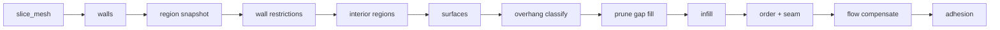
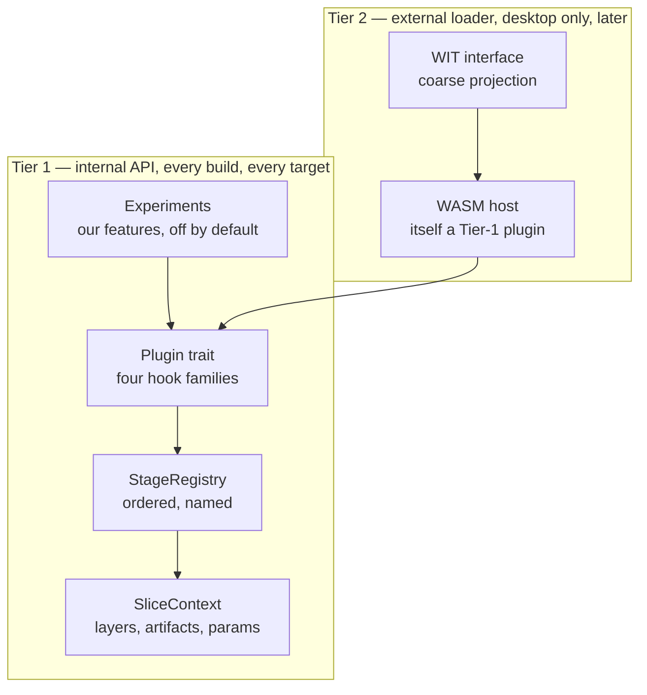

# Plugin support — design proposal

> **Status: proposal. Nothing here is implemented yet.**
> This document records the research behind a plugin system and the
> architecture chosen for it. It describes what we intend to build, not how the
> engine behaves today. Until it ships, treat every "is" below as "will be".

The slicer should let people add behaviour — arc welding, wavy overhangs,
whatever someone needs — without forking the pipeline. This document argues for
**one hook API, designed once, with several delivery transports layered on
top**, and explains what has to change in the engine before that is possible.

The single rule the whole design defends:

> **A plugin extends the engine through the same interface we use ourselves.**
> Our own optional features are plugins. The external loader is a plugin. If a
> capability is only reachable by editing the pipeline, the API has failed.

---

## Why this shape

Three constraints drove the design, and together they eliminate most of the
obvious answers.

**Deep access matters more than convenience.** A plugin that only sees G-code
text can reorder moves but can never touch geometry. The interesting extensions
— non-planar overhangs, custom infill, support generation — need the real
`SliceLayer`, the real `clipper2::Paths`, the real `Mesh`. Any design that
marshals those across a boundary either loses fidelity or pays for it per layer,
per slice.

**The engine ships to five runtimes.** CLI, WebSocket server, browser WASM,
Tauri desktop, and iOS all drive the same core. Anything requiring `dlopen` or a
JIT is unavailable on the last two.

**We want the plugin system for ourselves first.** The immediate goal is a home
for optional, opinionated features that should not bloat the core — shipped in
every build as **experiments**, off by default. External third-party plugins are
a later, desktop-only concern.

That combination points at a **compile-time Rust trait** as the real API, with
sandboxed/loadable transports added later *as consumers of that same trait*.

---

## What the engine already gives us

More of the groundwork exists than expected.

| Asset | Where | Why it matters |
| --- | --- | --- |
| Two convergence points | `core::process_mesh`, `gcode::generate_gcode_from_params` | Every runtime funnels through exactly these two functions. Hook them once and all five benefit. |
| Half-reified stage list | [logging.rs](logging.rs) `phases::*` | The pipeline's stages are already *named* for timing — they are just not a list yet. |
| Trait-extension precedent | [gcode/dialect.rs](gcode/dialect.rs) | `GcodeDialect: Send + Sync` with defaulted methods is the established house pattern for `Box<dyn Trait>` extension. |
| Schema-driven settings UI | [settings/params.rs](settings/params.rs) → `schemars` → `ui/src/app/schema-form/` | **The biggest lever in the repo** — see below. |
| Conditional field visibility | [relevance.ts](../ui/src/app/schema-form/models/relevance.ts) | `x-relevant-when` already gates a field on a sibling's value. |
| QA baselines | [slicing_quality.rs](../tests/slicing_quality.rs) + 8 baselines | Makes a load-bearing refactor verifiable instead of hopeful. |

### The settings UI is already free

The settings form is generated entirely from JSON Schema. A Rust field
annotated with `#[schemars(description = "…", extend("x-group" = "Walls"))]`
becomes a labelled, grouped, validated form control with no Angular code at all.

This means **a plugin that emits a JSON Schema fragment gets its entire settings
UI for free.** And because `x-relevant-when` supports a scalar `equals` gate, a
plugin can hide its own settings behind its own `enabled` flag using machinery
that already exists — the experiments toggle needs no new UI concept whatsoever.

---

## What blocks it today

Four findings, in increasing order of how much work they imply.

### The pipeline is a function, not a list

`process_mesh` ([core/pipeline.rs](core/pipeline.rs)) runs roughly 440 lines of
straight-line code. It times **11 phases** — but 4 of them
(`"Overhang Perimeter Classification"`, `"Path Ordering"`, `"Flow Compensation"`,
`"Bed Adhesion"`) use ad-hoc string literals rather than the `phases::` catalog,
and one step (`prune_redundant_gap_fill`) is not timed at all. The stages are
real, they are simply not data.

Worse, inter-stage results live in **local variables** — `pre_strip_infill_regions`
and `interior_regions` are computed in one part of the function and read in
another. There is nowhere to insert a stage, and nothing for an inserted stage
to read.



`process_mesh_debug` re-implements this entire sequence a second time to capture
snapshots. That is already a maintenance hazard; any naive hook scheme would
make it a third copy.

### `SliceLayer` cannot express non-planar intent

[core/types.rs](core/types.rs) gives every layer a single `z`. It carries
per-vertex *width* (`path_vertex_widths`) but no per-vertex *Z*. Spiral/vase
mode works around this with bespoke Z-ramping inside the G-code emitter.

So **wavy overhangs cannot be expressed at any hook point** — not because the
hooks are in the wrong place, but because the type handed to them cannot
represent the idea.

This is the central lesson of the research: *the data model, not the hook list,
is the real limit.* A hook that hands you a type that cannot describe your
feature is a dead end, however well-placed it is.

### There is no G-code move IR

`generate_with_stats` ([gcode/generator.rs](gcode/generator.rs)) interleaves
geometry, extrusion accounting, fan, acceleration, temperature and spiral logic
while appending directly to a `String`. Layer-time markers are already patched
afterwards by string surgery.

**Arc welding has nothing to attach to.** Issue
[#32](https://github.com/max-scopp/slicer-engine/issues/32) explicitly wants it
native rather than as a post-processing pass — and post-processing has been
ruled out as a plugin mechanism — so this is a hard prerequisite, not a
preference.

There is a related cost: [gcode_viewer/parser.rs](gcode_viewer/parser.rs) parses
our *own* emitted text back into moves to drive the 3D preview. A shared move IR
would serve the generator, the time estimator and the viewer from one
representation.

### `SlicingParams` is closed, and the cache will lie

[settings/params.rs](settings/params.rs) is 105 flat fields with
`#[serde(default)]` and no `deny_unknown_fields` anywhere in the crate — so
unknown keys are **silently dropped**. A plugin's settings would vanish on
round-trip with no error.

More urgently, `SlicingParams::cache_fingerprint` feeds the G-code result cache.
If plugin state is not in that fingerprint, **toggling a plugin hands back a
stale G-code file.** That is a correctness bug, not an ergonomic one.

One smaller gap: the settings form is flat. `FieldType` is only
`'number' | 'integer' | 'boolean' | 'string'`, and the parser reads a single
level of `properties`, so nested `plugins.<id>.<key>` settings will not render
without a small dotted-path change.

---

## The contract: two tiers, one interface



The load-bearing property: **the external loader is just another compile-time
plugin.** Adding it later changes no hook signatures, because it is written
*against* the same trait everything else uses. That is what lets the API be
designed once rather than renegotiated per transport.

### Four hook families — and only four

| Family | Shape | Serves |
| --- | --- | --- |
| **Stage** | `fn stages(&self) -> Vec<StageRegistration>` | fuzzy skin, ironing, wavy overhangs, supports |
| **Registry** | `fn register(&self, r: &mut Registry)` | new infill patterns, wall generators, G-code dialects |
| **Move filter** | `fn move_filter(&self) -> Option<Box<dyn MoveFilter>>` | arc welding, pause-at-height, travel optimisation |
| **Settings** | `fn settings_schema(&self) -> Option<Value>` | every plugin — yields its UI automatically |

A stage registration says *where* it goes by naming an existing stage: insert
before it, insert after it, or wrap it.

### Why this expands as the codebase expands

- Hooks are keyed by **stage id**, and stages are **data** — so adding an engine
  stage creates two new hook points for free, with no change to the plugin API.
- Plugins receive `&SlicingParams`, so every new core setting is visible
  immediately.
- Registries are open maps: new strategy categories are purely additive.
- New `ExtrusionRole` variants flow through the context untouched.

The honest limit, restated: this holds for **behaviour**, not **representation**.
When a feature needs something the data model cannot express, plugins still need
the model extended. That is why the `SliceLayer` and move-IR work below are
foundation, not polish.

---

## Anatomy

```rust
/// Identity and stability of a plugin. Experiments are just plugins that
/// declare themselves experimental.
pub struct PluginManifest {
    pub id: &'static str,          // "fuzzy-skin"
    pub name: &'static str,        // "Fuzzy skin"
    pub description: &'static str,
    pub stability: Stability,      // Experimental | Stable
    pub api_version: u32,
}
```

`SliceContext` replaces the local variables that currently trap inter-stage
state: it owns the layers, an `artifacts` side-channel (`interior_regions`,
`pre_strip_infill_regions`), the params, the logger, and a typed map for
plugin-owned data.

Everything reachable from a stage must be `Send + Sync` — rayon parallelises
wall generation, interior regions, surfaces and infill.

### Experiments

An experiment is a plugin with `stability: Experimental`. Its settings live at
`params.plugins["<id>"]`, with a reserved `enabled` boolean in its own
namespace, and its other fields declare
`x-relevant-when: { field: enabled, equals: true }`.

The consequence is that the entire show/hide behaviour falls out of machinery
that already exists. Experiments are statically linked, so they work on WASM and
iOS too — a free consequence of the Tier-1 choice rather than a goal.

Settings are namespaced per plugin rather than flattened into one bag,
deliberately: no collisions with the 105 core keys, obvious ownership, and a
fingerprint that is trivial to compute.

---

## Security model: two trust tiers, and the seam between them

The tiers above are not just a delivery mechanism — they are a trust boundary,
and the design's safety claims hold only as long as that boundary is respected.

- **Tier 1 trust = engine trust.** A compile-time plugin is reviewed like core
  code (`cargo fmt`, `cargo clippy -- -D warnings`, human review, the QA
  baselines) *because* it ships with the same privileges as the engine itself,
  in every build we distribute — including WASM and iOS, where there is no
  loader boundary at all to fall back on. There is deliberately no isolation
  here; see Non-goals.
- **Tier 2 trust = contained by construction.** Whatever a Tier 2 module does,
  it can only do it through what the WIT interface exports to it — no ambient
  filesystem or network access, no reach outside its own linear memory. A bug
  or a malicious plugin is bounded by the host, not by the plugin author's
  intentions.

### Why the isolation is structural, not conventional

This is worth being explicit about, because a scripting VM looks like a
tempting shortcut for Tier 2 and it is not an equivalent one. A Lua embed
(PrusaSlicer's own extension mechanism, scoped there to macro/G-code-expression
text — not geometry) is sandboxed by *removing capability*: strip `os`, `io`,
`debug`, `loadstring`, `package.loadlib` from the global table and hope nothing
reaches them back through a metatable. The interpreter itself still runs in the
host's address space, so a VM bug is a host memory-corruption bug. WASM's
sandbox instead comes from the hardware/runtime enforcing a linear-memory
boundary regardless of what the guest code does or what bugs it has — the
capability grant (the WIT surface) and the isolation guarantee are two
independent layers, and losing one doesn't lose the other. That difference is
why Tier 2 is specified as WASM rather than an embedded scripting language: the
guarantee needs to hold even when the plugin is actively hostile, not just
when it is well-behaved.

### The promotion path is where the guarantee disappears

The scenario worth writing down now, before M4 exists: a Tier 2 plugin proves
useful, gets popular, and someone proposes baking it into the engine as a Tier
1 experiment — shipped by default, compiled in, no longer sandboxed. That
proposal is exactly the moment the code's trust level jumps from "contained
regardless of what it does" to "runs with full engine privileges on every
user's machine, including iOS, which Tier 2 never reached in the first place."

**A plugin having run safely inside the Tier 2 sandbox says nothing about
whether it is safe to run outside one.** The sandbox validates that *whatever
the plugin does, the blast radius is bounded* — it says nothing about the
quality, intent, or memory-safety of the code once that bound is removed.
Popularity and utility validate the feature; they do not substitute for the
review a Tier 1 PR would otherwise get.

Before M4 ships loadable Tier 2 plugins, promotion needs its own explicit gate
— not "it worked fine and people like it" — covering at least:

- **The same review bar as a first-party core PR**: full source read, `clippy
  -D warnings`, `fmt`, and particular scrutiny of any `unsafe` block, since
  Tier 1 has no memory-isolation backstop to catch a mistake there.
- **Supply-chain review of everything the plugin newly pulls in.** A promoted
  plugin's dependency tree becomes the engine's dependency tree — license,
  maintenance status, and build-script behavior all need the same vetting a
  new core dependency would get.
- **No silent capability expansion.** A promoted plugin should not gain
  filesystem/network/process reach it never exercised behind the WIT boundary
  without that specifically being called out and justified — "it was sandboxed
  before" is not a reason to wave through what it can touch now that it isn't.
- **Provenance.** Who is vouching for this code, and who maintains it once it
  is compiled into every release, on targets (iOS, WASM) the original sandboxed
  version never ran on at all.
- **Every existing Tier 1 gate applies unchanged**: the QA baselines, and the
  byte-identical-output-when-disabled requirement that already governs
  experiments.

This is called out here, ahead of M4, specifically so it doesn't get decided
implicitly under release pressure the first time a community plugin is good
enough that "just compile it in" feels like the obvious next step.

---

## Staging

Each milestone is independently shippable, and the risk climbs steeply at the
end.

| Milestone | Delivers | Unblocks |
| --- | --- | --- |
| **M1** Foundation | `SliceContext`, stage list, `Plugin` trait, namespaced settings, experiments UI | fuzzy skin, ironing |
| **M2** Layer model | per-vertex Z, per-path plugin data | wavy overhangs; simplifies spiral mode |
| **M3** Move IR | plan → `Vec<Move>` → filters → render | arc welding (#32), pause-at-height (#113) |
| **M4** External | desktop-only WASM host, WIT interface | third-party plugins |

M1 also **deletes the duplicated debug pipeline** by turning snapshot capture
into an ordinary stage. M3 additionally lets the time estimator and the G-code
viewer share one representation instead of round-tripping through text.

The non-negotiable constraint across all of them: with no plugin active, output
must be **byte-identical**. The QA baselines are the gate, and refactors land
separately from the hooks they enable.

---

## Non-goals

- **Post-processing scripts.** Spawning an executable over finished G-code is
  the traditional answer and is explicitly rejected: it sees text only, has no
  geometry, no settings integration, and no UI.
- **External plugins on iOS/iPadOS.** Out of scope. Experiments still run there
  because they are compiled in; third-party plugins will not.
- **Sandboxing in Tier 1.** A compile-time plugin has the same trust level as
  the engine. Isolation is what Tier 2 is for — see
  [Security model](#security-model-two-trust-tiers-and-the-seam-between-them)
  for what that isolation actually rests on, and where it stops applying.
- **A stable ABI for native dynamic libraries.** Rust has no stable ABI, and
  flattening `SliceLayer` and `Paths` through a C boundary would discard the
  deep access that motivates the whole design.
- **Replacing existing extension points.** `GcodeDialect` and the wall/infill
  strategies keep working; the registries wrap them rather than displace them.

---

## Open questions

- **How far does the first push go** — M1 alone, or through M2/M3? M3 means
  splitting the emitter core, which is the single riskiest change proposed here.
- **Which feature is the first experiment?** Fuzzy skin
  ([#95](https://github.com/max-scopp/slicer-engine/issues/95)) and ironing
  ([#94](https://github.com/max-scopp/slicer-engine/issues/94)) need only the
  stage hook; a new infill pattern would exercise the registry family.
- **Do existing features migrate to plugins** to dogfood the API, or do plugins
  stay purely additive?
- **Tier 2 runtime:** `wasmtime` with the Component Model, or the lighter
  `extism`? Deferred to M4 — it does not affect the Tier-1 design.
- **The Tier 2 → Tier 1 promotion checklist is not yet written.** The
  [Security model](#security-model-two-trust-tiers-and-the-seam-between-them)
  section lists what it must cover; it needs to exist as an actual reviewable
  gate (a PR template section, or a CONTRIBUTING.md checklist) before the first
  promotion happens, not be improvised in the moment.

---

## See also

- [core/pipeline.rs](core/pipeline.rs) — `process_mesh`, the stage sequence to be reified
- [core/types.rs](core/types.rs) — `SliceLayer`, `ExtrusionRole`
- [gcode/generator.rs](gcode/generator.rs) — the emitter to be split behind a move IR
- [gcode/dialect.rs](gcode/dialect.rs) — the trait-extension pattern this follows
- [settings/params.rs](settings/params.rs) — `SlicingParams`, `cache_fingerprint`
- [logging.rs](logging.rs) — `phases`, `ProcessLogger`
- [../ui/src/app/schema-form/](../ui/src/app/schema-form/) — the schema-driven form
- [issue #32](https://github.com/max-scopp/slicer-engine/issues/32) — native arc welder, the motivating case for the move IR
