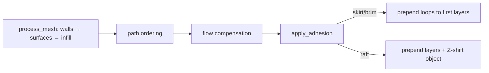

# Adhesion — Skirt, Brim & Raft Generation

This module exists to answer one question: *how do we help the first layer stick
to the bed?* It turns the
[`AdhesionType`](../settings/params.rs) selection (plus its sub-parameters) into
extra geometry, and it obeys a single rule: **it runs last and never touches the
object's own toolpaths.** Skirt/brim loops are *prepended* to the first layer(s);
a raft *prepends whole layers* and lifts the object in Z. Nothing the object
already generated (walls, surfaces, infill, ordering, flow) is reshaped.

---

## Why a separate, last-stage module

Bed adhesion is *additive scaffolding*, not part of the part. Slicing it inside
the wall/infill passes would entangle it with the very geometry it must stay
clear of (separation gaps, wall-footprint clips, seam ordering). Mature slicers
(PrusaSlicer, OrcaSlicer, CuraEngine) all generate adhesion from the finished
first-layer outline as a distinct step for exactly this reason. Running after
path ordering and flow compensation means the loops are appended cleanly and the
object is provably unperturbed.

## The contract

- **Footprint from `OuterWall` centerlines.** The wall generator emits
  centerlines inset `d/2` from the true surface (`d` = nozzle diameter), so the
  object outline is recovered by unioning the layer-0 `OuterWall` paths and
  inflating outward by `d/2`. **Winding is preserved** (CCW solids, CW holes) so
  Clipper2 treats holes as voids — see `AGENTS.md` § "Clipper2 Fill Rules".
- **Loops print first.** Skirt/brim paths are prepended so the nozzle primes on
  them before the part. They carry the `Skirt` role (a closed-loop role in the
  G-code generator, Orca-compatible `;TYPE:Skirt`).
- **Raft is a base, not a part.** Raft layers carry the `Support` role, sit on
  the bed (Z from `layer_height/2`), and the object is shifted up by
  `raft_layers · layer_height + raft_air_gap` so it lands on the raft top.

## The catalog

| Type  | Geometry | Role | Key params |
| ----- | -------- | ---- | ---------- |
| Skirt | `skirt_loops` outward loops from the outline, over the first `skirt_height` layers | `Skirt` | `skirt_loops`, `skirt_distance`, `skirt_height` |
| Brim  | apron loops hugging the object on layer 0 | `Skirt` | `brim_width`, `brim_type`, `brim_separation` |
| Raft  | coarse base + finer interface layers under the object | `Support` | `raft_layers`, `raft_air_gap` |

`brim_type` (`BrimType`): `outer_only` offsets outward; `inner_only` steps into
each hole; `outer_and_inner` does both; `ears` stamps concentric discs only at
sharp convex corners (interior angle < 120°) where warping actually starts —
detected on a **miter** footprint so the round offset doesn't bevel the corners
away first.

## Geometry primitives

- **`offset` / `offset_join`** — the polygon-offset workhorse. `Round` for
  skirt/brim/raft outlines; `Miter` only for ears corner detection.
- **`outward_loops` / `hole_loops`** — concentric loops stepping out from the
  object or into each hole. Loop `k` sits at `gap + d/2 + k·d`.
- **`concentric_loops`** — fills an arbitrary region (the ears disc-minus-object)
  with `d`-spaced loops from its boundary inward.
- **`convex_corners`** — signed exterior turn via `atan2(cross, dot)`; positive
  turn on a CCW contour is a convex corner.

## Lifecycle

`apply_adhesion` is called once at the tail of
[`process_mesh`](../core/pipeline.rs), gated on `adhesion_type != None`. It
mutates the layer vector in place (skirt/brim) or replaces it with
`[raft…, object…]` (raft). There is no persistence and no per-layer state — it is
a pure function of the finished layers plus params.

## Non-goals

- **No brim-to-part fusion tuning beyond `brim_separation`.** The brim abuts the
  wall at the configured gap; it does not model inter-bead flow welding.
- **No variable raft layer heights.** Raft layers use `layer_height` because the
  G-code generator computes extrusion `E` from the global `layer_height`; a
  thicker base would mis-estimate flow. This is a deliberate, honest limitation.
- **No bed-bounds clamping.** Skirt/raft expansion is not clipped to the build
  plate here; that belongs to a bed-aware validation pass, not adhesion.
- **No support generation.** Rafts reuse the `Support` role for annotation only;
  actual support structures are a separate, unimplemented feature.

## See also

- [`mod.rs`](./mod.rs) — the implementation.
- [`../settings/params.rs`](../settings/params.rs) — `AdhesionType`, `BrimType`,
  and the sub-parameters.
- [`../core/pipeline.rs`](../core/pipeline.rs) — where `apply_adhesion` is called.
- `AGENTS.md` § "Slicing Pipeline — Deep Knowledge" and § "Clipper2 Fill Rules".
- Issue [#93](https://github.com/max-scopp/slicer-engine/issues/93) — the
  originating feature; part of [#92](https://github.com/max-scopp/slicer-engine/issues/92)
  (profile import).
