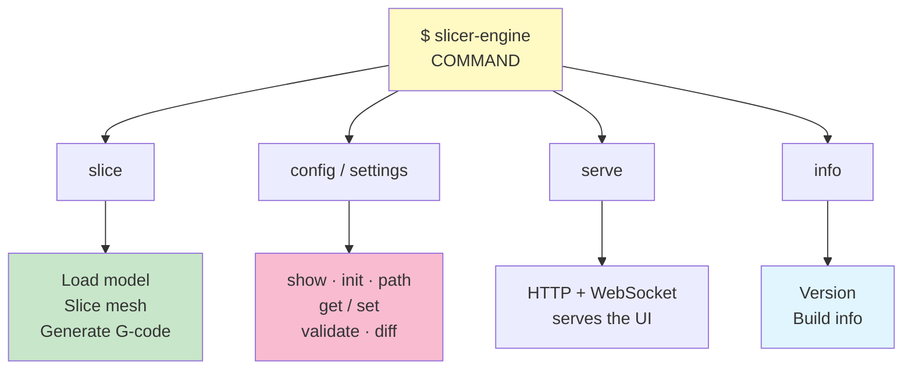

# Command-Line Interface

User-friendly commands for slicing, configuration, and build info.

## Commands

| Command | Does |
| --- | --- |
| `slice` | Model(s) → G-code |
| `settings` | `show` · `get` · `set` · `validate` · `diff` |
| `config` | `show` · `init` · `path` — the layered `slicer.toml` |
| `serve` | Host the web UI and WebSocket API |
| `info` | Version and build information |
| `changelog` | Release notes embedded in this build |
| `gen-schemas` | Regenerate the JSON schemas the UI consumes |



## Slice: model → G-code

Convert one or more 3D models to printer-ready G-code. Repeat `--input` to
slice a multi-object build plate — every model is placed in one scene and
merged into a single mesh before slicing.

```bash
# Basic
slicer-engine slice --input model.stl --output output.gcode

# Multi-object build plate, packed without overlap
slicer-engine slice -i part_a.stl -i part_b.stl --arrange --output plate.gcode

# Custom layer height
slicer-engine slice --input model.stl --output out.gcode --layer-height 0.15

# Klipper firmware flavor
slicer-engine slice --input model.stl --gcode-flavor klipper

# Custom start/end G-code (string or file path)
slicer-engine slice --input model.stl \
  --start-print-gcode "START_PRINT BED_TEMP=60 EXTRUDER_TEMP=210" \
  --end-print-gcode "END_PRINT"

# Force-enable or disable layer lifecycle markers
slicer-engine slice --input model.stl --lifecycle-markers
slicer-engine slice --input model.stl --no-lifecycle-markers

# Use an explicit project config file
slicer-engine slice --input model.stl --config ./slicer.toml

# Center and drop mesh to Z=0 before slicing
slicer-engine slice --input model.stl --center --drop-to-floor --verbose
```

Transform flags are plate-wide: `--translate`, `--rotate`, `--scale`,
`--align-face`, `--center`, and `--drop-to-floor` apply to **every** `--input`
model, since the CLI has no syntax for addressing a single object. Objects that
fall outside the build volume or overlap each other are reported as warnings —
the slice still runs.

`--center` and `--drop-to-floor` are retained aliases that log a deprecation
warning and dispatch the equivalent scene operation. Every transform goes
through the [scene engine](../scene/README.md); do not add a flag that bypasses
it.

**Arguments:**

| Flag | Type | Required | Default | Purpose |
|------|------|----------|---------|---------|
| `--input` | path | ✓ | – | Input model file; repeat for a multi-object plate |
| `--output` | path | | auto | Output G-code file (`<first>_plate.gcode` for several models) |
| `--layer-height` | float | | from settings | Slice spacing (mm) |
| `--gcode-flavor` | string | | from settings | `marlin` or `klipper` |
| `--start-print-gcode` | string | | from settings | Custom start G-code or file path |
| `--end-print-gcode` | string | | from settings | Custom end G-code or file path |
| `--lifecycle-markers` | flag | | from settings | Force-enable layer lifecycle markers |
| `--no-lifecycle-markers` | flag | | from settings | Force-disable layer lifecycle markers |
| `--config` | path | | auto-discover | Explicit project `slicer.toml` path |
| `--center` | flag | | false | Center every model horizontally |
| `--drop-to-floor` | flag | | false | Drop every model to Z=0 |
| `--arrange` | flag | | false | Pack all models onto the bed without overlap |
| `--arrange-spacing` | float | | 2.0 | Gap between arranged models (mm) |
| `--arrange-auto-orient` | flag | | false | Auto-orient each model while arranging (applies the machine's `preferred_print_rotation_deg`) |
| `--verbose` | flag | | false | Print mesh stats |
| `--output-format` | string | | human | `json` or `human` |

## Settings: Manage Configuration

Validate, compare, and modify slicing parameters.  
Settings are persisted in `~/.config/slicer-engine/slicer.toml`.

### Get / Set

Both flat aliases and full dot-separated paths are accepted:

```bash
# Get — flat alias or full path (equivalent)
slicer-engine settings get layer_height
slicer-engine settings get params.layer_height

# Set — flat alias or full path
slicer-engine settings set layer_height 0.15
slicer-engine settings set params.nozzle_temp 215

# Top-level fields
slicer-engine settings set gcode_flavor klipper
slicer-engine settings set start_print_gcode "START_PRINT BED_TEMP=60 EXTRUDER_TEMP=210"
slicer-engine settings set end_print_gcode "END_PRINT"

# Clear an optional field
slicer-engine settings set start_print_gcode null

# JSON output
slicer-engine settings get gcode_flavor --output-format json
```

### Show / Validate / Diff

```bash
# Display all persisted settings
slicer-engine settings show
slicer-engine settings show --output-format json

# Validate global and object settings files
slicer-engine settings validate \
  --global global.json --object object.json

# Show differences (what's overridden in an object file)
slicer-engine settings diff \
  --global global.json --object object.json
```

See [Settings Reference](../settings/README.md) for all parameters and the full priority cascade.

## Info: Build Information

```bash
slicer-engine info
slicer-engine info --verbose
slicer-engine info --output-format json
```

Shows: version, Rust info, Clipper2 details.

## Complete Workflow

```bash
# 1. Set your preferred defaults once
slicer-engine settings set gcode_flavor klipper
slicer-engine settings set params.nozzle_temp 215

# 2. Add a project-specific slicer.toml (overrides user settings for this project)
cat > slicer.toml << 'EOF'
[slicing]
layer_height = 0.15
gcode_flavor = "klipper"
EOF

# 3. Slice — picks up slicer.toml automatically
slicer-engine slice --input cube.stl --output cube.gcode
```

## Input/Output Formats

| Format | Type | Supported | Example |
|--------|------|-----------|---------|
| **STL** | Input | ASCII, Binary | `model.stl` |
| **OBJ** | Input | Wavefront | `model.obj` |
| **3MF** | Input | Multi-part; each build item becomes an object | `plate.3mf` |
| **G-code** | Output | FFF printer | `model.gcode` |
| **TOML** | Config    | User & project  | `slicer.toml` |

### Example G-code Snippet

```gcode
; Generated by slicer-engine | flavor: marlin
G21 ; millimetres
M104 S210 ; set nozzle temp
G28 ; home axes
M109 S210 ; wait for heat

;LAYER_CHANGE
;Z:0.200
;HEIGHT:0.200
;BEFORE_LAYER_CHANGE
;0.200
G92 E0
G1 Z0.200 F9000
;AFTER_LAYER_CHANGE
;0.200
;TYPE:WALL-OUTER
;WIDTH:0.40mm
G1 X10.000 Y10.000 F9000 ; travel
G1 X20.000 Y10.000 E0.12345 F3600
```

## Global Flags

```bash
slicer-engine --version   # Show version
slicer-engine --help      # Show help
slicer-engine slice --help  # Command help
```

## Error Messages

| Error | Fix |
|-------|-----|
| `Cannot read input file` | Check STL path exists |
| `Invalid STL format` | Re-export from CAD tool |
| `Invalid config file` | Fix the TOML syntax |
| `Settings validation failed` | Check parameter ranges |
| `Cannot write output` | Check disk space & permissions |
| `Invalid gcode_flavor` | Use `marlin` or `klipper` |

## See Also

- [Mesh Loading](../mesh/README.md) – STL, OBJ and 3MF parsing
- [Scene engine](../scene/README.md) – where every transform flag ends up
- [Slicing](../SLICING.md) – How slicing works
- [Settings](../settings/README.md) – Parameter reference and priority cascade
- [Config](../config/README.md) – `slicer.toml` discovery and merge order
- [Root](../../README.md) – Project overview
