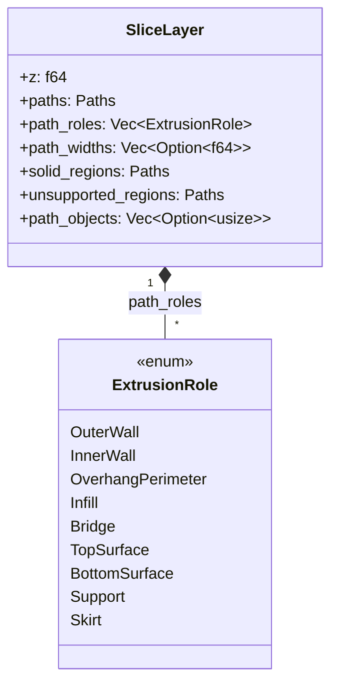
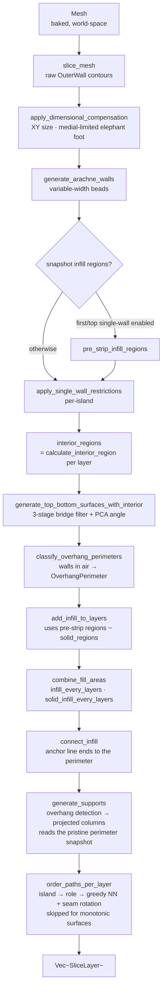
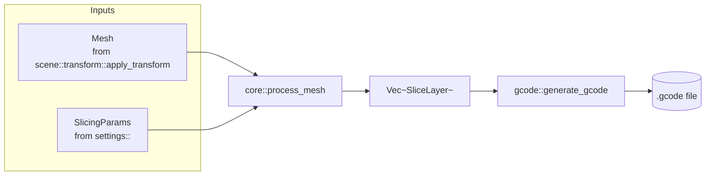

# Core — The Slicing Pipeline

This module turns a baked, world-space `Mesh` into a stack of `SliceLayer`s
ready for G-code emission. It is the engine's main loop.

> _Triangles in. Layers out. Order of operations matters._

---

## Why it exists

Slicing is not a single algorithm — it's seven of them, glued together in a
specific order, each consuming what the previous one produced:

1. Cut the mesh into 2D contours (one set per Z plane).
2. Replace those contours with variable-width wall beads (Arachne).
3. Snapshot the infill region _before_ any walls get stripped.
4. Strip inner walls from first-layer / top-surface islands when configured.
5. Detect and fill top / bottom solid surfaces (with bridge sub-classification).
6. Re-tag perimeters that cross unsupported air as `OverhangPerimeter`.
7. Add sparse infill to whatever is left.
8. Generate support structures under overhangs steeper than the threshold
   angle (`support_enabled`), tagged `ExtrusionRole::Support`. These read a
   perimeter snapshot taken back at step 5, before step 6 retags and splits
   the overhanging walls they would otherwise measure.
9. Order all paths per layer to minimise travel — including rotating closed
   loops to start at the configured seam vertex — so support strands are
   ordered alongside everything else.

Each step depends on the geometric output of the one before. Putting them in
the wrong order — or running surface detection on the original contours
instead of the post-Arachne ones — produces visibly wrong G-code. The
pipeline lives here, in [`pipeline::process_mesh`](pipeline.rs), as one
function so the order is impossible to misread.

---

## The contract

1. **`process_mesh` is the only public entry point** for the full pipeline —
   and [`slice_plate`](objects.rs) is the only way to reach *it*. The CLI, the
   WS server, the wasm preview and the desktop bridge all hand `slice_plate` a
   list of placed objects; it decides whether the plate can be merged into one
   mesh (the default) or has to be sliced object by object. There is no
   "subset" pipeline; partial slicing is achieved by feeding fewer params,
   not by skipping steps.
2. **All progress is reported through `ProcessLogger`.** No `eprintln!`,
   no `println!`. CLI verbosity and WS log streaming are then identical
   by construction.
3. **Order of operations is fixed.** The comments in
   [`pipeline.rs`](pipeline.rs) explain _why_ each step sits where it does;
   re-ordering is a behaviour change, not a refactor.
4. **`SliceLayer` is the sole carrier between phases.** Each phase reads from
   and writes back into the same `Vec<SliceLayer>`; nothing escapes to
   global state.
5. **Object identity is added around the pipeline, never inside it.** A part
   knows nothing of its neighbours: [`objects.rs`](objects.rs) slices each one
   with the untouched pipeline and only then tags and interleaves the results.
   No phase branches on "which object is this?".

---

## Anatomy



`paths`, `path_roles`, `path_widths` and `path_objects` are parallel arrays —
index `i` identifies the same emitted contour across all of them. `path_objects`
follows the `path_overhang` convention: **empty means "not sliced object-aware"**
and a `None` entry means "belongs to no object" (plate-wide bed adhesion). Any
helper that rebuilds these arrays has to carry every one of them, or the tags
shift onto the wrong paths. `solid_regions` is a
union of every top / bottom surface area on this layer; sparse infill
subtracts from it to avoid double-printing. `unsupported_regions` is the raw
layer footprint that has nothing solid in the layer below; the wall-
classification post-pass uses it to flag walls printed in air as
`OverhangPerimeter`.

---

## Pipeline order



### Dimensional compensation

[`compensation.rs`](compensation.rs) corrects the raw contours **before**
anything is built from them, which is the only place the correction can be made
once. Walls, interior, surfaces and infill are all derived from these shapes, so
a contour corrected here corrects the whole layer; a *bead* corrected after the
fact would leave the interior — and therefore every solid surface — sized to the
uncorrected model.

Two corrections share the pass. `xy_size_compensation_mm` is a plain signed
offset on every layer, for a machine that prints consistently over- or
undersize. `elephant_foot_compensation_mm` shrinks the layers at the bed to undo
the squish, and is deliberately **not** a uniform offset — see the module docs
for why, and [§ Critical invariants](#5-elephant-foot-is-medial-limited-never-uniform).

The whole pass is skipped when neither is configured, which is the default, so
an ordinary slice never allocates for it — `ElephantFootConfig::resolve` returns
`None`, and the QA baselines therefore cannot move.

`apply_elephant_foot` is additionally **raft-gated and bed-gated**: skipped when
`adhesion_type = raft`, because the first layer then lands on sacrificial
material across an air gap; and skipped for any layer whose `z` is inconsistent
with resting on the plate, which is how a lifted or sequentially-printed object
avoids being "corrected" in mid-air.

### The first layer has its own height, set at both ends of the pipeline

`first_layer_height` is split deliberately. The slicer gives layer 0 its own Z
span — sampled at its **own mid-plane**, so an unset value reproduces the uniform
slicer plane-for-plane and the QA baselines cannot move — and
`mark_first_layer_height` then charges it through `path_heights` *after*
adhesion, so a skirt sharing that layer's Z is charged at the same height.

**Both ends resolve the value through `resolved_first_layer_height`**, which the
G-code generator also uses to decide which layer gets first-layer speeds and
temperatures. The two must never disagree about which layer is the first. It is
suppressed under a raft, which owns bed contact and prints at `layer_height`.

### Path ordering & seam placement

After every path on a layer has been classified, the pipeline orders it for
printing: **island first, then role, then a greedy nearest-neighbour walk**
inside each role run.

- **An island is finished before the nozzle leaves it.** Surface and infill
  generation runs per *layer*, so the paths arrive as "every island's walls,
  then every island's fill". Printed in that order the nozzle lays every wall
  on the plate and then crosses back over all of them again to fill each one.
  `Islands::of` regroups them: one outermost closed `OuterWall` loop plus
  everything inside it — inner walls, hole contours, fills. A path inside no
  island (a free-standing support strand) joins the nearest one.
- **The visible top surface is laid last** in its island, after the sparse fill
  beside it, so no travel crosses a finished top; ironing then sweeps it. That
  is the only reordering *within* an island — everything else keeps the order
  the generators emitted, because that order is the wall sequence and the
  monotonic sweep.
- **The nozzle carries over between layers.** The walk starts where the layer
  below ended. Restarting it at the origin opened every layer with a hop toward
  whichever path sat nearest the bed's corner — on a 30 mm cube that was a full
  crossing of the part, 150 times over.

Closed loops are **cyclic** — picking vertex 0 as the
start point would force unnecessary travel to a fixed first point — so the
ordering pass picks the start vertex per loop using
`SlicingParams::seam_position`:

| Policy                | Vertex choice                                                                                           | Use case                                   |
| --------------------- | ------------------------------------------------------------------------------------------------------- | ------------------------------------------ |
| `Nearest` _(default)_ | Vertex closest to the previous path's end                                                               | Fastest print, scattered seams             |
| `Rear`                | Vertex with the largest Y (tie-break smallest X)                                                        | Single back-of-model seam line             |
| `Aligned`             | Vertex with the largest projection onto a fixed direction (+Y)                                          | Consistent seam line across all layers     |
| `SharpestCorner`      | Vertex with the largest convex turn angle; falls back to `Nearest` for smooth loops (max corner < ~10°) | Hides the blob in geometry corners         |
| `Random`              | Hash of the loop's first-vertex bits (deterministic per loop)                                           | Spreads blobs evenly on cylinders/organics |

Once the start vertex is chosen the loop's vertices are rotated in place
(`pts[(start + k) % n]`) so the emitted G-code begins at that point. The
rotation is the only mutation — geometry is preserved exactly. Combined
with the role-grouped nearest-neighbour pass this single change reduced
benchmark travel by ~18 % vs always starting at vertex 0.

### Bridge & overhang quality

Bridge detection lives inside `generate_top_bottom_surfaces_with_interior`
and runs a three-stage filter on the raw "footprint with no support below"
region (matching OrcaSlicer / PrusaSlicer behaviour):

1. **Morphological opening** (`bridge_noise_filter_mm`, default 0.05 mm) —
   erode then dilate to wipe out sub-pixel slivers caused by Clipper2's
   Centi quantisation. Kept small so genuine 0.4 mm-wide bridge frames
   (window mullions, text overhangs) survive intact.
2. **Minimum-area filter** (`bridge_min_area_mm2`, default 0.5 mm²) — drop
   surviving islands smaller than the threshold; they get reclassified as
   ordinary `BottomSurface` so the layer remains fully solid below the gap.
3. **Anchor expansion** (`bridge_anchor_mm`, default 0.5 mm) — dilate the
   surviving regions outward and clip back to **`interior_regions[i]`**
   (the inside-walls bound) so each strand bites into the supported solid
   bottom material on either side of the gap _without_ expanding into the
   wall band.

Bridge **direction** uses principal-axis analysis (PCA) of the unsupported
region. Strands print perpendicular to the dominant axis so the shortest
possible span is bridged, even when the gap is rotated relative to the
print bed. Falls back to bounding-box short-axis when the region is
square / circular.

After surfaces are assigned, `classify_overhang_perimeters` re-tags each
`OuterWall` / `InnerWall` whose centerline is ≥ 50 % **inside or on the
boundary of** the layer's `unsupported_regions` as `OverhangPerimeter`.

The crucial detail is how `unsupported_regions` is built. Naïvely you
would think `perimeters[i] − perimeters[i-1]` (raw centerline difference),
but that is **wrong in two complementary ways** that took several rounds
to disentangle:

1. **`perimeters[i]` IS the wall path.** `perimeter_paths_of(layer)`
   returns the OuterWall centerline polygons of the layer — i.e. the same
   closed paths the wall classifier iterates over. So every wall vertex
   lies _exactly on_ the boundary of `perimeters[i]`, and therefore on the
   outer boundary of any region derived by subtracting another polygon
   set from `perimeters[i]`. A "strictly inside" parity test (treating
   `IsOn` as outside) flags **nothing**, ever.
2. **A current-layer wall is supported by the previous-layer bead, not
   by its centerline.** The previous-layer bead extends `d/2` outward
   from its centerline, so the geometric support envelope is
   `inflate(perimeters[i-1], +d/2)`.

The two fixes go together:

```text
unsupported_regions = perimeters[i] − inflate(perimeters[i-1], +d/2)
```

with `IsOn` counted as **inside** in the parity test:

- For a slight outward lean (horizontal step `S < d/2`) the inflated
  previous perimeter fully contains `perimeters[i]`, so
  `unsupported_regions` is empty → no wall flagged. This kills the
  "80 % of the Benchy is overhang" false positive without any vertex-
  fraction tuning.
- For a real overhang (`S > d/2`, ≈ 45° lean for 0.2 mm layer / 0.4 mm
  nozzle) a meaningful air strip exists. Wall vertices lie on its outer
  boundary (= the current centerline), and the `IsOn`-counts-as-inside
  parity test flags them.

**Don't** restore the raw centerline difference, the strict-inside
boundary policy, or the `0.6 × nozzle_diameter` "safety" erosion that
was tried at one point — any one of them suppresses _all_ overhang
detection. See `test_classify_overhang_e2e_*` in `walls.rs` for the
production-geometry lockdown tests.

Reclassified paths inherit the bridge speed (`bridge_speed`) and the fused-flow
width (`nozzle_diameter_mm × bridge_flow_ratio`, > 1× by default) in the G-code
generator and trigger the bridge fan boost via `has_bridges`. This eliminates
sagging walls printed across windows, slots, and similar mid-air features.

### Dynamic overhang speed & cooling

When `enable_overhang_speed` is set, the same pass grades each wall segment by
**overhang degree** — how far past the previous layer's material footprint its
centreline sits — and records an `OverhangClass` (`None`/`Deg1`…`Deg4`) per path.
The degrees are nested inflations of the previous perimeter (`prev`, `+d/4`, the
existing `d/2` air boundary, `+3d/4`), so `Deg3`/`Deg4` coincide exactly with the
binary `OverhangPerimeter` region and the role tag stays consistent.

Two invariants:

- **Off ⇒ byte-identical.** With grading off the classifier reduces to the
  historical air/support split and `path_overhang` stays empty.
- **Split only where output changes.** `overhang_band_class` folds any degree
  whose speed and fan match a plainer wall down to that class, so a wall is never
  fragmented into arcs that print identically — no wasted retracts.

Grading needs the **pristine** previous-layer perimeter, snapshotted before
bridge clipping splits any walls and passed in as `OverhangGrading`.

Two things to note:

- **Snapshot before strip.** The single-wall-strip step (step 4) removes
  walls _per island_, but `calculate_interior_region` would still
  miscount islands on the same layer if the strip happened first.
  Snapshotting the infill region while all walls are present prevents the
  sparse-infill boundary from ballooning into the wall zone on unaffected
  islands.
- **Surfaces use post-Arachne geometry.** Top/bottom detection compares
  `OuterWall` paths between adjacent layers. Running it before Arachne
  would compare raw mesh contours instead — same shape, but with
  inconsistent winding from the slicer.

---

## Phase catalog

| Phase                         | Function                                                                      | Reads                                       | Writes                                       |
| ----------------------------- | ----------------------------------------------------------------------------- | ------------------------------------------- | -------------------------------------------- |
| Slice                         | [`slice_mesh`](slicer.rs)                                                     | `Mesh`                                      | `paths` (OuterWall)                          |
| Dimensional compensation      | [`compensation::apply_dimensional_compensation`](compensation.rs)             | `paths` (raw contours), layer `i + 1`       | `paths` (corrected; skipped when unconfigured) |
| Arachne walls                 | [`walls::arachne::generate_arachne_walls`](../walls/arachne/mod.rs)                        | `paths`                                     | `paths`, `path_roles`, `path_widths`         |
| Infill snapshot               | [`infill::calculate_interior_region`](infill.rs)                              | `paths` (all walls)                         | `pre_strip_infill_regions` local             |
| Single-wall strip             | [`walls::apply_single_wall_restrictions`](walls.rs)                           | `paths`, `path_roles`                       | `paths`, `path_roles` (inner walls + first-layer gap fill removed) |
| Interior regions for surfaces | [`infill::calculate_interior_region`](infill.rs)                              | `paths` (post-strip)                        | `interior_regions` local                     |
| Top / bottom surfaces         | [`surfaces::generate_top_bottom_surfaces_with_interior`](surfaces.rs)         | `paths`, `interior_regions`                 | `paths`, `path_roles`, `solid_regions`       |
| Overhang classification       | [`walls::classify_overhang_perimeters`](walls.rs)                             | `paths`, `unsupported_regions`, `OverhangGrading` (opt) | `path_roles` (some `OverhangPerimeter`), `path_overhang` (when grading) |
| Sparse infill                 | [`infill::add_infill_to_layers`](infill.rs)                                   | `pre_strip_infill_regions`, `solid_regions` | `paths`, `path_roles`, `path_heights`        |
| Path ordering & seams         | inline in [`pipeline::process_mesh`](pipeline.rs) (uses `choose_seam_vertex`) | `paths`, `path_roles`, `seam_position`      | `paths` (rotated/reordered)                  |

`pre_strip_infill_regions` is computed only when at least one of
`only_one_wall_first_layer` / `only_one_wall_top` is enabled; otherwise the
post-strip and pre-strip regions are identical and the snapshot would be
wasted work.

---

## Role in the wider system



The pipeline does not load files, does not write G-code, and does not know
about printer profiles. It is a pure function from `(Mesh, SlicingParams)`
to `Vec<SliceLayer>`, with logging as a side channel.

---

## Performance

### Native / server (x86-64, AArch64)

The three most expensive pipeline phases all parallelise across layers via
[`rayon`](https://docs.rs/rayon):

| Phase                     | Strategy                               | Notes                                                                                  |
| ------------------------- | -------------------------------------- | -------------------------------------------------------------------------------------- |
| `perimeter_snapshot`      | `par_iter().map` across all layers     | `perimeter_paths_of` runs concurrently per layer                                       |
| `surface_blocked`         | `into_par_iter().map` **gated**        | Wall-bead footprint built only for layers that produced a top/bottom surface region    |
| `surfaces` detection      | `into_par_iter().map(detect_region)`   | Each layer's bridge/top/bottom regions are independent                                 |
| `overhang_classification` | `par_iter().map(process_layer)`        | Each layer's densification + boundary tests are independent                            |

Measured on a 3DBenchy at 0.2 mm layer height (240 layers), 8-core host:

| Phase                     | Serial (before) | Parallel (after) | Δ        |
| ------------------------- | --------------- | ---------------- | -------- |
| `perimeter_snapshot`      | 3 004 ms        | 108 ms           | −96%     |
| `surfaces`                | 2 926 ms        | 273 ms           | −90%     |
| `overhang_classification` | 426 ms          | 54 ms            | −87%     |
| **Wall-clock total**      | **4 119 ms**    | **1 163 ms**     | **−72%** |

`compute_wall_bead_footprint` was also rewritten from one Clipper2
`inflate+union` _per wall path_ (quadratic accumulation) to one batched
`inflate` _per `(is_open, radius)` bucket_, typically reducing it to 1–2
Clipper2 calls per layer regardless of wall count.

Even batched, the wall-bead footprint is the single most expensive per-layer
artifact of the surface phase, so `surface_blocked` (the eroded-footprint ∪
gap-fill region the serial apply pass subtracts from the solid fill) is built
**only for layers that actually produced a top/bottom surface region**. The
gate runs after the detection pass, when each layer's `(bottom, top)` regions
are known; a layer with no surface never reads its `surface_blocked` entry, so
the empty placeholder left there is output-identical while skipping the
footprint construction for the majority of mid-model layers. On a 3DBenchy this
roughly halves the surface phase.

### WASM (`wasm32-unknown-unknown`)

`rayon` is excluded from the WASM build via `cfg(not(target_arch = "wasm32"))`.
The same phases fall back to sequential `iter()` / `map()`. Three additional
WASM-specific constraints reduce throughput further:

1. **Single-threaded execution.** WebAssembly in browsers runs on one JS
   thread. `SharedArrayBuffer`-based threading exists but requires
   cross-origin isolation headers that most hosts don't enable.
2. **Clipper2 C++ allocator shim.** `src/cpp_shims.rs` provides `operator
new/delete` implementations that compile Clipper2 entirely into the WASM
   binary — no `env` module imports, no JS boundary crossings. However,
   every C++ heap allocation prepends an 8-byte bookkeeping header, adding
   a small constant overhead to the many short-lived `Paths` objects that
   inflate/union produce in per-path loops.
3. **Memory pressure.** Wasm32 has a 4 GiB address limit and is typically
   allocated 256 MiB by browsers. Very large models or high layer counts
   can OOM before completion.

As a rough guide, expect the WASM slicer to be **5–15× slower** than the
native server-side slicer for the same model and settings. The browser UI
uses the WASM path only for the live preview; the production slice
(server or desktop) always runs the native binary.

**What this means in practice:**

| Scenario                  | Binary                  | Expected slice time (Benchy 0.2 mm) |
| ------------------------- | ----------------------- | ----------------------------------- |
| WS server / Tauri desktop | `slicer-engine` release | ~1 s                                |
| Browser preview (WASM)    | `scene_wasm.js`         | ~10–15 s                            |
| CI (cross-compile test)   | debug build             | ~10–20 s (LTO off)                  |

Per-phase timings are reported through the `ProcessLogger::log_phase_*`
hooks. Sub-timings for Arachne (`collapse_depth_ms`, `bead_shrink_ms`) and
surface generation (`perimeter_snapshot_ms`, `detection_ms`,
`infill_gen_ms`) are summed across worker threads on native, so they can
exceed the wall-clock duration of those phases.

---

## Object identity through slicing

A *plate* is several placed objects; layers are flat. Turning one into the other
without losing track of which part is which is what
[`objects.rs`](objects.rs) is for, and both exclude-object (cancel a part
mid-print) and sequential printing (finish one part before starting the next)
need exactly the same segmentation — so it is built once.

**[`slice_plate`](objects.rs) is the single slicing entry point.** CLI, WS
server, wasm `web-slicer` and the desktop bridge all hand it a `&[ObjectInput]`
instead of merging meshes themselves. Do not re-introduce a "just concatenate
the faces and call `process_mesh`" site — that merge is what erased object
identity in the first place.

### The merged fast path is not optional

When [`SlicingParams::object_aware()`](../settings/params.rs) is false — neither
`exclude_object` nor `print_sequence = by_object` — `slice_plate` merges and
calls `process_mesh` exactly as before, so the default configuration produces
**byte-identical G-code**. `merged_path_matches_a_plain_process_mesh` pins this.

Object-aware slicing runs the pipeline once *per object*, which is **not**
output-equivalent: `calculate_interior_region` averages the wall-bead count
across a layer's islands, so an island's interior estimate depends on what else
shares its layer. Slicing a part alone is the more faithful result, but it is
still a change, and must only happen when asked for.

### Rules that hold the segmentation together

- **`SliceLayer::path_objects` is a parallel array with an empty sentinel**,
  like `path_overhang`: empty means "not sliced object-aware", and `None` at an
  index means "belongs to no object". Every helper that rebuilds a layer's
  parallel arrays — notably [`adhesion::prepend`](../adhesion/mod.rs) — must
  carry it along, or the tags silently shift onto the wrong paths.
- **Adhesion is plate-wide in `by_layer`, object-owned in `by_object`.** In
  layer order the skirt or brim is generated once on the merged stack and tagged
  `None`, so cancelling one part does not take the plate's adhesion with it. In
  object order each object is a self-contained print and owns its own.
- **Layers merge by Z slot, not by index.** Two parts resting on the bed slice
  onto the same grid, but a part lifted off the bed keeps its own — its bottom
  layers are *its* bottom layers. `merge_layers_by_z` groups within a quarter
  layer and takes at most one layer per object per slot, so emitted Z is always
  strictly ascending.
- **Sequential order is front-to-back** (`min_y`, then `min_x`). The gantry
  sweeps from behind, so finishing the nearest part first keeps the carriage away
  from finished work longest. Clearance problems are **warnings, not errors** —
  the clearances are machine estimates, and refusing to slice would be worse than
  saying what to check. Only objects printed *before* another are height-checked;
  the last one has nothing reaching over it.
- **Object names are sanitised and de-duplicated here.** Klipper parses
  `EXCLUDE_OBJECT_DEFINE NAME=…` as a G-code parameter, so a space splits the
  token, and two parts sharing a name would cancel together. Every runtime feeds
  user-chosen filenames straight in, so `unique_object_name` fixes both centrally
  rather than at each call site.

Where the markers themselves are emitted — `M486` by default, `EXCLUDE_OBJECT_*`
for Klipper — is [`gcode`](../gcode/README.md)'s business.

### What belongs on the printer, not the process

Whether the machine *can* cancel an object (`exclude_object`) and how much room
its printhead needs (`extruder_clearance_height_mm` /
`extruder_clearance_radius_mm`) are properties of the **machine**, so all three
carry the **Hardware** `x-group`. Two printers can run the same `by_object`
process yet differ in gantry height, duct radius and firmware support. Only the
print-behaviour choices (`print_sequence`, `between_objects_gcode`) are process
settings. The clearances carry **no** `x-relevant-when` gate — a printer always
has a clearance, and gating it would point across contracts at a process field
in another tab.

---

## Support structure generation

[`supports.rs`](supports.rs) runs **after infill and before path ordering**. It
reads only `OuterWall` paths to derive each layer's model footprint, so it never
disturbs wall, surface or infill geometry, and appends `ExtrusionRole::Support`
open polylines. Running before ordering is what gets support strands ordered and
flow-compensated with the rest of the layer.

The mechanism — overhang detection, downward projection with XY and Z clearance,
interface layers, and the two column styles — is documented in that module's own
doc comments. Four things are worth knowing from outside it:

- **Footprints come from a pristine perimeter snapshot, never the live layer.**
  `classify_overhang_perimeters` retags an overhanging wall as
  `OverhangPerimeter` and splits its loop, so on a steep slope there is no
  `OuterWall` path left by the time supports run. `process_mesh` takes the
  snapshot before surface generation and hands it to `generate_supports`.

  **Any test for support behaviour must go through `process_mesh`**
  ([tests/support_slice.rs](../../tests/support_slice.rs)) — a test that builds
  `SliceLayer`s by hand cannot see this class of bug, and did not.
- **`Normal` carries the full overhang footprint down; `Tree` is a node-drop
  simulation** whose tips migrate toward their local centroid, merge when they
  meet, and reject any step entering the model. Tree costs markedly less
  filament. It is a pragmatic approximation, **not** a collision-avoiding
  branching tree with base flaring — the limitation is surfaced by
  `unsupported_feature_warnings()`.
- **`ExtrusionRole::forms_closed_loops` is one definition** shared by the G-code
  generator and the path orderer. The two disagreeing about whether `Support`
  closes silently drops the segment that closes each island back to its start.
- **Support carries no explicit width.** An explicit width short-circuits
  `resolve_width_mm`'s fill-role branch, which is what charges a support line the
  volume of the strip it fills rather than a full nominal bead. The raft shares
  the role but deliberately stamps its own coarser bead — `support_line_width`
  must never reach it.

Supports are also forced off in `spiral_vase_normalized` (a vase has no discrete
layer to stand on), generated by `process_mesh_debug` under `DebugStage::Support`,
and unioned into `printed_footprint` so the raft and skirt never start a column
in mid-air.

### Supports are generated *after* bridge classification — deliberately

Bridge detection never learns that an overhang is supported. With the default
`support_z_gap_layers ≥ 1` that is **correct**: the gap is real air, so the first
model layer above support genuinely bridges and wants bridge speed and cooling.

At `support_z_gap_layers = 0` the support does touch, and that layer is still
classified `Bridge`. The asymmetry decides it: bridge settings over supported
material print a slightly worse surface, while normal settings over real air
*fail*. So the conservative classification stands, and the setting's own copy
says so.

**If you ever reorder it**, note supports no longer need to run late for their
own sake — they read the pristine snapshot, not the mutated layer. The only
remaining reason is that support strands are ordered by the TSP with everything
else.

---

## The infill / surface boundary

Everything that is not a wall is placed inside an **interior region**: the gross
island outline deflated by the walls that will sit on it.
[`calculate_interior_region`](infill.rs) computes it from the `OuterWall` paths,
**winding preserved**, deflated inward by

```
total_inward = (walls_per_island − 0.5) × nozzle_diameter − overlap_distance
```

The `−0.5 × d` accounts for `OuterWall` centrelines already being inset half a
bead from the model surface.

### The estimate is an average, and Arachne breaks the assumption

`walls_per_island` is a **mean** bead count, and Arachne places a variable number
of variable-width beads per island — even along one island. Where a layer's
islands differ, the interior is under-deflated and fill lands on top of the
innermost wall. The classic generator, placing a fixed count, shows none of it.

Four corrections follow. Each is deliberately narrow, and **none of them reshape
`interior_regions` itself** — bridge *detection* keys off the smooth interior, and
reshaping it spawns phantom bridges from the jagged bead-following boundary. Only
fill regions and the bridge *candidate* are clipped.

| Correction | Applied to | Stays safe because |
| --- | --- | --- |
| Wall-footprint clip | sparse infill · solid surfaces | Count- and width-agnostic — a no-op wherever the estimate was already right |
| Opened interior | top/bottom surfaces · bridge candidates | Erases sub-bead *channels*; a real surface sits on a thick interior and keeps its full extent |
| Sliver opening | surface fill regions | A strip narrower than one bead cannot hold a bead by construction |
| Solid-region margin | sparse infill | Keyed to `solid_regions`, so an exact no-op on layers with no solid surface |

Each is implemented and fully justified beside its own constant in
[`infill.rs`](infill.rs) and [`surfaces.rs`](surfaces.rs) — including what was
tried first and why it failed. **Read those doc comments before changing a
threshold**; the values are not arbitrary and the obvious generalisations have
already been measured and rejected.

Two rules that span the corrections and are easy to get wrong:

- **Use `FillRule::NonZero` for any subtraction of a wall footprint.** The
  footprint is a frame with CW hole sub-paths; `Positive` ignores them, treats
  the frame as solid, and erases the whole interior.
- **A correction must be keyed to the thing it corrects**, not applied to the
  fill area at large. The solid-region margin keys to `solid_regions`, so a thin
  wall-to-wall cavity with no surface keeps its lattice; the region-area filter
  is an area rule on connected regions, never a width rule, so a large-but-narrow
  cavity survives. Both generalisations have been tried and both destroy real
  geometry.

### Gap fill, surfaces and ironing

- **`prune_redundant_gap_fill`** drops a `GapFill` bead the surface already
  covers — either inside `solid_regions`, or *sandwiched* between surface on both
  sides. The surface must then **cover** the pruned bead's footprint rather than
  carve a corridor out of it, or the corridor becomes a hole in `solid_regions`.
- **Ironing must touch no region field.** It is a near-dry smoothing sweep, not
  material: folded into `solid_regions`, it would punch a hole in the sparse
  infill underneath. It carries its own `ExtrusionRole::Ironing` rather than
  reusing `TopSurface` — sharing the role would iron at full flow and let the TSP
  interleave it with fill not yet printed — and its flow reduction is folded into
  the *width*, never `extrusion_for_move`'s `flow_ratio`.

### Which Clipper2 fill rule, and why

| Operation | Rule | Why |
| --- | --- | --- |
| Surface detection (intersect / difference of layer perimeters) | `EvenOdd` | The mesh slicer does not guarantee consistent winding; EvenOdd is winding-independent |
| Infill interior subtraction (infill area − solid regions) | `Positive` | Input winding is consistent Clipper2 output; predictable for non-overlapping inputs |
| Wall-footprint subtraction | `NonZero` | The footprint is a frame with CW holes; `Positive` would erase the interior |
| Variable elephant-foot offset cleanup | `Positive` | Discards the reversed folds a variable offset creates in a concavity, while a CW hole still subtracts |

**Do not union Arachne bead paths with `EvenOdd`.** Tightly nested concentric
closed paths produce alternating in/out bands instead of one solid region.

### Measuring a change to any of this

**Neither gap-fill length nor a 3DBenchy slice is bit-reproducible between runs
of the same binary**, so `diff` reporting a change proves nothing, and a real
regression smaller than that jitter hides in it. Byte-compare a **deterministic
fixture** instead, skipping the timestamp header: `Voron_Design_Cube_v7.stl`,
`bottom_panel_hinge_x2.stl` and `Filament_Card_Caddy_25.stl` all reproduce
exactly. Sparse infill is deterministic and can be compared directly.

**A passing quality gate is not evidence that output is unchanged** — its
tolerances exist to absorb that jitter.

---

## Spiral (vase) mode

`spiral_vase` prints a single continuous outer wall whose Z ramps over each
layer. It is split across two boundaries so every runtime behaves identically.

**Normalization** ([`SlicingParams::spiral_vase_normalized`](../settings/params.rs))
forces the incompatible settings off — `wall_count = 1`, `infill_density = 0`,
`top_layers = 0`, `retract_mm = 0`, `z_hop_mm = 0`, `ironing_enabled = false` —
while **keeping `bottom_layers`** as the solid base. It is a `Cow` (a no-op
borrow when the flag is off) and **idempotent**, so it is applied at both
boundaries without double effect: the top of `process_mesh` / `process_mesh_debug`,
and the top of `generate_with_stats`.

**The pipeline skips `classify_overhang_perimeters` in spiral mode.** That pass
splits closed wall loops into open arcs, and the spiral emitter needs each
layer's outer wall to stay one closed loop. Nothing else changes — surface
generation still runs for the base, and everything else is a plain single-wall
slice.

**The generator owns the spiralization**; see
[`gcode`](../gcode/README.md). Multi-island layers fall back to a normal flat
print with a single warning — spiral vase is for solid, single-island models.

---

## Critical invariants

These have all been hit as bugs at least once. Read before changing
[`pipeline.rs`](pipeline.rs).

### 1. Snapshot infill regions _before_ wall stripping

Even though the strip is per-island, the snapshot is the safety net that
keeps `calculate_interior_region` honest if the strip ever changes again.
Computing `pre_strip_infill_regions` after the strip would cause sparse
infill to expand into the (now wall-less) zone on stripped islands.

### 2. Surfaces depend on Arachne `OuterWall` paths only

[`surfaces`](surfaces.rs) calls `perimeter_paths_of()`, which intentionally
returns only `OuterWall` paths. Including `InnerWall` beads makes the
EvenOdd fill rule see alternating in/out bands between concentric beads —
phantom "exposed" strips appear and get tagged as top/bottom surfaces.

### 3. `calculate_interior_region` preserves winding

`OuterWall` paths from holes are legitimately CW. Normalising them to CCW
before the inward inflate makes Clipper2 treat hole interiors as solid —
infill is then generated through the void. The `−0.5 × d` correction in
the inflate accounts for the fact that `OuterWall` centerlines are already
inset half a bead width from the model surface.

### 4. Compensation runs on contours, before walls

[`apply_dimensional_compensation`](compensation.rs) is the **first** thing to
touch a layer, and it must stay there. It rewrites a layer's entire path list,
which is only sound while no per-path metadata exists to keep in step with it —
a `debug_assert!` pins that. Run it after wall generation and it would correct
the beads while leaving the interior, and every solid surface with it, sized to
the uncorrected model.

### 5. Elephant foot is medial-limited, never uniform

A uniform inward offset of 0.2 mm deletes every first-layer feature narrower than
0.4 mm — embossed text, logo strokes, thin ribs — which is exactly the detail a
first layer is judged on. The shrink is therefore computed **per contour vertex**
from the largest circle that fits inside the material there and applied as a
variable offset, so a feature ends up `max(w_min, w − 2δ)` wide and nothing thin
is erased.

Three rules keep that honest; each exists because the obvious version is wrong,
and [`compensation.rs`](compensation.rs) explains each at its implementation:

- **Two radius measurements, not one** — one restored by a running maximum along
  the contour, the other capping it back down, taking the smaller. Either alone
  fails: the first leaves a nub on every convex corner, the second lets a thick
  body's radius leak down an attached rib and pinch it off.
- **Smoothing may only reduce**, or it re-erodes the thin feature the limit just
  protected.
- **Vertices move to the mitre point, not along the normal**, or every corner
  rounds off.

The **cliff guard** is a separate limit on top: compensation is withheld where
the layer above flares steeply outward, so a narrow pedestal under a wide body is
never undercut. The flare is measured *along the outward normal*
(`ray_exit_distance`) — nearest-boundary distance answers a different question.
The pass walks **bottom-up** so layer `i` consults layer `i + 1` before that
layer is itself rewritten.

See [`../walls/README.md`](../walls/README.md) for the wall-side implications.

---

## What this module deliberately does _not_ do

- **No mesh placement.** Transforms are baked into the mesh by
  [`scene::transform::apply_transform`](../scene/transform.rs) before
  `process_mesh` runs.
- **No G-code emission.** `Vec<SliceLayer>` goes to [`gcode::`](../gcode/),
  not to disk.
- **No file I/O.** The CLI loads the mesh; the pipeline doesn't know paths
  exist.
- **No profile validation.** `SlicingParams` arrives already validated by
  [`settings::validator`](../settings/validator.rs).
- **No hole-specific dimensional compensation.** Growing holes by their own
  delta needs per-contour hole classification and a setting of its own;
  [`compensation.rs`](compensation.rs) offsets holes only as part of the whole
  cross-section.

---

## See also

- [pipeline.rs](pipeline.rs) — `process_mesh` orchestrator
- [slicer.rs](slicer.rs) — triangle-plane intersection, segment chaining
- [compensation.rs](compensation.rs) — XY size + medial-limited elephant foot
- [walls.rs](walls.rs) — per-island first/top single-wall restriction
- [surfaces.rs](surfaces.rs) — top / bottom solid surface detection and infill
- [infill.rs](infill.rs) — `calculate_interior_region`, sparse infill driver
- [types.rs](types.rs) — `SliceLayer`, `ExtrusionRole`
- [../walls/README.md](../walls/README.md) — wall generation (Arachne + classic)
- [../infill/README.md](../infill/README.md) — sparse infill pattern catalog
- [../SLICING.md](../SLICING.md) — slicing-algorithm walkthrough
- [../../AGENTS.md](../../AGENTS.md) — the repo map
