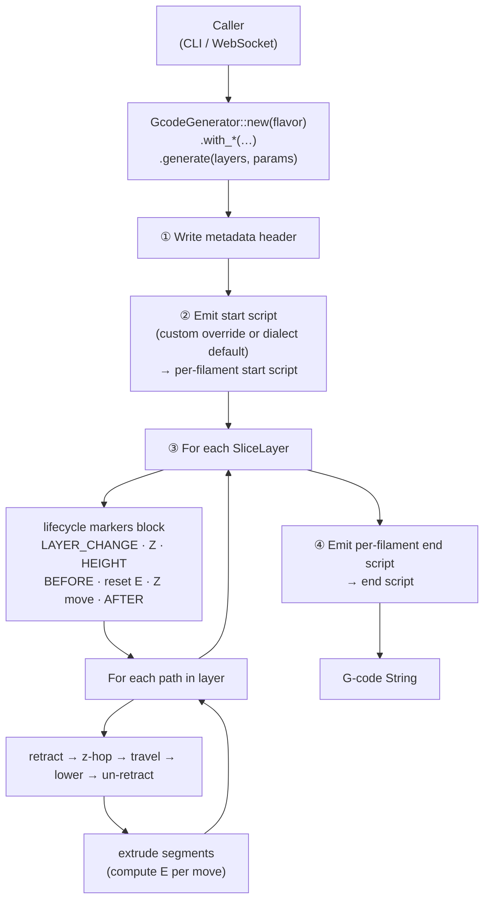
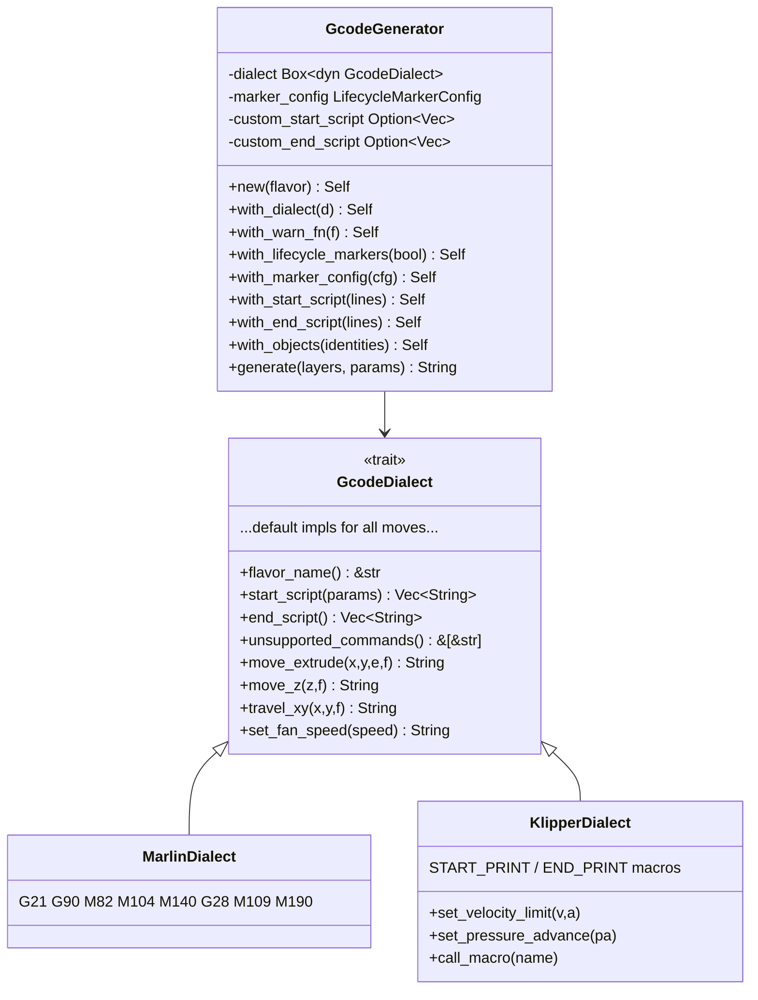
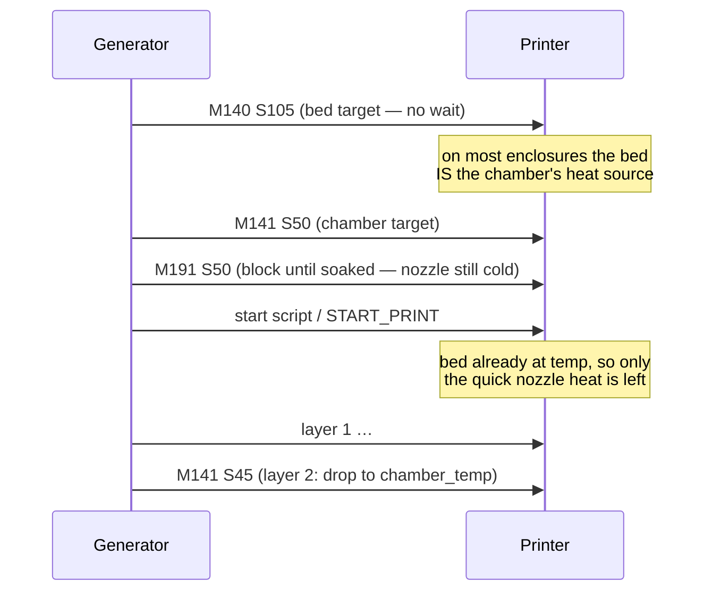
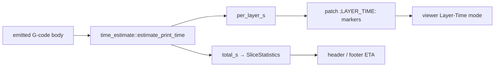
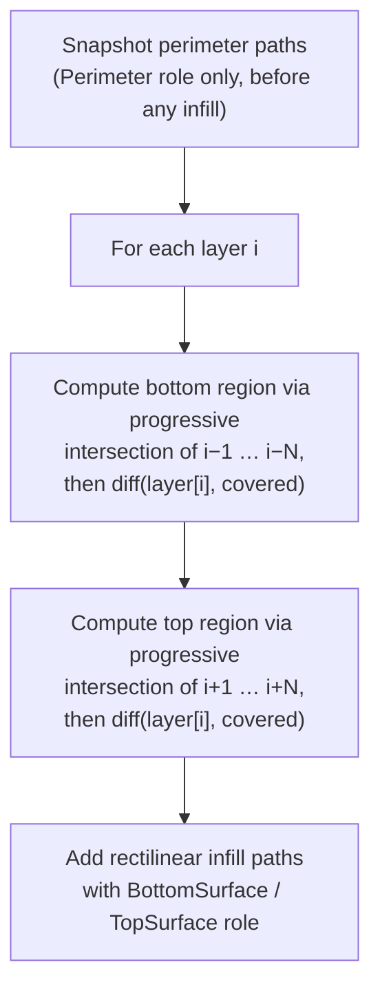
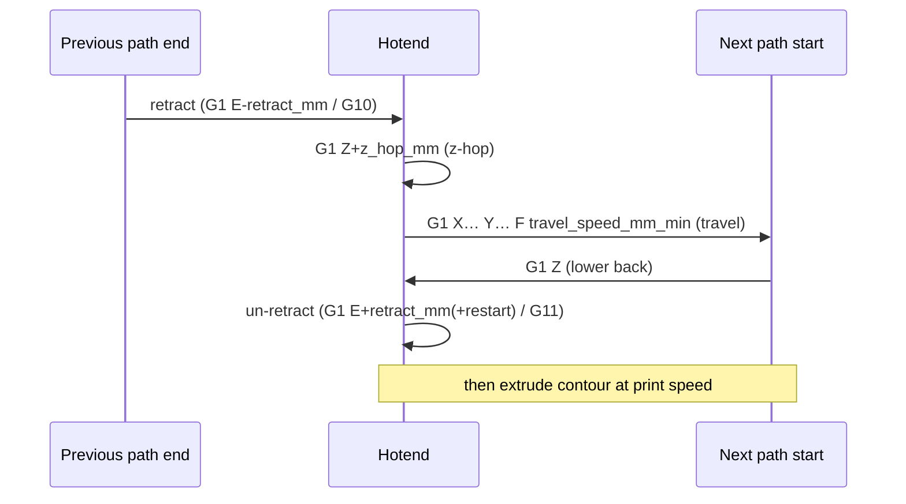
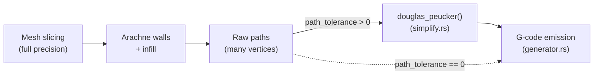

# `gcode` — G-code generation

Converts `Vec<SliceLayer>` → a firmware-ready G-code `String`.

---

## Module layout

```
gcode/
├── mod.rs          re-exports; module-level docs
├── flavor.rs       GcodeFlavor enum (Marlin | Klipper)
├── dialect.rs      GcodeDialect trait + WarnFn + header()
├── generator.rs    GcodeGenerator façade + generate_gcode()
├── stats.rs        SliceStatistics + metadata/settings header lines
├── simplify.rs     Ramer-Douglas-Peucker polyline simplification
├── time_estimate.rs  acceleration-aware print-time estimator (#117)
├── source.rs       resolve_gcode_source() file/string resolver
└── dialects/
    ├── mod.rs      re-exports
    ├── marlin.rs   MarlinDialect  (M104/M109/M140/M190; HEADER_BLOCK header)
    └── klipper.rs  KlipperDialect (START_PRINT / END_PRINT; KLIPPER_HEADER)
```

---

## Call flow



---

## Dialect abstraction



---

## Object markers (issues #22, #112)

Three trait methods let a firmware attribute every move to a named part and
cancel one mid-print. The **defaults implement `M486`** — the RepRap standard,
understood by Marlin 2.0.9.3+, RepRapFirmware and Prusa — and `KlipperDialect`
overrides them with `EXCLUDE_OBJECT_*`, which also carries the footprint so the
firmware knows *where* a cancelled object lives.

| Method               | Default (`M486`)         | Klipper                                          |
| -------------------- | ------------------------ | ------------------------------------------------ |
| `object_definitions` | `M486 T<n>` + comments   | `EXCLUDE_OBJECT_DEFINE NAME= CENTER= POLYGON=`   |
| `object_start`       | `M486 S<i> [A"name"]`    | `EXCLUDE_OBJECT_START NAME=`                     |
| `object_end`         | `M486 S-1`               | `EXCLUDE_OBJECT_END NAME=`                       |

The generator drives them from the per-path tags in `SliceLayer::path_objects`
(see [src/core/objects.rs](../core/objects.rs)); with no objects attached the
output is unchanged. Three placement rules matter:

- **Definitions precede the start script.** Klipper's `[exclude_object]` module
  and Moonraker both expect to meet every object before the print begins.
- **The block switches before a path's travel**, so the hop between two parts is
  charged to the one it is heading for — the PrusaSlicer / OrcaSlicer convention,
  and what lets a firmware skip a cancelled object's approach moves too.
- **A `None` tag closes the block without opening one.** Bed adhesion belongs to
  the plate, so it must still print when a single part is cancelled.

In `by_object` (sequential) order the generator additionally hands over between
objects **before the layer's own Z move**: close the block → retract → lift
above the tallest thing already printed → travel across → `between_objects_gcode`.
Doing any of that afterwards would lower the nozzle into the part just finished.

---

## Extrusion math

For each XY segment of length _L_ the required filament advance is:

```
E = L × (layer_height × nozzle_ø) / (π × (filament_ø/2)²)
```

This is the **volumetric flow balance**: the rectangular cross-section of the
deposited bead `(layer_height × nozzle_ø)` must equal the volume of filament
pushed through `(π r² × E)`.

Both diameters are configurable via `SlicingParams` (fields `nozzle_diameter_mm`
and `filament_diameter_mm`). Typical defaults: filament ø = 1.75 mm,
nozzle ø = 0.40 mm.

---

## Metadata header & config-block footer (issues #15, #23)

Two blocks bracket the program, and they serve different readers.

| Block | Where | Reader |
| --- | --- | --- |
| `GcodeDialect::header` | top of file | **humans** — flavor-tagged, `; key: value` |
| `GcodeDialect::footer` | after the end script | **machines** — `; prusaslicer_config = begin … end` |

Both render from one [`SliceStatistics`](./stats.rs) built after the body is
emitted, so their figures always agree with the moves actually written.

The footer is what printer front-ends parse. Moonraker (Mainsail / Fluidd)
identifies us as a PrusaSlicer-family slicer from the `; generated by <name> on
<date>` line, then scans the **last 1 MiB** for `; key = value` comments — which
is why the block is a footer, not part of the header. OctoPrint reads the same
shape.

**Scope rule: a line earns its place by having a parser.** The footer is
deliberately *not* a dump of all ~130 resolved settings — every field in it is
read by a front-end in the wild (filament usage / cost, print time, layer count,
temperatures, nozzle and filament dimensions, filament and machine identity).
Anything purely informational belongs in the human header instead.

Fields sourced from a profile are **omitted when unset** rather than emitted
empty, so a flag-only CLI slice never advertises a blank material or a free
print.

---

## Thermal management — cooling & chamber

Two contracts meet here. The **filament** says how hot the chamber should be and
how much airflow the material tolerates; the **printer** says whether the machine
can actually heat a chamber. Neither one alone emits anything.

### Chamber heating

`chamber_temp` used to be a `{chamber_temp}` placeholder and nothing else. It is
now a real directive — but **only** when the printer profile sets
`heated_chamber`. That gate is not a preference, it is a safety interlock:
Klipper *aborts the print* on an unknown command, and every ABS/ASA/PC filament
preset carries a chamber temperature whether or not the machine has a chamber
heater.

The set and the soak both run **before** the start script, and the ordering
inside that block is load-bearing:



Two mistakes are avoided here, and both are worth stating because the obvious
alternatives hit them:

- **Waiting after the start script** would park molten filament in a hot end for
  the length of the soak. The materials that carry a chamber target are exactly
  the ones that suffer for it — ABS/ASA at 250 °C, PC at 270 °C, Nylon at 260 °C.
- **Soaking without arming the bed** would never terminate on a bed-heated
  enclosure. The bed target is therefore emitted first, non-blocking; the start
  script sets it again and its own `M190` returns immediately.

`chamber_temp_first_layer` (`0` = inherit `chamber_temp`) is the soak target; the
layer-2 restore mirrors how `nozzle_temp_first_layer` / `bed_temp_first_layer`
already work and never blocks.

Klipper has no built-in `M141`/`M191`, so `KlipperDialect` overrides
`set_chamber_temp` with `SET_HEATER_TEMPERATURE HEATER=chamber TARGET=…` and
`TEMPERATURE_WAIT SENSOR="heater_generic chamber" MINIMUM=…` — needing a
`[heater_generic chamber]` section exactly as `SET_RETRACTION` needs
`[firmware_retraction]`. (`TEMPERATURE_WAIT` only *waits*, which is why the
target is armed as its own command rather than folded into the wait.)

**A start script that heats the chamber owns the whole job.** If the custom start
G-code contains `M141`, `CHAMBER=`, `CHAMBER_TEMP`, `HEATER=chamber` or
`heater_generic chamber`, the generator emits a note and suppresses its own
sequence rather than heating and soaking twice. A
`START_PRINT … CHAMBER={chamber_temp}` macro keeps behaving exactly as it did
before this feature existed. The tokens deliberately require a *heating* context:
a bare `chamber` would also match a chamber **fan** (`SET_FAN_SPEED FAN=chamber_fan`,
`M106 P2 ; chamber fan`) or a comment, and silently disabling chamber heating is
the failure this feature exists to prevent.

The chamber heater is **not** switched off by the end script: ABS and PC want a
slow cool-down, and `time_estimate_cooldown_s` already exists for that allowance.

### Part-cooling fan

`fan_configs` is the printer-side adaptive table (per-fan layer-time curve, plus
`AuxFanOverrides` for RSCS-style hybrid cooling). On top of it sits the
filament-owned **material policy**, resolved by
[`SlicingParams::part_cooling_speed`](../settings/params.rs) and applied to the
part-cooling fan (`fan_index` 0) only — hotend, chamber and aux fans keep the raw
curve:

| Precedence | Condition                                | Emitted speed                                 |
| ---------- | ---------------------------------------- | --------------------------------------------- |
| 1          | `layer_index < disable_fan_first_layers` | `first_layer_fan_speed` (default `0.0` = off) |
| 2          | segment role `Bridge`                    | `bridge_fan_speed`                            |
| 3          | segment overhang ≥ `overhang_fan_threshold` | `overhang_fan_speed`                       |
| 4          | otherwise                                | `min(fan_configs curve, fan_speed)`           |

Two properties are load-bearing:

- **`fan_speed` is a ceiling, not a duty.** Clamping the adaptive curve is what
  gates high-temperature materials: an ABS preset caps at 30 % so the part fan
  cannot fight the chamber heater it just asked for. At the default `1.0` it is
  a no-op, so an unchanged profile emits unchanged G-code.
- **Rows 2 and 3 are suppressed while row 1 applies.** A single overhang on
  layer 1 must not defeat the adhesion gate, so the per-segment override is not
  even armed on pinned layers.

Bridge cooling is unconditional (a bridge is a bridge), while the overhang boost
stays tied to `enable_overhang_speed`; when a segment somehow qualifies for both
the higher of the two wins. Both are emitted **on change only**, so a run of
bridge lines toggles the fan at most twice per layer.

> **Behaviour change.** Before this landed, `fan_speed`, `bridge_fan_speed`,
> `first_layer_fan_speed` and `disable_fan_first_layers` were read by nothing —
> the generator drove fans purely from `fan_configs`, so the part-cooling fan ran
> on layer 1 for every material. It no longer does.

---

## Print-time estimation (issue #117)

The header / footer ETA and the viewer's **Layer Time** colouring come from
[`time_estimate`](./time_estimate.rs), an **acceleration-aware** estimator that
*parses the emitted program* rather than the slice geometry. Because it measures
the moves the generator actually wrote, it can never drift from them — the same
principle behind PrusaSlicer's `GCodeProcessor`.



Each move is timed with a **trapezoidal velocity profile** (accelerate → cruise →
decelerate). Entry/exit speeds at each corner come from a two-pass planner
look-ahead, and cornering speed uses the **junction-deviation** model (a right
angle is taken at the square-corner velocity, a straight join keeps full speed, a
reversal stops). Travel moves, Z lifts and the retract/un-retract ceremony are
all counted; per-role feedrates and per-role accelerations (`M204` /
`SET_VELOCITY_LIMIT`) are read straight from the emitted lines.

### Machine kinematics (emitted **and** estimated)

To keep the estimate honest — *it must describe the moves the printer actually
runs* — the kinematic limits are both **emitted** by the generator and **read
back** by the estimator from the same `SlicingParams`:

| Param                     | Emitted as (Marlin / Klipper)                          | In the estimate                    |
| ------------------------- | ------------------------------------------------------ | ---------------------------------- |
| `acceleration`            | `M204 P…` / `SET_VELOCITY_LIMIT ACCEL=…` (per role)    | per-move ramp rate                 |
| `square_corner_velocity`  | `M205 J<jd>` / `SET_VELOCITY_LIMIT SQUARE_CORNER_VEL…` | junction-deviation corner speed    |
| `max_velocity`            | `M203 X… Y…` / `SET_VELOCITY_LIMIT VELOCITY=…`         | per-move nominal-speed cap         |

Marlin has no square-corner-velocity command, so it is converted to a
junction-deviation distance `jd = scv² · (√2 − 1) / accel` — the exact relation
`junction_speed` inverts. Each limit is emitted only when set (`> 0`), so a
profile that never touched them produces byte-identical output to before.

### Calibration (Bucket B)

Three `SlicingParams` knobs correct for wall-clock the toolpath physics cannot
show. `total = warmup_s + (toolpath × scale) + cooldown_s`:

| Param                      | Effect                                                       |
| -------------------------- | ----------------------------------------------------------- |
| `time_estimate_scale`      | multiplies the **toolpath** portion (systematic-error fudge) |
| `time_estimate_warmup_s`   | fixed seconds added **before** (homing, heat-soak, purge)    |
| `time_estimate_cooldown_s` | fixed seconds added **after** (e.g. chamber cool-off)        |

The per-layer `;LAYER_TIME:` markers are scaled by `scale` too (so they stay
consistent with the toolpath total) but carry **no** fixed allowance — those
belong to no single layer. The physics module [`time_estimate`](./time_estimate.rs)
stays pure; scale/offset are applied at the generator boundary.

The old naive `length ÷ print_speed` figure survives only as
[`generator::estimate_layer_time`](./generator.rs) — a cheap *pre-move* proxy
still used for the adaptive fan decision (which must be emitted before a layer's
moves are known); its `;LAYER_TIME:` placeholder is overwritten afterward with
the trapezoidal figure. On a 30 mm calibration cube the naive model
under-estimated by ~57 % (≈35 min vs the realistic ≈81 min).

> **Not modelled:** heating waits (a coarse `warmup`/`cooldown` allowance stands
> in — not a thermal model), arcs, dwell, and *per-axis* jerk (one scalar
> square-corner velocity, not an X/Y/E profile). The slicer does not yet slow a
> layer to meet a minimum layer time, so there is no min-layer-time slowdown to
> account for — the day that feature lands, the estimator picks it up for free
> because it reads the emitted moves.

---

## Surface generation

Top and bottom surfaces are generated by `generate_top_bottom_surfaces()` in
`src/core.rs`. They use solid rectilinear infill at a configurable angle
(`SlicingParams::surface_infill_angle`, default 45°).

### Detection algorithm

A region of layer `i` is treated as a **top surface** when it is not covered
by every one of the `top_layers` layers above it simultaneously. Formally,
the surface region is computed by progressive intersection:

```
covered = perimeters[i]
for j in 1..=top_layers:
    if layer[i+j] does not exist or is empty:
        covered = ∅          ← model ends here; whole remaining region is exposed
        break
    covered = intersect(covered, perimeters[i+j])
    if covered = ∅: break

top_region[i] = diff(perimeters[i], covered)
```

`top_region[i]` is the area of layer `i` that is **not** enclosed by all
`top_layers` consecutive layers above it. Bottom surfaces follow the same
logic looking downward.



**Key behaviours:**

- **Model top/bottom** — when fewer than `N` layers exist above/below, the
  intersection yields `∅`, so the entire current slice becomes a surface.
- **Mid-model surfaces** — ledges, internal floors, cabin roofs, etc. are
  detected because the layers above/below do not fully cover the current
  footprint.
- **Non-monotonic shapes** — a region that is exposed at _any_ of the `N`
  successor layers (even if the `N`-th successor covers it) is correctly
  flagged as a top surface, because the progressive intersection narrows to
  the _smallest_ coverage found in the window. The old single-comparison
  approach (`diff(layer[i], layer[i+N])`) could silently miss such regions.

### Infill spacing & flow

Line spacing for solid surface infill uses the libslic3r/Orca/PrusaSlicer
**extrusion-spacing** relation, derived from the solid-surface extrusion width
(`top_surface_line_width` → `line_width` → nozzle diameter — see
`solid_surface_nominal_width_mm`):

```
line_spacing = extrusion_width − layer_height × (1 − π/4)
```

At a 0.4 mm nozzle / 0.2 mm layers this is ≈ 0.357 mm — below the 0.4 mm bead
width so the rounded bead caps interlock (no gaps), yet well above the earlier
over-extruding `1.2 × layer_height` rule (0.24 mm).

Crucially, the G-code generator **charges each fill line at exactly this
spacing** — `mm³/mm = line_spacing × layer_height` — *not* the wider nominal
bead width (see `resolve_width_mm`). Depositing the full nominal width into the
narrower pitch would over-extrude every solid surface by `width / spacing`
(≈ 13 % at nozzle width, ≈ 23 % once `line_width > nozzle`) — the raised,
"blobby" top-surface defect. Matching the flow to the spacing mirrors
PrusaSlicer/Orca and fills the surface flat: no gaps, no bulge.

### Infill direction

The solid top/bottom fill angle **alternates by 90° every layer** (cross-hatch),
matching CuraEngine's default `skin_angles = {45°, 135°}`. Even layers use
`surface_infill_angle`; odd layers use `surface_infill_angle + 90°`. Cross-
hatching welds adjacent solid layers and hides the fill direction on the
visible top surface. Because the fill lines are laid at the interlocking stadium
pitch (with the flow reduced to match — see spacing above), the cross-hatch does
not open gaps between beads.

### Configurable parameters

| `SlicingParams` field  | Default | Description                                |
| ---------------------- | ------- | ------------------------------------------ |
| `top_layers`           | 3       | Number of solid layers above a top face    |
| `bottom_layers`        | 3       | Number of solid layers below a bottom face |
| `surface_infill_angle` | 45.0°   | Angle of rectilinear infill lines          |

---

## Travel sequence per path

Every path (closed contour or infill line) is preceded by a travel move from
the previous path's end. Whether that travel is wrapped in the
**retract / z-hop / travel / lower / un-retract** guard depends on a
_smart retract_ policy that mirrors PrusaSlicer / OrcaSlicer / Cura:

| Travel distance          | Role change? | Retract? | Why                                                                             |
| ------------------------ | ------------ | -------- | ------------------------------------------------------------------------------- |
| `> max(2 mm, min)`       | any          | **yes**  | Long hops always ooze enough to need a retract                                  |
| `min – 2 mm`             | yes          | **yes**  | Crossing role boundaries (e.g. infill → outer wall) shows seams without retract |
| `min – 2 mm`             | no           | no       | Same-role short hops oozing is invisible inside infill                          |
| `≤ min`                  | any          | no       | Retract ceremony costs more time than the hop itself                            |

The minimum (`min`) is the configurable `retract_before_travel_mm`
(default 1.0 mm); travels longer than 2 mm always retract. The role-aware
branch eliminates the 99 %+ of pointless retracts that occurred on every
wall-loop end on dense benchmarks, while still protecting the visible outer
surface from oozing.

When a retract _is_ emitted, the sequence is:



Otherwise a single bare `G1 X… Y… F travel_speed_mm_min` move is emitted.

The distances and the travel speed are configurable via `SlicingParams`
fields `retract_mm` (default 1.0 mm), `z_hop_mm` (default 0.2 mm),
`retract_speed_mm_min` (default 2400 mm/min = 40 mm/s), and
`travel_speed_mm_min` (default 9000 mm/min = 150 mm/s).

### Advanced retraction modes

The retract / un-retract steps above adapt to several opt-in modes (all
default-off, so the baseline output is unchanged):

| Setting                       | Effect                                                                                                              |
| ----------------------------- | ----------------------------------------------------------------------------------------------------------------- |
| `use_firmware_retraction`     | Emits `G10`/`G11` instead of `G1 E` moves; syncs the firmware via `M207`/`M208` (Marlin) or `SET_RETRACTION` (Klipper) in the start section |
| `use_relative_e_distances`    | Emits `M83` and per-move incremental E (`G1 … E<delta>`) instead of `M82` absolute positions                       |
| `retract_before_travel_mm`    | Minimum travel distance that triggers a retraction (the `min` above)                                              |
| `retract_restart_extra_mm`    | Extra prime length added on un-retract to compensate for travel ooze                                               |
| `retract_on_layer_change`     | Forces a retraction before the layer-change Z move                                                                 |
| `wipe` / `wipe_distance_mm`   | Retraces the tail of the just-printed path while retracting, smearing ooze onto printed material                   |
| `retract_before_wipe_percent` | Fraction of the retraction performed *before* the wipe move (the rest is distributed *along* it)                   |

Under firmware retraction the slicer still performs the Z-hop with explicit Z
moves (the firmware Z-hop component of `M207` is set to `0`), so hop behaviour
is identical across modes; only the filament pull becomes `G10`/`G11`.

---

## Path simplification (Ramer-Douglas-Peucker)

Sliced contours and infill paths often contain many near-collinear vertices.
Streaming every one of them as a `G1` move overwhelms firmware buffers
(OctoPrint, Klipper) and bloats `.gcode` files. To address this, every path is
thinned just before emission using the [Ramer-Douglas-Peucker][rdp] (RDP)
algorithm.

[rdp]: https://en.wikipedia.org/wiki/Ramer%E2%80%93Douglas%E2%80%93Peucker_algorithm

### Where it sits in the pipeline



**Geometry calculations always use full mesh precision** — simplification
happens _only_ at the output stage, so wall offsets, infill clipping, and
surface detection are never degraded.

### Algorithm

For each polyline, recursively find the vertex with the greatest perpendicular
distance from the chord between the segment's endpoints. If that distance
exceeds `tolerance`, split there and recurse on both halves; otherwise discard
all interior vertices. The first and last point are always preserved.

### Configuration — `SlicingParams::path_tolerance`

| Value     | Effect                                                       |
| --------- | ------------------------------------------------------------ |
| `0.0`     | Disabled — all vertices preserved                            |
| `0.01`    | Conservative — high-quality printers, minimal visible impact |
| `0.05` ⭐ | Default — good balance of fidelity and move-count reduction  |
| `0.1+`    | Aggressive — best for slow firmware (legacy OctoPrint)       |

### Future-feature checklist

When adding a new feature that emits paths through `GcodeGenerator`:

- ✅ **Nothing to do.** Simplification is applied inside the generator's
  per-path loop, so any new path source (new infill pattern, support, brim,
  ironing pass, …) automatically benefits.
- ⚠️ **Bypass deliberately when curvature must be preserved point-for-point**
  (e.g. arc-fitting / `G2`/`G3` emission, exact-position commands). Either set
  `path_tolerance = 0.0` for that pass or perform the special-case emission
  before the generic generator loop.
- ⚠️ **Don't simplify upstream of geometry ops.** Calling `douglas_peucker`
  on Clipper2 paths _before_ offset/clip/intersect operations will cascade
  precision loss into walls and infill. Keep it strictly at the output layer.

---

## Lifecycle markers

When `LifecycleMarkerConfig::enabled` is `true` (default), each layer emits a
structured block compatible with OrcaSlicer / PrusaSlicer post-processors:

```
;LAYER_CHANGE
;Z:{z}
;HEIGHT:{height}
;BEFORE_LAYER_CHANGE
;{z}            ← bare numeric marker for post-processing scripts
G92 E0          ← extruder reset (E tracking restarts each layer)
G1 Z{z} F9000
;AFTER_LAYER_CHANGE
;{z}

;TYPE:{role}    ← emitted once per extrusion-role transition
;WIDTH:{w}mm
```

All marker strings are **templates**: `{z}`, `{height}`, `{type}`, `{width}`
are substituted at render time via `render_marker()`. Per-flavor overrides
are stored in `GlobalSettings::lifecycle_markers` (keyed by flavor name).

The `;TYPE:` label comes from `ExtrusionRole::type_name()` (OrcaSlicer-
compatible), and a fresh `;TYPE:` / `;WIDTH:` pair is emitted whenever the role
**or** the extrusion width changes. Variable-width Arachne beads additionally
re-emit `;WIDTH:` as the bead tapers past `WIDTH_MARKER_STEP_MM`.

### Extrusion width per role

`resolve_width_mm(explicit, has_vertex_widths, role, params)` decides the width
used for both the extrusion flow and the `;WIDTH:` annotation. Precedence, first
match wins:

1. **Per-role override** — `outer_wall_line_width`, `inner_wall_line_width`,
   `top_surface_line_width` (top *and* bottom surfaces), or
   `sparse_infill_line_width`, when set (`> 0`) — but **only for constant-width
   paths** (no per-vertex widths). This lets a wall-width setting take effect
   even though the wall generator stamps an explicit, nozzle-derived width on
   every wall path. `OverhangPerimeter` follows the outer-wall override.
   Variable-width Arachne beads (gap fill, tapered beads) are skipped because
   their per-vertex widths are authoritative.
2. **Explicit per-path width** — Arachne bead width or bridge-flow reduction.
3. **Generic `line_width`** — but only for solid infill and surfaces,
   preserving the rule that walls ignore the global line width (their width
   comes from the wall generator).
4. **Role default** — the nozzle-derived `ExtrusionRole::default_width_mm()`.

All per-role width fields default to `0.0` ("derive"), so an unset config
behaves exactly as before.

---

## Script priority chain

```
CLI --start-gcode argument
        ↓  (overrides)
GlobalSettings.start_print_gcode
        ↓  (overrides)
GcodeDialect::start_script()  ← firmware default
```

`resolve_gcode_source(input)` auto-detects whether `input` is a file path or
an inline G-code string (1 MiB file size limit enforced).
