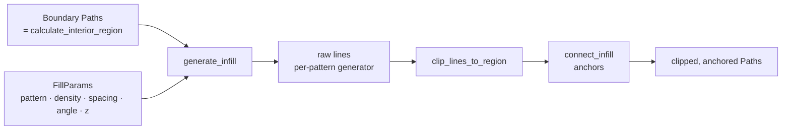
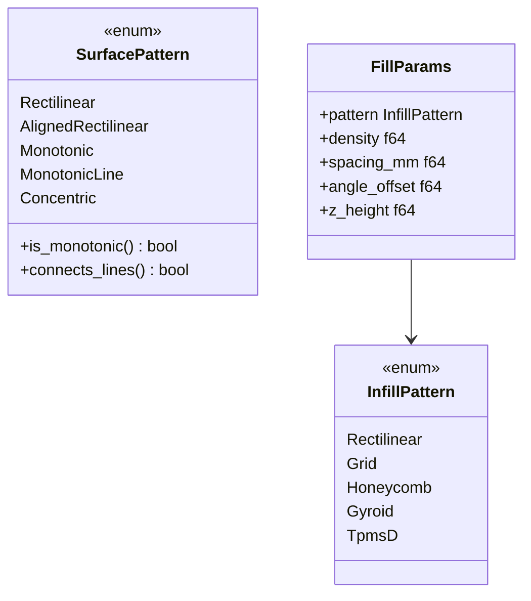
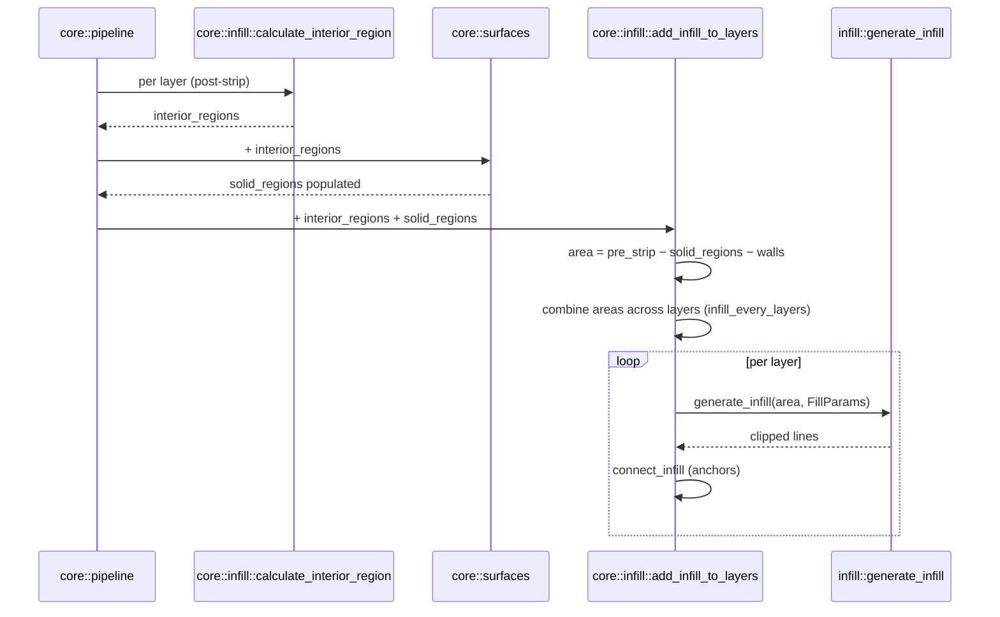

# Infill — Pattern Generation Inside a Boundary

This module turns a closed boundary `Paths` into a `Paths` of infill line
segments. It is pure 2D geometry: no slicing, no G-code, no per-layer
bookkeeping.

> _Boundary in. Lines out. The boundary is sacred — never inflate it again._

---

## Why it exists

Sparse infill is what fills the inside of a print so it isn't a pile of
loose walls. There are several established patterns, each a tradeoff
between print speed, strength, and isotropy. Rather than scatter that
geometry across the slicing pipeline, all of it lives behind one entry
point — [`generate_infill`](mod.rs) — that takes a [`FillParams`](mod.rs) and
produces line segments. The slicer doesn't know how a gyroid is computed;
the gyroid doesn't know what a `SliceLayer` is.

The boundary handed in is the _final_ infill region: it has already been
inset to account for every wall bead and the configured infill overlap.
The infill generators must fill it as-is, with no further offsetting.

---

## The contract

1. **Boundaries are not inflated.** [`core::infill::calculate_interior_region`](../core/infill.rs)
   has already done that work. A second inward inflate inside this module
   was the cause of the "missing infill on cabin transition layers" bug —
   features narrower than ~2× the extra offset collapsed entirely.
2. **Output is line segments, not closed contours.** Each emitted `Path` is
   a polyline that the G-code generator strokes once. They are clipped to
   the boundary by [`utils::clip_lines_to_region`](utils.rs); patterns
   themselves emit the raw, unclipped pattern across the boundary's bounding
   box.
3. **Density is a fraction in `[0.0, 1.0]`, measured against the bead
   spacing.** `0.0` returns empty paths; values outside the range are clamped.
   See [The density unit](#the-density-unit) — this is the single most
   important invariant in the module.
4. **Layer rotation comes in as `angle_offset` (radians).** Callers
   alternate this per layer so rectilinear / grid lines cross between
   layers. 3D patterns (gyroid, TPMS-D) ignore it and use `z_height`
   instead.

---

## The density unit

Every pattern derives its geometry from **one** number: `FillParams::spacing_mm`,
the flow spacing of a single bead —

```text
spacing = extrusion_width − layer_height × (1 − π/4)
```

which is libslic3r's `Flow::spacing()`, computed once by
[`core::extrusion_flow_spacing_mm`](../core/surfaces.rs) from
[`core::sparse_infill_nominal_width_mm`](../core/surfaces.rs). Lines are laid

```text
line_pitch = spacing / density
```

apart, and the G-code generator charges each of them `spacing × layer_height`
of filament (`resolve_width_mm`). Because the pitch and the flow come from the
same quantity, "20 % density" deposits exactly 20 % of a solid layer's volume.

**Patterns that lay several sweeps across the region divide the density first.**
libslic3r's `fill_surface_by_multilines` does `density /= sweeps`, so N sweeps
together deposit `density`, not `N × density`. Use
[`rectilinear::generate_multiline`](rectilinear.rs) rather than calling
`generate_rectilinear` twice — an earlier grid implementation did exactly that
and deposited **double** the requested density.

Every generator used to hardcode a `0.4 mm` reference width instead, which made
density wrong for any nozzle or `sparse_infill_line_width` that was not 0.4 mm
(a 0.6 mm nozzle printed "20 %" as roughly 13 %).

---

## Pattern catalog

### Sparse — [`InfillPattern`](mod.rs)

| Pattern              | File                             | Dimensionality | Cell relation                                              |
| -------------------- | -------------------------------- | -------------- | ---------------------------------------------------------- |
| `Rectilinear`        | [rectilinear.rs](rectilinear.rs) | 2D, per layer  | pitch `= spacing / density`                                |
| `AlignedRectilinear` | [rectilinear.rs](rectilinear.rs) | 2D, fixed angle| as rectilinear, but the per-layer 90° flip is suppressed   |
| `Grid`               | [grid.rs](grid.rs)               | 2D, per layer  | two sweeps at `density / 2`                                |
| `Triangles`          | [rectilinear.rs](rectilinear.rs) | 2D, per layer  | three sweeps 60° apart at `density / 3`                    |
| `TriHexagon`         | [rectilinear.rs](rectilinear.rs) | 2D, per layer  | triangles, third sweep shifted `1.5 × spacing / density`   |
| `Cubic`              | [rectilinear.rs](rectilinear.rs) | 3D, uses `z`   | triangles, sweeps shifted `± √0.5 · z`                     |
| `Honeycomb`          | [honeycomb.rs](honeycomb.rs)     | 2D, per layer  | `distance = spacing / density`, `side = distance / (√3/2)` |
| `Concentric`         | [concentric.rs](concentric.rs)   | 2D, per layer  | loops stepping inward `spacing / density`                  |
| `Gyroid`             | [gyroid.rs](gyroid.rs)           | 3D, uses `z`   | period `= 2π · spacing / (density × 2.44)`                 |
| `TpmsD`              | [tpms_d.rs](tpms_d.rs)           | 3D, uses `z`   | period `= 2π · spacing / (density × 13.2)`                 |

`InfillPattern::parse` accepts OrcaSlicer's spellings alongside our own
(`line` / `linear` → `Rectilinear`, `alignedrectilinear`, `stars` →
`TriHexagon`, `hexagonal` → `Honeycomb`, `tpmsd` → `TpmsD`), so an imported
profile maps without a translation table.

Every one of them deposits the density it is asked for, pinned by
`every_line_pattern_deposits_the_density_it_is_asked_for` — measured on a Voron
cube, all ten land within 4 % of each other (concentric excepted: it traces the
whole outline of a thin sliver where a line fill would cross it once, so it
over-fills complex cross-sections by design, exactly as libslic3r does).

**A marching-squares tracer must chain its output.** `TpmsD` walks a level set
cell by cell, emitting one short segment per crossing. Left unchained those are
isolated sub-cell dabs, and the splat filter deletes almost all of them — the
pattern used to deposit barely a seventh of the requested density.
[`utils::chain_segments_into_polylines`](utils.rs) joins them back into the
curves the tracer actually found.

### Solid — [`SurfacePattern`](mod.rs)

Solid fill is always 100 % dense, so these variants differ only in the *order
and connectivity* of the lines — which is what decides how a visible surface
looks. Generated by [`core::surfaces::generate_solid_infill`](../core/surfaces.rs),
not here; the enum lives in this module because it is a fill pattern.

| Pattern              | Behaviour                                                        |
| -------------------- | ---------------------------------------------------------------- |
| `Rectilinear`        | Back-and-forth serpentine, every second line reversed            |
| `AlignedRectilinear` | Serpentine with the per-layer 90° alternation suppressed         |
| `Monotonic`          | One-way sweep; consecutive spans joined where they already abut  |
| `MonotonicLine`      | One-way sweep, lines never joined (**default for top surfaces**) |
| `Concentric`         | Loops following the outline, stepping inward one bead per loop   |

`SurfacePattern::parse` accepts both slicers' spellings — PrusaSlicer writes
`monotoniclines`, OrcaSlicer `monotonicline` — so an imported profile maps
cleanly either way.

**Monotonic means every line is drawn in the same direction.** The nozzle never
returns across a line it just laid, so each bead is squished by its neighbour
identically and the direction-dependent sheen a serpentine leaves on a top
surface disappears. `MonotonicLine` is exactly `Monotonic` with joining switched
off, which libslic3r encodes as `anchor_length_max = 0`.

Because that ordering *is* the feature, [`core::pipeline`](../core/pipeline.rs)
skips the greedy-TSP path reordering for a monotonic surface group — the TSP is
free to reverse an open path, which would scramble the sweep and leave the
surface looking no different from a plain serpentine.

---

## Anchors — [anchor.rs](anchor.rs)

Every sparse-infill line stops dead where it meets the inner wall. Letting it
turn and follow the wall welds it to the shell instead of merely touching it,
and two lines that meet around a short stretch of wall become one continuous
move. This is a port of libslic3r's `Fill::connect_infill`, driven by two knobs:

| Setting                 | Meaning                                                            |
| ----------------------- | ------------------------------------------------------------------ |
| `infill_anchor_max_mm`  | longest wall stretch that may join **two** lines; `0` disables all anchoring |
| `infill_anchor_percent` | how far a **single** unpaired end may run along the wall, as a % of the bead spacing; `0` disables open anchors |

The walk always follows the boundary, never cuts across the region, so an anchor
can only be laid where the fill area already reaches.

**This is not a cosmetic feature.** Measured on the Filament Card Caddy's
hollow-box layers, anchoring turned **101 isolated sub-0.8 mm infill dashes**
on a single layer — each an isolated dab costing a full retract → travel →
un-retract — into one continuous serpentine, with none left over. The extra
material is the connectors that make those dashes printable at all.

**Anchoring must run before the splat and minimum-length filters** in
[`core::infill::add_infill_to_layers`](../core/infill.rs). A line that anchoring
would have merged into a long path must not be discarded as an isolated dash
first.

**Anchors are for sparse infill only.** libslic3r gives solid and bridge fill
unlimited anchors, but our monotonic surface fill already joins abutting spans
itself, and running the generic pass over it would reverse lines to make the
join — destroying the uniform sweep the pattern exists to produce.

---

## Anatomy





---

## Role in the wider system



The `infill` module sits at the leaves of the pipeline. Everything
upstream — surface detection, wall stripping, region calculation — exists
so the boundary handed to `generate_infill` is exactly right.

---

## Critical invariants

### 1. Do not inflate the input boundary

The block comment in [`generate_infill`](mod.rs) calls this out explicitly.
A second inward offset inside this module collapses thin features and
silently loses infill. If a pattern needs internal padding, it must do so
in its own coordinate space, not by shrinking the boundary.

### 2. Pattern outputs are unclipped polylines

Per-pattern generators (`generate_rectilinear`, `generate_grid`, …) emit
straight line segments across the boundary's bounding box without any
clipping. `clip_lines_to_region` does the boolean intersection at the
end. This keeps each pattern simple and pushes the Clipper2 dependency to
one shared utility.

### 3. Line phase is anchored to world coordinates

`generate_lines` seeds its first line from a world-aligned grid, not from the
region's own centre. Successive layers have slightly different interior
regions, so a centre-relative phase would drift the infill a fraction of a pitch
per layer and the lattice would never stack.

### 4. Scanline fill correctly handles holes

For boundaries containing CW hole sub-paths (annular cross-sections like a
hollow box), the scanline algorithm relies on Clipper2's standard winding to
produce the right parity of crossings — solid CCW outer ring + CW hole
naturally toggles the even-odd count to skip the void. No special-casing
is needed as long as the input is canonical Clipper2 output.

---

## What this module deliberately does _not_ do

- **No slicing.** It doesn't know what a layer is; it operates on a single
  boundary at a time.
- **No solid-surface fill generation.** Top/bottom solid lines are generated by
  [`core::surfaces`](../core/surfaces.rs), which owns the scanline used for
  both. Only the `SurfacePattern` *vocabulary* lives here.
- **No G-code.** Output is `Paths`. The G-code generator strokes them.
- **No layer combining.** Stacking sparse infill across layers is a per-layer
  bookkeeping problem, so it lives in [`core::infill`](../core/infill.rs).
- **No travel optimisation.** Path ordering and combing are out of scope;
  anchoring only ever connects lines *along the boundary*.

---

## See also

- [mod.rs](mod.rs) — `InfillPattern`, `SurfacePattern`, `FillParams`, `generate_infill`
- [anchor.rs](anchor.rs) — `connect_infill`
- [utils.rs](utils.rs) — `clip_lines_to_region`
- [rectilinear.rs](rectilinear.rs) — single- and multi-sweep line fills
- [grid.rs](grid.rs), [honeycomb.rs](honeycomb.rs) — 2D patterns
- [gyroid.rs](gyroid.rs), [tpms_d.rs](tpms_d.rs) — 3D patterns
- [../core/README.md](../core/README.md) — how the boundary is computed
- [../core/infill.rs](../core/infill.rs) — `calculate_interior_region`,
  `add_infill_to_layers`, layer combining
- [../core/surfaces.rs](../core/surfaces.rs) — `generate_solid_infill`
- Issue [#99](https://github.com/ColdCrabby/slicer/issues/99) — advanced infill options
