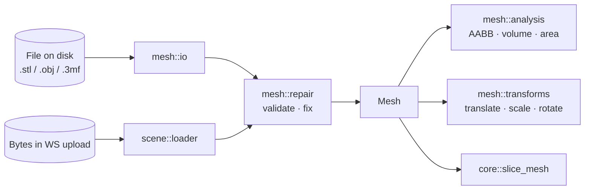
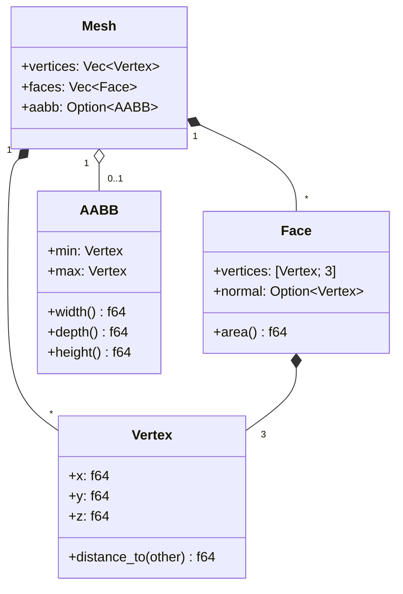
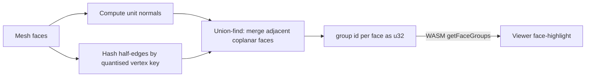
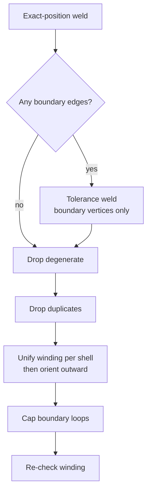
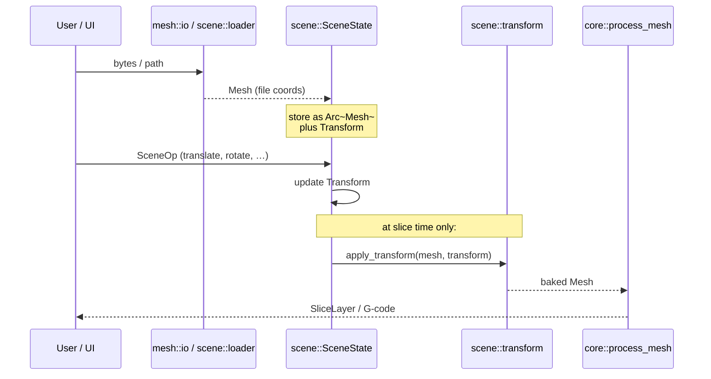

# Mesh — Triangle Geometry, Loaded, Checked and Inspected

This module owns one thing: the in-memory triangle mesh that the rest of the
engine slices. Everything starts with a `Mesh`, and every byte that comes in
from disk — STL, OBJ, 3MF — funnels through here on the way to becoming one.

> _All coordinates are in millimeters. Z is up. There is no other convention._

---

## Why it exists

Three distinct concerns share one truth: a soup of triangles with a bounding
box.

- **The slicer** wants a flat list of triangles to intersect with horizontal
  planes — it doesn't care how they got there.
- **The scene engine** ([../scene/](../scene/)) wants to clone meshes cheaply
  (via `Arc<Mesh>`) and bake transforms once before slicing.
- **The loaders** want a single target type to convert into, regardless of
  whether the source is binary STL, ASCII STL, OBJ, or a ZIP-wrapped 3MF.

`mesh::types::Mesh` is that single target. Loaders fill it; the repair pass
vets it; analysis reads it; transforms produce new copies of it; the slicer
consumes it.

---

## The contract

1. **Coordinates are mm; Z is up.** Loaders convert from whatever the source
   uses (STL `f32`, OBJ unspecified) to `f64` in this convention. Slicing,
   G-code, and the scene engine all assume it.
2. **Transforms are pure.** `translate_mesh`, `scale_mesh`, and friends return
   a new `Mesh`; the input is never mutated. The new mesh's cached `aabb` is
   cleared so it is recomputed on next access.
3. **`Face` carries its own vertex copies.** The triangles are denormalised
   for slicing speed: each `Face` stores its three `Vertex` values inline,
   not indices into `Mesh::vertices`. The `vertices` array exists for AABB
   computation; the slicer reads `faces`.
4. **Every load is validated, and defects are repaired.**
   [`repair::repair`](repair.rs) runs inside
   [`scene::loader`](../scene/loader.rs) before the mesh reaches anything else.
   Its own contract is that a **clean mesh is returned untouched** — literally
   `Cow::Borrowed`, not a rebuilt copy — so this changes nothing for
   well-formed models. See [Validation and repair](#validation-and-repair).
5. **Loaders never apply _placement_ transforms.** A loaded mesh is in the
   file's native coordinates. Centering, dropping to floor, rotating — all of
   that is the scene engine's job ([../scene/ops.rs](../scene/ops.rs)). The one
   exception is 3MF: its `<build>` item and `<components>` transforms _are_
   baked in, because they assemble the object's own geometry (each mesh's
   triangle indices are local to that mesh), not a user placement on the bed.

---

## Anatomy

A few things worth knowing:

- **`aabb` is a cache.** It is `None` after construction or after a transform,
  and gets populated lazily by [`analysis::calculate_aabb`](analysis.rs).
- **`Face::normal` is what the file said.** STL ASCII files often record zero
  vectors as normals; in those cases the field is `None` and the slicer
  recomputes orientation from the triangle winding when it needs to.
- **No _persistent_ half-edge / connectivity structure.** The slicer uses
  Clipper2 to chain segments after intersection, so it never needs to know
  which triangles share which edges. [`repair`](repair.rs) does build an
  edge graph, but it is transient — thrown away before the mesh is handed on.

---

## Analysis functions

`analysis.rs` provides three categories of mesh inspection:

| Function                  | Returns                        | Notes                                                      |
| ------------------------- | ------------------------------ | ---------------------------------------------------------- |
| `calculate_aabb`          | `AABB`                         | Scans all vertices; panics on empty mesh                   |
| `calculate_volume`        | `Result<f64, String>`          | Divergence-theorem signed sum; returns `Err` if no faces   |
| `calculate_surface_area`  | `f64`                          | Sums `Face::area()` over all triangles                     |
| `compute_coplanar_groups` | `Vec<u32>` (one id per face)   | Union-find over shared edges; see below                    |

### Coplanar face groups

`compute_coplanar_groups(mesh, angle_threshold_deg, vertex_merge_distance_mm)`
assigns every triangle to a coplanar group. Two triangles end up in the same
group when they **share an edge** and their **geometric normals agree** within
`angle_threshold_deg`. The algorithm runs in three phases:

1. **Normal computation.** Each face gets a unit geometric normal (cross
   product, then normalised). Degenerate triangles (zero-length cross product)
   get the zero vector and never merge with anything.

2. **Edge adjacency.** Vertex positions are quantised to a
   `vertex_merge_distance_mm` grid so floating-point near-duplicates collapse
   to the same integer key. Every directed half-edge is then hashed to a
   symmetric key `(min_vert, max_vert)`. Half-edges are sorted by key, giving
   an O(N log N) pass to collect all faces that share each edge.

3. **Union-find merge.** For every set of faces that share an edge, each pair
   is tested: if `dot(normalA, normalB) ≥ cos(threshold)`, the two faces are
   joined. Path-halving and union-by-rank keep the structure nearly flat.

The returned `Vec<u32>` is contiguous — group ids start at 0 and are assigned
in the order the first face of each group is encountered. The WASM bridge
exposes this as `SceneHandle.getFaceGroups(id, angleThresholdDeg)`, which the
UI uses for face-highlight in the `pullToFloor` gizmo mode.

**Tuning knobs**

| Parameter                  | Recommended value | Effect                                         |
| -------------------------- | ----------------- | ---------------------------------------------- |
| `angle_threshold_deg`      | 1.0°              | Larger = merges slightly uneven surfaces       |
| `vertex_merge_distance_mm` | 0.001 mm          | Larger = tolerates worse vertex welding        |

---

## Validation and repair

Real STLs are frequently broken. The slicer used to absorb that silently:
`slice_mesh` chains open contour segments defensively, so a hole in the model
turned into a *missing top surface* three stages later, with nothing pointing
back at the cause. [repair.rs](repair.rs) exists to name the problem at the
door, and fix it where it safely can.

### Why it can be on by default

Because it is a **no-op on a clean mesh, by construction**. `repair` measures
first; when the diagnostics come back clean it hands the original mesh straight
back as `Cow::Borrowed` and never rebuilds anything. Every model in this
repository — Benchy, the Voron cube, the caddy, the hinge, the simple-cube
fixtures in all four formats — is clean, which is what lets the slicing-quality
baselines stay valid with repair enabled everywhere. That is pinned by
`known_good_meshes_are_reported_clean_and_never_rewritten` in
[../../tests/mesh_repair.rs](../../tests/mesh_repair.rs); if it ever fails, the
baselines are about to drift.

### Determinism is a correctness requirement, not a nicety

`SceneOp::PlaceFaceOnFloor { face_index }` is picked in the browser against the
mesh the wasm bundle parsed, and — in cloud mode — re-resolved by a server that
loaded and repaired the same file independently. The two must agree, so repair
assigns vertex and face indices in strict first-seen order and its union–find
always attaches the larger root to the smaller, never depending on hash
iteration order.

### What it measures

`MeshDiagnostics` is computed on the welded triangle graph. Degenerate
triangles are counted but excluded from the edge graph, where their repeated
corners would fabricate defects that aren't there.

| Field                        | Meaning                                          |
| ---------------------------- | ------------------------------------------------ |
| `degenerate_faces`           | Repeated corner, or effectively zero area        |
| `duplicate_faces`            | Repeats another triangle's corner set            |
| `boundary_edges` / `holes`   | Edges used once, chained into closed loops       |
| `non_manifold_edges`         | More than two incident triangles                 |
| `inconsistent_winding_edges` | Both triangles traverse the shared edge the same way |
| `inverted_shells`            | Closed shell with negative signed volume         |
| `shells`                     | Connected components across shared edges         |

### What it repairs

- **Welding** is two-stage on purpose. The exact pass is one hash lookup per
  corner, so a clean 225k-triangle model pays almost nothing. The expensive
  27-neighbour tolerance pass is restricted to vertices that actually touch a
  boundary edge — a crack is exactly where welding matters, and confining it
  there makes accidentally merging distinct interior geometry impossible.
- **Duplicates** are grouped by corner set. When one orientation outnumbers the
  other, one triangle in the majority orientation survives. When they cancel
  exactly — the classic zero-volume "flap" — the whole group goes, because
  keeping one would tear three edges open.
- **Winding** propagates by BFS across manifold edges; non-manifold edges are
  not traversed, since which side is "outside" there is ambiguous. Each shell is
  then flipped as a unit if its signed volume is negative — but **only if that
  shell is closed**. Signed volume here is the divergence-theorem cone volume
  about the *origin*, which equals the enclosed volume only for a sealed
  surface; on an open one the sum is dominated by the cone over the missing
  region and its sign depends on where the model happens to sit in space.
  Orienting an open shell by it would turn a perfectly good surface inside out.
  Open shells therefore keep whatever the BFS produced, and if `fill_holes`
  seals them the pass runs again and orients them then. Pinned by
  `an_uncappable_hole_never_inverts_the_surface`.
- **Hole capping** reuses each boundary half-edge *in reverse*, so the patch is
  consistently wound with the surface it closes without any extra reasoning. A
  3-edge loop becomes one triangle; anything larger is fanned from a new
  centroid vertex, which is watertight regardless of how non-planar the rim is.
  Loops longer than `max_hole_edges` (512) are reported and left alone — an
  intentionally open surface must not be "repaired" shut. Capping can leave a
  previously-open shell inverted (an open surface has no meaningful volume), so
  the winding pass gets a second look afterwards.

### Where the report goes

`MeshReport` (`before` / `after` / `actions` / `summary`) reaches the user
through every runtime, worded identically by `repair::log_report`:

| Runtime | Surface                                                          |
| ------- | ---------------------------------------------------------------- |
| CLI     | Warning line during `slice`, a `mesh` block in `--output-format json`, and the dedicated `slicer-engine mesh-check` command |
| Cloud   | `WsLogger::log_warn` from `handle_slice`, relayed into the UI log |
| Native  | The same warning through the Tauri bridge's process logger        |
| UI      | A warning toast raised once per import from `SceneEngine.addMesh`, reading `SceneHandle.meshReport(id)` |

Opting out is `RepairOptions::analysis_only()` in Rust and `--no-mesh-repair`
on the CLI. The UI always repairs.

---

## File-format catalog

| Format | Variant    | Loader                  | Notes                                                 |
| ------ | ---------- | ----------------------- | ----------------------------------------------------- |
| STL    | Binary     | [`io::read_stl`](io.rs) | Via `stl_io`; fastest path, normals usually present   |
| STL    | ASCII      | [`io::read_stl`](io.rs) | Same entry point; `stl_io` auto-detects               |
| OBJ    | Wavefront  | [`io::read_obj`](io.rs) | Via `tobj`; vertex positions only, materials ignored  |
| 3MF    | XML-in-ZIP | [`io::read_3mf`](io.rs) | Custom parse (`zip` + `quick-xml`); merges all `<build>` items, rebasing each object's local indices and baking item/component transforms |

`SUPPORTED_EXTENSIONS` lists the recognised file extensions for CLI / WS
validation. The scene loader ([../scene/loader.rs](../scene/loader.rs))
dispatches on `MeshFormat` rather than re-sniffing extensions.

---

## Role in the wider system

The mesh module never knows about scenes, but the scene module relies on this
contract: cheap `Arc<Mesh>` clones, pure transforms, and a single AABB cache
slot that transforms invalidate.

---

## Lifecycle of a single mesh

1. **Load.** `io::read_*` (or `scene::loader::load_bytes`) parses the file
   into a `Mesh` with `aabb: None`.
2. **Validate.** `repair::repair` measures the triangle graph and, unless the
   caller opted out, fixes what it can. A clean mesh is passed straight
   through; a defective one is replaced by a repaired copy and a `MeshReport`
   is surfaced to the user.
3. **Inspect.** `analysis::calculate_aabb`, `calculate_volume`,
   `calculate_surface_area` populate / report basic geometry. The first AABB
   call fills the cache.
4. **Place.** The scene engine wraps the mesh in `Arc<Mesh>` and tracks a
   `Transform` alongside it. The mesh itself is _not_ mutated by scene ops.
5. **Bake.** Just before `core::process_mesh`, `scene::transform::apply_transform`
   produces a new `Mesh` with the transform baked into the vertices, AABB
   cleared.
6. **Slice.** `core::slice_mesh` walks the (now world-space) faces and emits
   `SliceLayer`s.

After step 6 the original `Arc<Mesh>` is still alive and unchanged in
`SceneState` — re-slicing with a different transform reuses it.

---

## What this module deliberately does _not_ do

- **No placement logic.** Centering, dropping to floor, face alignment — all
  in [../scene/](../scene/). The scene engine is the SSOT for "where is it";
  this module is the SSOT for "what is it".
- **No _deep_ mesh repair.** [repair.rs](repair.rs) welds cracks, drops
  degenerate and duplicate triangles, unifies winding and caps simple holes.
  It deliberately stops there: non-manifold edges are **reported but not
  split**, and self-intersections, T-junctions and shell separation are not
  touched at all. Those change the surface in ways that need their own design.
- **No format conversion.** `read_stl` produces a `Mesh`; there is no
  `write_stl`. Outputs are G-code, not meshes.
- **No _retained_ connectivity graph.** The slicer doesn't need one, and
  keeping it would cost memory we don't have on wasm32. Repair builds one and
  drops it again within a single call.

---

## See also

- [types.rs](types.rs) — `Mesh`, `Face`, `Vertex`, `AABB`
- [io.rs](io.rs) — STL / OBJ / 3MF loaders, `SUPPORTED_EXTENSIONS`
- [analysis.rs](analysis.rs) — AABB, volume, surface area, coplanar face groups
- [repair.rs](repair.rs) — validation, diagnostics, and the auto-repair pass
- [../../tests/mesh_repair.rs](../../tests/mesh_repair.rs) — the known-bad
  corpus and the clean-mesh no-op contract
- [../../tests/fixtures/broken/](../../tests/fixtures/broken/) — one defective
  cube per defect class, regenerated by `generate.py`
- [transforms.rs](transforms.rs) — pure translate / scale / rotate helpers
- [../scene/README.md](../scene/README.md) — how meshes are placed in a scene
- [../SLICING.md](../SLICING.md) — the triangle-plane intersection algorithm
- [issue #114](https://github.com/ColdCrabby/slicer/issues/114) — why the
  repair pass exists
