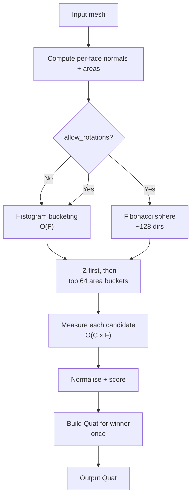
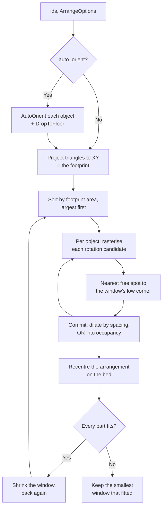

# Orient — Auto-Orient and Arrange

This module answers one question:

> What object orientation and bed placement should be used before slicing?

It computes print-friendly rotations (low overhang, high contact, low height)
and, for multi-object scenes, packs footprints on the bed without overlap.

---

## Why it exists

Orientation and placement are part of slicing correctness, not just UI polish.
If these decisions drift across entry points, preview and final G-code can
disagree. Keeping orientation and arrange behavior documented in one module
keeps CLI, server, and WASM behavior aligned.

---

## The contract

1. `auto_orient(mesh, opts)` returns one best-fit quaternion for a single mesh.
2. `SceneOp::AutoOrient` applies that orientation to one scene object and recenters it.
3. `SceneOp::ArrangeOnBed` optionally auto-orients multiple objects, packs them, and centers the arrangement.

User-facing entry points:

| Function / Op | Purpose |
|---|---|
| `auto_orient(mesh, opts) → Quat` | Best rotation for **one** object. |
| `auto_orient_in(mesh, opts, bed) → Quat` | Same, rejecting orientations too tall for the machine. |
| `SceneOp::AutoOrient { id, options }` | Orient one scene object and center it on the bed. |
| `SceneOp::ArrangeOnBed { ids, options }` | Orient **and** arrange multiple objects; no overlap. |

---

## `auto_orient` — Single-object orientation

### Why this phase exists

FDM prints favor three properties:
- A **large flat face on the bed** (maximises first-layer adhesion, gives the
  part something to stand on, and removes the need for supports under it).
- **Minimal overhangs** (faces tilted more than ~45° past horizontal require
  support material and leave surface marks when it is removed).
- A **short print height** as a tiebreaker (less time, less wobble on tall
  prints).

The first is the default answer and the second is what overrides it: put the
biggest practical face on the plate *unless* doing so makes the print hard.

### Contact means touching

The one rule the rest of this section defends: **a face counts as bed contact
only when it lies within one first layer of the bottom plane.**

The obvious shortcut — treat every downward-facing face as contact, and
subtract that area from the overhang penalty — reads an overhang test fixture
(a stack of flat undersides, none of them touching anything) as *simultaneously*
high-contact and low-overhang. Tipping such a model onto a corner then scores
better than standing it on its base, and the same reasoning laid a filament
caddy on a 16 mm² edge at four times its authored height. Both are real
measurements from the corpus, and both are what the contact band fixes.

### Algorithm overview



#### Step 1: Candidate generation (`candidates.rs`)

All face normals are snapped to a coarse ≈6° grid and their areas are
accumulated per bucket.  The top 64 buckets (by total area) become candidates.

**Why histograms instead of coplanar groups?**
`compute_coplanar_groups` was O(F log F) and emitted one candidate per
triangulated patch — producing hundreds of near-identical directions for any
slightly-curved hull (e.g. a Benchy's rounded bow).  The histogram collapses
all near-duplicate normals into a single representative direction in O(F), then
only scores the top 64 — roughly a **40× speedup** on a 200K-face mesh.

`NEG_Z` leads the list, so the orientation the model arrived in wins every tie
(see `STAY_PUT_BONUS` below) rather than being needlessly rotated.

If `allow_rotations = true`, ~128 uniformly-distributed directions from a
Fibonacci sphere are added.  Use this for organic shapes (figurines, animals)
that have no prominent flat regions.

#### Step 2: Measurement (`score.rs`)

One pass over the faces per candidate direction `c` yields four numbers.  A
point `v` sits at printed height `−dot(c, v)`, and a normal `n` ends up with
vertical component `rz = −dot(c, n)`:

| Quantity | How |
|---|---|
| `contact_area` | Area of faces within `CONTACT_ANGLE_DEG` of straight down **whose highest vertex is within `BED_CONTACT_BAND_MM` of the bottom plane**. |
| `overhang_area` | Area of the remaining downward faces, each weighted by severity — `0` at `overhang_threshold_deg`, `1` for a flat ceiling. |
| `footprint_area` | `½ · Σ aᵢ·\|rzᵢ\|` — exactly the model's shadow, because every vertical ray leaves a closed surface as often as it enters. |
| `height` | `max(−dot(c, v)) − min(−dot(c, v))` over all vertices. |

The key optimisation: `rz = −dot(c, n)` replaces `(q * n).z` where
`q = Quat::from_rotation_arc(c, −Z)`.  This is mathematically identical but
avoids a quaternion construction + multiplication per face — a dot product per
face instead.  **Severity weighting is not cosmetic**: counting overhangs as a
plain yes/no makes a wall of steep faces look no worse than a wall of 46° ones,
which on the overhang-test fixture alone was enough to invert the ranking.

#### Step 3: Scoring

Every term is dimensionless and lives in `0..1`, so the weights are directly
comparable and a model's size cannot change the ranking:

```
score = OVERHANG_W × overhang_area / total_area      (penalty)
      − CONTACT_W  × contact_area / best_contact     (reward)
      − COVERAGE_W × contact_area / footprint_area   (reward)
      + HEIGHT_W   × height / tallest_candidate      (tiebreaker)
```

Lower is better.

- **Contact is normalised against the best candidate**, not against the model's
  surface area: the question being asked is which of *these* poses puts the most
  on the plate, and the answer must not depend on how big the model is.
- **Coverage** (`contact / footprint`) separates a wide flat base from a wide
  model balanced on a small pad — the tipping risk a contact area alone misses.
- `OVERHANG_W` is set so that roughly a fifth of the surface hanging in the air
  overrides a perfect bed face.  That ratio *is* the "unless it is unprintable"
  half of the contract; tune it here.
- `STAY_PUT_BONUS` gives index 0 (the mesh's own `−Z`) a small edge, so
  floating-point noise between two equivalent poses cannot spin a model its
  author already placed correctly.

#### Step 4: Result

`Quat::from_rotation_arc(best_candidate, −Z)` is built **exactly once** for the
winner.  An optional Z-rotation (`preferred_z_rotation_deg`) is then composed
in — useful for CoreXY printers that want seam lines at 45°.

**Where that angle comes from.**  It is a property of the *machine*, so callers
read it off the printer rather than asking per plate:
`PrinterProfile::preferred_orientation_deg` (see
[`PrinterProfile::orient_options`](../profiles/printer.rs)) on the profile side,
and `MachineConfig::preferred_print_rotation_deg` for the CLI.  Because it is
composed inside `auto_orient`, it only takes effect when auto-orient actually
runs — an arrange with `auto_orient: false` leaves every pose exactly as it was.

### Build volume

`auto_orient_in(mesh, options, Some(bed))` additionally ranks any orientation
taller than `bed.height` behind every orientation that fits — the one print
parameter that makes a pose *inherently* unprintable rather than merely awkward.
Both scene ops pass the scene's bed, so this is the path the UI and the server
take; plain `auto_orient` is the bed-less shorthand.  If nothing fits, the
least-bad candidate still wins, because returning an arbitrary pose would be
worse than returning a too-tall one the caller can warn about.

---

## `ArrangeOnBed` — Multi-object packing

### Why this phase exists

For multi-object jobs, the system must ensure that objects are:
1. Oriented optimally for printing.
2. Placed on the bed without overlap.
3. Centered as a group for predictable inspection and slicing.

`SceneOp::AutoOrient` operates on a single object and always centers it at the
bed origin. Applying it to N objects in sequence would stack them all on top of
each other.  `ArrangeOnBed` solves the whole-group placement problem.

### Algorithm overview (`pack.rs`)

The one rule this section defends: **packing reasons about the object's own
outline, never about the box around it.** A bounding box is a bad description
of a printed part — an L-bracket, a bracket arm, anything turned 45° is mostly
air inside its box, and a box-packer leaves that air unusable. Two such parts
can sit side by side without touching, and that arrangement is exactly the one
that fits a plate no box-packer can fill.



#### The plate is a bitmap

The footprint is rasterised into a bitmask over a grid of the bed
(`cell_size` — 512 cells across the longest axis, floored at 0.4 mm).
Everything after that is bitwise, which is what makes trying every position
affordable:

1. **The bed *is* the occupancy map.** Every cell not fully on the plate starts
   occupied, so "does it fit on the bed" and "does it hit another part" are one
   `AND`. A circular bed needs no special case and no inscribed square.
2. **Largest first**, so the parts with the fewest choices choose first.
3. **Every rotation, every position.** Candidate positions are visited in rings
   outwards from the ideal cell, and the search stops once the next ring cannot
   beat the best hit so far — which makes "nearest" exact rather than
   first-fit.
4. **Spacing is applied at commit time**, by dilating the placed mask with a
   disc of `spacing_mm` before OR-ing it in. The next part is tested with its
   *true* outline, so the gap is measured between outlines, the honest way.

Rasterisation is **conservative**: a cell is occupied if a triangle touches it
at all, and a bed cell is printable only if the whole cell is on the plate.
Parts can end up up to one cell further apart than asked — never closer, and
never off the plate.

#### Why the corner, then a recentre

Packing towards the bed centre sounds right and packs badly: the first big part
lands squarely on the space every later part needs. Parts are nested into the
plate's low corner instead, and the finished arrangement is moved back to the
middle — one shift for the whole group, shortened a cell at a time until every
part is still on the plate. On a rectangular bed the full shift always
survives; on a round one that check is the difference between a centred plate
and parts pushed over the rim.

#### Why a shrinking window

Filling a corner is dense, but on a light plate it is the wrong shape: the
parts run along the first row and step up in a staircase, and the nozzle tours
that whole spread on every layer. So the plate is packed inside a **window** —
the plate's own outline shrunk about its centre — and a binary search finds the
smallest window that still takes every part. A handful of parts comes out as
one compact block in the middle; a full plate needs the whole window and is
packed exactly as densely as before. The search starts at the parts' combined
area, so it never tries a window that obviously cannot work, and it keeps only
runs where every part fitted, so a wrong guess costs a slightly larger block,
never a lost part.

#### Rotation

`rotation_step_deg` defaults to 90°, which is free: a quarter turn cannot undo
an auto-orient result, and it preserves a printer's preferred Z-rotation — a
CoreXY machine asking for 45° still gets a diagonal part afterwards. Finer
steps nest tighter at the cost of turning parts off the angle the user chose;
`0` keeps every pose exactly as it arrived.

**Spacing** between outlines defaults to 2 mm (`ArrangeOptions::spacing_mm`).

Objects that fit nowhere are **parked in a column beside the plate**, never
dropped and never overlapped onto a part that did fit, so the caller can warn
about a plate that is too full.

### Undo

`ArrangeOnBed`'s inverse is `BatchSetTransform` — a single op that atomically
restores every affected object to its pre-arrange transform.  This keeps the
undo history clean: one `Ctrl-Z` undoes the entire arrange, not one object at a
time.

---

## Options reference

### `AutoOrientOptions`

| Field | Default | Meaning |
|---|---|---|
| `allow_rotations` | `false` | Add Fibonacci-sphere candidates (organic shapes). |
| `preferred_z_rotation_deg` | `0.0` | Extra Z-rotation after orienting (e.g. 45° for CoreXY). |
| `overhang_threshold_deg` | `45.0` | Overhang angle that triggers a penalty.  Same convention as the process's `support_threshold_angle`, and wants to agree with it. |

### `ArrangeOptions`

| Field | Default | Meaning |
|---|---|---|
| `spacing_mm` | `2.0` | Gap between objects on the bed (mm). |
| `auto_orient` | `true` | Orient each object before packing. |
| `orient_options` | (defaults) | Passed through to `auto_orient` per object. |
| `rotation_step_deg` | `90.0` | Rotation step the packer may turn an object by. `0` keeps every pose. |

---

## TypeScript / WASM usage

```ts
// Arrange all objects on the bed (orient + pack + center):
sceneEngine.arrangeOnBed(objectIds, {
  spacing_mm: 5,
  auto_orient: true,
  orient_options: { allow_rotations: false },
});

// Orient a single object (no packing):
sceneEngine.autoOrientObject(id, { allow_rotations: true });

// Low-level op dispatch (same as above):
sceneEngine.apply({
  op: 'arrange_on_bed',
  args: {
    ids: [id1, id2, id3],
    options: { spacing_mm: 3 },
  },
});
```

---

## Non-goals

- **Three-dimensional packing.**  The footprint is a shadow: two parts never
  share plate area, even where one could pass over the other's low shoulder.
  A gantry sweeps the whole column above a part, so trading that away for
  density would buy collisions.
- **Optimal bin-packing.**  Every part is placed once, in size order, and never
  reconsidered.  Searching permutations (or annealing the result) would pack a
  little tighter for a cost no arrange button can afford.
- **Persistence.**  Scene state is ephemeral per WS connection / WASM instance.
  `ArrangeOnBed` does not save its results to a database.

---

## See also

- [`src/orient/mod.rs`](mod.rs) — `auto_orient` entry point + scoring constants
- [`src/orient/candidates.rs`](candidates.rs) — histogram bucketing + Fibonacci sphere
- [`src/orient/score.rs`](score.rs) — per-candidate contact / overhang / footprint / height
- [`src/orient/geometry.rs`](geometry.rs) — face normal helpers
- [`src/orient/pack.rs`](pack.rs) — outline rasterisation and the nesting search
- [`src/orient/types.rs`](types.rs) — `AutoOrientOptions`, `ArrangeOptions`
- [`src/scene/ops.rs`](../scene/ops.rs) — `SceneOp::AutoOrient`, `SceneOp::ArrangeOnBed`
- [`tests/auto_orient.rs`](../../tests/auto_orient.rs) — corpus pins for the contact rule
- [../scene/README.md](../scene/README.md) — the scene SSOT contract
