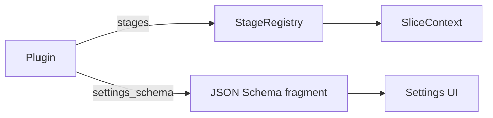
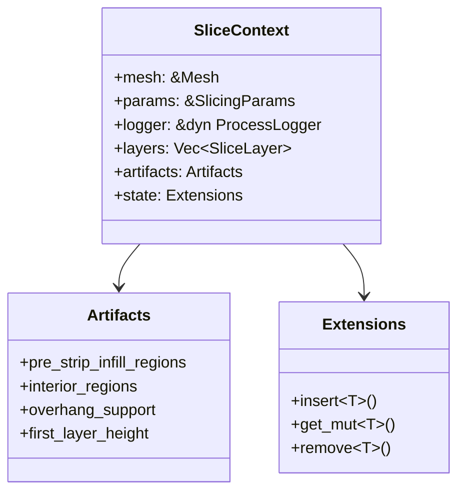

# `plugin` — one hook interface, used by the engine on itself first

This module exists so behaviour can be added to the slicer without editing the
pipeline. The single rule everything else defends:

> **A plugin extends the engine through the same interface we use ourselves.**
> Our own optional features are plugins. The external loader, when it arrives,
> is a plugin. If a capability is only reachable by editing `process_mesh`, the
> API has failed.

The design and the research behind it are in [PLUGINS.md](../PLUGINS.md). This
document is about the code that now implements its first milestone.

## Why a compile-time trait, and not a script host

Three constraints ruled out most of the obvious answers, and they are worth
restating because they are what makes the shape here non-arbitrary.

**Deep access matters more than convenience.** A plugin that only sees G-code
text can reorder moves but can never touch geometry. The interesting extensions
— non-planar overhangs, custom infill, supports — need the real `SliceLayer`,
the real `clipper2::Paths`, the real `Mesh`. Marshalling those across a
boundary either loses fidelity or pays for it per layer, per slice.

**The engine ships to five runtimes.** CLI, WebSocket server, browser WASM,
Tauri desktop and iOS all drive the same core. Anything needing `dlopen` or a
JIT is unavailable on the last two — so a compile-time plugin is the only kind
that runs *everywhere*, which is precisely what our own optional features need.

**We wanted it for ourselves first.** The immediate goal is a home for
optional, opinionated features that should not bloat the core.

## The contract

A plugin is a `Send + Sync` value implementing [`Plugin`](mod.rs). Two hooks
exist today; every one of them is defaulted, so a plugin implements only what
it uses — and a new hook family can be added later without breaking any plugin
already written.

| Hook | Method | Answers |
| --- | --- | --- |
| Stage | `stages()` | *where does my work run?* |
| Settings | `settings_schema()` | *what can the user configure?* |

The registry and move-filter families the design names arrive with the
milestones that give them something to attach to — a strategy registry, and a
G-code move IR. Neither changes the signatures above.

### Stages: the pipeline is a list, not a function

[`stages.rs`](stage.rs) reifies each pipeline step as a [`Stage`] with a
[`StageId`]. A registration names an existing stage and says which side of it
the new work goes:

| Registration | Effect |
| --- | --- |
| `before(target, stage)` | runs immediately before `target` |
| `after(target, stage)` | runs immediately after `target` |
| `wrap(target, wrapper)` | runs *instead of* `target`, and decides whether to call it |

This is what makes the API expand as the engine expands: hooks are keyed by
stage id, and stages are data, so **every stage the pipeline grows creates two
new hook points for free**. The core list lives in
[`core/stages.rs`](../core/stages.rs) and its ids are the
[`logging::phases`](../logging.rs) constants — the name a plugin targets and
the name the phase timings report are one string, so there is no second catalog
to drift.

A registration naming a stage that does not exist is **rejected and logged**,
never appended. A plugin targeting a stage the engine has since renamed should
lose its own feature, not run at some arbitrary other point in the pipeline —
and not take the user's print down with it either.

### The layer model is not flat

A hook is only as expressive as the type it is handed. `SliceLayer` carries
per-vertex **Z offsets** (`path_vertex_z`) alongside its per-vertex widths, so a
bead can rise and fall *within* a layer — which is what a feature like a wavy
overhang is, and what no hook placement could have supplied on its own.

`path_data` is its sibling: per-path scratch space keyed by plugin id, so a
plugin can carry a conclusion from one stage to a later one and two plugins
annotating the same path cannot clobber each other.

Both use the empty-vector sentinel, so an ordinary flat print allocates neither.

**Rebuild a layer's paths with [`SliceLayer::rebuild_paths`](../core/types.rs),
never by hand.** It replaces the paths and every per-path array together, and
re-walks per-vertex arrays with the same rotation or reversal as the vertices
they describe. That is the failure this API exists to remove: an array left
behind shifts somebody's tags onto the wrong path, silently.

### `SliceContext`: where inter-stage state lives

Everything a stage may read or write is on [`SliceContext`](context.rs). Before
this module those values were **local variables** inside `process_mesh`, which
is the concrete reason an inserted stage was impossible: there was nowhere to
insert one, and nothing for an inserted one to read.

`Artifacts` holds engine-owned geometry passed between stages. Several fields
are only populated when the feature that produces them is switched on, so **a
stage reading one must cope with absence** rather than assume its producer ran.

`Extensions` is a type-keyed store for state a *plugin* owns, so the engine
does not have to grow a field every time a plugin needs to remember something.

### Settings: the UI is free

The settings form is generated entirely from JSON Schema, so a plugin that
emits a fragment gets its whole settings UI with no Angular code at all.
[`schema.rs`](schema.rs) grafts each fragment onto the generated
`SlicingParams` schema at `properties.plugins.properties.<id>`, and adds two
things the plugin does not write itself:

- the reserved `enabled` toggle, titled with the plugin's own name; and
- an `x-relevant-when` gate on every other field pointing at that toggle.

So "hide my settings until I'm switched on" falls out of machinery that already
existed, and every experiment behaves the same way.

Settings are **namespaced** (`params.plugins["<id>"]`) rather than flattened
into the ~100 core keys. That buys three things at once: no collision with a
core setting, obvious ownership when reading a saved profile, and — because
`cache_fingerprint` serializes the whole struct — plugin state in the G-code
cache key for free. Without the last one, toggling a plugin hands the user back
a stale G-code file, which is a correctness bug rather than an ergonomic one.

The map is skipped when empty, so a build with no configured plugin
fingerprints exactly as it did before this module existed.

## The one invariant

**With no plugin active, output is byte-identical.** The QA baselines
([`tests/slicing_quality.rs`](../../tests/slicing_quality.rs)) are the gate,
and [`tests/plugin_hooks.rs`](../../tests/plugin_hooks.rs) additionally pins
that occupying a hook point changes nothing by itself — a hook that perturbed
the pipeline merely by existing would make every experiment a silent output
change and the baselines meaningless.

## Trust

A compile-time plugin has **the same trust level as the engine**: it is
reviewed like core code and is not sandboxed, because it ships with the same
privileges in every build we distribute — including WASM and iOS, where there
is no loader boundary at all. Isolation is what the later external tier is for.
The security model, and what a promotion from that tier into this one has to
clear, is in [PLUGINS.md](../PLUGINS.md).

## What this module deliberately does *not* do

- **Sandbox anything.** See above; Tier 1 is trusted by construction.
- **Load anything at runtime.** No `dlopen`, no script host, no stable ABI —
  Rust has none, and flattening `SliceLayer` and `Paths` through a C boundary
  would discard the deep access that motivates the whole design.
- **Run post-processing over finished G-code.** Explicitly rejected: text only,
  no geometry, no settings integration, no UI.
- **Replace the existing extension points.** `GcodeDialect` and the wall and
  infill strategies keep working exactly as they did.
- **Reorder stages arbitrarily.** A registration attaches to a named stage; it
  cannot rewrite the sequence. The order in
  [`core/stages.rs`](../core/stages.rs) is load-bearing and its comments record
  why each step sits where it does.

## See also

- [PLUGINS.md](../PLUGINS.md) — the design, the research, the milestones, the security model
- [core/stages.rs](../core/stages.rs) — the core pipeline as a stage list
- [core/pipeline.rs](../core/pipeline.rs) — the entry points that build a run
- [builtin/debug_capture.rs](builtin/debug_capture.rs) — the first plugin, and what it replaced
- [settings/params.rs](../settings/params.rs) — `SlicingParams::plugins`, `cache_fingerprint`
- [ui/src/app/schema-form/](../../ui/src/app/schema-form/) — the schema-driven form the settings hook feeds
