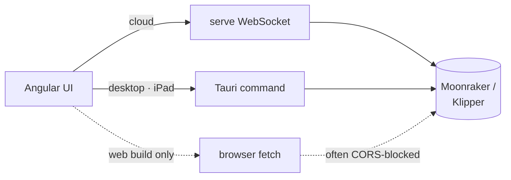
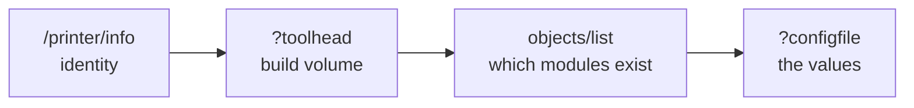

# Printer — The Slicer → Printer Link

This module is how a finished `.gcode` file reaches a real machine, how the app
answers "is that printer awake?", and how a printer describes itself well enough
that the user barely has to set one up.

It is split across that seam, because the two halves have different reach:

> **Probe and upload from the process that has the LAN, never from the browser —
> but interpret what comes back in exactly one place, everywhere.**

| File | Owns | Compiles for |
| --- | --- | --- |
| [`transport.rs`](transport.rs) | The HTTP: probing, status, upload | native only |
| [`klipper.rs`](klipper.rs) | Turning Moonraker's JSON into a detection | everywhere, wasm included |
| [`detection.rs`](detection.rs) | `PrinterDetection` and its questions | everywhere |

The pure half is what lets the web build reach the same conclusions about a
printer as the server and the desktop app. It fetches with its own `fetch` and
then calls straight into `klipper` through wasm, rather than keeping a second
copy of these rules in TypeScript.

## Why not just `fetch` from the UI

Moonraker (Klipper) ships no permissive `Access-Control-*` headers, so a direct
browser request from the Angular app fails for most users. Routing the request
through the native process sidesteps CORS entirely — the request never leaves
the same trust boundary as the printer's own network.

Both native runtimes reach the same three functions in-process:

| Function                             | Cloud (WS message) | Native (Tauri command) |
| ------------------------------------ | ------------------ | ---------------------- |
| [`check_status`](transport.rs)       | `CheckPrinter`     | `printer_check`        |
| [`detect_printer`](transport.rs)     | `DetectPrinter`    | `printer_detect`       |
| [`send_gcode`](transport.rs)         | `SendToPrinter`    | `printer_send`         |

**The result types are serialized to the same field shape** as the matching WS
payloads (minus the envelope), so the UI reuses one set of `fromServer*` mappers
for both transports:

| Native type            | WS payload           |
| ---------------------- | -------------------- |
| `PrinterStatusReport`  | `PrinterStatus`      |
| `PrinterDetection`     | `PrinterDetected`    |
| `SendOutcome`          | `PrinterSendResult`  |

Keep them in step — a field added to one without the other splits the UI's
single mapper in two.

## The contract

- **Never gate the transport on `environment.runtimeMode` alone.** The desktop
  build ships the *cloud* environment and only becomes native by detecting Tauri
  at runtime, so a build-time constant sends the desktop app down the CORS-prone
  browser path. That is the specific bug this contract exists to prevent;
  [`printer-connection.ts`](../../ui/src/app/services/printer-connection.ts)
  picks at runtime — cloud WS when connected, Tauri commands when
  `isTauriHost()`, browser `fetch` only in `web`.
- **The web fallback distinguishes *unreachable* from *reachable-but-blocked*.**
  A `no-cors` follow-up probe separates the two, and the UI surfaces a distinct
  `cors` status rather than a misleading green or offline dot.
- **Never put `reqwest` in `profiles`.** That module compiles to wasm; the
  transport stays here, behind the native `cfg`.
- **An unimplemented printer kind reports `unsupported`, not an error.** Only
  `PrinterConnectionKind::Moonraker` is implemented today, and an honest status
  beats a misleading dot.

## Reading a printer out of its own config

Moonraker will hand over a parsed copy of the user's `printer.cfg`, and nearly
everything a setup wizard would ask for is in it. One rule governs what we do
with that:

> **Facts apply, preferences ask.**

A value the config *states* — build volume, nozzle, filament diameter, the
machine's own velocity and acceleration limits, whether object exclusion or
firmware retraction is configured — is applied without asking, and recorded as a
`DetectionFinding` naming the section it came from so the wizard can show its
work. A value that is a *choice* — what a `[fan_generic]` is for, whether to
re-probe the bed every print — becomes a `DetectionQuestion`.

Every question carries a `suggested` answer, and the wizard applies all of them
up front. **No question ever blocks a profile**: the user can add the printer
from the first screen and the questions only refine it. A question the config
answered outright is marked `certain` — still reported, because its *effect*
(the start G-code a macro convention implies) is UI-owned copy the engine has no
business carrying, but never put to the user.

Derived values ride in a sparse `params` bag rather than a field per reading.
Adding a field would mean editing this struct, the WS message, the TypeScript
model and the wizard — four places to learn one number.

**Only state the machine's ceiling once.** `max_velocity` already caps every
move, in the firmware and in our own time estimate, so no role speed is derived
from it; doing that would restate the cap and override the user's own profile.

### Probing in stages, cheapest first

`configfile` is a copy of the whole `printer.cfg` and runs to megabytes on a
macro-heavy setup. So it is asked for last, after the two cheap calls that carry
the load:

Only the first is required. A host that times out on `configfile` still yields
the build volume, and still settles the start-macro convention — because the
object list alone says which macros are defined.

### Vendor is the machine's maker, never the firmware

Klipper runs on hundreds of printers. Writing it into the vendor field makes
every detected profile claim the same manufacturer, so an unrecognised machine
leaves vendor and model empty and the user names it. Machines with a distinctive
configuration are fingerprinted on their levelling hardware and build volume —
the two things that separate otherwise identical CoreXY designs — and offered as
a question to confirm, never assumed.

## The data model lives elsewhere

[`PrinterConnection`](../profiles/printer.rs) — `kind`, `host` (may embed a
scheme or `:port`), `port`, `api_key`, plus the legacy UI-owned `connected`
flag. **That flag is no longer trusted for the status dot**, which reflects the
live probe instead:

| Dot     | Meaning                                    |
| ------- | ------------------------------------------ |
| neutral | local or unknown                           |
| green   | online                                     |
| amber   | checking · cors · error · unsupported      |
| red     | offline                                    |

## What this module deliberately does _not_ do

- **No slicing.** It moves finished bytes; geometry belongs in `core::`.
- **No printer state machine.** It reports point-in-time snapshots. Job
  orchestration and queueing are the printer firmware's business.
- **No credential storage.** `api_key` lives on the profile, and the profile
  exporter strips it — see [profiles](../profiles/README.md).
- **No G-code copy.** Detection reports *which* start macros a printer defines;
  the commands that implies are templates in
  [`gcode-templates.ts`](../../ui/src/app/models/gcode-templates.ts), and the
  wording of every question is in
  [`detection-questions.ts`](../../ui/src/app/components/profiles/detection-questions.ts).
- **No profile writing.** It describes a printer; the wizard decides what to
  build from that description.
- **No browser transport.** The wasm build has none by construction; the UI owns
  that fallback.

## See also

- [transport.rs](transport.rs) — `check_status`, `detect_printer`, `send_gcode`
- [klipper.rs](klipper.rs) — everything read off a `printer.cfg`
- [detection.rs](detection.rs) — `PrinterDetection`, findings and questions
- [../../tools/mock-printer/](../../tools/mock-printer/README.md) — a fake
  Moonraker for exercising all of it
- [../profiles/printer.rs](../profiles/printer.rs) — `PrinterConnection`
- [../server/README.md](../server/README.md) — the WS messages that reach here
- [../../ui-desktop/README.md](../../ui-desktop/README.md) — the Tauri commands,
  and why iOS keeps this module while dropping `cli` / `server` / `db`
