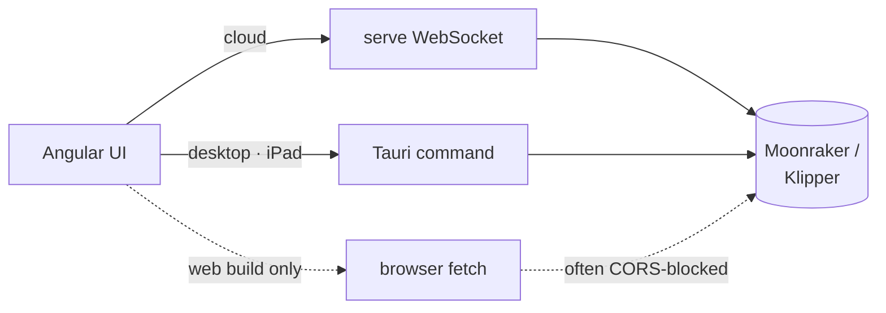

# Printer — The Slicer → Printer Link

This module is how a finished `.gcode` file reaches a real machine, and how the
app answers "is that printer awake?". It exists as a **native-only** module
(`cfg(not(target_arch = "wasm32"))`) for one reason, and every decision below
follows from it:

> **Probe and upload from the process that has the LAN, never from the browser.**

## Why not just `fetch` from the UI

Moonraker (Klipper) ships no permissive `Access-Control-*` headers, so a direct
browser request from the Angular app fails for most users. Routing the request
through the native process sidesteps CORS entirely — the request never leaves
the same trust boundary as the printer's own network.

Both native runtimes reach the same three functions in-process:

| Function                        | Cloud (WS message) | Native (Tauri command) |
| ------------------------------- | ------------------ | ---------------------- |
| [`check_status`](mod.rs)        | `CheckPrinter`     | `printer_check`        |
| [`detect_printer`](mod.rs)      | `DetectPrinter`    | `printer_detect`       |
| [`send_gcode`](mod.rs)          | `SendToPrinter`    | `printer_send`         |

**The result types are serialized to the same field shape** as the matching WS
payloads (minus the envelope), so the UI reuses one set of `fromServer*` mappers
for both transports:

| Native type            | WS payload           |
| ---------------------- | -------------------- |
| `PrinterStatusReport`  | `PrinterStatus`      |
| `PrinterDetection`     | `PrinterDetected`    |
| `SendOutcome`          | `PrinterSendResult`  |

Keep them in step — a field added to one without the other splits the UI's
single mapper in two.

## The contract

- **Never gate the transport on `environment.runtimeMode` alone.** The desktop
  build ships the *cloud* environment and only becomes native by detecting Tauri
  at runtime, so a build-time constant sends the desktop app down the CORS-prone
  browser path. That is the specific bug this contract exists to prevent;
  [`printer-connection.ts`](../../ui/src/app/services/printer-connection.ts)
  picks at runtime — cloud WS when connected, Tauri commands when
  `isTauriHost()`, browser `fetch` only in `web`.
- **The web fallback distinguishes *unreachable* from *reachable-but-blocked*.**
  A `no-cors` follow-up probe separates the two, and the UI surfaces a distinct
  `cors` status rather than a misleading green or offline dot.
- **Never put `reqwest` in `profiles`.** That module compiles to wasm; the
  transport stays here, behind the native `cfg`.
- **An unimplemented printer kind reports `unsupported`, not an error.** Only
  `PrinterConnectionKind::Moonraker` is implemented today, and an honest status
  beats a misleading dot.

## The data model lives elsewhere

[`PrinterConnection`](../profiles/printer.rs) — `kind`, `host` (may embed a
scheme or `:port`), `port`, `api_key`, plus the legacy UI-owned `connected`
flag. **That flag is no longer trusted for the status dot**, which reflects the
live probe instead:

| Dot     | Meaning                                    |
| ------- | ------------------------------------------ |
| neutral | local or unknown                           |
| green   | online                                     |
| amber   | checking · cors · error · unsupported      |
| red     | offline                                    |

## What this module deliberately does _not_ do

- **No slicing.** It moves finished bytes; geometry belongs in `core::`.
- **No printer state machine.** It reports point-in-time snapshots. Job
  orchestration and queueing are the printer firmware's business.
- **No credential storage.** `api_key` lives on the profile, and the profile
  exporter strips it — see [profiles](../profiles/README.md).
- **No browser transport.** The wasm build has none by construction; the UI owns
  that fallback.

## See also

- [mod.rs](mod.rs) — `check_status`, `detect_printer`, `send_gcode`
- [../profiles/printer.rs](../profiles/printer.rs) — `PrinterConnection`
- [../server/README.md](../server/README.md) — the WS messages that reach here
- [../../ui-desktop/README.md](../../ui-desktop/README.md) — the Tauri commands,
  and why iOS keeps this module while dropping `cli` / `server` / `db`
