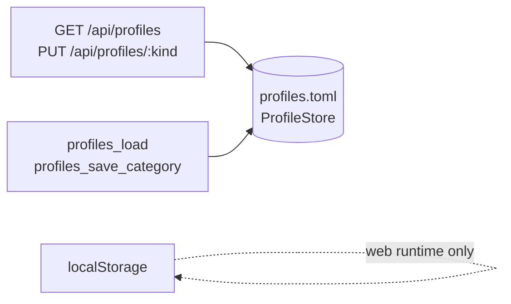

# Profiles — The User's Own Printers, Filaments and Processes

This module owns the **profile library**: the printers, filaments, process
profiles and label vocabulary a user has created. It exists because of one
failure it must prevent:

> **A cloud user who clears their browser must not lose every printer they
> own.** Profile *instances* live where the engine runs, not only in
> `localStorage`.

[`ProfileStore`](store.rs) is the engine-side home. `profiles.toml` sits beside
`slicer.toml` in [`config_dir()`](../config/io.rs).

## TOML at rest, JSON on the wire

The library is TOML on disk and JSON in transit. The profile structs are
JSON-native — `#[serde(flatten)]` metadata plus a dynamic `serde_json::Value`
`params` bag — which the `toml` serializer cannot encode directly, so the
conversion goes through `serde_json::Value` with nulls dropped.

**Do not try to `toml::to_string` a profile struct.** Call
[`toml_bridge::render_library_toml`](toml_bridge.rs) — the one renderer behind
both `ProfileStore::save` and the exporter.

## The contract

- **The library *shape* is target-independent.** `ProfileLibrary`, `Label` and
  `ProfileKind` live in [library.rs](library.rs) so wasm — which has no
  filesystem and therefore no `store` — can still use them. Only `ProfileStore`
  is `cfg(not(target_arch = "wasm32"))`.
- **Profiles never touch SQLite.** The database is history and the G-code cache,
  nothing else.
- **Sync is whole-category, last-writer-wins.** The unit is a `ProfileKind`
  (`Printers` · `Filaments` · `Processes` · `Labels`); the UI sends the full
  array on any add, edit or delete, mirroring the whole-blob `localStorage`
  write it replaced. Single-tenant: one library per engine instance, no auth.
- **`Label` is snake-case aligned** (`{id, name, color, tone}`) across
  [store.rs](store.rs) and the UI's `label.model.ts`. The UI profile models *are*
  the engine's generated types, with no mapping layer, so stored items serialize
  back byte-compatibly.
- **The UI's "print profiles" are the engine's "processes".** The store key is
  `profiles.printProfiles`; the wire token is `processes`.

## Three transports, one store

| Runtime | Transport                                                    |
| ------- | ------------------------------------------------------------ |
| Cloud   | REST — [`server/handlers.rs`](../server/handlers.rs)          |
| Native  | Tauri `profiles_load` / `profiles_save_category`              |
| Web     | `localStorage` only — the browser *is* the engine             |

- **Change fan-out over WS, cloud only.** A successful `PUT /api/profiles/:kind`
  broadcasts `ServerMessage::ProfilesChanged { kind }` to every open WebSocket
  session — via a `tokio::broadcast` channel on `AppState` — so a second tab
  refetches instead of showing stale profiles. `ProfileSync` maps the token to
  its store and calls `reload()`. GET and PUT stay REST; only the *nudge* is WS.
  It is inert in web and native, which have no second client.
- **`loadLibrary()` is memoised** in the UI. The four stores hydrate in their
  constructors, so one in-flight request is shared rather than fetching the whole
  library once per category. Invalidated on `saveCategory`; force-refreshed via
  `reloadLibrary()`.
- **On first run against an empty engine store the local library is pushed up.**
  A migration, never a clobber.
- **`localStorage` stays a fast cache in every mode.** Engine-backed runtimes
  also hydrate from and write through to the store.

The settings-sidebar notice mirrors exactly this: native = "saved on this
device", cloud = "saved on the slicer", web = "kept in this browser only".

## Export — written once, never revisited

[export.rs](export.rs) renders the library for download in two shapes: a
**bundle** (`slicer-profiles.zip` — one TOML per profile, plus `labels.toml`,
`manifest.toml` and a `README.md`) and a **single** `profiles.toml` identical to
what the store writes. Both come from the same serialization.

- **Never name a field — or a category.** The exporter walks the *serialized
  value* and treats every top-level array as a category. A new profile setting,
  or a whole new category on `ProfileLibrary`, exports with **zero** changes
  here. That is the point of the module; do not add per-feature branches. The
  only category-specific rule is one line (`splits_per_item`): labels are a flat
  vocabulary and stay in one file.
- **Every file is an array of tables** (`[[printers]]`), and per-item files are
  ordinal-prefixed (`printers/01-voron-24.toml`). Concatenating a bundle in name
  order therefore reconstructs a valid `profiles.toml` **with the original order
  intact** — the contract a future importer relies on, pinned by
  `concatenating_a_bundle_reconstructs_the_library`.
- **Deterministic.** Fixed zip timestamps, so the same library exports
  byte-identically and the artifact can be diffed or version-controlled.
- **Credentials are stripped.** An export is built to be *handed over* — a git
  repo, AirDrop, mail — so `redact_secrets` removes any field named in
  `SECRET_FIELDS` (`api_key`, `token`, …) anywhere in the tree, in **both**
  shapes. Matched by name at the value level, so a credential added later is
  covered for free. The user re-enters keys after restoring.
- **It is faithful to the library *as the engine understands it*** — what
  `ProfileStore::load` produced and what the next save would write — not a
  verbatim copy of the bytes on disk. A *typed* field written by a different
  build is dropped by serde at load, before the exporter sees it (exactly as it
  already is for `GET /api/profiles`). Free-form `params` entries, where new
  slicing settings actually land, always survive. Do not overstate this in
  user-facing copy.

Export has the same three transports: `GET /api/profiles/export?format=`,
Tauri `profiles_export` — both exporting what is *persisted*, i.e. what the CLI
on that machine would read — and wasm `exportProfileLibrary(library, format)`
for the web runtime. The wasm binding exists only in the `web-slicer` build, so
the UI looks it up dynamically rather than importing a symbol the cloud and
native bindings do not declare.

## The UI half

- **[`ProfilePersistence`](../../ui/src/app/services/profiles/profile-persistence.ts)**
  has three adapters — browser, remote-REST, native-invoke — picked by
  `resolveRuntimeMode()`, **not** `environment.runtimeMode` alone, because the
  desktop build ships the `cloud` environment and only becomes `native` by
  detecting Tauri at runtime.
- **[`ProfileExport`](../../ui/src/app/services/profiles/profile-export.ts)**
  picks the export transport and hands the bytes to
  [`FileExport`](../../ui/src/app/services/file-export.ts) — the one place that
  knows the three "save a file" idioms (iOS share sheet, desktop Save-As, browser
  anchor). G-code downloads go through it too; **do not re-implement a download
  in a feature**.
- **`BrowserProfilePersistence` looks the wasm export up dynamically**, since
  `exportProfileLibrary` exists only in the `web-slicer` bindings.

---

## What this module deliberately does _not_ do

- **No networking.** `reqwest` would break the wasm build; outbound printer
  traffic is [`printer`](../printer/README.md)'s job.
- **No per-user identity.** Single-tenant by design.
- **No import.** The bundle is built so a future importer *can* reconstruct the
  library, but nothing reads one back yet.
- **No merge resolution.** Whole-category, last writer wins.

## See also

- [store.rs](store.rs) · [library.rs](library.rs) · [export.rs](export.rs) ·
  [toml_bridge.rs](toml_bridge.rs) · [resolve.rs](resolve.rs)
- [../config/README.md](../config/README.md) — where `config_dir()` points
- [../server/README.md](../server/README.md) — the REST endpoints and the WS nudge
