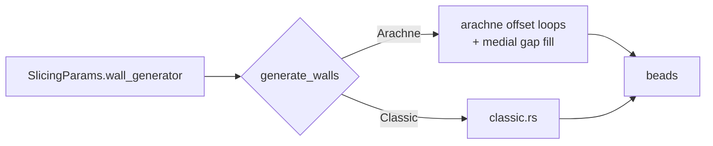

# Walls — Perimeter (Wall) Generation

This module turns each layer's raw mesh cross-section contours into extrusion
**beads** (wall paths with per-path widths). It is the single place the slicing
pipeline calls for walls, and it is **switchable**: the algorithm is chosen per
slice by [`SlicingParams::wall_generator`](../settings/params.rs).

The one rule the rest of the pipeline relies on: **whichever generator runs, it
replaces the layer's `OuterWall` / `InnerWall` contours with beads and preserves
every non-perimeter path (surfaces, infill) in its original order after the
walls.** Everything downstream is therefore generator-agnostic.

---

## Why switchable

The mature slicers (PrusaSlicer, OrcaSlicer, Bambu Studio, CuraEngine) all ship
**two** wall generators and let the user pick:

- **Classic** — fixed-width concentric perimeters plus a thin-wall gap fill.
  Deterministic, fast, dependency-free. Descends from Slic3r's
  `PerimeterGenerator` + `MedialAxis`.
- **Arachne** — variable-width extrusion built on a medial-axis skeletal
  trapezoidation (Kuipers et al. 2020). Beads taper continuously along their
  length with graded bead-count transitions.

This module ships both, selected per slice:

- **`Arachne`** — the **default**. Medial-axis **offset loops** (constant-`d`
  perimeters whose count adapts locally) plus **variable-width medial gap fill**
  of the residual. Each **inner** loop is offset from the *morphologically
  opened* remaining region (`open(region, d)`), so a loop can never trace a
  sub-`2d` neck on top of itself — the coincident-bead seam that reads as
  over-extrusion. Those necks fall through to the variable-width medial gap fill
  instead. Overlap is resolved by geometry, not by post-hoc flow compensation
  (`wall_overlap_compensation` is **off by default**; see
  [flow](../flow/mod.rs)).
- **`Classic`** — fixed-width concentric perimeters plus a thin-wall gap fill.
  Deterministic, fast, dependency-free. Descends from Slic3r's
  `PerimeterGenerator` + `MedialAxis`.



---

## Public API

| Item                             | Purpose                                                                                                                            |
| -------------------------------- | ---------------------------------------------------------------------------------------------------------------------------------- |
| [`generate_walls`](mod.rs)       | Dispatch on `wall_generator`; replace contours with beads for every layer (parallel via rayon on native). Returns [`WallTimings`]. |
| [`generate_walls_debug`](mod.rs) | Sequential debug counterpart; captures intermediate geometry into `DebugGeometry`. Native only.                                    |
| [`WallParams`](types.rs)         | Resolved per-run config (mm-absolute) built from [`SlicingParams`](../settings/params.rs). Shared by every generator.              |
| [`Bead`](types.rs)               | One emitted bead: closed centerline `Path` + extrusion `width_mm` + `is_outer` flag.                                               |
| [`WallTimings`](types.rs)        | CPU-time breakdown (collapse search vs. bead shrinks).                                                                             |

Selecting the generator: set `wall_generator = "arachne"` (default) or
`"classic"` in the settings / config, or via the schema-driven UI dropdown.

---

## Classic generator ([`classic.rs`](classic.rs))

For each closed shell contour produced by [`crate::core::slice_mesh`]:

1. **Normalise input.** A Clipper2 `union(…, FillRule::EvenOdd)` over the raw
   contours resolves arbitrary winding and overlaps into the canonical
   representation (CCW outer rings, CW holes). See invariant #1.
2. **Standard beads.** Place up to `wall_count` full-width beads at centerline
   depths `d/2, 3d/2, …` (`d = nozzle_diameter_mm`) via successive negative
   `inflate`. Each bead has width `d`.
3. **Thin-wall residual.** If the space remaining after the standard beads is
   ≥ `wall_line_width_min × d`, add one variable-width bead at its center
   (clamped to `wall_line_width_max × d`).
4. **Width distribution.** A sub-minimum residual is instead absorbed by the
   innermost `wall_distribution_count` beads, slightly widening them.

The Clipper2 negative `inflate` is the fundamental primitive; one call per bead
gives the centerline path.

---

## Output topology

Both generators emit **centerline paths**, not filled polygons. Each path is a
closed polygon whose vertices are the _center_ of the extrusion bead.

- `OuterWall` paths sit at inward depth `d/2` from the raw mesh contour.
- `InnerWall` paths sit at `3d/2`, `5d/2`, …
- `path_widths[i]` carries the actual extrusion width (the G-code generator uses
  it to compute the correct E values per move).
- A **hole boundary** also receives an `OuterWall`-tagged bead (it is the
  outermost bead of that contour's shrink sequence). Distinguish solid islands
  from holes by signed area, **not** by role:

| `path.signed_area()` | Topology     |
| -------------------- | ------------ |
| Positive (CCW)       | Solid island |
| Negative (CW)        | Hole         |

---

## Pipeline integration

Walls sit between raw slicing and surface/infill generation:

```
slice_mesh()                                  — raw mesh → OuterWall contours per layer
generate_walls()                              — replaces those contours with bead paths
pre_strip_infill_regions snapshot             — taken before wall stripping
apply_single_wall_restrictions()              — strips inner walls from first/top layers
interior_regions computed                     — post-strip, used by surfaces
generate_top_bottom_surfaces_with_interior()  — top/bottom solid infill within interior
add_infill_to_layers()                        — sparse infill = pre_strip region − solid_regions
```

Order matters: [`crate::core::surfaces`](../core/surfaces.rs) runs **after**
walls so [`calculate_interior_region`](../core/infill.rs) sees the correct bead
geometry. See [`AGENTS.md`](../../AGENTS.md) for the full invariant list.

---

## Critical invariants

These have all been hit as bugs. **Read before changing the module.**

### 1. Input must be normalised before offsetting

Raw contours from [`chain_segments`](../core/slicer.rs) have **arbitrary
winding** and may overlap, duplicate, or nest (engraved text, near-degenerate
triangles). Passing them straight to `inflate(-d, …)` produces fragmented,
self-intersecting output — hundreds of micro-loops, or a near-total collapse.
The `union(…, EvenOdd)` in [`classic.rs`](classic.rs) fixes this.

### 2. Degenerate beads must be filtered

Thin slivers survive the negative offset as zero-area stubs.
[`drop_degenerate_beads`](beads.rs) removes any centerline whose area is below
`0.01 × d²`. The collapse-detection branch must test the **raw** shrink result,
not the filtered one.

### 3. Do not normalise wall paths to CCW elsewhere

[`calculate_interior_region`](../core/infill.rs) consumes `OuterWall` paths
directly and **must preserve winding**. Hole beads are legitimately CW; flipping
them makes Clipper2 treat holes as solid and infill fills the void.

### 4. Bead union with `EvenOdd` is wrong

Tightly nested concentric paths under EvenOdd produce alternating in/out bands.
If you ever union the bead set, use `NonZero` — and only after making every
input path CCW.

---

## Non-goals (deliberately not done here)

- **No continuously variable-width _outer_ walls.** Arachne varies the wall
  *count* locally and fills the thin residual with a variable-width medial bead,
  but the main perimeter loops themselves stay constant width `d`. A
  skeletal-trapezoidation *walk* that gives every bead a per-vertex width was
  prototyped (`ArachneWalk`) and removed: it fragmented walls into open runs that
  broke overhang / speed / flow classification for marginal benefit. The
  `wall_transition_threshold` / `wall_transition_length` params exist for it but
  are not consumed.
- **No medial-axis gap fill in Classic.** The thin-wall residual is a single
  offset bead, not a true medial-axis fill (that also needs a Voronoi).
- **No parallel placement path outside this module.** Walls are generated only
  here; do not offset perimeters elsewhere in the pipeline.

---

## Related files

- [src/core/slicer.rs](../core/slicer.rs) — produces the raw contours fed here
- [src/core/walls.rs](../core/walls.rs) — per-island first/top-layer single-wall
  restriction (runs _after_ this module)
- [src/core/infill.rs](../core/infill.rs) — infill boundary derived from
  `OuterWall` centerlines
- [src/gcode/generator.rs](../gcode/generator.rs) — consumes
  `(path, role, width)` triples; variable widths come from `path_widths[i]`
- [src/settings/params.rs](../settings/params.rs) — `SlicingParams`,
  `WallGenerator`
- [AGENTS.md](../../AGENTS.md) — pipeline-wide invariants and Clipper2
  fill-rule guidance
