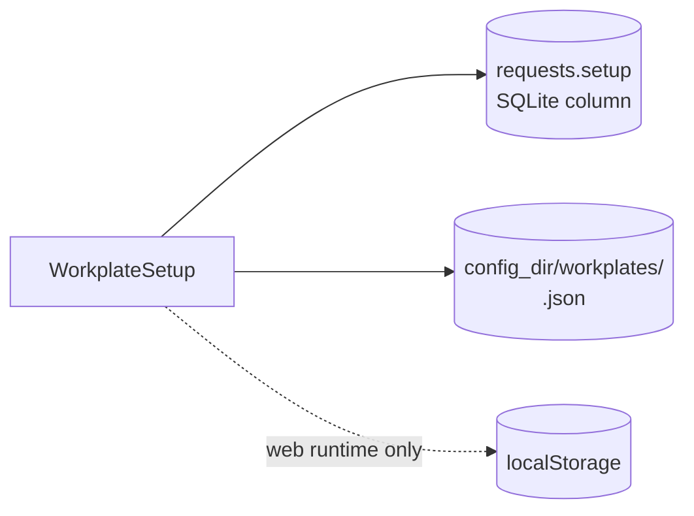

# Workplate — The Plate as a Saved Document

This module owns what a workplate *is* once you stop looking at it: which
printer, filament and process it was set up with, the settings the user changed,
and where each object sat. It exists to answer one question correctly:

> **What comes back when the user reopens this plate?**

A plate's live scene is ephemeral — it lives in the WebSocket session's scene
engine and is gone when the connection drops. That is fine for slicing and wrong
for everything else, because the plate is the thing the user thinks they are
working on. So the plate gets a document, and that document lives where the
engine runs, for the same reason [profiles](../profiles/README.md) do:

> **A cloud user who clears their browser must not lose their plates.**

## The contract

- **References, never copies.** A plate records three *profile ids*, not three
  profiles. That is what lets editing a print profile reach every plate that
  uses it — which is the entire point of having profiles. The same goes for
  geometry: objects are a `file_id` plus a placement, never mesh bytes.
- **Settings are stored as a diff**, measured against those presets. A value
  equal to what the preset says is not stored at all; storing it would pin the
  plate and stop it following the profile it was never really changed away from.
- **Saving a plate is not what makes a slice correct.** A slice request carries
  the scene it is slicing, in full, every time. The saved placements are what
  the plate is *restored* from; the request is what is *sliced*. The two are
  allowed to differ while the user is mid-edit, and the request always wins.
- **An unconfigured plate is not written.** `WorkplateSetup::is_empty` is what
  keeps a page load from filling the table with blank rows.

## Shape

| Field | Holds |
| --- | --- |
| `name` | The user's name for the plate, when they renamed it |
| `presets` | `printer` / `filament` / `process` profile ids |
| `overrides` | Sparse `SlicingParams` — only what the user changed |
| `objects` | `file_id`, part index, transform, support paint |
| `updated_at` | RFC 3339, for last-writer-wins |

Every field is defaulted, so a document written by a different build loads with
whatever it does carry rather than failing the whole plate. A plate that will
not open is a worse outcome than a plate that opens with one setting missing.

## Two homes, one document

| Runtime | Persisted in | Why |
| --- | --- | --- |
| Cloud | `requests.setup`, a column on the plate's own row | The plate already has a row there, so `DELETE /api/history` drops its setup with it |
| Native | `<config_dir>/workplates/<uuid>.json` ([`WorkplateStore`](store.rs)) | The desktop has no database — its history is in memory and its profiles are a file |
| Web | `localStorage` only | The browser *is* the engine; there is nothing behind it |

One file per plate rather than one map: plates accumulate, and rewriting every
plate to record that one of them moved an object is the kind of thing that is
fine until someone has four hundred of them.

`WorkplateStore` rejects an id that is not a bare uuid. The id arrives from the
webview, and a path separator in it would otherwise write outside the store.

## Non-goals

- **No mesh bytes.** Same rule as [`db`](../db/README.md): the filesystem is the
  storage, this is the index.
- **No merge resolution.** Whole-document, last writer wins — matching the
  profile library's sync unit.
- **No history.** Previous versions of a plate are not kept; that is what the
  slice history in [`db`](../db/README.md) is for.
- **No thumbnail.** The picture is rendered in the browser from the user's own
  camera and sent with each slice; it is not part of what a plate remembers.

## See also

- [mod.rs](mod.rs) · [store.rs](store.rs)
- [../profiles/README.md](../profiles/README.md) — the library the preset ids name
- [../db/README.md](../db/README.md) — the plate's row, and the column this lands in
- [../scene/README.md](../scene/README.md) — the live, in-memory placement engine
