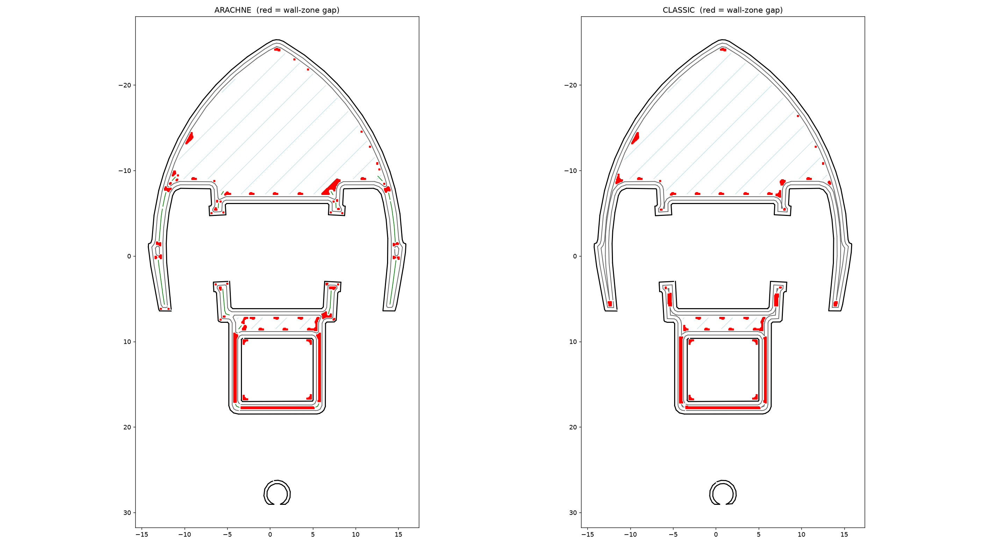
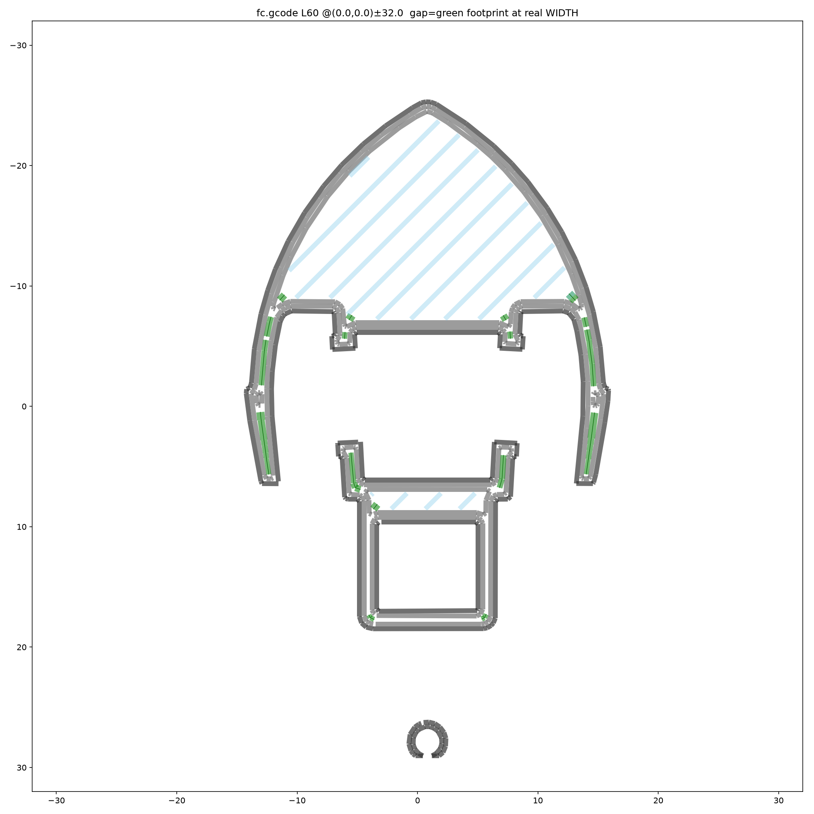
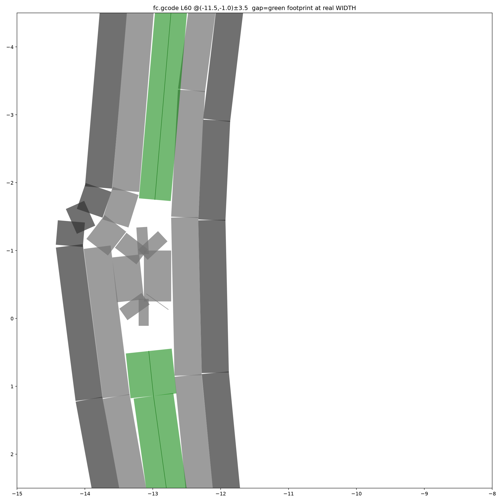

# gcode analysis toolkit

Diagnostic scripts for inspecting sliced G-code quality — built while fixing the
Arachne wall generator and its variable-width gap fill. They measure and
visualise wall/gap-fill defects straight from a `.gcode` file, and are meant to
be run against output from `slicer-engine slice`.

The guiding workflow is **slice → measure → compare against the `classic`
generator** (the trusted reference) rather than eyeballing a viewer.

## Requirements

- `python3` with `numpy` (all scripts) and `matplotlib` (`render.py`, `zoom.py`).

```bash
pip install numpy matplotlib
```

## Producing input

```bash
cargo build
printf '[slicing]\nwall_generator = "arachne"\n' > /tmp/arachne.toml
printf '[slicing]\nwall_generator = "classic"\n' > /tmp/classic.toml
./target/debug/slicer-engine slice -i 3DBenchy.stl --config /tmp/arachne.toml -o /tmp/arachne.gcode
./target/debug/slicer-engine slice -i 3DBenchy.stl --config /tmp/classic.toml -o /tmp/classic.gcode
```

## Scripts

| Script | What it measures | Usage |
| --- | --- | --- |
| `coincident.py` | Overlapping wall beads: near-parallel, non-adjacent segments closer than a gap threshold. Target **0** for clean walls. | `coincident.py <gcode> [layer=60] [gap_mm=0.10]` |
| `voids.py` | Enclosed **wall-zone gaps** — thin (`< 2.5×nozzle`) unfilled voids hugging walls/gap-fill but not infill — plus connected-component sizes. | `voids.py <gcode> [layer=60]` |
| `widthdist.py` | **Length-weighted** extrusion-width histogram per role (marker-count stats over-weight short shed corners). | `widthdist.py <gcode> [wall\|gap\|all]` |
| `render.py` | Two generators side-by-side, red = wall-zone gap. Best for locating gaps. | `render.py <gcodeA> [layer=60] [gcodeB] [out.png]` |
| `zoom.py` | Zoomed region drawing every bead as a filled capsule at its **actual `;WIDTH:`**, so you can see whether gap-fill beads truly span their gap. | `zoom.py <gcode> [layer] [cx] [cy] [half] [out.png]` |

### Examples

```bash
# Is any wall overlapping on layer 60?
python3 tools/gcode-analysis/coincident.py /tmp/arachne.gcode 60

# How much wall-zone void remains, arachne vs classic?
python3 tools/gcode-analysis/voids.py /tmp/arachne.gcode 60
python3 tools/gcode-analysis/voids.py /tmp/classic.gcode 60

# Are walls printed at full width or shed thin?
python3 tools/gcode-analysis/widthdist.py /tmp/arachne.gcode wall

# Locate the gaps (red) side-by-side, then zoom into one at (x,y) with a ±3mm window
python3 tools/gcode-analysis/render.py /tmp/arachne.gcode 60 /tmp/classic.gcode /tmp/layer60.png
python3 tools/gcode-analysis/zoom.py  /tmp/arachne.gcode 60 -11.5 -1 3.5 /tmp/hull.png
```

## Example output

`render.py` — Arachne vs. Classic on one layer, red = leftover wall-zone gap:



`zoom.py` — every bead drawn as a filled capsule at its true `;WIDTH:`; the green
gap fill tapers to fill the space between the grey walls:



A tight zoom on a hull wall (`zoom.py … 60 -11.5 -1 3.5`):



## Assumptions & caveats

- **G-code markers:** paths need `;TYPE:` role comments and, for width-aware
  scripts, `;WIDTH:<n>mm` comments (the generator's default annotations).
- **Layers are Z-bucketed** (`round(z, 2)`) so Z-lift travel moves don't shatter
  the model into pseudo-layers — layer indices are dense print layers, not raw
  Z changes.
- **Nozzle/resolution are hardcoded** in `voids.py` (`NOZ = 0.40`, `RES = 0.08`
  mm/cell) and `gap_max = 2.5×nozzle` throughout. Edit the constants for other
  nozzles.
- `voids.py` implements fill-holes / dilate / erode by hand (numpy only, no
  scipy) — fine for a Benchy-sized layer, not tuned for huge plates.
- E-per-mm measured from raw G-code is unreliable (retraction / absolute-E
  bookkeeping); trust the width markers and the capsule render instead.

## See also

- [src/walls/README.md](../../src/walls/README.md) — wall generators (Classic / Arachne).
- [src/gcode/README.md](../../src/gcode/README.md) — G-code emission and the volumetric flow balance.
- `AGENTS.md` → “Slicing Pipeline — Deep Knowledge”.
