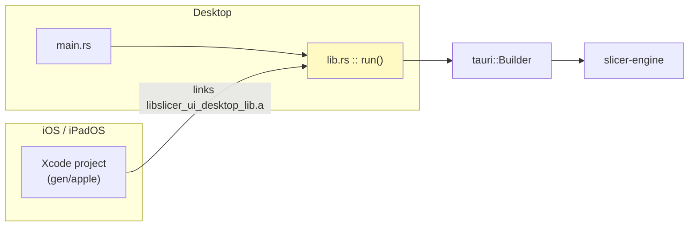
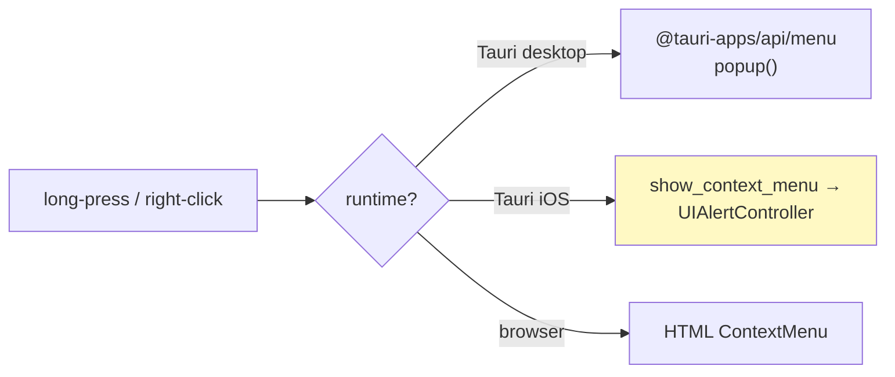
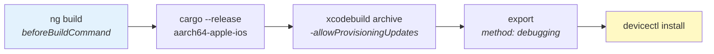

# The native shell (`ui-desktop`)

This is the Tauri application that wraps the Angular UI and the Rust slicing
engine into a single installable app — on macOS, Windows, Linux **and now
iPadOS/iOS**. It owns no slicing logic of its own; it is a *shell* that hands
`tauri::invoke` calls straight to `slicer-engine`.

The rule everything here defends:

> **There is exactly one application entry point, and it is a library.**
> `src/lib.rs` builds and runs the Tauri app. Desktop reaches it through a
> three-line `main.rs`; iOS has no `main` at all and links the same code as a
> static library. A change that only works on desktop is therefore impossible to
> write by accident.

---

## Why a library, not a `main`

A desktop Tauri app is a normal Rust binary: the OS runs `main`, `main` builds
the app. iOS does not work that way. The app process is started by UIKit from an
Xcode project, and Rust is along for the ride as a **static library** that the
Xcode project links and calls into.

`#[cfg_attr(mobile, tauri::mobile_entry_point)]` bridges the two worlds: on
desktop it expands to nothing, and on mobile it exports the `extern "C"` symbol
the generated Xcode project invokes.



`Cargo.toml` therefore declares `crate-type = ["staticlib", "cdylib", "rlib"]`:
`staticlib` for iOS, `cdylib` for Android, `rlib` so the desktop binary can
depend on it like any other crate.

---

## Anatomy

| Path                    | Purpose                                                                 |
| ----------------------- | ----------------------------------------------------------------------- |
| `src/lib.rs`            | The app: plugins, state, setup, command handlers. **Start here.**       |
| `src/main.rs`           | Desktop launcher. Calls `run()` and nothing else.                       |
| `src/commands.rs`       | `#[tauri::command]` surface exposed to the webview.                     |
| `src/context_menu.rs`   | Native iOS context menus (UIKit). See [Native menus](#native-menus).    |
| `src/native_dialog.rs`  | Native iOS alerts/confirmations and the share sheet.                    |
| `src/bridge/`           | Slice orchestration, G-code cache, and the progress-event logger.       |
| `src/system_accent.rs`  | OS accent-colour polling. Desktop only — mobile has no user accent.     |
| `tauri.conf.json`       | Shared configuration.                                                   |
| `tauri.macos.conf.json` | macOS window overrides.                                                 |
| `tauri.ios.conf.json`   | iOS overrides: product name and minimum deployment target.              |
| `Info.ios.plist`        | Extra iOS `Info.plist` keys, merged into the generated project.         |
| `app-icon.png`          | 1024×1024 icon master. See [App icons](#app-icons).                     |
| `capabilities/`         | Permission grants, split by platform (see below).                       |
| `gen/apple/`            | **Generated, but committed** Xcode project. Created by `ios:init`.      |

### Slicing slices the plate, not the file

`bridge/runtime_bridge.rs` receives the scene snapshot the webview is drawing and
must reproduce that plate exactly. Three properties do the work, and each was
broken here at some point — the symptom is always the same: the print comes out
as the *files* describe rather than as the plate shows, and moving things on
screen changes nothing.

- **Each object names its own file.** A workplate is a build plate, not a file:
  it can hold several different models. `SceneObjectPayload::file_path` carries
  one path per object, and every distinct file is read and repaired once,
  however many objects it backs. Sending a single path for the whole plate makes
  every object resolve into the *first* file, so a second model is silently
  sliced as a copy of the first.
- **Multi-part files stay apart.** A 3MF is a scene, not a model. Its build
  items are separate objects on the plate, and each item's transform is already
  baked into that part's vertices — so a *merged* load hands back the file as its
  author assembled it: parts stacked, geometry floating above the bed. The bridge
  loads with `load_path_multi_reporting` and picks the part named by
  `source_part`.
- **Every object is placed, with its own transform.** One `ObjectInput` per scene
  object, each baked once at the slicer boundary. Baking only the first object's
  transform silently drops duplicates and every part after the first.

`slice_plate` receives the objects separately so the desktop honours
exclude-object and sequential printing exactly like the CLI and the server.

Two rules for the error cases, both chosen so a mistake is loud rather than
wrong: a `source_part` the file cannot satisfy is an **error**, never a fallback
to part 0; and an object with no file of its own falls back to the request-level
`file_path` only because an older webview may not send one — with neither, the
slice fails instead of guessing.

**The G-code cache key fingerprints every file on the plate** (path + length +
mtime), not just the first, plus each object's `source_part`. Hashing one file
would let two plates that differ only in their *second* model collide on one
cached result.

The webview half of this contract lives in `ModelSourceRegistry`
([ui/src/app/services/model-source/](../ui/src/app/services/model-source/)),
which is what resolves each object's `source_id` to the path sent here.

### `dev:desktop` overrides `devUrl` at launch

`tauri.conf.json` pins `build.devUrl` to the default UI port and names a
`beforeDevCommand` that starts a dev server of its own. That is right for a
lone checkout and wrong the moment two run at once, so
[`scripts/dev.mjs`](../scripts/dev.mjs) starts the seeded dev server itself and
passes Tauri a generated config that **blanks `beforeDevCommand` and repoints
`devUrl`** at it. Expect the window to load a port other than the one in
`tauri.conf.json` — that is the seed, not a bug. The override is written to a
file rather than passed as an inline JSON string, whose quotes do not survive a
Windows shell.

### App icons

Every platform's icon set is generated from one master,
`ui-desktop/src-tauri/app-icon.png` — a 1024×1024 opaque crop of
[`ui/public/logo_source.png`](../ui/public/logo_source.png) using the shipping
app-icon framing. Regenerate after a brand change and commit the result:

```bash
pnpm run icons
```

Two things that script exists to get right:

- **iOS forbids an alpha channel.** `tauri icon` writes RGBA even when the source
  is opaque and `--ios-color` has been applied, and App Store Connect rejects
  that outright (`ITMS-90717`) regardless of the channel being fully opaque. The
  script flattens the iOS set back to RGB, which is lossless here.
- **`tauri icon` emits every platform it knows.** We ship dmg/app/msi/nsis and
  iOS, none of which read the MSIX/UWP tiles or Android mipmaps it also
  produces, so those are pruned instead of committed as dead artwork.

### Which surfaces are native

The rule across the app: **if the OS has a control for it, use the OS control.**
An HTML lookalike is the browser's fallback, never the mobile default.

| Surface | Desktop | iOS / iPadOS | Browser |
| --- | --- | --- | --- |
| Context menu | `@tauri-apps/api/menu` | `UIAlertController` action sheet | HTML menu |
| Confirm / alert | HTML dialog | `UIAlertController` alert | HTML dialog |
| Rich dialog (embeds a component) | HTML | HTML | HTML |
| Open a model | `open()` file dialog | `UIDocumentPickerViewController` | `<input type="file">` |
| Export G-code | `save()` + write | `UIActivityViewController` share sheet | `<a download>` |

Two of these are not merely nicer natively — the desktop approach is *broken* on
iOS, which is why they were changed:

- **Export.** iOS has no Save-As panel. Tauri's `save()` does run there, but it
  exports an empty placeholder file and returns a URL *outside* the sandbox, so
  the follow-up write silently lands nowhere and the user gets a 0-byte file.
  The share sheet copies the real bytes, and covers Save to Files, AirDrop and
  Mail in one control. The G-code is staged into the app's cache directory first
  because the sandbox is the only reliably writable location.
- **Import.** The iOS picker filters by **UTType**, not by extension: Tauri maps
  each filter through `UTType(filenameExtension:)`, which resolves for `stl` but
  not for `obj` or `3mf`. Without the `UTImportedTypeDeclarations` in
  `Info.ios.plist`, those files appear greyed out and simply cannot be imported.

Anything presented as a popover on iPad — the action sheet and the share sheet —
**must** carry a `sourceView`/`sourceRect`. UIKit raises
`NSInvalidArgumentException` otherwise and the app terminates.

### Native menus

Context menus are drawn by the OS on every platform that has one — an HTML menu
is the fallback for the browser, not the default.



iOS is the interesting branch. Tauri gates its whole `menu` module behind
`#[cfg(desktop)]`, so there is no API to call — and UIKit's blurred
`UIContextMenuInteraction` cannot help either, because it binds to a `UIView`
and is driven by UIKit's own gesture recogniser, which knows nothing about a DOM
element the webview long-pressed. The one native menu that *can* be presented
imperatively at a point is a `UIAlertController` in `.actionSheet` style — the
same control Apple's own apps use for "act on this row". UIKit renders it as a
popover on iPad and a bottom sheet on iPhone.

[`src/context_menu.rs`](src-tauri/src/context_menu.rs) builds it, giving the app
system blur, Dynamic Type, dark mode, destructive-red styling, VoiceOver and the
platform dismissal gestures for free. Points worth knowing before changing it:

- **The popover anchor is mandatory, not cosmetic.** An action sheet presented
  on iPad without `sourceView`/`sourceRect` raises `NSInvalidArgumentException`
  and takes the app down.
- **UIKit is main-thread-only**, so presentation hops via `run_on_main_thread` —
  and returns immediately. Blocking there would freeze the very sheet it just
  presented. The choice arrives later on a channel.
- **Dismissal resolves through channel disconnect.** Tapping outside an iPad
  popover invokes no handler at all; when UIKit releases the alert it drops the
  handler blocks, the last sender goes with them, and `recv` reports the
  disconnect — which *is* "nothing was chosen".
- **The cancel action matters on iPhone.** Sheets there ignore outside taps, so
  without it the menu would be inescapable. iPad hides the button automatically.
- **No per-item icons.** `UIAlertAction` only takes an image through the private
  `setValue:forKey:` `"image"` key, which risks App Store rejection. The web
  menu keeps its icons; native drops them.
- **Separators are dropped**, since action sheets have no divider concept. The
  returned index still refers to the original array, so the frontend's item list
  and the reply cannot drift apart.

### Capabilities are split by platform

`capabilities/default.json` holds what every platform needs (events, dialogs,
filesystem). `capabilities/desktop.json` is fenced with
`"platforms": ["macOS", "windows", "linux"]` and holds the window-chrome grants —
minimize, maximize, close, drag. Mobile has no window to minimize, so granting
those there would hand the webview commands the platform cannot honour.

### The window is frameless and hidden on Windows/Linux — by config, not at runtime

macOS keeps native decorations (`titleBarStyle: Overlay`, so the traffic lights
overlay our custom title bar) and is visible from the first frame — WKWebView
paints fast enough that there is nothing to hide. Windows and Linux instead
create the window **frameless and hidden** in
[`tauri.windows.conf.json`](src-tauri/tauri.windows.conf.json) /
[`tauri.linux.conf.json`](src-tauri/tauri.linux.conf.json) (platform overrides
that RFC 7386-merge over [`tauri.conf.json`](src-tauri/tauri.conf.json), so their
`app.windows` array replaces the base one wholesale — hence the full window
object is duplicated there).

Both settings fix a Windows launch hang:

- **Frameless at creation, never a runtime `set_decorations(false)`.** Toggling
  decorations after the window exists forces a WebView2 relayout that visibly
  froze the app for a moment on launch. Creating it frameless avoids the toggle
  entirely.
- **Hidden until the UI paints.** WebView2's cold start is slow, so a
  visible-from-creation window sat blank and unresponsive first. The frontend
  reveals it with `getCurrentWindow().show()` from `afterNextRender`
  ([`app.ts`](../ui/src/app/app.ts)) — gated on `isTauriDesktop()`, so it is a
  no-op on the web and on mobile. A Rust safety-net timer in
  [`lib.rs`](src-tauri/src/lib.rs) shows the window anyway if that call never
  arrives, so a frontend failure can never leave it permanently invisible. This
  is why `desktop.json` grants `core:window:allow-show` / `allow-set-focus`.

Do **not** re-add a runtime decoration toggle, and do **not** drop `visible: false`
from the desktop platform configs — either one brings the launch hang back.

---

## What the engine looks like on iOS

The iOS build links the slicing engine but deliberately **excludes three
modules**, gated in [`src/lib.rs`](../src/lib.rs) and mirrored by the dependency
tables in [`Cargo.toml`](../Cargo.toml):

| Module   | On iOS | Why                                                                          |
| -------- | ------ | ---------------------------------------------------------------------------- |
| `cli`    | no     | There is no command line in a sandboxed app. Drops `clap`.                   |
| `server` | no     | A mobile app must not bind a listener. Drops the whole `actix-web` stack.    |
| `db`     | no     | History/G-code cache is host-side only. Drops `sea-orm` + `sqlx` + SQLite.   |
| `printer`| **yes**| Sending G-code from an iPad uses the same native, CORS-free transport.       |
| `core`, `walls`, `infill`, `gcode`, `scene` | **yes** | The actual slicer. |

That is not just tidiness — it is what makes the build tractable. Resolving the
dependency graph for `aarch64-apple-ios` yields **333 packages against 495 for
macOS**: a third of the tree, including several C/C++ dependencies, never has to
cross-compile.

Keep the `cfg`s and the `Cargo.toml` target tables in sync; they encode the same
decision twice by necessity.

---

## Running on an iPad simulator

### One-time setup

iOS needs more than the desktop toolchain, and each missing piece fails deep
inside `xcodebuild` with an unhelpful message. Run the doctor first — it checks
every prerequisite and prints the exact command to fix each one:

```bash
pnpm run ios:doctor        # report
pnpm run ios:setup         # report + install what can be automated
```

It verifies, in order:

1. **The full Xcode app**, not Command Line Tools. Only Xcode ships the iOS SDK.
   Installing Xcode is not enough — macOS keeps pointing at the Command Line
   Tools until you switch it:

   ```bash
   sudo xcode-select -s /Applications/Xcode.app
   ```

   `DEVELOPER_DIR` is *not* a substitute here. Our helper scripts export it so
   `simctl` works without sudo, but `tauri ios dev` builds with a sanitized
   environment and never forwards it — its `xcodebuild` still resolves the
   Command Line Tools and fails. The doctor treats this as a hard failure.

2. **An iOS Simulator runtime and at least one iPad device type.** Xcode 26 does
   not bundle the runtime; it is a separate ~8 GB download:

   ```bash
   xcodebuild -downloadPlatform iOS
   ```

   A staged runtime image is not the same thing as a *registered* runtime. If
   `simctl runtime list` shows an image but `simctl list runtimes` is empty, the
   image is unusable — purge and re-fetch it:

   ```bash
   xcrun simctl runtime delete all && xcodebuild -downloadPlatform iOS
   ```

   > Deleting one image removes the underlying asset that **every** image of
   > that version shares, so deleting a "duplicate" silently breaks the good
   > one. Delete all of them and re-download rather than pruning selectively.

3. **Rust targets** `aarch64-apple-ios` (device) and `aarch64-apple-ios-sim`
   (simulator on Apple silicon). Installed for you by `ios:setup`.
4. **CocoaPods**, which drives the generated Xcode project.
5. **The Tauri CLI** and whether the Xcode project has been generated yet.

Then, from a fresh clone:

```bash
pnpm install
pnpm run hydrate      # WASM scene bindings + generated types — the UI cannot build without this
pnpm run ios:init     # generates ui-desktop/src-tauri/gen/apple
```

`ios:init` runs the doctor first and stops before generating anything if the
toolchain is incomplete.

### The dev loop

```bash
pnpm run ios:dev
```

This picks an iPad simulator, boots it, starts the Angular dev server, builds
the Rust static library, and installs the app — with live reload on the web
side, much like `pnpm run dev:desktop`.

> **This is the one dev flow still on a fixed port.** Everywhere else
> `pnpm run dev` seeds the ports so parallel checkouts don't collide, but the
> generated Xcode project builds against the `devUrl` pinned in
> `tauri.conf.json`, so seeding it would mean regenerating the project on every
> run. If `:4213` is busy, stop whatever holds it before starting.

> The first run cross-compiles the whole engine for `aarch64-apple-ios-sim` and
> takes several minutes; the resulting `libapp.a` is ~500 MB in debug. Later
> runs are incremental.

The device is chosen for you because `tauri ios dev` otherwise drops into an
interactive picker dominated by iPhones. The default is the largest iPad on the
newest runtime (Pro → Air → iPad → mini, biggest screen first), which matches
how the slicer canvas is laid out. To override:

```bash
pnpm run ios:simulator -- --list        # what is available
IOS_DEVICE='iPad mini (A17 Pro)' pnpm run ios:dev
```

If no iPad has been created yet — the case right after installing a runtime —
`ios-simulator.sh` creates one rather than failing.

Prefer driving Xcode yourself? `pnpm run ios:open` starts the dev server and
opens the project instead of running it.

> **Why `ui-desktop/package.json` has a `"tauri": "tauri"` script:** the
> generated Xcode "Build Rust Code" phase shells out to `pnpm tauri …` from
> `gen/apple`. Without that passthrough entry pnpm cannot resolve the binary and
> the iOS build fails with `Command "tauri" not found`. Do not remove it.

> **Do not `open gen/apple/*.xcodeproj` on its own.** The "Build Rust Code"
> phase reads a dev-server address file (`.../<T>-server-addr` in `$TMPDIR`)
> that only exists while a `tauri ios dev`/`ios:open`/`ios:dev` process is
> running; opening the project directly and hitting Run fails with `thread
> '<unnamed>' panicked … failed to read missing addr file`. Always launch
> through `pnpm run ios:dev` or `pnpm run ios:open` and keep that process
> alive — you can still use Xcode's own Run/Debug once it has opened the
> project for you.

### Debugging the webview

Safari owns the inspector for iOS. Enable **Safari → Settings → Advanced → Show
features for web developers**, then use **Develop → Simulator → localhost**.

---

## Physical iPhones and iPads

The app is **universal** (`TARGETED_DEVICE_FAMILY = "1,2"`), so everything below
applies to an iPhone exactly as it does to an iPad — same script, same signing,
same seven-day clock. The UI adapts on its own: an iPhone falls under the
handheld breakpoint and gets the bottom tab bar, settings drawer and slice
sheet described in [ui/README.md](../ui/README.md#phones), and iOS draws the
context menu as a bottom sheet rather than the popover it uses on iPad.

The only wrinkle is having both plugged in at once. The script will not guess
between them — a wrong choice costs a multi-minute build — so it lists them and
asks:

```bash
pnpm run ios:install --device 'Max iPhone'
```

There are two ways onto a real device and they answer different questions.

| | `tauri ios dev --host` | `pnpm run ios:install` |
| --- | --- | --- |
| Where the UI comes from | streamed from this Mac | compiled into the app |
| Survives closing the terminal | no — the app goes blank | yes |
| Rebuild to see a UI change | no, it live-reloads | yes, a few minutes |
| For | editing the front-end | *using* the slicer |

Both need signing — the simulator needs none, a real device needs all of it:

- **Team ID.** Detected from the signing certificate in your keychain, or set
  `APPLE_DEVELOPMENT_TEAM` explicitly. It is the certificate's **OU**, not the
  identifier printed in its common name, and a free Apple ID has no Membership
  page to read it off — which is why `ios-install.sh` digs it out for you.
- **The dev server must be reachable over the network** *for the dev loop only*.
  `tauri ios dev --host` publishes the address as `TAURI_DEV_HOST` and rewrites
  the dev URL to match. The Angular dev server already binds `0.0.0.0`, so it
  will answer.
- **Local network permission.** iOS prompts once, on the first printer probe.
  Decline it and every printer looks permanently offline; re-enable under
  **Settings → Cold Crabby → Local Network**.

### Keeping it on the device, with no Mac and no Apple Developer Program

`tauri ios dev` installs an app whose `devUrl` points at the Angular dev server
on your Mac, so it is a white screen the moment that process stops. Turning the
iPhone or iPad into something you can actually print from means shipping the
*release* app, where the whole UI is compiled into the binary and the slicing
engine — which already runs on-device — has nothing left to phone home to.

```bash
pnpm run ios:install
```

That is the whole story: build, sign with your free Apple ID, install over the
pairing you already have. There is no paid Apple Developer Program membership
anywhere in it, and afterwards the device slices with the Mac switched off.



**The price of not paying is seven days.** A free Apple ID gets a *personal
team*, and personal teams sign for a week; on day eight iOS refuses to launch
the app until it is re-signed. Re-running the script fixes that, and your
models, profiles and settings survive because the app is *replaced*, not
removed:

```bash
pnpm run ios:install -- --renew
```

`--renew` matters because automatic signing happily reuses a profile that is
still technically valid, so a plain rebuild on day six inherits one day rather
than starting a fresh week. It deletes the cached profiles for this bundle ID
first, which forces Xcode to mint a new one. The script prints the expiry date
either way, so you never have to guess.

The other limits of a free account, in the order they bite:

| Limit | What it means here |
| --- | --- |
| App IDs are globally unique | If somebody else registered `com.maxscopp.slicerengine`, pick your own `identifier` in `tauri.conf.json` and re-run `ios:init`. |
| 10 App IDs per 7 days | Only a problem if you keep renaming the bundle. |
| 3 side-loaded apps per device | Uninstall an old build before the fourth. |
| No push, App Groups or iCloud | None of which the slicer uses. |

**One tap on the device, once per certificate:** Settings → General → VPN &
Device Management → Developer App → Trust. Until then iOS installs the app but
will not launch it. Developer Mode (Settings → Privacy & Security) must also be
on; the script refuses to continue if it is not, because the install otherwise
fails with a far less obvious error.

Useful flags:

```bash
pnpm run ios:install -- --list                 # what is connected
pnpm run ios:install -- --device 'Max iPhone'  # required when two are paired
pnpm run ios:install -- --reinstall            # install the last build, skip building
pnpm run ios:install -- --launch               # start the app afterwards
```

#### Two things it cleans up after Tauri

Both exist because `gen/apple` is a *committed* Xcode project, which is unusual
and makes anything the build writes into it everybody's problem:

- **`tauri ios build` writes `DEVELOPMENT_TEAM` into `project.pbxproj`.** That
  would put one contributor's team ID into everyone else's checkout, so the
  script snapshots the file and restores it on exit — including when you
  interrupt a long build — and clears the line if an earlier run was killed
  before it could. The team is supplied per-build through the environment and
  does not belong in the repository.
- **`project.xcworkspace/contents.xcworkspacedata` must stay tracked.**
  `tauri ios build` passes it to `xcodebuild -workspace`; a checkout without it
  fails with a bare `project.xcworkspace does not exist` long before anything
  interesting happens. Only the `xcuserdata`/`xcshareddata` beneath it are
  ignored.

### Release build (no install)

```bash
pnpm run ios:build
```

The `.ipa` lands in `ui-desktop/src-tauri/gen/apple/build/arm64/`. This is what
`ios:install` runs underneath; use it directly when you want the artifact
rather than a device.

---

## `Info.ios.plist`

Tauri merges `Info.ios.plist` (next to `tauri.conf.json`) into the generated
`gen/apple/<app>_iOS/Info.plist`, so these survive re-running `ios:init`. The
entries there exist for concrete reasons:

| Key                                 | Without it                                                        |
| ----------------------------------- | ------------------------------------------------------------------ |
| `NSLocalNetworkUsageDescription`    | iOS 14+ blocks all LAN traffic; every printer looks offline.       |
| `NSBonjourServices`                 | mDNS browsing returns nothing, so discovery finds no printers.     |
| `NSAllowsLocalNetworking`           | ATS blocks plain HTTP — both Moonraker and the dev server.         |
| `UIFileSharingEnabled`              | Models cannot be dropped in via the Files app.                     |
| `ITSAppUsesNonExemptEncryption`     | Every TestFlight upload asks the export-compliance questions again.|

---

## Non-goals

- **This module does not slice.** Anything resembling geometry belongs in
  `slicer-engine`. The shell marshals JSON and paths.
- **It does not keep a second version number.** Everything reads
  `slicer_engine::version` (see the AGENTS.md SSOT contract).
- **It does not fork the UI for mobile.** The Angular app is one codebase; where
  behaviour must differ it asks `isTauriMobile()`, not a build flag.
- **Android is not set up.** The `cdylib` crate type and the platform-split
  capabilities make it possible, but nothing has been generated or tested.

---

## See also

- [`src/lib.rs`](src-tauri/src/lib.rs) — the entry point
- [`scripts/ios-doctor.sh`](../scripts/ios-doctor.sh) · [`ios-simulator.sh`](../scripts/ios-simulator.sh) · [`ios-dev.sh`](../scripts/ios-dev.sh) · [`ios-install.sh`](../scripts/ios-install.sh)
- [SETUP.md](../SETUP.md) — prerequisites for every surface
- [AGENTS.md](../AGENTS.md) — "Native shell targets" contract
- [Tauri: iOS distribution](https://v2.tauri.app/distribute/app-store/)
