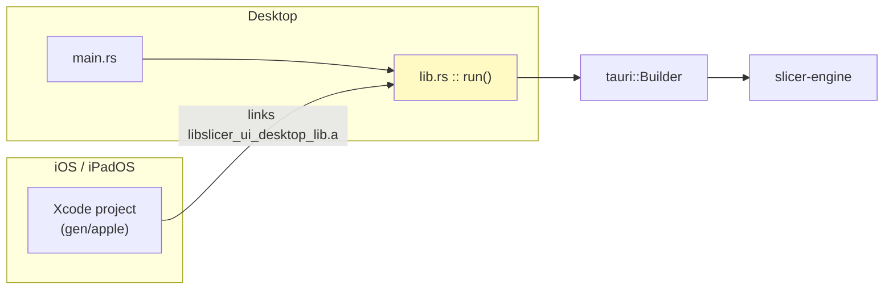

# The native shell (`ui-desktop`)

This is the Tauri application that wraps the Angular UI and the Rust slicing
engine into a single installable app — on macOS, Windows, Linux **and now
iPadOS/iOS**. It owns no slicing logic of its own; it is a *shell* that hands
`tauri::invoke` calls straight to `slicer-engine`.

The rule everything here defends:

> **There is exactly one application entry point, and it is a library.**
> `src/lib.rs` builds and runs the Tauri app. Desktop reaches it through a
> three-line `main.rs`; iOS has no `main` at all and links the same code as a
> static library. A change that only works on desktop is therefore impossible to
> write by accident.

---

## Why a library, not a `main`

A desktop Tauri app is a normal Rust binary: the OS runs `main`, `main` builds
the app. iOS does not work that way. The app process is started by UIKit from an
Xcode project, and Rust is along for the ride as a **static library** that the
Xcode project links and calls into.

`#[cfg_attr(mobile, tauri::mobile_entry_point)]` bridges the two worlds: on
desktop it expands to nothing, and on mobile it exports the `extern "C"` symbol
the generated Xcode project invokes.



`Cargo.toml` therefore declares `crate-type = ["staticlib", "cdylib", "rlib"]`:
`staticlib` for iOS, `cdylib` for Android, `rlib` so the desktop binary can
depend on it like any other crate.

---

## Anatomy

| Path                    | Purpose                                                                 |
| ----------------------- | ----------------------------------------------------------------------- |
| `src/lib.rs`            | The app: plugins, state, setup, command handlers. **Start here.**       |
| `src/main.rs`           | Desktop launcher. Calls `run()` and nothing else.                       |
| `src/commands.rs`       | `#[tauri::command]` surface exposed to the webview.                     |
| `src/bridge/`           | Slice orchestration, G-code cache, and the progress-event logger.       |
| `src/system_accent.rs`  | OS accent-colour polling. Desktop only — mobile has no user accent.     |
| `tauri.conf.json`       | Shared configuration.                                                   |
| `tauri.macos.conf.json` | macOS window overrides.                                                 |
| `tauri.ios.conf.json`   | iOS overrides: product name and minimum deployment target.              |
| `Info.ios.plist`        | Extra iOS `Info.plist` keys, merged into the generated project.         |
| `capabilities/`         | Permission grants, split by platform (see below).                       |
| `gen/apple/`            | **Generated, but committed** Xcode project. Created by `ios:init`.      |

### Capabilities are split by platform

`capabilities/default.json` holds what every platform needs (events, dialogs,
filesystem). `capabilities/desktop.json` is fenced with
`"platforms": ["macOS", "windows", "linux"]` and holds the window-chrome grants —
minimize, maximize, close, drag. Mobile has no window to minimize, so granting
those there would hand the webview commands the platform cannot honour.

---

## What the engine looks like on iOS

The iOS build links the slicing engine but deliberately **excludes three
modules**, gated in [`src/lib.rs`](../src/lib.rs) and mirrored by the dependency
tables in [`Cargo.toml`](../Cargo.toml):

| Module   | On iOS | Why                                                                          |
| -------- | ------ | ---------------------------------------------------------------------------- |
| `cli`    | no     | There is no command line in a sandboxed app. Drops `clap`.                   |
| `server` | no     | A mobile app must not bind a listener. Drops the whole `actix-web` stack.    |
| `db`     | no     | History/G-code cache is host-side only. Drops `sea-orm` + `sqlx` + SQLite.   |
| `printer`| **yes**| Sending G-code from an iPad uses the same native, CORS-free transport.       |
| `core`, `walls`, `infill`, `gcode`, `scene` | **yes** | The actual slicer. |

That is not just tidiness — it is what makes the build tractable. Resolving the
dependency graph for `aarch64-apple-ios` yields **333 packages against 495 for
macOS**: a third of the tree, including several C/C++ dependencies, never has to
cross-compile.

Keep the `cfg`s and the `Cargo.toml` target tables in sync; they encode the same
decision twice by necessity.

---

## Running on an iPad simulator

### One-time setup

iOS needs more than the desktop toolchain, and each missing piece fails deep
inside `xcodebuild` with an unhelpful message. Run the doctor first — it checks
every prerequisite and prints the exact command to fix each one:

```bash
pnpm run ios:doctor        # report
pnpm run ios:setup         # report + install what can be automated
```

It verifies, in order:

1. **The full Xcode app**, not Command Line Tools. Only Xcode ships the iOS SDK.
   Installing Xcode is not enough — macOS keeps pointing at the Command Line
   Tools until you switch it:

   ```bash
   sudo xcode-select -s /Applications/Xcode.app
   ```

   `DEVELOPER_DIR` is *not* a substitute here. Our helper scripts export it so
   `simctl` works without sudo, but `tauri ios dev` builds with a sanitized
   environment and never forwards it — its `xcodebuild` still resolves the
   Command Line Tools and fails. The doctor treats this as a hard failure.

2. **An iOS Simulator runtime and at least one iPad device type.** Xcode 26 does
   not bundle the runtime; it is a separate ~8 GB download:

   ```bash
   xcodebuild -downloadPlatform iOS
   ```

   A staged runtime image is not the same thing as a *registered* runtime. If
   `simctl runtime list` shows an image but `simctl list runtimes` is empty, the
   image is unusable — purge and re-fetch it:

   ```bash
   xcrun simctl runtime delete all && xcodebuild -downloadPlatform iOS
   ```

   > Deleting one image removes the underlying asset that **every** image of
   > that version shares, so deleting a "duplicate" silently breaks the good
   > one. Delete all of them and re-download rather than pruning selectively.

3. **Rust targets** `aarch64-apple-ios` (device) and `aarch64-apple-ios-sim`
   (simulator on Apple silicon). Installed for you by `ios:setup`.
4. **CocoaPods**, which drives the generated Xcode project.
5. **The Tauri CLI** and whether the Xcode project has been generated yet.

Then, from a fresh clone:

```bash
pnpm install
pnpm run hydrate      # WASM scene bindings + generated types — the UI cannot build without this
pnpm run ios:init     # generates ui-desktop/src-tauri/gen/apple
```

`ios:init` runs the doctor first and stops before generating anything if the
toolchain is incomplete.

### The dev loop

```bash
pnpm run ios:dev
```

This picks an iPad simulator, boots it, starts the Angular dev server, builds
the Rust static library, and installs the app — with live reload on the web
side, exactly like `pnpm run desktop:dev`.

> The first run cross-compiles the whole engine for `aarch64-apple-ios-sim` and
> takes several minutes; the resulting `libapp.a` is ~500 MB in debug. Later
> runs are incremental.

The device is chosen for you because `tauri ios dev` otherwise drops into an
interactive picker dominated by iPhones. The default is the largest iPad on the
newest runtime (Pro → Air → iPad → mini, biggest screen first), which matches
how the slicer canvas is laid out. To override:

```bash
pnpm run ios:simulator -- --list        # what is available
IOS_DEVICE='iPad mini (A17 Pro)' pnpm run ios:dev
```

If no iPad has been created yet — the case right after installing a runtime —
`ios-simulator.sh` creates one rather than failing.

Prefer driving Xcode yourself? `pnpm run ios:open` starts the dev server and
opens the project instead of running it.

> **Why `ui-desktop/package.json` has a `"tauri": "tauri"` script:** the
> generated Xcode "Build Rust Code" phase shells out to `pnpm tauri …` from
> `gen/apple`. Without that passthrough entry pnpm cannot resolve the binary and
> the iOS build fails with `Command "tauri" not found`. Do not remove it.

### Debugging the webview

Safari owns the inspector for iOS. Enable **Safari → Settings → Advanced → Show
features for web developers**, then use **Develop → Simulator → localhost**.

### Release build

```bash
pnpm run ios:build
```

The `.ipa` lands in `ui-desktop/src-tauri/gen/apple/build/arm64/`.

---

## Physical iPads

The simulator needs no signing; a real device needs all of it.

- **Team ID.** Set `TAURI_APPLE_DEVELOPMENT_TEAM` to the value from
  [developer.apple.com](https://developer.apple.com/account) → Membership
  details. Without it Xcode cannot sign the app.
- **The dev server must be reachable over the network.** `tauri ios dev --host`
  publishes the address as `TAURI_DEV_HOST` and rewrites the dev URL to match.
  The Angular dev server already binds `0.0.0.0`, so it will answer.
- **Local network permission.** iOS prompts once, on the first printer probe.
  Decline it and every printer looks permanently offline; re-enable under
  **Settings → Cold Crabby → Local Network**.

---

## `Info.ios.plist`

Tauri merges `Info.ios.plist` (next to `tauri.conf.json`) into the generated
`gen/apple/<app>_iOS/Info.plist`, so these survive re-running `ios:init`. The
entries there exist for concrete reasons:

| Key                                 | Without it                                                        |
| ----------------------------------- | ------------------------------------------------------------------ |
| `NSLocalNetworkUsageDescription`    | iOS 14+ blocks all LAN traffic; every printer looks offline.       |
| `NSBonjourServices`                 | mDNS browsing returns nothing, so discovery finds no printers.     |
| `NSAllowsLocalNetworking`           | ATS blocks plain HTTP — both Moonraker and the dev server.         |
| `UIFileSharingEnabled`              | Models cannot be dropped in via the Files app.                     |
| `ITSAppUsesNonExemptEncryption`     | Every TestFlight upload asks the export-compliance questions again.|

---

## Non-goals

- **This module does not slice.** Anything resembling geometry belongs in
  `slicer-engine`. The shell marshals JSON and paths.
- **It does not keep a second version number.** Everything reads
  `slicer_engine::version` (see the AGENTS.md SSOT contract).
- **It does not fork the UI for mobile.** The Angular app is one codebase; where
  behaviour must differ it asks `isTauriMobile()`, not a build flag.
- **Android is not set up.** The `cdylib` crate type and the platform-split
  capabilities make it possible, but nothing has been generated or tested.

---

## See also

- [`src/lib.rs`](src-tauri/src/lib.rs) — the entry point
- [`scripts/ios-doctor.sh`](../scripts/ios-doctor.sh) · [`ios-simulator.sh`](../scripts/ios-simulator.sh) · [`ios-dev.sh`](../scripts/ios-dev.sh)
- [SETUP.md](../SETUP.md) — prerequisites for every surface
- [AGENTS.md](../AGENTS.md) — "Native shell targets" contract
- [Tauri: iOS distribution](https://v2.tauri.app/distribute/app-store/)
