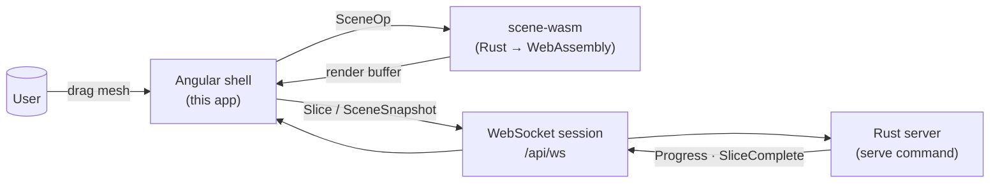
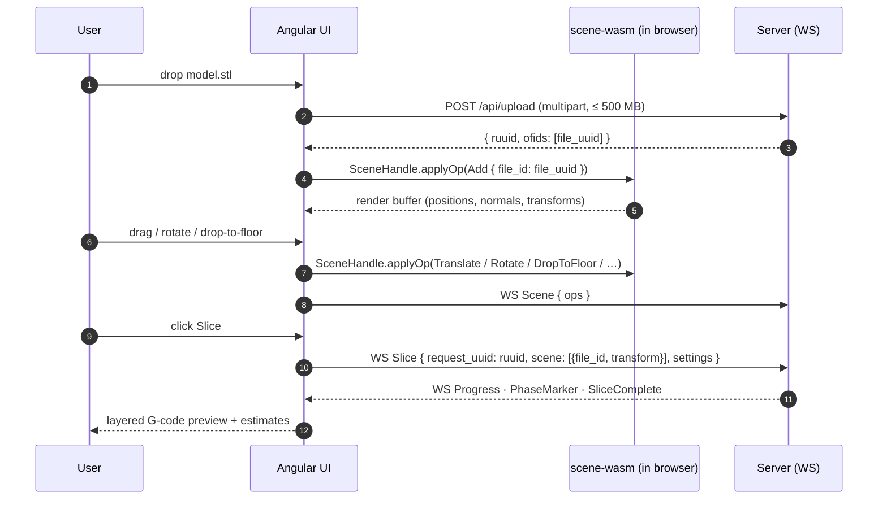
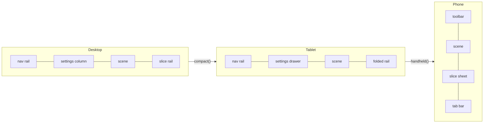
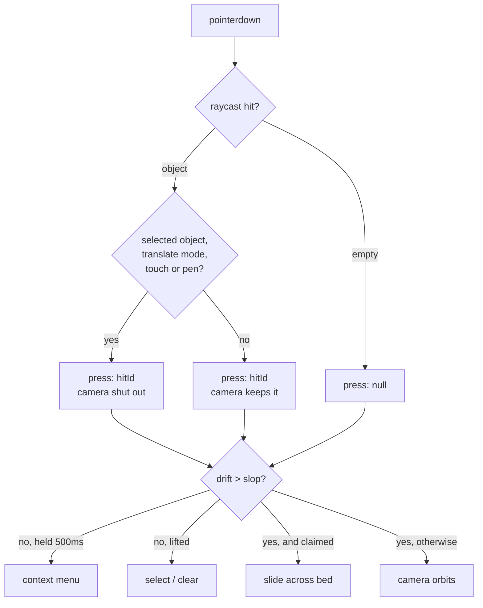
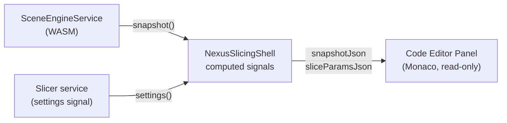
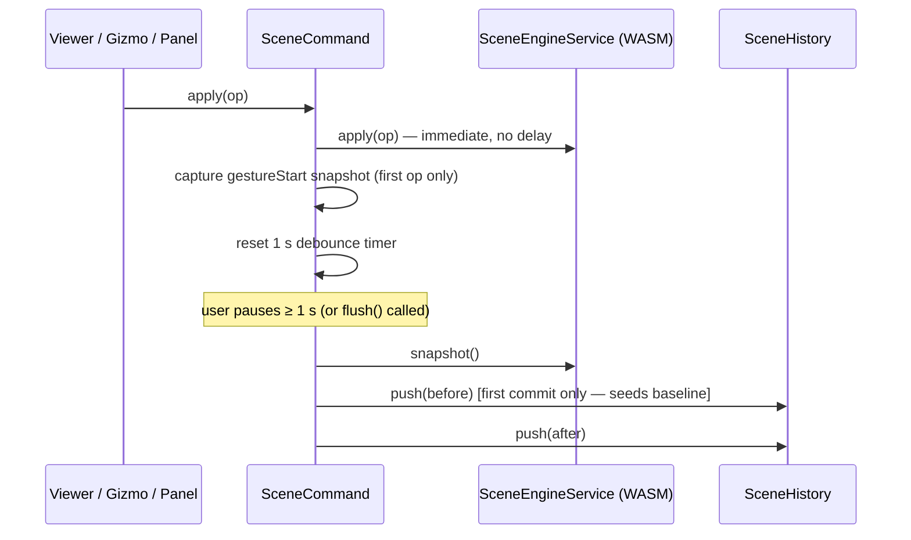
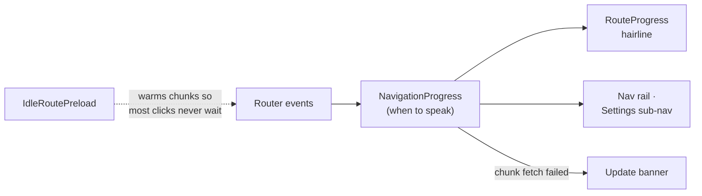

# Cold Crabby — Web UI

The Angular front-end of Cold Crabby. It uploads meshes, drives the slice, renders the live G-code preview, and lets you tweak settings — all against a single Rust core that also powers the CLI.

It exists for one reason: **what you preview in the browser must be exactly what slices on the server.** Both run the same Rust code. The UI compiles part of the engine to WebAssembly so scene placement is computed locally, and delegates the heavy slicing to the server over WebSocket.

There is now an alternative `web-slicer` build for fully local slicing in the
browser. It keeps the default WS-backed flow untouched, but swaps `slicer.ts`
to use `SceneHandle.sliceGcode()` when the UI is built with
`pnpm run hydrate:web-slicer` plus `pnpm run ui:build:web-slicer`. That mode
requires a wasm-capable `clang++` toolchain because the slicing pipeline pulls
in `clipper2`.

---

## The contract



- The Angular app **never reimplements** scene math. Translate, rotate, drop-to-floor, align-face — every gesture becomes a `SceneOp` and is applied by the Rust scene engine compiled to WASM. See [src/scene/README.md](../src/scene/README.md) for the SSOT contract.
- **A plate holds objects from several files, so every object carries its own `source_id`** and resolves it through [`ModelSourceRegistry`](src/app/services/model-source/model-source-registry.ts). Never answer "which model does this object slice from?" per *plate* — by list position, by "the first upload", or by one path for everything. Every runtime that did got it wrong: the browser slicer refused to slice a second model, the desktop app sliced it as a copy of the first.
- Schemas and TypeScript types are **generated from the Rust definitions**, not hand-written. See "Generated artifacts" below.
- The G-code preview is decoded from the same `SliceResult` produced by the CLI's `slice` command.

---

## Anatomy

```
ui/src/app/
├── app.config.ts          providers (router, http, markdown, input-modality, keyboard-shortcuts)
├── app-routes.ts          /, /slice/(new|:requestUuid), /settings/* — all lazily loaded
├── pages/
│   ├── home/              landing dashboard
│   ├── slice-new/         upload + initial slice
│   └── slice-viewer/      G-code preview, layer scrubber, history
├── nexus/                 application shell — top bar, sidebar, layout, print-estimates
├── components/            stateless building blocks
│   ├── viewer/            three.js canvas + ViewportCube + 3D-view-toolbar
│   ├── code-editor/       Monaco editor wrapper (lazy-loaded; used by transmit-preview panel)
│   ├── settings-panel/    schema-driven forms
│   ├── file-upload/       drag-and-drop, progress, upload-guard hook
│   ├── history-panel/     past slice runs from the server's SQLite ledger
│   ├── status-panel/ connection-state/ notification-center/ logo/
│   └── …                  card, list-history, viewport-cube
├── services/
│   ├── scene-engine.service.ts       wraps the WASM SceneHandle (single instance)
│   ├── scene-command/scene-command.ts  single dispatch point for SceneOps; gesture-batching + history
│   ├── scene-history/scene-history.ts  linear undo/redo stack (max 50 snapshots)
│   ├── keyboard-shortcuts/             global Ctrl+Z / Ctrl+Y undo/redo hotkeys
│   ├── editor-panel.ts               toggle signal for the transmit-preview panel
│   ├── slicer.ts                     high-level slice orchestration
│   ├── slicer-connection.ts          WebSocket transport (typed messages)
│   ├── slicer-file.ts                mesh upload (REST), download
│   ├── workplate-objects/            the one way an object gets onto a plate
│   ├── model-source/                 object `source_id` → the file it slices from
│   ├── upload-guard.ts               CanDeactivate guard for in-flight uploads
│   ├── viewer-control.ts             camera / framing helpers
│   ├── object-tracker/               per-object UI state
│   ├── print-area/                   build-volume + bed config from server
│   ├── history.ts                    slice history client
│   ├── notifications.ts              toast layer
│   ├── browser-storage.ts            localStorage wrapper
│   ├── logger.service.ts             structured logger (mirrors server logs in console)
│   └── app-theme.ts                  light / dark token switcher
├── schema-form/           generic form renderer driven by JSON Schema
├── models/                shared types (mostly re-exports from generated/)
└── shared/                slicer-only cross-cutting bits — dialog service, icon-button
```

> **Presentational primitives and the design language live in
> [`@coldcrabby/ui`](https://github.com/ColdCrabby/ui), not here.** See
> [Shared UI](#shared-ui-coldcrabbyui) below.



---

## Shared UI (@coldcrabby/ui)

The presentational primitives (button, select, segmented, slider, modal-shell,
…) and the **design language** (theme tokens, base elements, utilities, mixins)
are not defined here — they live in the shared
[`ColdCrabby/ui`](https://github.com/ColdCrabby/ui) repo and are consumed as
**raw source**, so what the slicer renders and what other Cold Crabby apps
render stay identical.

- **Vendored, not published.** `pnpm vendor:ui` clones `ColdCrabby/ui` (tracking
  `main`) into `vendor/coldcrabby-ui/`, which is git-ignored. It also runs on
  `postinstall`, so a fresh `pnpm install` fetches it automatically. To pull the
  latest shared UI, re-run `pnpm vendor:ui`.
- **Imported as `@coldcrabby/ui`.** A tsconfig `paths` entry maps the package to
  `vendor/coldcrabby-ui/src/public-api.ts`; components import primitives from
  `@coldcrabby/ui` directly.
- **Styles via `includePaths`.** `angular.json` adds
  `vendor/coldcrabby-ui/src/styles` to the Sass load path, so
  [src/styles/main.scss](src/styles/main.scss) pulls the shared theme, base,
  utilities, and mixins with bare `@use 'theme/…'` specifiers. Slicer-only
  styles stay local: the **viewport-locking reset** (the app pins the viewport;
  the shared reset scrolls), the global `components/` partials, and the
  `drop-aurora` emit.
- **What stays here.** Slicer-specific UI only: the app shell (`nexus/`), the
  3D viewer, the schema-driven forms, the `fov-cube`, the `dialog` service, and
  the local `icon-button`.

Change a primitive or a token in `ColdCrabby/ui`, open a PR there, and once it
lands, `pnpm vendor:ui` brings it in.

---

## Multi-object plates

**A workplate is a build plate, not a file.** It starts from one model and must
accept more, so responsibilities are split strictly.

- **[`WorkplateObjects`](src/app/services/workplate-objects/workplate-objects.ts)
  is the only way an object gets onto a plate.** It uploads (cloud), calls
  `addMesh` with the resulting `source_id`, places the result using the shared
  [`Arrange`](src/app/services/arrange/arrange.ts) settings, and nudges the new
  object clear of the ones already there. Every entry point — the toolbar's add
  button, drag-and-drop, restoring a saved plate — goes through it, so they
  cannot drift apart. **Adding never clears existing objects**; only an explicit
  clear does.
- **[`SlicerFile`](src/app/services/slicer-file.ts) holds a list, not a file.**
  `files` accumulates `{fileId, filename}` and `upload(file)` appends, attaching
  to the open workplate. `fetchFile` adopts a file as the *primary displayed*
  model — it sets `selectedFile`, which retargets the viewer's `model` input — so
  additional objects must use **`downloadFile`**, which registers without
  touching `selectedFile`. Otherwise restoring an N-object plate leaves only the
  last file on screen.
- **[`toSliceDtos`](src/app/runtime/adapters/cloud/scene-slice-dto.ts) resolves
  each object to its file via `source_id` and throws rather than guessing.** It
  is a pure function with tests pinning the regression; keep the mapping there,
  not inline in the runtime adapter.
- **The viewer mirrors, it does not own.** `Viewer.syncWasmMeshes()` diffs
  `sceneEngine.objects()` against its Three.js nodes and adds or disposes to
  match, so an object created by *anyone* — the add button, `Duplicate`, undo —
  renders without the viewer being told. Do not add a second place that
  constructs display meshes.

### Placing objects is one command, not two

"Auto-orient" and "arrange all" used to be rival buttons that undid each other's
work. [`Arrange`](src/app/services/arrange/arrange.ts) owns the single
`ArrangeOnBed` dispatch plus the settings it needs — gap, auto-orient, and the
printer's preferred angle.

Its UI follows the object-tools idiom exactly: a uniform toolbar button **in the
same group as move / rotate / scale**, revealing a contextual card
([`PlacementPanel`](src/app/components/placement-panel/placement-panel.ts), a
sibling of [`TransformPanel`](src/app/components/transform-panel/transform-panel.ts)).
**Do not give it a split caret** — that made one button in the group behave
unlike its neighbours. **Add-time placement reads the same settings**: dropping a
file in and pressing the button must not disagree about orientation or spacing.
Do not re-introduce a bare "auto-orient everything" action beside it.

`preferred_orientation_deg` lives on the **printer profile**, not in plate
preferences, because it describes the machine (a CoreXY prints everything at
45°). Settings → Printers is the only editor; the placement panel shows it
read-only and links there, so one machine's angle is never changed from a
plate-scoped surface. It rides along inside
`orient_options.preferred_z_rotation_deg` and is therefore **only applied when
auto-orient runs** — the panel says so rather than showing a live-looking value
that does nothing.

### Contextual tool cards hang off the tools that open them

Both cards render inside `3d-view-toolbar.html`, in a `.tool-panels` column
**absolutely positioned** under the `.tool-cluster` and centred on it, so they
follow the buttons instead of sitting in a screen corner the user has to connect
them to.

Absolute positioning is what makes this safe: the toolbar's own `contentRect`
height is unchanged, so the shell's `--main-scene-inset` — and with it the
viewport cube and the slice rail — never shifts as cards appear. That invariant
is why the transform card originally lived in the shell. The column stacks, so
transform and placement can be open at once, and the container is
`pointer-events: none` so gaps stay click-through to the scene.

**The toolbar's own pill rules must keep their `:host ` prefix.** `nexus-card`
styles itself with `:host(.small){border-radius:var(--radius-md)}`, which a bare
class selector ties on specificity and loses to on order — squaring off the pill.

### `TransformPanel` edits the whole selection

It used to render nothing unless *exactly one* object was selected, which made a
multi-object plate untransformable.

| Edit | Applied as |
| --- | --- |
| Position | a **delta** off the selection's combined AABB centre, so a spread-out arrangement keeps its layout instead of collapsing onto one coordinate |
| Rotation · scale | **per object**, about each one's own centre |
| `setSize` | measured against each object's own AABB, so a batch of different-sized parts all reach the requested size |

A single-object selection is the exact previous behaviour — the anchor is then
its own translation, so an edit is still an absolute set. The header shows
`"N objects"` for a batch and **nothing** for one; it deliberately does not name
the file, since every duplicate shares a name and it identified nothing.

### Plate-editing chrome hides in G-code preview

The placement control, add-model button, gravity toggle, multi-select toggle,
gizmo-mode group and objects list are all gated on `viewMode() === 'model'`, and
the `A` shortcut matches only there. The scene's context menu is gated the same
way. Preview shows toolpaths, so an edit made from it changes something the user
cannot see change.

---

## Phones and tablets

The desktop layout assumes horizontal room the slicer does not have on a
handset: a 60px nav rail, a 280px docked settings column and a 380px slice rail
add up to more than a 390px screen _is_. Rather than a second app, the same
shell rearranges itself.

A tablet is the case a single "is it small?" flag gets wrong in both directions.
An iPad has a desktop's width and a phone's input. Treat it as a phone and it
loses a docked settings column it has ample room for; treat it as a desktop —
which is what a lone `handheld()` did — and every panel that floats over the
plate stays open forever, with no cursor to dismiss it, over targets sized for a
mouse. So the shell asks three separate questions and answers them independently.

| Question                               | CSS                | TypeScript          | True on                       |
| -------------------------------------- | ------------------ | ------------------- | ----------------------------- |
| May the layout keep its desktop shape? | `handheld()`       | `isHandheld()`      | phones                        |
| Must chrome over the scene fold away?  | `compact()`        | `isCompact()`       | phones, tablets, ≤1024px      |
| How big must a target be?              | `coarse-pointer()` | `isCoarsePointer()` | phones, tablets, touchscreens |



- **One definition of each.** [`styles/_breakpoints.scss`](src/styles/_breakpoints.scss)
  holds all three mixins and [`services/viewport.ts`](src/app/services/viewport.ts)
  holds their three signals. **The query strings are copies of each other and
  must stay identical** — CSS switches the layout, TypeScript switches the
  _controls_ (which ones render at all, whether the settings column may dock),
  and a disagreement shows up as chrome styled for one answer and wired for
  another. Layout itself stays in media queries so a page lays out correctly
  before any script runs.
- **Width and pointer are orthogonal; do not conflate them.** `compact()` is
  about _room_, `coarse-pointer()` about _precision_. A narrow desktop window
  needs the first and not the second; a 12.9" iPad needs the second and not
  obviously the first. Size a target with the pointer, fold a panel with the room.
- **Source order matters more than usual.** A phone matches all three queries,
  so where two blocks set the same property at the same specificity the later
  one wins. Order them **compact → handheld → coarse-pointer**, and prefer
  setting a value in exactly one of them.
- **`html.is-handheld` / `html.is-coarse-pointer` are for the shared components
  only.** [`_handheld.scss`](src/styles/base/_handheld.scss) adapts the layout of
  `@coldcrabby/ui` primitives we do not own (stacking `nexus-field-row`, trimming
  modal gutters); [`_touch.scss`](src/styles/base/_touch.scss) adapts their
  _size_ (34px controls to 44px, an 18px slider thumb to 26px). A component's own
  `:host` block compiles to an attribute selector, which a plain element selector
  loses to; the class buys exactly the specificity needed without `!important`.
  Both are set before first paint by the inline script in `index.html`, and
  `Viewport` keeps them live (`AppShell` constructs it, so they exist on every
  route).
- **`handheld()` keeps a width-bounded short-landscape arm**, so a docked-but-
  short desktop window is not mistaken for a handset. A height test alone
  reclassifies a perfectly roomy window the moment someone drags it shorter.
- **The `tooltip` directive contributes no accessible name.** An icon-only
  button whose only label is `[tooltip]` is unlabelled to VoiceOver *and*
  unlabelled on a tablet, which has no hover to reveal it. Give every icon-only
  control an `aria-label` mirroring its tooltip **at the call site** — the
  directive lives in the shared repo and is not ours to change here.
- **The page does not zoom; surfaces claim their own gestures.** Cold Crabby is
  an application shell, not a document: the plate is manipulated by direct pinch
  and drag, and a page zooming underneath those fights every one of them. So the
  viewport meta carries `user-scalable=no` / `maximum-scale=1`, `html` carries
  `touch-action: pan-x pan-y` (pan, never pinch), and — because iOS has ignored
  that meta since iOS 10 — [index.html](src/index.html) preventDefaults the
  `gesture*` events and multi-touch `touchmove` to enforce the same rule there.
  A surface can opt back in with `data-allow-gesture`.
  **Double-tap zoom is suppressed per control**, via `touch-action: manipulation`
  in [_reset.scss](src/styles/base/_reset.scss) — not document-wide, because a
  blanket `touchend` preventDefault also eats legitimate taps.
  Text scaling stays available through the OS and the app's own theme settings.

### Folding the chrome over the plate

Everything that hovers over the 3D scene can be folded to a header, because on a
tablet there is no cursor to move away from it and on a phone it is most of the
screen. The pattern is the same in each: a full-width header button with a
chevron, the one readout worth keeping while folded, and a preference that
persists once the user states it.

| Panel            | Header keeps | Default folded |
| ---------------- | ------------ | -------------- |
| G-code inspector | Layer N / M  | `isCompact()`  |
| Object list      | Object count | `isCompact()`  |

Until the user folds or unfolds one, the default is derived; afterwards their
choice is remembered across sessions **and viewports**, because a stated
preference outranks a guess. The preference is therefore **tri-state**: `null`
until the user states one, at which point the derived default (`!isCompact()`)
stops applying entirely. Do not add a floating panel without one.

**Unfolded, a panel gets the room that is actually there.** The rail card is
bounded by `100dvh` minus the chrome above it — titlebar, safe area, toolbar
inset, its own margins — and the inspector opens to its natural height inside
that, so on any iPad the whole legend and both sliders are visible without
scrolling. A `vh` fraction cannot do this: the same number is too small in
landscape and too generous in portrait. When the room genuinely runs out (a short
desktop window, a phone) the inspector is the thing that shrinks and scrolls —
`min-height: 0` lets flexbox squeeze it, and `flex: none` on the slice row means
the Slice button is never what gets clipped.

What changes on a phone specifically, and why:

| Surface               | Phone form               | Reason                                                                                            |
| --------------------- | ------------------------ | ------------------------------------------------------------------------------------------------- |
| Nav rail              | Bottom tab bar           | 60px of a 390px screen for something used once a session; the bottom edge is what a thumb reaches |
| Print settings        | Drawer + edge tab        | Docked, it leaves ~50px of scene                                                                  |
| Slice rail            | Full-width bottom sheet  | The bottom-right corner is the hardest place on a tall phone to reach                             |
| G-code inspector      | Scrolls inside the sheet | Slice must never be the thing that scrolls away                                                   |
| Settings sections     | Scrollable chip strip    | A 220px column leaves 170px for the settings                                                      |
| Manage pages          | Stacked master–detail    | Two columns need width that is not there                                                          |
| Toasts                | Top of the screen        | The bottom belongs to the sheet and the tab bar                                                   |
| Viewport cube         | Hidden                   | A click-and-drag widget with no touch equivalent, in the corner a phone can least spare           |
| Projection · pipeline | Hidden                   | Eleven pill buttons do not fit; neither is part of getting a model sliced                         |
| Object list           | Collapsible chip         | Expanded it covers a third of the plate it describes                                              |

### The edge tab, and why hover is armed by geometry

Collapsed, the settings drawer leaves a **"Print settings" tab** on the left edge.

- **It hangs just under the toolbar, not at `top: 50%`** — vertically centred is
  where the model sits, the worst place for a permanent affordance. The dock nub
  shares the anchor, so toggling the drawer changes the control's form without
  moving it. Its hover state is **tone and elevation only, never a transform**:
  the tab is flush against the nav rail, so nudging it sideways tears a gap open.
- **The peek has no backdrop.** The scrim element stays — it is what gives touch a
  tap-outside-to-close — but is fully transparent. A peek is not a modal, and the
  point of peeking at the settings is to keep watching the plate.
- **Hover intent is armed by pointer geometry, never by element events.** A panel
  that mounts, unmounts and slides under a stationary pointer emits enter/leave
  pairs that say nothing about intent — arming from the tab's own `mouseenter`
  oscillates, because opening the drawer unmounts the tab. Arming reads `clientX`
  from a document `pointermove`; closing compares against the panel's edge.

  **Do not "simplify" this to an invisible edge strip.** It would need
  `pointer-events: auto`, and since the collapsed host is zero-width it would lie
  over the leftmost slice of the 3D scene for its full height — swallowing camera
  drags, click-to-select and, the sidebar being a *sibling* of `<main>`, file
  drops.

---

## Touch and pen

A tablet keeps the desktop *layout* — it has the width — but not the desktop
*pointer*. Everything below is about the second half, and lives behind
`Viewport.isCoarsePointer()` rather than `isHandheld()`.



Everything in that flow is [`scene/selection.ts`](src/app/components/viewer/scene/selection.ts).
The rules worth knowing before editing it:

- **Tap slop is per pointer type** (`TAP_SLOP_PX`): 4px mouse, 9 pen, 16 finger.
  One mouse-sized threshold for all three makes tapping a model on a tablet do
  nothing at all — a fingertip is a ~10 mm disc whose reported centre wanders, so
  most real taps drift past it and are discarded as drags. Pinned by
  [`selection.spec.ts`](src/app/components/viewer/scene/selection.spec.ts).
- **A tap resolves on the lift, never the press**, so a mis-aimed press can be
  dragged off to cancel. That includes pull-to-floor, where the press only
  *paints* the candidate face and the lift commits it.
- **Additive selection is a mode, not a modifier** — there is no ⌘ to hold. It is
  offered from the tool cluster on touch-primary devices only.
- **The long press is the right-click**, since iOS never fires `contextmenu` for
  one. **Right-click itself is driven off the button's press and release, not the
  `contextmenu` event** — Windows raises that after the button comes up and macOS
  the moment it goes down, so only the button's travel separates a right *click*
  from the right *drag* that pans the camera.
- **Direct drag is deliberately narrow**: touch or pen, translate mode, and an
  object that is *already* selected. Requiring a prior tap means a stray swipe can
  never shove a model across the plate.
- **The camera is shut out at `pointerdown`, and only for a press the drag will
  claim.** OrbitControls listens on the same canvas without capture, and the DOM
  runs capture-flagged listeners first whatever the registration order, so a
  `stopPropagation()` there stops a rotate starting at all. Every *other* press on
  a model is deliberately let through, or most of the scene becomes a dead zone.
  A bubble-phase probe in the spec pins both directions.
- **Never stop the lift.** OrbitControls' pointer-up handler is on the
  **document**, so blocking `pointerup` strands it mid-gesture in the presses it
  *was* let into — the pointer stays tracked and the next move orbits the view.
  The only safe stops are on `pointermove` inside a live drag, whose
  `pointerdown` was withheld too.
- **A raycast hit is not a visible hit.** Three's `Raycaster` filters on `layers`
  and **never on `visible`**, so hidden geometry reports hits like anything else.
  `GizmoManager.hitTest` raycasts TransformControls' *pickers* — invisible,
  deliberately oversized shapes that a detached gizmo parks at the origin, i.e.
  the middle of the bed. Anything deciding "did the user touch this?" from a
  raycast must apply visibility itself (`isVisibleWithin`) and check the gizmo is
  attached first. [`gizmo.spec.ts`](src/app/components/viewer/gizmo.spec.ts) pins
  it, and asserts the three.js behaviour so a future release changing it is
  noticed.
- **Palm rejection sits above all of it** in
  [`scene/pointer-arbiter.ts`](src/app/components/viewer/scene/pointer-arbiter.ts),
  on the host in the capture phase, so a resting wrist never reaches these
  handlers.

| Surface        | Touch form                     | Reason                                                                    |
| -------------- | ------------------------------ | ------------------------------------------------------------------------- |
| Tap on a model | Selects it                     | The objects list was the only working path                                |
| Multi-select   | Tool-cluster toggle            | There is no ⌘/Ctrl to hold                                                 |
| Long press     | Object / plate context menu    | Puts duplicate, drop, centre, remove where the model is                   |
| Selected model | Drags across the bed           | Three axis arrows inside one contact patch is a coin toss                 |
| Gizmo          | Scaled up (`setSize` 1.4)      | Scaling the helper scales its pickable geometry with it                   |
| Object list    | Starts folded, 44px rows       | It sits on the plate it describes, and cannot be hovered out of the way   |

---

## Monaco Transmit Preview

The **transmit preview panel** is a toggleable side panel that shows, in real time, the exact JSON payloads that the UI would send to the server when a slice job starts.

Toggle it with the **pipeline** (⊞) button — the `filter-list` icon — in the 3D-view toolbar, or press the button again to hide it. The button turns active (highlighted) when the panel is open. The panel sits alongside the 3D viewport and does not obscure the model.



The panel contains two read-only Monaco editor instances, each updated live as signals change:

| Editor | Content                                           | WebSocket field    |
| ------ | ------------------------------------------------- | ------------------ |
| Top    | Scene snapshot — objects, transforms, world AABBs | `scene` payload    |
| Bottom | Slice settings — layer height, walls, infill, …   | `settings` payload |

`bigint` object IDs are serialised as strings so `JSON.stringify` does not throw.

### `CodeEditorComponent` (`components/code-editor/`)

A thin Angular wrapper around Monaco editor:

- **Lazy-loaded, narrowly, and not until it is looked at** — the editor is composed from Monaco's modular entry points (`editor/editor.api` + `features/register.all`) rather than the package root, and is fetched only once an instance comes within 400 px of the viewport. The root export is `editor.main`, which would register ~90 language grammars and the TypeScript/CSS/HTML language services: a 2.7 MB chunk plus 9.6 MB of web workers, for an app that shows G-code and JSON. **A dynamic `import()` is lazy in the bundle but still runs the moment the component is created** — the printer settings page mounts three editors about six screens below the fold, which used to fetch ~4 MB before the user had scrolled anywhere near them.
- **Inputs**: `content` (string signal), `language` (Monaco language ID, default `'plaintext'`), `readOnly` (boolean).
- **Live updates** — an `effect()` pushes content and readOnly changes into the live editor instance, so Angular signals drive Monaco without re-creating the editor.
- **Resource cleanup** — `DestroyRef.onDestroy` disposes the editor and releases its DOM/worker resources when the component is destroyed.
- **Languages** — `gcode` is ours (a Monarch grammar in `gcode-language.ts`, registered together with the shared `nexus-code` theme, so it loads for every editor). `json` is Monaco's own language service and is fetched only when a JSON editor mounts.
- **Workers** — declared as real module entry points under `workers/`, referenced via `new Worker(new URL(…, import.meta.url))` so the bundler emits base-href-relative assets (a bare specifier only resolved at the site root, which broke sub-path deploys). Only `editor` and `json` are listed: naming a worker in `MonacoEnvironment.getWorker` is what makes the bundler emit it.
- **Options**: dark theme (`vs-dark`), auto-layout, word-wrap on, minimap off, folding on.

### `EditorPanel` service (`services/editor-panel.ts`)

Holds the single `visible: Signal<boolean>` toggle state. Lives in the root injector because the toolbar (toggle button) and the shell (conditional rendering) are in separate component trees. Call `toggle()` to flip it.

---

## Undo / Redo History

Every scene mutation goes through `SceneCommand`, which maintains a snapshot-based undo/redo stack via `SceneHistory`.



### `SceneCommand` (`services/scene-command/`)

The **only** place where `SceneEngineService.apply` should be called for user-driven mutations. Initialisation paths (`ready()`, `addMesh()`, `resetWithBed()`) still go directly to `SceneEngineService` — they are not undoable.

- `apply(op)` — forwards the op to WASM immediately, then starts/resets a 1-second debounce timer. When the timer fires the gesture is committed to history.
- `flush()` — commit immediately without waiting for the timer. Call on pointer-up / gesture-end events (e.g. drag release in the viewer).

### `SceneHistory` (`services/scene-history/`)

Linear stack of complete `SceneSnapshot` values — no deltas, no partial patches.

| Signal / method  | Description                                   |
| ---------------- | --------------------------------------------- |
| `canUndo`        | `true` when cursor > 0                        |
| `canRedo`        | `true` when cursor < stack tail               |
| `entryCount`     | total snapshots stored                        |
| `push(snapshot)` | append; trims redo branch; caps at 50 entries |
| `undo()`         | step cursor back and restore                  |
| `redo()`         | step cursor forward and restore               |
| `clear()`        | wipe the stack                                |

**Restoration** issues `set_transform` ops for every object in the target snapshot and `remove` ops for objects that no longer exist. Objects that should be re-added but whose mesh bytes are no longer in memory are permanently skipped in the current implementation — re-add support requires a future mesh-byte retention layer.

The baseline snapshot (`s0`) is seeded by `SceneCommand` on the very first gesture commit, so the user can always undo back to the state before any edits.

---

## Keyboard Shortcuts

`KeyboardShortcuts` is eagerly instantiated in `app.config.ts` and adds a single `keydown` listener to `document` for the lifetime of the app.

| Shortcut                  | Action                                     |
| ------------------------- | ------------------------------------------ |
| `Ctrl+Z` (or `⌘Z`)        | Undo                                       |
| `Ctrl+Y` (or `⌘Y`)        | Redo                                       |
| `Ctrl+Shift+Z` (or `⌘⇧Z`) | Redo (alternate — common on macOS / Linux) |

Shortcuts are no-ops when the corresponding history direction is unavailable (guards `canUndo` / `canRedo`). The `keydown` event is consumed with `preventDefault()` only when the shortcut fires, so browser defaults are unaffected otherwise.

---

## Route chunking and navigation feedback

Every screen below `AppShell` is a lazily-loaded chunk, and the initial-bundle
budgets in [angular.json](angular.json) exist to keep it that way.

### What may sit in the initial download

**The initial bundle is the code the browser must have before it can draw
anything**, so it belongs to the *first* screen — not to the app as a whole. Left
unwatched this regresses silently: the app still works, it just starts slower
every release, and the reflex is to raise the budget until it means nothing.

- **A route's `component:` is a static import.** Naming a component in the route
  table pulls its entire import graph into the initial bundle, however deeply
  nested the route. **Everything routed uses `loadComponent`**; `AppShell` is the
  only exception, being the chrome every route renders inside.
- **A root-provided service drags its whole import graph in with it**, because
  `provideAppInitializer` constructs it during startup. Watch for this with any
  **pre-bundled** library — three's ESM build is a single module, so importing
  one class costs all of it. `ViewerControl` therefore holds a plain `Vec3` that
  three's `Vector3` is structurally assignable to, and the three-aware components
  convert at their own boundary.
- **Import the narrow entry point, not the package root.** Monaco's root export
  registers ~90 language grammars and three language services, most of the cost
  being web workers. `code-editor.ts` composes the editor from
  `editor/editor.api` + `features/register.all`. **Naming a worker in
  `MonacoEnvironment.getWorker` is what makes the bundler emit it**, so that
  switch lists only the two that can be asked for.
- **A dynamic `import()` is lazy in the *bundle*, not in *time*.** It runs the
  moment the component is created, so a heavy off-screen widget charges its
  download to the page the user is actually reading. `CodeEditor` waits for an
  `IntersectionObserver`. Waiting for a widget you are looking at is fine; making
  the rest of the app wait for one you are not is the thing to avoid.
- **`provideMarkdown()` stays at the root.** The shared UI's tooltip renders
  markdown and tooltips appear everywhere, including in dialogs drawn from the
  root outlet — moving it under a route trades bytes for a `NullInjectorError` in
  whichever surface was overlooked.
- **Measure before concluding.** Build with `--source-map` and attribute each
  chunk's bytes back to its modules. Chunk names are hashes; sizes alone tell you
  nothing about *why* something is there.

### Bytes are only half of it — what a service *does* on construction

A chunk the browser already downloaded costs nothing until something runs it, and
the reverse is the trap: a small service can start very expensive work the moment
it is injected. `Slicer` used to call `orchestrator.init()` from its constructor,
and because the home dashboard injects `Slicer` for its history list, every
visitor downloaded and compiled the whole slicing engine before the first screen
had painted.

The pattern to follow for anything similarly heavy:

- **Boot lazily, and warm on idle.** `Slicer.ensureRuntimeStarted()` is
  idempotent and shared, scheduled from the constructor through
  [`onIdle`](src/app/services/idle.ts) and awaited by every path that reaches the
  runtime. A user who acts before idle fires simply claims the same promise
  early, so deferring can only make the boot later, never absent.
- **Gate on demand as well as on idle.** An idle callback is a hint, not a
  guarantee; on a busy tab it may not fire before the user acts.
- **A failed boot must not be cached.** `ensureRuntimeStarted` clears its promise
  on failure so the next demand retries, and never rejects — callers fail in
  their own terms.
- **[`onIdle`](src/app/services/idle.ts) is the one place** that knows
  `requestIdleCallback` must be called through `globalThis` and that older Safari
  needs a timer fallback. `IdleRoutePreload` uses the same helper — do not
  re-derive it.

**Raise first-run explanations from the action they describe, not from app
boot.** A modal shown at startup becomes the page's Largest Contentful Paint, so
the web build's "Running in your browser" notice now fires from
`WorkplateObjects.placeMesh` — cheaper, and the moment its advice means anything.

### Paying the wait back

Splitting the app moves the wait rather than removing it, so two pieces exist to
pay it back:



- [`IdleRoutePreload`](src/app/services/route-preload.ts) fetches lazy chunks
  during `requestIdleCallback`, skipping Data Saver and 2G-class connections.
- [`NavigationProgress`](src/app/services/navigation-progress.ts) is the single
  source of truth for "a navigation is taking long enough to mention". It stays
  silent below 120 ms so instant transitions never flash, marks the destination
  rail item as pending, and turns a failed chunk fetch — the signature of a
  redeploy under a long-lived tab — into the existing reload banner via
  `AppVersion.reportStaleAssets()`.

**Because preloading usually wins, the route bar is rarely seen — that is the
intended outcome, not a broken feature.** It appears when a chunk is genuinely
cold: a hard reload straight into a deep link, a slow connection, or a client
where preloading was skipped.

### The boot splash

Route feedback cannot cover the *first* load, because Angular is the thing being
waited for. That gap belongs to [index.html](src/index.html), which paints a
logo, a progress bar and a label before a byte of the bundle has run, and tears
itself down from [main.ts](src/main.ts) once the app is on screen.

- **It has to be inline.** A splash component ships inside the bundle it is meant
  to cover. Same reason its colours are literals rather than tokens — the
  stylesheet carrying those tokens is part of what is still loading. Keep them in
  step with `--accent` and `--color-bg-primary` by hand.
- **The logo arrives in two stages, neither animated.** A tiny WebP is embedded in
  the document as base64 so it paints with the HTML at no request cost;
  `public/splash-logo.webp` then cross-fades over it. Progressive JPEG is not an
  option (the logo is RGBA) and neither WebP nor AVIF decodes progressively, so
  the refinement is staged explicitly. Both stages and the header logo's `srcset`
  come from [scripts/gen-logo-assets.sh](../scripts/gen-logo-assets.sh) —
  `pnpm run logo-assets`, `--check` to verify. **Never hand-edit the base64**, and
  note Prettier rewrites CSS `url()` to single quotes, which the generator
  tolerates.
- **Every logo the app serves is WebP, with no PNG fallback.** The `.png` files in
  `public/` are the masters the generator reads. Safe because the app needs
  WebAssembly and WebGL2 anyway, so nothing that can run it lacks WebP.
- **The progress bar is real.** The build lists every initial chunk as
  `<link rel="modulepreload">` and a `PerformanceObserver` reports each as it
  lands; downloads map to 0–90 %, the last tenth is parse + bootstrap.
  **Survey the chunk list on every tick, never once at startup** — the build
  appends those links *after* this inline script.
- **The full-resolution logo is `rel="preload"`ed at high priority**, or it queues
  behind the chunks and arrives after the splash has gone.
- Degrades quietly: with no `modulepreload` links or no `PerformanceObserver` the
  splash still covers the blank page and still clears, and admits failure after
  30 s rather than freezing mid-bar.

---

## The preset catalog

The **catalog** is the read-only library of vendor presets the profile wizards
browse. Its data lives in a separate service — the Cold Crabby Preset Cloud (repo
`cloud-presets`) — so everything here is a client concern.

- **The client is generated from the *remote* OpenAPI, not a vendored copy.**
  [openapi-ts.config.ts](openapi-ts.config.ts) feeds `@hey-api/openapi-ts` the
  document on the cloud repo's `main`, so the frontend cannot silently drift from
  the deployed contract. It uses the **Angular** client, so requests go through
  `HttpClient` and its interceptors, not a bare `fetch`. Output lands in
  `src/generated/catalog-client/`. **Never hand-edit it, and never re-add the
  vendored spec** — regenerate.
- **The served API is search-plus-detail, never bulk.** `GET /v1/presets` returns
  cursor-paginated *summaries*; `GET /v1/presets/{id}` returns the complete preset
  with its `params` bag. There is no "dump everything" endpoint, so a plate-wide
  import is one round trip per preset.
- **`CatalogSource` is the seam.**
  [`CloudCatalog`](src/app/services/catalog/cloud-catalog.ts) talks only to that
  interface, so the backend is a one-line provider override. Each of the three
  categories loads and searches **independently**, one page at a time, so opening
  a picker never blocks on a whole category. Any transport error becomes the
  `unavailable` state — the UI then offers "create from scratch", and the builtin
  default per category keeps the app working offline.
- **Importing fetches the real preset before committing.** A summary carries no
  slicing parameters, so every "Use preset" and "Import" overlays the detail
  response's `params` onto the widened summary *before* creating the local copy.
  That is a real round trip, so each call site tracks its own `importingId` and
  `nexus-catalog-picker` swaps that one row's button for a disabled "Importing…"
  state — **per-row, not a modal-wide block**, so picking a different entry stays
  live. A failure notifies and adds nothing.
- **The base URL is configured once at startup.** `environment.catalogApiUrl`
  feeds both the `RemoteCatalogSource` provider and `provideCatalogClient()` in
  [app.config.ts](src/app/app.config.ts). The generated client's default base URL
  is the raw-GitHub host of the spec and is **never** what you want.

---

## Generated artifacts

Anything under `src/generated/` is **regenerated, not edited**. Each file maps 1:1 to a Rust type or wasm-pack output, and any drift is treated as a bug in the generator, not in this folder.

| Path                        | Source of truth                                   | Regenerated by                          |
| --------------------------- | ------------------------------------------------- | --------------------------------------- |
| `src/generated/*.d.ts`      | Rust schemas via `slicer-engine gen-schemas`      | `pnpm run gen` (also runs on `install`) |
| `src/generated/scene-wasm/` | `src/scene/wasm.rs` (`cfg(target_arch="wasm32")`) | `make build-wasm` at the repo root      |
| `src/schemas/*.json`        | JSON Schema emitted by the Rust CLI               | `pnpm run gen-schemas`                  |
| `public/splash-logo.webp` + the base64 blob in `src/index.html` | `public/logo_still@3x.png` | `pnpm run logo-assets` at the repo root |

The `postinstall` script in [package.json](package.json) wires this up: cloning the repo and running `pnpm install` (with the WASM bundle already built) is enough to get a working dev environment.

---

## Quick start

```bash
# From the repo root, build the WASM scene engine first
make build-wasm                                  # writes ui/src/generated/scene-wasm/

pnpm install                                     # also runs `pnpm run gen`

# Then, from the repo root, start the engine + dev server together
pnpm run dev                                     # seeded ports: UI 4<seed>, engine 5<seed>
```

`pnpm run dev` ([scripts/dev.mjs](../scripts/dev.mjs)) picks a random seed so
parallel checkouts never fight over a port, and prints the UI URL to open. The
dev server proxies `/api` and `/ws` to the engine
([proxy.conf.mjs](proxy.conf.mjs)), so the app addresses one origin in
development exactly as it does in production.

Running this folder's `pnpm start` on its own is still fine — it serves on the
default `:4213` and proxies to an engine on its default `:5201`.

Reset the generated folder anytime with `pnpm run gen`. If types or schemas look stale after editing Rust, run `pnpm run gen` — never edit `src/generated/` by hand.

---

## Development workflow

| Task                            | Command                                 |
| ------------------------------- | --------------------------------------- |
| Engine + dev server (seeded)    | `pnpm run dev` (repo root)              |
| Dev server with HMR             | `pnpm start`                            |
| Production build                | `pnpm build`                            |
| Watch incremental dev build     | `pnpm watch`                            |
| Unit tests (Vitest, jsdom)      | `pnpm test`                             |
| Regenerate JSON schemas + .d.ts | `pnpm run gen`                          |
| Rebuild the WASM scene engine   | `make build-wasm` (repo root)           |
| Format                          | Prettier (configured in `package.json`) |

The UI follows the project [`.editorconfig`](.editorconfig) and is formatted with Prettier.

---

## Tech stack

- **Angular 21** — standalone components, signals, `provideRouter` with view transitions, zoneless-ready.
- **Monaco Editor** — VS Code's editor component, composed from its modular entry points so only the G-code and JSON languages ship, and deferred until an editor nears the viewport.
- **three.js 0.184** — 3D viewer, custom camera/orbit controls (`viewer-control.ts`), `viewport-cube` orientation widget.
- **Iconoir 7** — icon set.
- **fuse.js 7** — fuzzy search inside settings/history.
- **ngx-markdown 21** — renders Rust READMEs and docs inline where useful.
- **Vitest 4** — fast unit tests via `@angular/build`.
- **wasm-bindgen** (via `scene-wasm`) — typed bridge to the Rust scene engine.

---

## What this UI deliberately does not do

- **No client-side slicing.** The browser only handles scene placement and preview. The slice runs on the server, against the same Rust core.
- **No second source of truth for transforms.** All placement state lives in the WASM `SceneHandle`. The UI reads from it, never duplicates it.
- **No hand-written API types.** If a Rust struct changes, regenerate; do not patch the `.d.ts`.
- **No bundled meshes.** Test fixtures live in `/stls` and [`/tests/fixtures`](../tests/fixtures/) at the repo root.
- **No undo across sessions.** The `SceneHistory` stack is in-memory and is cleared on page reload or navigation. Persistence is a future concern.
- **No undo for mesh uploads / removes.** Re-adding an object requires the original mesh bytes, which are not retained in the history stack. Only transforms are restored on undo.

---

## See also

- [src/scene/README.md](../src/scene/README.md) — the scene engine SSOT this UI sits on top of
- [src/server/README.md](../src/server/README.md) — HTTP + WebSocket protocol
- [src/cli/README.md](../src/cli/README.md) — the same engine, different surface
- [`.github/instructions/ui-design-language.instructions.md`](../.github/instructions/ui-design-language.instructions.md) — the design language
- [src/styles/](src/styles/) — slicer-local SCSS; tokens themselves live in `@coldcrabby/ui`
- [THEME.md](THEME.md) — colour and spacing system
- [AGENTS.md](../AGENTS.md) — repo-wide conventions and AI-agent guidance
