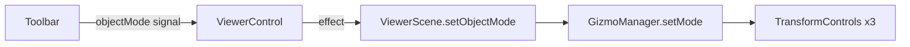
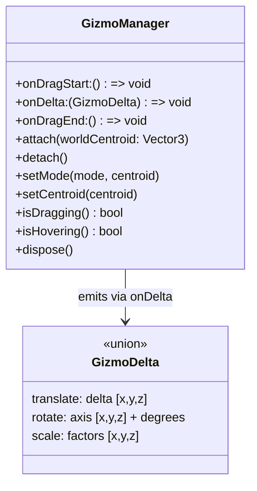
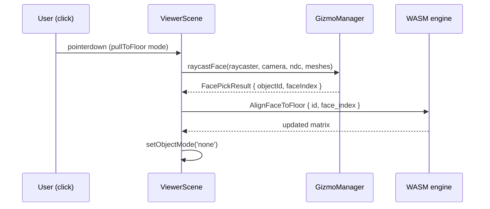
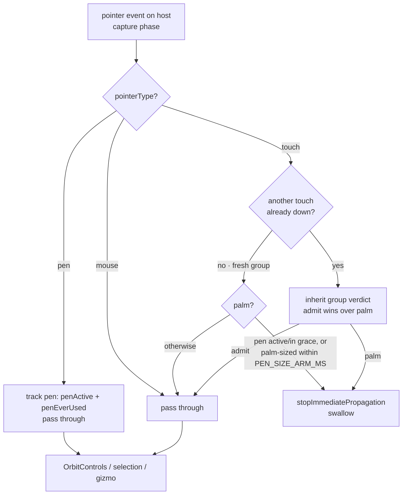
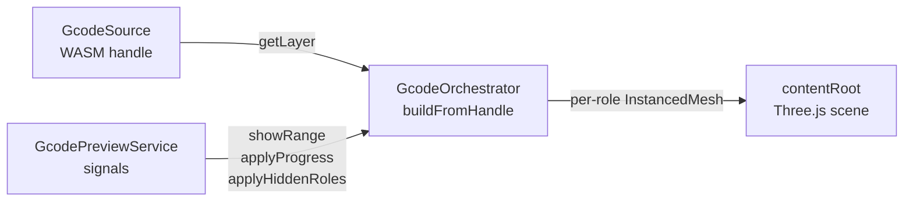
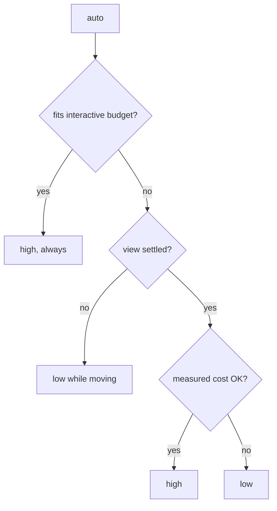

# Viewer — 3D Canvas, Gizmos, and Object Manipulation

The viewer is the single entry point for 3D visualisation. It owns the
Three.js scene, the WebGL render loop, camera controls, and — introduced in
this PR — a full suite of interactive object-manipulation gizmos.

> _Every gesture the user makes becomes a `SceneOp`. The renderer reads the
> result back. It never invents transforms of its own._

---

## Why gizmos live here

Scene placement is owned by the Rust scene engine (compiled to WASM). The
viewer's job is to translate pointer events into the right `SceneOp` and then
reflect the updated state back into Three.js.

Before this PR only orbit/pan/zoom were interactive. Object placement required
clicking toolbar buttons ("center on bed", "drop to floor"). The gizmo layer
adds direct on-canvas manipulation without breaking the SSOT contract: every
drag still ends with a `Rotate`, `Translate`, or `Scale` op dispatched to the
WASM engine; Three.js receives the resulting matrix and mirrors it — nothing
more.

---

## Object-manipulation modes

The `ObjectMode` union defined in `viewer-control.ts` drives what happens when
the user interacts with a selected mesh:

| Mode          | What it shows                                   | What it does on interaction              |
| ------------- | ----------------------------------------------- | ---------------------------------------- |
| `none`        | No gizmo (default)                              | Clicks select / deselect objects         |
| `translate`   | Three-axis / three-plane translation handles    | Emits `Translate` ops per frame          |
| `rotate`      | Three arc rotation handles                      | Emits `Rotate` ops per frame             |
| `scale`       | Three-axis scale handles (no planar handles)    | Emits `Scale` ops per frame              |
| `pullToFloor` | Face-highlight cursor; no handles on the canvas | Single face-pick → `AlignFaceToFloor` op |

The toolbar (`3d-view-toolbar`) exposes one button per mode in a radio group
that writes to `ViewerControl.objectMode`. The viewer reacts via an Angular
`effect()` and calls `ViewerScene.setObjectMode()`.



---

## GizmoManager

`GizmoManager` (`gizmo.ts`) wraps Three.js
[`TransformControls`](https://threejs.org/docs/#examples/en/controls/TransformControls)
and hides all its mechanical details behind a clean delta-stream interface.



### Ghost object

`GizmoManager` attaches `TransformControls` to an invisible `Group` (the
"ghost") instead of directly to a scene mesh. The ghost lives at the world
centroid of the current selection and acts purely as a drag surface. At the end
of each frame the ghost is reset to its anchor with identity rotation and unit
scale — so the WASM engine is always the authoritative record of where things
actually are.

### Incremental deltas

`TransformControls` reports absolute transforms of its target object. The
manager converts those to per-frame incremental deltas that map directly to
WASM ops:

- **translate** → position difference from last frame → `Translate { delta }`
- **rotate** → quaternion difference → axis-angle decomposition → `Rotate { axis, degrees }`
- **scale** → ratio of current to last scale → `Scale { factors }`

Zero-magnitude deltas are filtered before dispatch so the WASM pipeline is not
flooded with no-ops.

### Shift-key snapping

While **Shift** is held, each TransformControls instance snaps to a fixed step
defined in `GIZMO_SNAP`:

| Mode      | Snap step  |
| --------- | ---------- |
| translate | 1 mm       |
| rotate    | 15°        |
| scale     | 0.1 (±10%) |

When Shift is released, the snap reverts to continuous free motion (`null`).

### Always-on-top rendering

Gizmo handles are rendered on top of the model so they are never occluded.
Every `Mesh` node in the `TransformControls` helper tree has its material
configured with `depthTest: false`, `depthWrite: false`, `transparent: true`,
and `renderOrder: 999`. This is applied once in `makeControls()` — from that
point `TransformControls` reuses the same materials.

---

## Pull-to-floor — face picking

`pullToFloor` is a one-shot mode: the user clicks any face on any object and
that face is aligned to the build plate floor (Z = 0) via an
`AlignFaceToFloor` op. The mode exits automatically to `'none'` after the
pick.

### How face picking works



`raycastFace()` runs a Three.js raycaster against all scene meshes and returns
the `selectableId` (the string form of the WASM object id stored in
`userData.selectableId`) and the triangle index of the nearest hit.

### Face-group highlighting

When the cursor enters `pullToFloor` mode, the viewer asks the WASM engine for
coplanar face groups (`SceneEngineService.getFaceGroups`). As the cursor moves,
`raycastFace` identifies the hovered triangle and the viewer highlights all
faces in the same coplanar group — giving the user a clear preview of which
flat face will be aligned to the floor.

The highlight is applied as a per-vertex color buffer attribute on a cloned
`BufferGeometry`. The original geometry is restored when the mode exits.

---

## Coplanar face groups (Rust side)

`src/mesh/analysis.rs::compute_coplanar_groups` is the Rust function that
powers the face-pick highlight. See [src/mesh/README.md](../../../../../src/mesh/README.md)
for the full algorithm description.

The WASM bridge method `SceneHandle.getFaceGroups(id, angleThresholdDeg)` calls
it and returns a `Uint32Array` of group ids (one per triangle). The
`SceneEngineService.getFaceGroups()` wrapper logs the call timing and hands the
array to the viewer.

---

## Interaction priority

When multiple input consumers are active at the same time (orbit, selection
raycaster, gizmo), the viewer applies a clear priority order:

0. **Palm rejection (stylus in use)** — [`PointerArbiter`](scene/pointer-arbiter.ts)
   listens in the _capture_ phase on the canvas host (an ancestor of the WebGL
   canvas), so it runs before every other consumer. While an Apple Pencil /
   stylus is down, hovering, or was active within the grace window, it swallows
   `pointerType === 'touch'` events — the hand and wrist resting on the glass —
   so the palm never orbits, pinches, or selects. It decides **per gesture
   group** (see the no-tear invariant below), so it can never split a real
   two-finger gesture into a lone survivor. Genuine finger gestures are untouched
   whenever no pen is involved.
1. **Gizmo dragging in progress** — gizmo owns the pointer; OrbitControls
   and the selection raycaster are both suppressed.
2. **Gizmo hovering** (cursor over a handle, not yet dragging) — the selection
   raycaster is suppressed on this frame so a click registers on the handle,
   not on an underlying mesh.
3. **pullToFloor mode** — selection raycaster is disabled; pointer is entirely
   dedicated to face picking.
4. **Normal mode** — the selection raycaster runs; OrbitControls handles any
   gesture that misses a selectable object.

### Viewport-cube auto-ortho

Clicking a viewport-cube face/edge/corner snaps the camera to that view **and
flattens the projection to orthographic** — the CAD convention that a snapped
view is dimension-true. The snap is then **pinned**: it survives until a gesture
breaks it free — a **pan**, a **zoom**, or a **rotate dragged past the breakout
distance** — at which point the projection reverts to whatever the toolbar preset
was (normally perspective). Because the revert targets the toolbar `currentView`,
leaving the snap lands back in perspective only when the user _entered_ it from
perspective; a toolbar ortho preset stays ortho.

The rotate behaviour is a true **detent, Shapr3D-style**. While the snap is held
the camera does **not move at all**: a rotate gesture shorter than
`SNAP_BREAKOUT_TRAVEL_PX` (70 px, measured straight-line from where the drag
started) is absorbed completely, so the dimension-true view survives jitter, a
small screen touch or a stray nudge — and wiggling back and forth never breaks
out, because travel is measured from the origin rather than summed along the
path. Cross that distance and the snap "pops": the camera starts orbiting from
the snapped orientation and the projection animates back. Interacting with the
cube again always keeps ortho.

| Action                                                  | Auto-ortho         |
| ------------------------------------------------------- | ------------------ |
| Cube face/edge/corner snap                              | engage (→ ortho)   |
| Rotate **inside** the breakout distance                 | keep — view frozen |
| **Rotate past breakout** (1-finger / left-drag / swipe) | **revert** (pops)  |
| Cube drag-orbit / roll / re-snap                        | keep               |
| **Pan** (2-finger / right-drag / ⌥-swipe)               | **revert**         |
| **Zoom** (pinch / wheel / autoscroll)                   | **revert**         |
| Toolbar view toggle / home reset                        | cancel (manual)    |

This lives across two files. Both the projection override (`autoOrtho`) and the
detent (`snapHoldPose`) are in [`SceneCamera`](scene/camera.ts). Engaging
animates to the snapped direction at ~1° FOV with an apparent-size-preserving
distance, then pins that pose on landing.

A snap also **tells the toolbar what it did**. Engaging sets `currentView =
'ortho'` and reports it through `onViewChange` → `ViewerScene.setViewChangeSink`
→ the UI's `view` signal; a breakout restores the remembered `preSnapView` the
same way. Earlier the snap deliberately left that signal alone, which desynced
the button from the screen: the toolbar claimed "perspective" while the view was
flat, so the button's icon lied and its first press was swallowed re-asserting a
projection that was already active — you had to press it twice to see anything.
The viewer guards the echo (`cameraOriginatedView`, armed only when the write
actually changes the signal) so a camera-originated value is not routed straight
back into `setView`, which would cancel the in-flight snap and its detent.

The perspective preset is seeded from the FOV the camera is built with
(`setPerspectiveFov(camera.fov)` at construction). The settings effect that
applies the user's field-of-view runs before the scene exists, so without this
the preset kept its built-in default and _restoring_ perspective — the toggle, a
breakout, or the home reset — snapped the view to that default instead of the FOV
the user had configured.

**Holding** is enforced by `applySnapHold()`, which the render loop calls _after_
`OrbitControls.update()` and the inertia step: it restores the pinned pose, so
whatever rotation those applied is discarded before anything is drawn. Discarding
it each frame (rather than accumulating) is what makes the hand-off seamless —
`OrbitControls` re-derives its orbit frame from the camera's current position
every update, so the instant the pin is released the view simply starts following
the pointer from the snapped orientation, with no jump and no replay of the
absorbed movement.

**Reverting** animates over the same `VIEW_TRANSITION_MS` + easing as the
toolbar's perspective/ortho toggle, so the morph reads identically whichever
control triggered it. It runs as a projection-only `ProjectionTween`
(`notifyUserViewGesture` → `advanceProjectionTween`) rather than a full pose
animation: only the FOV is driven, and the orbit distance is rescaled
_incrementally_ each frame (`tan(prevFov/2) / tan(nextFov/2)`) to hold apparent
size. Because nothing pins the direction, target or distance, the tween never
fights the gesture that triggered it — the render loop advances it on **every**
frame, including frames where `OrbitControls` is driving the camera, so the user
can keep dragging/zooming straight through the transition.

The revert trigger is emitted only from the genuine pan/zoom input sites and from
the pointer-travel breakout detector in [`SceneControls`](scene/controls.ts)
(`setRevertGestureSink`) — a rotate inside the detent and cube-driven moves never
emit it. Travel is measured in **pixels**, not camera angle, precisely because a
held snap does not rotate the camera at all. The budget is per gesture: reset on
each pointer down/up and, on the trackpad-swipe path (which has no pointer
brackets), after an idle gap.

### Pen-priority palm rejection ("wrist detection")

On an iPad the hand resting on the glass while drawing with an Apple Pencil
fires `touch` pointer events for the palm and wrist. Unfiltered, they drive the
camera — OrbitControls' single-touch rotate spins the view and two palm
contacts read as a pinch — so the model lurches while the user works with the
pencil. [`PointerArbiter`](scene/pointer-arbiter.ts) vetoes those contacts.



A **fresh** touch — the first contact of a group, nothing else down — is judged
palm at its `pointerdown` (`isPalmTouch`, unit-tested) when a pen is active
(down, hovering, or lifted within `PEN_GRACE_MS`) or, once a pen has been used
**recently** (`PEN_SIZE_ARM_MS`), when its contact patch is palm-sized
(`PALM_CONTACT_MIN_PX`) — which catches the palm that lands just before the tip
on iPads without pencil hover. Pure-touch users are never affected: the
contact-size path only arms after a pen is seen, and the pen-active path only
fires while a pen is in use.

**No-tear invariant.** The camera's two-finger handler only engages while two
touches are down; a lone touch falls to OrbitControls' single-finger rotate. If
the arbiter ever swallowed exactly one finger of a two-finger gesture, the
survivor would spin the camera — the "spazzing" a stylus user hits when a
palm-sized fingertip, or a flickering pen hover/grace state, splits the pair.
So only the first contact of a fresh group is classified from scratch; any touch
that lands while another is already down **inherits** the group verdict (admit
wins over palm). A resting hand is still rejected because its contacts open the
group as palm (the pencil is the active tool, and a lone palm never lifts, so
the group stays palm across long pauses between strokes). To keep a dropped
`pointerup` (an iPad that never delivers the palm's lift) from stranding a
`palm` verdict that every later finger would inherit — locking out all touch —
stale verdicts and a stuck pen-down latch are reclaimed by timeout
(`TOUCH_VERDICT_STALE_MS`, `PEN_CONTACT_STALE_MS`); a contact really still down
keeps itself fresh. The user can turn the whole behaviour off from **Settings →
General → Controls → Palm rejection** (persisted; default on).

### Hand-aware inspector tooltip placement

The G-code inspector tooltip (extrusion width/height/speed on hover in the
scalar views) is anchored to a virtual element at the pointer. A fixed
below-right placement is ideal with a mouse but lands the readout **directly
under the palm** of a right-handed pen user. `preferredHoverPlacement`
([hover-placement.ts](hover-placement.ts), unit-tested) picks the side per input:

| Pointer | Placement                                                    |
| ------- | ------------------------------------------------------------ |
| mouse   | `right-start` — the familiar below-right desktop behaviour.  |
| touch   | `top` — the finger and hand occlude below, so float above.   |
| pen     | opposite the tilt (hand) direction; `top` when near-upright. |

The elegant part is the pen case: `PointerEvent.tiltX`/`tiltY` point from the tip
toward the barrel — i.e. toward the hand — so the tooltip floats to the _opposite_
side. Because tilt reveals which way the pen leans, this adapts to left- vs.
right-handed users with **no setting to configure**. Floating UI's flip/shift
still keep it on-screen, so this only chooses the _preferred_ side. The
`viewer.ts` effect re-anchors when the preferred side changes (input swap or a
tilt that crosses an axis).

---

## Anatomy

The viewer is split into focused files so each concern stays under ~300 lines.

```
viewer/
├── viewer.ts                  Angular component — effects wiring, WASM ↔ Three bridge
├── hover-placement.ts         preferredHoverPlacement — hand-aware inspector-tooltip side (pen tilt)
├── scene/                     ViewerScene and all Three.js sub-systems
│   ├── index.ts               ViewerScene — owns renderer, render loop, delegates to sub-modules
│   ├── camera.ts              SceneCamera — animations, view presets, fit-to-content, near/far
│   ├── controls.ts            SceneControls — orbit inertia, multi-touch (pinch/pan/roll), autoscroll zoom
│   ├── grid.ts                SceneGrid — adaptive build-plate grid with cross-fade and fade-on-graze
│   ├── pointer-arbiter.ts     PointerArbiter — pen-priority palm rejection (capture-phase touch veto)
│   ├── selection.ts           SceneSelection — selectable registry, emissive highlight, raycasting, face-pick
│   ├── types.ts               Shared public types (SceneSelectionHandlers, SceneGizmoHandlers, ViewerView, …)
│   └── utils.ts               disposeObject — recursive Three.js geometry/material cleanup
├── gizmo.ts                   GizmoManager, computeSelectionCentroid, raycastFace
├── gcode-orchestrator.ts      GcodeOrchestrator — owns the built model; Three.js visibility only (no geometry)
├── gcode-layer-renderer.ts    buildGcodeModel, applyLayerVisibility, applyHiddenRoles, setDetailLevel
└── index.ts                   Public re-exports
```

### ViewerScene sub-module responsibilities

| File                       | Class            | Owns                                                                                        |
| -------------------------- | ---------------- | ------------------------------------------------------------------------------------------- |
| `scene/camera.ts`          | `SceneCamera`    | `PerspectiveCamera` pose, view animations, `fitToContent`                                   |
| `scene/controls.ts`        | `SceneControls`  | `OrbitControls` config, orbit inertia, touch gestures, autoscroll zoom                      |
| `scene/grid.ts`            | `SceneGrid`      | Bed grid `LineSegments`, adaptive spacing, CSS theme integration                            |
| `scene/pointer-arbiter.ts` | `PointerArbiter` | Pen-priority palm rejection — capture-phase touch veto while a stylus is in use             |
| `scene/selection.ts`       | `SceneSelection` | Selectable `Map`, emissive highlight, pointer event plumbing, face-pick overlay             |
| `scene/index.ts`           | `ViewerScene`    | Three.js primitives (`Scene`, `WebGLRenderer`, `OrbitControls`), `contentRoot`, render loop |

### G-code layer architecture

All G-code geometry is built exclusively inside `GcodeOrchestrator.buildFromHandle()` by
calling the WASM-side `GcodeSource.getLayer()`. Three.js receives finished `Float32Array`
buffers and is responsible only for visibility and scrubbing draw-ranges. No geometry is
constructed in TypeScript.



#### One buffer per _role_, not per _layer_

Geometry is packed into a single instanced buffer pair (tube + joint balls) **per role,
spanning every layer**, with instances ordered layer-ascending. The obvious alternative —
a group per layer — costs a draw call per layer per role: a 335-layer plate reached
**~2 500 draw calls and ~2 500 distinct materials**, which pinned the frame at ~25 fps on
an M-series Mac purely in driver overhead. Per role it is **~18**.

The packing order is what keeps that cheap to drive:

| Control        | Range shape         | Mechanism                                   |
| -------------- | ------------------- | ------------------------------------------- |
| Layer max      | prefix              | `InstancedMesh.count` / `setDrawRange`      |
| Progress scrub | prefix (within top) | same `count`, split per role by block order |
| Layer min      | `0` or `== max`     | `uLayerMin` uniform, collapsed in-shader    |
| Role hiding    | whole role          | `mesh.visible`                              |

`layerMin` is never an arbitrary window (it is `0` when showing all layers, otherwise
`layerMax`), so the only non-prefix case is "single layer" — handled by a per-instance
`aLayer` attribute and one uniform rather than by splitting the buffer back up. Because a
raycast cannot see a shader-side collapse, the hover probe uses an offset-aware
`raycast` that starts at the first visible instance.

#### On-demand rendering

`ViewerScene` only calls `renderer.render()` when the image can actually have changed:
camera pose delta (which covers orbit damping, inertia, snap-hold, autoscroll and the
projection tween), an active animation or gizmo drag, pointer activity over the canvas, or
an explicit `invalidate()` from content changes. A static plate therefore costs nothing —
previously it was fully redrawn 60 times a second.

#### Detail levels, and when each is used

Draw calls were only half the story: a 1.14 M-segment plate at full detail is **77.7 M
triangles per frame**, which no draw-call count makes affordable. So the preview has two
levels of bead geometry:

| Level  | Tube                    | Joints | Tris/segment |
| ------ | ----------------------- | ------ | ------------ |
| `high` | octagon, capped         | yes    | 68           |
| `low`  | 4-sided diamond, capped | no     | 16           |

Both LODs are built up front and share the same instanced attributes, so switching is a
geometry pointer swap — no instance data is touched, and their extents are identical so the
instance bounding sphere stays valid.

**Two properties of the cheap bead are load-bearing, and both were learned by breaking
them:**

- **Ridge on top, never a flat face.** A first attempt rotated the 4-gon 45° into a
  flat-topped box, reasoning that a squished extrusion really does have a flat top. But
  every bead on a layer then has a _horizontal_ top face at exactly the same Z, and beads
  overlap constantly — at every path corner, and wherever flow deliberately overlaps a
  neighbour. Coplanar faces at identical depth is textbook **z-fighting**, and it speckled
  the whole plate. The default diamond orientation puts a ridge on top, so overlapping
  beads differ in Z almost everywhere. The octagon has the same property, which is why the
  high LOD never showed the artifact.
- **Capped ends.** An open tube shows its hollow interior wherever a path ends, which reads
  as beads being **chopped off mid-air**. Caps cost 8 triangles and remove it. They are
  invisible mid-path (the next segment covers them), so they only pay off where it matters.

#### Choosing a level — `PreviewDetail`

The user always decides, via **Settings → General → Preview detail**
(`auto` / `performance` / `quality`, persisted). `auto` is the default and is built around
one observation:

> Rendering is on-demand, so a **still view costs exactly one frame**.

Expensive, good-looking geometry is therefore affordable precisely when the user has
stopped to _evaluate_ the plate — and only interaction has to be cheap. `auto` resolves as:



- Plates under the **interactive budget** stay at full detail permanently, so ordinary
  models never visibly change as you orbit.
- Heavier plates drop to the cheap bead _only while the view is moving_, and snap back to
  full detail ~200 ms after it settles.
- The settled budget is far larger than the interactive one, because it buys a single
  frame rather than a sustained frame rate.

**Hardware detection is by measurement, not by name.** GPU strings are routinely masked and
are a poor guide to throughput anyway, so `auto` instead promotes once, measures the real
frame, and demotes permanently for that model if it blew the budget. This adapts to the
actual machine, including thermal throttling and integrated GPUs.

Detail is re-evaluated whenever the view settles, the layer range or scrub changes (the
layer slider is a draw-range prefix, so isolating a layer genuinely shrinks the frame and
can earn full detail back), or the user changes the preference.

---

## What this module deliberately does _not_ do

- **No scene-state ownership.** Transforms are not stored here. The WASM
  `SceneHandle` is the only truth; Three.js matrices are a read-only mirror of
  it.
- **No G-code geometry construction.** `GcodeOrchestrator` never builds
  `BufferGeometry` itself — it only routes the WASM-emitted `Float32Array`
  buffers into Three.js `LineSegments` via `gcode-layer-renderer`.
- **No multi-object gizmo.** When multiple objects are selected, the gizmo
  appears at their collective world centroid but each object receives
  independent `Rotate`/`Translate`/`Scale` ops with the same delta. A unified
  pivot is not implemented for v1.
- **No undo stack.** `onDragEnd` is the hook point for a history layer; the
  viewer itself discards the delta stream when the drag ends.

---

## See also

- [scene/index.ts](scene/index.ts) — `ViewerScene`, `SceneSelectionHandlers`, `SceneGizmoHandlers`
- [scene/camera.ts](scene/camera.ts) — `SceneCamera`
- [scene/controls.ts](scene/controls.ts) — `SceneControls`
- [scene/grid.ts](scene/grid.ts) — `SceneGrid`
- [scene/pointer-arbiter.ts](scene/pointer-arbiter.ts) — `PointerArbiter`, `isPalmTouch`, `PEN_GRACE_MS`, `PALM_CONTACT_MIN_PX`, `PEN_SIZE_ARM_MS`, `PEN_CONTACT_STALE_MS`, `TOUCH_VERDICT_STALE_MS`
- [scene/selection.ts](scene/selection.ts) — `SceneSelection`
- [gizmo.ts](gizmo.ts) — `GizmoManager`, `GizmoDelta`, `FacePickResult`, `raycastFace`, `computeSelectionCentroid`
- [hover-placement.ts](hover-placement.ts) — `preferredHoverPlacement`, `HoverPointerInfo`
- [gcode-orchestrator.ts](gcode-orchestrator.ts) — `GcodeOrchestrator`
- [gcode-layer-renderer.ts](gcode-layer-renderer.ts) — layer builder and visibility helpers
- [viewer.ts](viewer.ts) — Angular component wiring
- [../../services/viewer-control.ts](../../services/viewer-control.ts) — `ObjectMode`, `ViewerControl` signal store
- [../../services/scene-engine.service.ts](../../services/scene-engine.service.ts) — `SceneEngineService`, `getFaceGroups`
- [../../../../src/mesh/README.md](../../../../../src/mesh/README.md) — coplanar group algorithm
- [../../../../src/scene/README.md](../../../../../src/scene/README.md) — scene engine SSOT contract
